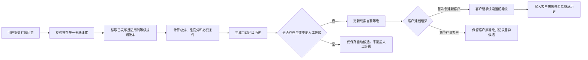

# 合数BOSS V1.0线索中心－线索配置需求文档

> 模块：线索中心 / 线索配置
> 版本：V1.0（独立细化版）
> 状态：待评审
> 更新日期：2026-09-14
> 上位基线：《[合数BOSS V1.0线索中心需求文档](./合数BOSS V1.0线索中心需求文档.md)》

## 1. 文档定位与边界

本文档是“线索配置”子模块的独立详细需求，可直接用于产品评审、交互核对、开发实现、测试用例编写和验收。本文档完整承接当前总需求中该模块的有效规则；跨模块状态、公共数据口径和发布规则仍与上位基线保持一致。

## 2. 功能详细需求

### 5.4 线索配置

线索配置页面采用“**规则中心**”模式，不按每一种规则新增独立菜单。页面左侧按规则域分类，右侧使用统一规则列表和统一版本机制；V1.0 首批开放“分配与接待”“期次名单流转”和“等级规则”三类，后续可继续注册清洗、标签、回收、提醒等规则域，而不改变页面主体结构。

#### 5.4.1 页面结构

| 页面区域 | 功能要求 |
|---|---|
| 规则分类 | 展示全部规则、分配与接待、期次名单流转、等级规则及数量；选中分类后只展示该类规则 |
| 汇总信息 | 展示规则总数、已发布数量、草稿数量，并提示已发布版本不可直接覆盖 |
| 查询区 | 支持按规则名称/编号/条件/动作、规则分类、状态和触发方式组合查询 |
| 规则列表 | 展示规则名称、编号、分类、版本、触发、判断条件、执行动作、适用范围、优先级、状态和最后更新信息 |
| 规则链预览 | 每行必须以“触发 → 判断条件 → 执行动作”直接展示核心内容，不能只展示无法理解的规则编号 |
| 操作区 | 支持详情、试算、编辑、复制为草稿、版本记录、发布、停用和版本回退 |
| 新建/编辑抽屉 | 分为基础与触发、条件与动作、试算与发布三个步骤；切换规则分类后展示对应专用字段 |

规则状态包括草稿、已发布和已停用。历史回退不是覆盖旧版本，而是基于目标历史版本重新生成一个可发布的新版本。

#### 5.4.2 统一规则模型

每条规则至少保存：规则ID、规则编码、规则分类、名称、说明、适用范围、触发类型、触发配置、条件组、执行动作、冲突策略、失败策略、优先级、状态、版本、生效时间、创建人、更新人和审计时间。

- 触发类型支持事件触发、定时触发和手动试算；
- 条件支持条件组内 `AND`、条件组间 `OR`，V1.0 页面先提供与当前两类规则相关的业务字段；
- 优先级数值越小越先执行；同一对象的多个规则按优先级依次判断；
- 冲突策略支持命中后停止、合并非冲突动作和高优先级覆盖；可能写入同一负责人或同一名单的规则若未配置冲突策略，禁止发布；
- 所有执行保存规则ID、版本、输入快照、命中条件、输出结果、追踪号和异常信息；业务记录永久引用执行时规则版本。

#### 5.4.3 活码分配规则

该规则用于自动轮询，不取代引流线索页面的人工指定操作。

| 配置项 | 规则 |
|---|---|
| 推荐触发 | 客户扫码、批量轮询任务 |
| 适用范围 | 活码、活码分组、引流期次、班级、渠道、店铺、组织或岗位 |
| 基础条件 | 活码启用；员工在职且账号启用；员工进入当前命中的全天在线或分时段规则名单 |
| 权重条件 | 轮询方式按员工接量权重计算分配比例；当前接量只读展示，不设置容量上限 |
| 动作 | 按轮询权重、配置顺序或随机规则选出接待员工，并保存负责人、活码、期次、排班规则、名单版本、权重、当前接量和游标快照 |
| 无人可分 | 线索保留待分配，生成异常记录，不得丢弃或伪造成功 |

人工指定只校验员工在职及账号启用，不受活码排班名单和接量权重约束；规则内名单和权重只控制自动分配。

#### 5.4.4 期次名单流转规则

该规则用于根据上一引流期次的员工表现，自动生成或更新下一引流期次的活码轮询人员名单。判断对象为员工，不是线索。

| 配置项 | 规则 |
|---|---|
| 来源期次 | 已结束或进入结算阶段的上一引流期次，从期次库选择 |
| 目标期次 | 待开始或进行中的下一引流期次，不得与来源期次相同 |
| 推荐触发 | 来源期次结束后每日 02:00 定时重算，同时保留管理员手动试算和补跑 |
| 核心指标 | 员工上一期次转化率=`已转化有效线索数 ÷ 有效分配线索数`；退款是否回退转化按统一转化口径执行 |
| 最小样本 | 必须同时设置最小有效分配量，默认建议30条，防止少量样本造成虚高转化率 |
| 资格条件 | 有效分配量达到下限、转化率达到阈值、员工在职且账号启用 |
| 执行动作 | 将符合条件的员工加入目标期次指定活码或活码分组的轮询名单，可同步默认接量上限 |
| 重复策略 | 已在目标名单则跳过或按明确配置更新上限；不得删除管理员手工加入的员工 |
| 幂等键 | 来源期次ID + 目标期次ID + 规则版本 + 员工ID；重复执行不得重复插入 |
| 失败处理 | 自动重试后进入异常中心，保留失败员工、原因和补跑入口 |

若来源期次统计口径或转化率定义发生变更，必须发布新口径版本，并在试算结果和名单记录中保留指标口径版本。

#### 5.4.5 试算、发布与版本

1. 草稿保存不影响线上业务；
2. 发布前必须执行规则试算，展示数据范围、命中对象、未命中对象、冲突、异常和样例明细；
3. 活码分配规则试算展示命中线索、候选员工和容量分布；期次名单流转规则试算展示员工有效分配量、转化率、是否入选及未入选原因；
4. 已发布规则不可直接修改，编辑时生成新草稿版本；发布时保存版本说明、发布人、生效时间和审批记录；
5. 停用只阻止后续执行，不撤回已完成的分配或名单同步；
6. 版本回退必须形成新版本，并可对回退前后的命中结果做差异预览。

#### 5.4.6 等级规则与客户继承

用户提交有效问卷后，系统按已发布等级规则自动生成线索 S/A/B/C 或未定级结果；S/A/B/C 枚举统一读取字典 `lead_customer_grade`，“未定级”为系统保留状态。线索列表支持等级筛选与展示，详情支持有权限人员填写原因后人工调整。人工等级优先于自动结果，后续自动重算只生成候选结果，不静默覆盖人工等级。

新客户首次建档继承线索当前有效等级；命中存量客户时不得直接覆盖客户等级，只记录评级候选及差异。建档后等级以客户主档为准，线索展示关联客户当前等级并保留线索发生时快照。

**职责边界**

| 模块 | 职责 |
|---|---|
| 问卷管理 | 保存问卷、答卷、答案快照、解析结果及线索/客户关联，不维护等级区间 |
| 线索配置—等级规则 | 等级规则唯一配置入口，维护适用问卷、条件、分值、等级区间、优先级、版本、试算、发布和停用 |
| 引流线索 | 展示和筛选当前等级，查看评级来源与历史；有权限时人工变更等级 |
| 客户中心—客户列表 | 首次建档继承线索等级；在客户单条操作中编辑当前等级并在客户档案查看历史，不设置独立等级管理菜单 |

**评级与继承流程**

**自动评级规则**

1. 仅有效答卷完成关联与解析，或管理员发起规则重算时触发；未关联、重复关联、解析失败及作废答卷不得评级；
2. 使用计算发生时已发布且适用的规则版本，保存问卷版本、答卷编号、答案快照、规则版本、总分、维度分、必要条件、命中等级、计算时间和追踪号；
3. 未命中规则时结果为“未定级”并记录原因；计算失败进入异常中心，可按答卷编号和规则版本幂等重试；
4. 同一答卷和同一规则版本重复回调不得重复生成当前结果；重新解析或新版本重算应新增历史记录，不覆盖旧记录；
5. 等级区间必须连续、不重叠并覆盖允许分值范围；发布前必须试算并展示样本量、各等级分布、与当前等级差异、人工锁定数量和异常明细。

**等级维护边界**

- V1.0 引流线索页面不提供“变更线索等级”操作，线索等级仅由有效问卷和已发布等级规则自动计算；
- 历史系统已有人工等级只作为迁移快照和历史记录保留，不作为新系统当前等级的人工编辑入口；
- 线索已建立客户档案后，客户首次继承线索当前有效等级；客户等级如需调整，从客户列表“编辑等级”操作并填写原因、独立留痕，不回写线索；
- 规则重算生成新的等级历史，禁止覆盖既有计算记录；当前等级取最新有效自动评级结果。

**客户建档继承规则**

| 场景 | 处理规则 |
|---|---|
| 创建全新客户 | 继承线索当前有效等级，并保存来源线索、评级来源、规则/人工记录ID和继承时间 |
| 线索未定级 | 客户初始化为未定级 |
| 手机号或UnionID命中存量客户 | 不覆盖存量客户等级；保存本次线索评级候选和差异记录 |
| 建档后新问卷评级 | 继续更新关联线索的评级事实和候选结果，不自动覆盖客户当前等级 |
| 客户人工改级 | 从客户列表单条操作选择 S/A/B/C、填写原因，更新客户当前等级并写入客户等级历史，不回写线索 |

**列表、详情和核心数据**

- 列表展示“线索等级”和来源（问卷自动、历史迁移、未定级），支持筛选和表格设置；
- 详情只读展示当前等级、来源、规则版本和评级时间，不提供人工变更等级入口；
- 旅程记录问卷提交、自动评级、历史等级迁移、客户继承和异常重算；
- 线索主表仅保存 `current_grade`、`grade_source` 和当前结果ID；完整计算、候选及人工操作写入不可覆盖的等级历史表；
- 等级历史至少包含 `grade_rule_version_id`、`questionnaire_submission_id`、`score`、`dimension_scores`、`migration_source`、`source_lead_id`、`effective_at`、`invalid_at`。

## 3. 共性实施约束

- 数据范围：页面列表、筛选、详情及导出均须受当前登录人的组织与数据权限约束；无权限的数据不得通过接口、地址参数或导出绕过。
- 写操作：新增、编辑、删除、绑定、分配、同步等写操作必须鉴权、校验、记录审计信息并保证接口幂等。
- 页面状态：须覆盖首次加载、加载中、无数据、筛选无结果、无权限、接口失败和部分外部平台失败等状态，并提供明确反馈或可重试入口。
- 数据留痕：业务记录原则上不做物理删除；关键状态变化、操作者、操作时间和变更前后值须可追溯。
- 外部依赖：企业微信、短信或第三方平台调用失败时，保留本地业务事实并记录失败原因，不得静默吞错或错误回滚已成功的本地事务。
- 历史口径：历史记录按发生时快照展示；配置后续变化不得反向改写历史业务结果。

## 4. 验收与回滚

- 功能验收：本模块各入口、筛选、列表、详情、弹窗、单条与批量操作均可按本文档规则完成闭环。
- 权限验收：不同角色、组织范围及无权限账号展示和可操作范围正确，越权请求被服务端拒绝。
- 异常验收：重复提交、并发修改、外部接口超时、空数据和失效数据均有确定结果与用户提示。
- 回滚要求：上线异常时可按功能开关或版本回退停用新增能力；回滚不得删除已产生的业务记录和审计记录。

## 5. 版本记录

| 版本 | 日期 | 变更内容 |
|---|---|---|
| V1.0 | 2026-09-14 | 从线索中心总需求拆分并补齐为可独立评审、开发和验收的细化模块文档 |
