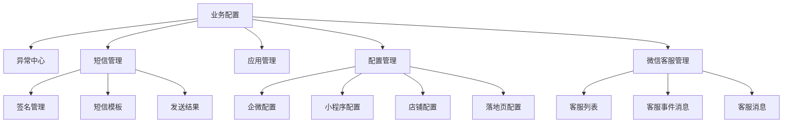
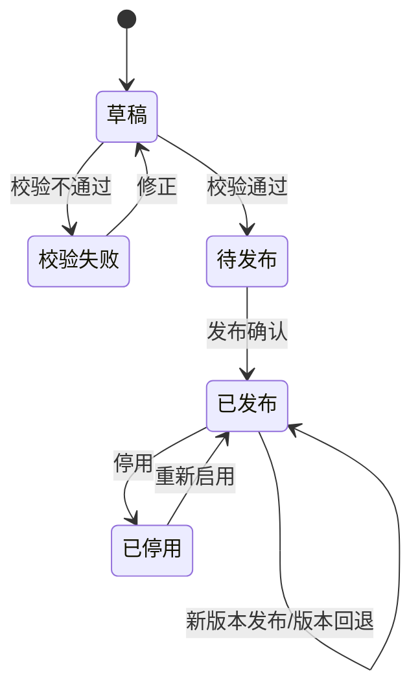

# 合数BOSS V1.0业务配置需求文档

> 本文从《合数BOSS V1.0系统管理与业务配置需求文档》中拆分形成，结合当前合数BOSS页面、菜单与交互实现，单独作为“业务配置”模块的产品、研发、测试与验收基线。跨模块通用规则仍以《合数BOSS V1.0产品需求总文档》和《合数BOSS V1.0整体业务流程与关键规则》为准。

| 文档属性 | 内容 |
|---|---|
| 所属项目 | 合数BOSS重构项目 |
| 所属版本 | V1.0 |
| 文档版本 | V1.0 |
| 文档状态 | 需求确认稿 |
| 更新日期 | 2026-08-28 |
| 模块归属 | 合数BOSS应用内“业务配置” |
| 需求范围 | 异常中心、短信管理、应用管理、配置管理、微信客服管理 |
| 参考页面 | 合数BOSS当前原型与用户提供的飞书 Wiki 链接 |

## 1. 文档目标

业务配置为合数BOSS各业务模块提供外部系统接入、运行配置、消息服务和异常处理能力。本文件用于统一页面范围、字段、状态、权限、校验、审计、版本和验收口径，避免接入参数散落在业务页面或代码中。

业务配置固定展示在“系统管理”上方。系统管理负责组织、员工、岗位、角色、菜单、系统参数、字典、日志和地区；业务配置负责企微、短信、微信客服、应用接入、店铺、小程序、落地页和运行异常。

## 2. 目标与范围

### 2.1 版本目标

1. 统一登记合数BOSS依赖的企业微信、短信服务、微信客服及其他外部应用；
2. 建立配置的草稿、校验、发布、停用、轮换、回退与审计闭环；
3. 汇总企微回调、同步和核心业务异常，支持幂等重试与人工处理；
4. 复用现有短信与微信客服服务，通过适配层接入，不重复建设供应商能力；
5. 确保 Secret、Token、手机号及授权凭证在页面、接口、日志和导出中受到保护。

### 2.2 范围分级

| 优先级 | 范围 | 完成口径 |
|---|---|---|
| P0 | 应用管理、合数BOSS接入权限 | 可登记、编辑、启停、校验连接、轮换凭证并审计 |
| P1 | 异常中心、短信管理、配置管理、微信客服管理 | 页面、接口、状态流转、权限和基础审计可用，不得只保留空白占位页 |
| P2 | 复杂短信计费与供应商路由、客服会话全文归档、店铺/落地页高级运营配置 | 后续迭代，不纳入 V1.0 阻断验收 |
| 明确排除 | 支付管理、群机器人 | 不生成菜单、路由、页面及验收项 |

### 2.3 系统边界

| 能力 | 责任系统/模块 |
|---|---|
| 统一登录、统一会话、平台应用入口 | 合数统一管理平台 |
| 合数BOSS内角色、菜单、数据范围、系统参数、字典和日志 | 系统管理 |
| 企微、短信、微信客服、店铺、小程序和落地页配置 | 业务配置 |
| 短信供应商发送、回执和历史能力 | 现有短信服务，通过适配层接入 |
| 微信客服账号、事件和消息状态 | 现有企微客服服务，通过适配层接入 |
| 线索、客户、活码、问卷及跟进业务 | 合数BOSS业务模块 |

## 3. 信息架构与路由

| 页面 | 路由 | V1.0 页面动作 |
|---|---|---|
| 异常中心 | `/system/exceptions` | 查询、详情、重试、忽略、转人工、关闭 |
| 签名管理 | `/system/sms/signatures` | 新增、编辑、提交审核、启停、查看详情 |
| 短信模板 | `/system/sms/templates` | 新增、编辑、变量校验、提交审核、启停、查看详情 |
| 发送结果 | `/system/sms/results` | 查询、详情、链路追踪 |
| 应用管理 | `/system/applications` | 新增、编辑、启停、连接校验、凭证轮换 |
| 企微配置 | `/system/configurations/wecom` | 编辑、校验、发布、凭证轮换、版本回退 |
| 小程序配置 | `/system/configurations/mini` | 新增、编辑、校验、发布、启停、轮换、回退 |
| 店铺配置 | `/system/configurations/stores` | 新增、编辑、连接校验、启停、查看审计 |
| 落地页配置 | `/system/configurations/landing` | 新增、编辑、链接校验、启停、查看审计 |
| 微信客服管理 | `/system/wecom-customer-service` | 客服列表、事件消息、客服消息、失败重试 |

菜单按当前用户权限动态生成；无任一子页面权限时不展示父菜单。短信管理、配置管理的子页面使用独立路由，正式版不得只通过前端页签切换模拟路由。

## 4. 通用页面与交互规范

### 4.1 列表与查询

- 页面采用“标题说明 + 筛选区 + 主操作 + 列表 + 分页”的统一结构；
- 支持关键词、状态及模块特有条件组合查询，查询条件可清空，回车触发查询；
- 列表必须覆盖加载、空数据、错误、无权限状态，长字段省略并可查看完整值；
- 刷新保留筛选条件和分页，提交与重试期间锁定按钮，避免重复操作；
- 导出按当前权限和筛选条件执行，敏感字段脱敏并记录审计；
- 危险或影响生产的操作使用二次确认，并展示影响对象、环境和当前版本。

### 4.2 新增、编辑与详情

- 简单对象使用弹窗，复杂配置使用抽屉或独立页面；
- 必填项在失焦和提交时校验，错误信息紧邻字段；
- 编辑回填当前值；并发版本不一致时阻止静默覆盖；
- 保存失败保留用户输入；有未保存内容时关闭或跳转需二次确认；
- Secret、Token、Webhook 密钥等字段不回显原值，留空表示不修改；
- 详情展示状态、负责人、创建/更新时间、最近校验、当前发布版本及最近操作轨迹。

### 4.3 配置生命周期

- 草稿不影响生产业务；只有校验通过的版本可以发布；
- 发布后版本不可原地覆盖，编辑形成新草稿；
- 生产发布、停用、凭证轮换和版本回退均需独立权限、二次确认和审计；
- 回退生成新的生效版本，历史版本与业务记录引用保持不变；
- 配置读取失败时优先使用最近有效缓存；不能继续安全运行的链路应失败关闭并进入异常中心。

## 5. 功能详细需求

### 5.1 异常中心（P1）

#### 5.1.1 页面结构

页面由异常概览、查询区、异常列表和详情抽屉组成。概览展示待处理、重试中、转人工和今日新增数量，并支持点击联动筛选。

| 区域/字段 | 需求 |
|---|---|
| 查询条件 | 请求地址、异常编号、错误码、异常摘要、业务类型、时间范围、处理状态 |
| 列表字段 | 异常编号、业务类型、请求地址、错误码、异常摘要、累计次数、最近发生时间、状态、操作 |
| 详情字段 | 首次/最近发生时间、关联对象、trace_id、脱敏请求摘要、处理建议、处理轨迹 |
| 处理动作 | 立即重试、忽略、转人工、关闭；按状态和权限展示 |

#### 5.1.2 异常范围与规则

- 汇总企微授权、回调验签、事件解析、通讯录同步、活码、客户联系、短信回执、微信客服事件及核心业务集成异常；
- 重复异常按“接口/任务 + 错误码 + 关联对象”聚合，累计次数递增，每次原始事件仍可追溯；
- 重试必须使用业务幂等键，成功后自动恢复关联任务并记录结果；
- 自动重试次数和间隔由受控配置决定，超过阈值转人工并触发告警；
- 忽略需要填写原因，不恢复业务；关闭必须填写处理结论，未处理完成不可直接关闭；
- Secret、完整手机号、原始授权凭证及完整请求体不得展示或写入普通日志。

#### 5.1.3 状态流转

| 当前状态 | 可执行动作 | 目标状态 |
|---|---|---|
| 待处理 | 重试、忽略、转人工 | 重试中、已忽略、待人工 |
| 重试中 | 查看 | 已恢复或待处理 |
| 待人工 | 重试、关闭 | 重试中、已关闭 |
| 已忽略 | 重新打开 | 待处理 |
| 已恢复/已关闭 | 查看 | 终态；需重新打开后才能再次处理 |

### 5.2 短信管理（P1）

V1.0 复用历史短信服务，不更换供应商，不重复建设供应商结算和智能路由。线索中心的“短信配置”只维护商品/活码与提醒策略；签名、模板及发送回执统一在业务配置维护。

#### 5.2.1 签名管理

| 字段 | 规则 |
|---|---|
| 签名编码 | 系统生成，全局唯一，不可修改或复用 |
| 签名名称 | 必填；满足供应商字数与字符限制 |
| 供应商 | 必填；来自已启用短信应用 |
| 适用场景 | 可多选；用于约束模板和业务调用 |
| 审核状态 | 草稿、审核中、审核通过、审核拒绝 |
| 启停状态 | 仅审核通过的签名可启用 |
| 有效期 | 选填；到期后自动不可用于新发送 |

提交审核后锁定供应商要求的关键字段；修改审核通过的签名时形成新草稿，旧版本在新版本通过并启用前继续有效。停用前展示被引用模板和发送策略数量。

#### 5.2.2 短信模板

| 字段 | 规则 |
|---|---|
| 模板编码/名称 | 编码系统生成且唯一；名称必填 |
| 模板内容 | 必填；遵循供应商长度、敏感词和退订要求 |
| 模板变量 | 从内容解析；名称唯一，发送时必须完整赋值 |
| 关联签名 | 只能选择审核通过且启用的签名 |
| 供应商模板编号 | 供应商审核通过后回填 |
| 审核/启停状态 | 审核通过后才可启用；审核拒绝需展示原因 |

保存时校验变量声明与正文占位符一致；发送前再次校验变量缺失、长度与类型。模板修改形成新版本，不重写历史发送内容快照。

#### 5.2.3 发送结果

| 字段 | 说明 |
|---|---|
| 业务请求号 | 合数BOSS生成的幂等请求号 |
| 供应商请求号 | 供应商返回的链路标识 |
| 关联业务 | 线索、客户、订单或任务及对象编号 |
| 模板/签名版本 | 保存发送时快照 |
| 提交/送达状态 | 已提交、提交失败、发送中、已送达、送达失败、未知 |
| 失败信息 | 供应商错误码、脱敏说明和可重试标识 |
| 计费条数 | 供应商回执值，仅用于查询和对账 |

列表支持按业务请求号、手机号后四位、模板、状态和时间查询。手机号默认脱敏；发送结果只读，不允许人工修改供应商回执。

### 5.3 应用管理（P0）

应用管理登记接入合数BOSS的业务应用、渠道应用和第三方服务，不管理统一平台应用中心。

| 字段 | 规则 |
|---|---|
| 应用编码 | 全局唯一，创建后不可修改或复用 |
| 应用名称/描述 | 必填；描述明确用途和数据范围 |
| 应用类型 | 企业微信、短信、微信客服、小程序、店铺平台、落地页或其他受控类型 |
| 入口/接口地址 | 使用 HTTPS 与域名白名单；禁止脚本协议和不受信任地址 |
| 负责人/所属组织 | 负责人必须为有效员工；用于告警和变更审批 |
| 接入状态 | 未配置、待校验、正常、异常 |
| 启停状态/排序 | 控制新调用和页面展示 |
| 凭证信息 | 加密保存，不回显明文，只允许重置或轮换 |

#### 5.3.1 核心规则

- 新增应用后先保存为停用/待校验，连接校验通过后才能启用；
- 连接校验返回时间、环境、结果、错误摘要和 trace_id，不保存敏感响应体；
- 应用停用后不可发起新调用，已打开配置页提示已停用；不影响其他应用和已产生业务历史；
- 凭证轮换支持新旧凭证短期并行、验证和正式切换；切换失败回到旧有效凭证；
- V1.0 至少登记企业微信、短信服务、微信客服及旧 SCRM 数据接口等实际依赖。

### 5.4 配置管理（P1）

#### 5.4.1 企微配置

V1.0 使用单一 CorpID。

| 字段 | 规则 |
|---|---|
| 企业标识/CorpID | 必填；系统内只允许一个生效 CorpID |
| AgentId | 必填；与应用登记一致 |
| Secret | 加密保存、不回显；仅更新或轮换 |
| 回调地址/Token/AES Key | 地址必须 HTTPS；凭证不回显 |
| 权限范围 | 通讯录、客户联系、活码、微信客服等，按实际授权校验 |
| 授权状态 | 未授权、已授权、失效、异常 |
| 最近校验 | 时间、结果、错误摘要和 trace_id |
| 主控方向 | 初始化读取企微基线；正式切换后合数BOSS主写并通过适配器下发 |

发布前依次校验 CorpID 唯一性、应用可用、回调连通、验签解密和权限范围。更换 CorpID 属于高风险变更，V1.0 不支持直接覆盖，应走迁移评审。

#### 5.4.2 小程序配置

| 字段 | 规则 |
|---|---|
| 配置编码/AppID/名称 | 必填；AppID 在有效配置中唯一 |
| 环境 | 开发、体验、生产；生产配置单独授权 |
| AppSecret | 加密保存，只允许更新或轮换 |
| 业务域名/回调域名 | HTTPS 白名单，可配置多个并逐项校验 |
| 授权状态/负责人 | 展示最近授权和责任人 |

发布前校验 AppID、密钥、域名和最小权限。生产与非生产配置隔离，测试连接不得写入生产业务数据。

#### 5.4.3 店铺配置

| 字段 | 规则 |
|---|---|
| 店铺编码/名称 | 编码全局唯一；名称必填 |
| 外部平台/外部店铺 ID | 同平台内有效店铺 ID 唯一 |
| 所属组织/负责人 | 只能选择启用组织和有效员工 |
| 关联应用 | 选择已启用且校验正常的渠道应用 |
| 授权/启停状态 | 授权失效后停止新同步并进入异常中心 |

V1.0 只维护接入、组织归属和状态，不承担订单业务管理。停用店铺不删除历史订单、线索和归因快照。

#### 5.4.4 落地页配置

| 字段 | 规则 |
|---|---|
| 落地页编码/名称 | 编码唯一且不可复用；名称必填 |
| 渠道/URL | URL 必须 HTTPS 且在域名白名单内 |
| 有效期/状态 | 过期或停用后拒绝新线索回传 |
| 默认线索接收应用 | 必须为启用且校验正常的应用 |
| 回传参数映射 | 明确外部字段、内部字段、必填、类型和默认值 |

链接校验覆盖可访问性、域名、参数签名、重复提交幂等和回传测试。测试数据必须标记并与生产统计隔离。

### 5.5 微信客服管理（P1）

微信客服复用现有企微客服接入，V1.0 重点完成账号映射、事件接入、消息状态和问题追踪，不默认将全部聊天内容写入客户跟进记录。

| 子页面 | 列表字段 | 主要动作 |
|---|---|---|
| 客服列表 | 客服账号、名称、关联组织、接待员工、状态、企微同步状态、更新时间 | 查询、详情、同步、启停映射 |
| 客服事件消息 | 事件号、类型、客服账号、外部联系人、发生时间、处理状态、失败原因 | 查询、详情、幂等重试、转异常 |
| 客服消息 | 方向、消息类型、时间、处理状态、关联客户、摘要 | 查询、详情；按合规范围脱敏 |

#### 5.5.1 核心规则

- 客服账号来源于企业微信，合数BOSS维护组织、接待员工和业务映射；
- 同一事件号只处理一次；重复回调返回成功但不重复写入业务事实；
- 无法关联客户时保留外部联系人标识与事件，进入待匹配/异常流程，不创建错误客户；
- 仅保存业务所需的消息类型、方向、时间、状态和脱敏摘要；媒体内容和全文归档需另行立项；
- 失败重试、人工关联和映射变更记录操作者、前后值、时间与 trace_id。

## 6. 权限与数据安全

### 6.1 权限拆分

| 权限类别 | 说明 |
|---|---|
| 页面查看 | 各子页面独立授权；父菜单不等于自动拥有全部子页面 |
| 维护 | 新增、编辑、启停分别授权 |
| 生产变更 | 发布、回退、轮换凭证和关闭异常为高风险权限 |
| 敏感字段 | 手机号、外部用户标识、请求摘要按字段权限脱敏 |
| 导出 | 与查看分离；需填写用途并产生审计 |

前端只负责按钮和字段可见性，后端对每个接口再次鉴权。拥有全公司数据范围不代表可以查看 Secret、手机号明文或执行生产发布。

### 6.2 敏感数据规则

- Secret、Token、AES Key、Webhook 密钥永不回显、永不导出，服务端加密保存；
- 手机号默认显示为 `138****5678`，企微外部标识仅展示部分字符；
- 搜索可使用完整手机号精确匹配，但结果仍按权限脱敏；
- 审计日志只记录“凭证已变更”和版本指纹，不记录原值、新值或可逆密文；
- 测试连接、异常详情和接口日志不得展示完整请求体中的个人信息和凭证。

## 7. 核心数据与接口要求

### 7.1 核心实体

| 实体 | 关键约束 |
|---|---|
| `biz_application` | 应用编码唯一；类型、负责人、状态、入口白名单 |
| `biz_application_credential` | 凭证加密、版本化、有效期与轮换状态；明文不可查询 |
| `biz_configuration` | 配置类型、对象、环境、状态和当前发布版本 |
| `biz_configuration_version` | 不可变版本、校验结果、发布人、变更说明与回退来源 |
| `biz_exception` | 异常编号、聚合键、关联对象、状态、次数、trace_id |
| `biz_exception_action` | 重试、忽略、转人工、关闭及处理前后状态 |
| `sms_signature` / `sms_template` | 审核、启停和版本；业务发送保存版本快照 |
| `sms_delivery_result` | 业务请求号唯一；供应商请求号、回执和计费条数 |
| `wecom_customer_service_*` | 客服账号、事件与消息状态；事件号幂等唯一 |

### 7.2 接口通用要求

- 所有写接口必须鉴权、参数校验、审计并支持幂等；
- 列表接口统一分页、排序和数据范围，敏感字段由服务端脱敏；
- 发布、轮换、重试接口接受幂等键，重复请求返回同一处理结果；
- 外部调用设置连接/读取超时、有限重试、熔断和 trace_id；
- 异步任务先落库再执行，状态可查询，失败进入异常中心；
- Webhook 先验签、解密、检查时间窗和去重，再异步处理业务。

## 8. 非功能要求

| 类别 | 要求 |
|---|---|
| 安全 | 凭证加密、最小权限、域名白名单、服务端脱敏、操作审计 |
| 可用性 | 最近有效配置缓存；单一外部服务故障不得拖垮其他模块 |
| 性能 | 列表常规查询 2 秒内返回；配置详情 1 秒内返回（不含外部实时校验） |
| 可观测性 | 外部调用、回调、发布和重试具备 trace_id、指标和告警 |
| 一致性 | 业务记录保存执行时的应用、配置、签名和模板版本快照 |
| 兼容性 | 1366×768 及以上关键操作可见；窄屏表格可横向滚动 |

## 9. 验收标准

### 9.1 模块验收

- [ ] 业务配置菜单按角色动态展示，短信与配置子页面均有独立路由；
- [ ] 异常可组合查询、查看脱敏详情、幂等重试、忽略、转人工和关闭，处理轨迹完整；
- [ ] 签名和模板覆盖审核、启停、变量校验与版本，发送结果可按业务请求号追踪；
- [ ] 应用可登记、连接校验、启停和轮换凭证，Secret 不回显；
- [ ] 企微配置满足单 CorpID、权限校验、回调验签、发布、轮换和回退；
- [ ] 小程序、店铺、落地页可新增、编辑、校验、启停并留痕，不是空白占位；
- [ ] 微信客服账号、事件和消息状态可查询，重复事件不重复处理；
- [ ] 发布、回退、轮换、重试和导出均完成后端鉴权与审计。

### 9.2 安全与异常验收

- [ ] 页面、接口、日志和导出均不出现 Secret、Token、AES Key 明文；
- [ ] 手机号和外部用户标识默认脱敏，明文与导出权限分离；
- [ ] 外部服务超时、验签失败、授权失效、重复回调和配置读取失败均有明确处理结果；
- [ ] 配置发布失败不影响上一有效版本，回退不删除历史版本和业务事实；
- [ ] 关闭页面、切换路由和并发编辑时不会静默丢失或覆盖用户输入。

## 10. 当前页面核对与实现差距

| 模块 | 当前页面表现 | V1.0 正式要求 |
|---|---|---|
| 异常中心 | 已有概览、筛选、列表、详情及重试/忽略/转人工演示 | 补齐关闭、真实状态流转、幂等、审计和后端接口 |
| 短信管理 | 已有签名、模板、结果数据和新增/编辑/详情演示 | 子页面独立路由；补齐审核、变量校验、启停、分页与真实服务适配 |
| 应用管理 | 菜单与路由已规划，当前使用通用占位页 | 建设独立页面、连接校验、凭证轮换和状态流转 |
| 配置管理 | 已有企微/小程序/店铺/落地页列表及通用表单演示 | 按类型拆分字段；补齐草稿、校验、发布、轮换、版本与回退 |
| 微信客服管理 | 菜单与路由已规划，当前使用通用占位页 | 建设客服列表、事件消息、客服消息及重试能力 |

说明：当前原型中短信管理和配置管理仍以同一组件内页签承载，且通用新增表单只包含名称、编码、状态和备注；正式交付必须以本需求文档的独立路由、专属字段和业务状态为准。

## 11. 已确认决策与待确认事项

### 11.1 已确认决策

| 事项 | 结论 |
|---|---|
| 模块位置 | 业务配置为合数BOSS应用内一级菜单，固定在系统管理上方 |
| 企微租户 | V1.0 使用单一 CorpID |
| 短信与客服 | 复用历史服务，通过适配层接入 |
| 配置治理 | 草稿、校验、发布、停用、审计、版本与回退 |
| 密钥处理 | 加密保存、不回显、不导出，只允许重置/轮换 |
| 范围排除 | 支付管理和群机器人不属于 V1.0 业务配置 |

### 11.2 待确认事项

| 事项 | 建议口径 |
|---|---|
| 各生产配置最终审批人 | 由应用负责人发起，系统负责人或对应业务负责人审批 |
| 短信供应商审核接口能力 | 联调前确认是否支持异步审核状态回调；不支持时提供人工刷新 |
| 微信客服消息保存范围与期限 | V1.0 只保留状态和脱敏摘要；全文/媒体另行做合规评审 |
| 异常自动重试阈值 | 默认 3 次，具体间隔在技术设计中确认并通过受控参数维护 |

## 12. 版本记录

| 版本 | 日期 | 变更内容 |
|---|---|---|
| V1.0 | 2026-08-28 | 从系统管理合并稿中拆分业务配置模块；结合当前页面与菜单补齐配置生命周期、字段、状态、权限、安全、数据、接口、实现差距和验收标准 |
