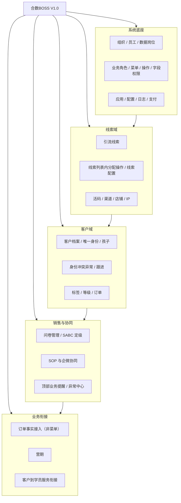
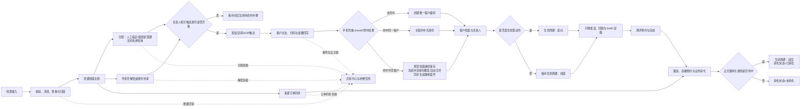
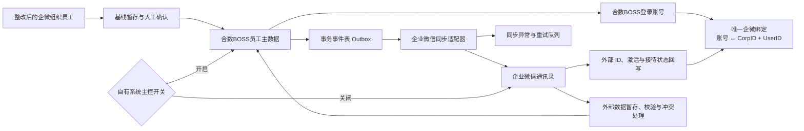
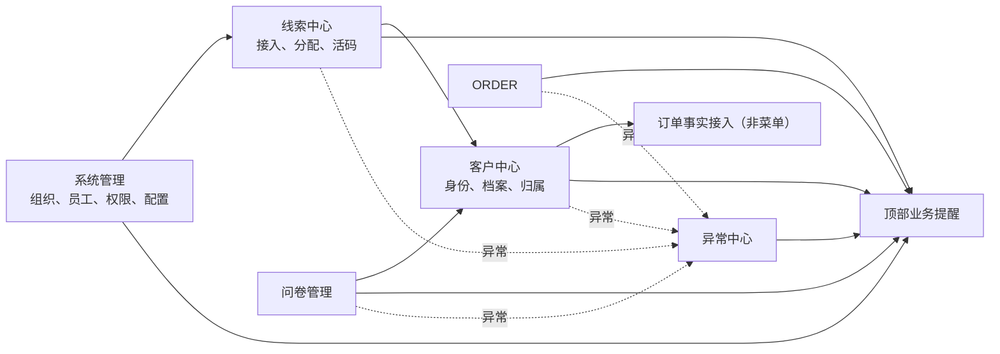
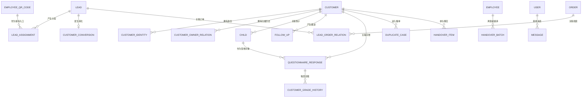

# 合数BOSS V1.0产品需求总文档

| 文档属性 | 内容 |
|---|---|
| 产品名称 | 合数BOSS |
| 产品定位 | 合数统一管理平台下，围绕客户关系的业务主系统 |
| 文档版本 | V1.85 |
| 文档状态 | 产品需求评审稿 |
| 更新日期 | 2026-09-04 |
| 全量规划 | V1.0 + V2.0 |
| 首期范围 | 一转部门 V1.0 |

> 本文档维护产品背景、目标、全局架构、完整菜单、全局流程及 V1.0 需求。项目人员、里程碑、验收签字、上线和回滚由 [合数BOSS项目立项与交付管理文档](./项目立项交付管理.md) 维护。

> **V1.85 当前生效补充：**引流线索批量菜单新增“查询异常订单、同步异常订单”两个独立入口；查询不触发同步，同步独立创建补同步演示任务。操作不依赖列表勾选结果，至少选择一个平台，按勾选顺序展示独立任务。当前仅为原型演示，不执行真实第三方查询或同步，结果必须明确标注演示状态，不能作为真实同步成功凭据。

> **V1.84 当前生效补充：**活码统一按多人接待配置，不展示单人活码类型；移除备用员工、接量日期区间、列表及详情二维码、详情下载入口和顶部“轮询权重/当前接量”指标，列表不再提供下载，操作仅保留详情、编辑和更多中的启用/停用，顶部“导出接量情况”保留；取消“添加同一员工”的开关、详情展示和分配逻辑。新增/编辑将“排班设置”移至“接待员工”之前；全天在线单独配置接待员工，分时段排班则先配置自定义规则人员、再配置不可删除的全天在线兜底人员，每条规则内直接选择员工并设置接量权重、只读展示当前接量，无需二次配置。详细校验以《线索中心需求文档》V1.73 为准。后文与本补充冲突的旧表述均不再生效。

> **V1.82 当前生效补充：**引流线索字段“首单商品名称”统一更名为“商品名称”，底层字段暂保持兼容；引流线索移除“所属直播组”概念，不再提供相关筛选、列表字段、详情信息及单条/批量变更，“变更期次”仅处理所属期次。后文与本补充冲突的旧表述均不再生效。

> **V1.80 当前生效补充：**系统管理—岗位管理的数据范围名称统一为“本人数据、本部门、本部门及下级部门、自定义组织、当前公司全部”；“本部门”按员工当前归属部门计算，“本部门及下级部门”按当前归属部门及全部下级部门计算。新增/编辑岗位移除独立“范围扩展”及“包含所选组织的全部下级组织”配置。后文与本补充冲突的旧名称及旧交互均不再生效。

> **V1.81 当前生效补充：**业务配置—短信管理新增“短信规则”，按规则名称、用户下单后/用户提醒/用户授权后类型、关联抖店、签名和模板配置；引流线索短信群发改为选择订单日期并由系统匹配生效规则，不再人工选择模板或编辑内容。标签管理仅保留标签库、标签组；系统与企业微信标签均只读，不提供新增标签，标签组可新增、编辑、启停并持久保留。后文与本补充冲突的旧表述均不再生效。

> **V1.67 当前生效补充：**首页经营数据在加微率前新增“有效线索数”，该字段仅展示数量并支持下钻和表头设置；引流期次名称全局唯一，新增、编辑和批量创建发现任一重名时均阻止保存，不自动跳过或部分创建。后文与本补充冲突的旧表述均不再生效。

> **V1.68 当前生效补充：**引流线索修改加微状态选择“已加企微”时，必须搜索并关联有效客户；关联客户位于加微时间上方，选中后自动带出只读的客户添加时间，提交阶段再次校验并绑定线索。“已加个微”仍由人工填写加微时间。引流线索单条“更多”移除“变更线索标记”，保留线索标记筛选和展示。客户列表字段“客户创建时间”更名为“客户添加时间”，客户总览仍按客户创建时间筛选且默认最近一个月。后文与本补充冲突的旧表述均不再生效。

> **V1.69 当前生效补充：**引流线索综合关键词拆分为客户、订单和商品三组独立筛选：客户下拉在“客户手机号、客户名称/微信昵称”间切换，订单编号独立输入，商品下拉在“商品名称、商品ID”间切换；三组条件可组合。新增与客户列表一致的线索标签筛选，按系统/企业微信分组，支持搜索和多选，多个标签按 OR 关系命中。后文与本补充冲突的旧表述均不再生效。

> **V1.70 当前生效补充：**首页—线索概览全局筛选新增IP大类多选项，选项读取启用的 `ip_category` 字典，并对整页聚合、下钻和导出统一生效；引流线索列表新增IP大类默认字段，按线索归因快照展示字典中文名称并纳入字段设置。后文与本补充冲突的旧表述均不再生效。

> **V1.71 当前生效补充：**引流线索来源筛选移除“认证赠送”和“店播/阿留直播间”，存量来源快照保持不变。业务配置—配置管理—落地页配置完善独立三级页面，页面内不再展示配置切换页签；支持名称/状态筛选、手机端预览、编辑H5地址及“获客助手/小程序/微信客服”主跳转方式与兜底优先级、启停，并仅允许删除停用记录。后文与本补充冲突的旧表述均不再生效。

> **V1.72 当前生效补充：**落地页配置的主跳转方式和兜底方式统一使用“微信客服”，不再使用容易与客户实体混淆的“微信客户”。后文与本补充冲突的旧表述均不再生效。

> **V1.73 当前生效补充：**线索中心—活码管理按企业微信主体及企微ID隔离。用户切换有权管理的已授权主体后，分组、列表、汇总统计和新建活码归属统一使用当前主体；禁止跨主体查询、配置或复用活码数据。后文与本补充冲突的旧表述均不再生效。

> **V1.74 当前生效补充：**商品短信配置中的购买后、授权后和手动提醒均选择已审核启用的短信模板，不再将触发动作或延迟时间作为模板选项。V1.74 的订单状态方案已被 V1.76 替代。后文与本补充冲突的旧表述均不再生效。

> **V1.75 当前生效补充：**渠道管理的渠道类型收口为平台渠道和IP渠道；渠道列表不提供新增入口，仅展示渠道编码、名称、类型、状态及详情、编辑、启停操作。后文与本补充冲突的旧表述均不再生效。

> **V1.76 当前生效补充：**引流线索的第三方订单状态统一映射为待支付、已支付、备货中、已发货、已取消、已完成、售后处理中、发货前退款完结、发货后退款完结、收货后退款完结、部分退款。外部待付款/未确认统一映射为待支付；不设置“状态异常”，未知外部状态保留原始值、维持原内部状态并进入异常中心。详细映射、退款阶段、字段和验收规则以《合数BOSS V1.0线索中心需求文档》5.1.6.1为准。后文与本补充冲突的旧表述均不再生效。

> **V1.77 当前生效补充：**渠道列表进一步移除详情和编辑，仅保留启用/停用；渠道编码、名称和类型按上游同步或既有主数据只读展示。本规则替代 V1.75 中保留详情、编辑的描述。后文与本补充冲突的旧表述均不再生效。

> **V1.78 历史补充（标签部分由 V1.81 替代，活码人员与排班规则由 V1.83 替代）：**引流线索订单状态固定为未支付、已支付、已取消、已完成、退款中、已退款，标注为第三方实时回传，本规则替代 V1.76。活码移除班级和使用明细，分组支持修改/删除并收入口“更多”；本版本曾包含备用员工等旧方案，现行活码规则以 V1.84 为准。

> **V1.79 当前生效补充：**活码管理列表“更多”移除“复制短链”，仅保留启用/停用操作；列表下载已于 V1.84 移除。后文与本补充冲突的旧表述均不再生效。

> **V1.66 当前生效补充：**客户生命周期仅保留线索、意向、成交：引流线索进入即自动保存并建立客户经营档案，发生可追溯挖需动作后转意向，存在支付成功且有效的成交订单后转成交。手机号与UnionID分别命中不同客户时，不阻断经营档案、来源线索和后续业务记录，只冻结冲突身份覆盖与自动合并并同步创建撞单案件。客户列表统一展示“客户添加时间”；基本档案展示客户地址，不展示企微客户ID和UnionID。

> **V1.65 当前生效补充：**客户列表新增企微客户全量/增量同步，以 `external_userid` 识别企微客户并独立保存多员工跟进关系；客户档案明确基本档案、线索记录、问卷测评和客户时间轴字段。客户与线索标签来源仅为系统/企业微信，标签管理仅保留标签库/标签组；引流线索修改加微状态时增加加微时间必填与变更审计。后文与本补充冲突的旧表述均不再生效。

> 名称口径：本文档中的现行产品统一称为“合数BOSS”；“旧 SCRM”或“历史 SCRM”仅指迁移前的来源系统。为兼容现有工程、数据库和权限体系，文件名、表名前缀及权限码中的 `scrm` 暂不调整。

## 1. 需求背景

历史 SCRM 同时承载线索、客户、活码、直播、内容、订单、售后和测评等能力，客户关系主链路与运营工具高度耦合。一转部门的业务横跨渠道、IDMS、旧 SCRM、企业微信、句子系统和问卷数据，存在以下核心问题：

- 线索接入、分配、加微、问卷和客户建档跨系统，状态和责任难以统一；
- 手机号、UnionID、企微身份和历史系统编号缺少统一客户身份模型；
- 客户归属、撞单和改派缺少统一规则及完整审计；
- 历史跟进主要依赖人工，过程指标和转化漏斗口径不完整；
- 旧系统继续叠加功能会扩大耦合、数据冲突和迁移风险；
- 现有客户超过 40 万、月新增线索约 3 万，需要可扩展的数据与系统底座。

因此需要在合数统一管理平台下建设合数BOSS，使其成为线索、客户身份、客户关系、销售跟进和业务转化的主系统，并通过分阶段迁移逐步收敛旧 SCRM。

## 2. 产品目标

1. 建立从渠道获客到业务转化的统一客户经营链路；
2. 建立手机号、UnionID、企微身份和客户编码之间的唯一身份体系；
3. 将线索分配、活码、客户归属、撞单和定级规则产品化；
4. 统一客户档案、标签、问卷、等级和关系历史；
5. 通过标准接口和事件连接 IDMS、企业微信、句子系统、旧 SCRM 及下游系统；
6. 建立异常处理、消息提醒、审计、对账和数据补偿能力；
7. 形成可继续承接交易、教务、履约、售后和 AI 能力的客户底座。

## 3. 全局产品架构

```mermaid
flowchart LR
    subgraph CHANNEL["获客与触点层"]
        A1["广告 / 活动 / 直播"]
        A2["转介绍 / 三方品"]
        A3["员工活码 / 企业微信"]
    end

    subgraph ACCESS["统一接入层"]
        B1["API / Webhook"]
        B2["文件导入 / 批量任务"]
        B3["数据清洗 / 标准化 / 幂等"]
    end

    subgraph CRM["合数BOSS客户关系核心"]
        C1["线索中心"]
        C2["客户身份与客户档案"]
        C3["分配 / 活码 / 改派 / 撞单"]
        C4["跟进 / 标签 / 问卷 / 等级"]
        C5["订单 / 消息 / 异常处理"]
    end

    subgraph COLLAB["业务协同层"]
        D1["企业微信"]
        D2["句子 SOP"]
        D3["IDMS"]
        D4["旧 SCRM 并行"]
    end

    subgraph BUSINESS["业务扩展层"]
        E1["订单与产品"]
        E2["课程教务与履约"]
        E3["售后与财务"]
        E4["数据分析与 AI"]
    end

    subgraph SUPPORT["平台支撑"]
        S1["组织 / 员工 / 岗位 / 权限"]
        S2["应用 / 配置 / 日志 / 支付"]
        S3["监控 / 审计 / 对账 / 补偿"]
    end

    CHANNEL --> ACCESS --> CRM --> BUSINESS
    CRM <--> COLLAB
    SUPPORT -.-> ACCESS
    SUPPORT -.-> CRM
    SUPPORT -.-> BUSINESS
```

### 3.1 系统责任边界

| 数据或能力 | 权威来源/主责 | 合数BOSS责任 |
|---|---|---|
| 组织、员工、岗位及角色 | 整改后的企业微信基线；合数BOSS正式主数据 | 企微基线经校验确认后建档；合数BOSS生成员工编号并用于权限、负责人、活码及继承；一个企微身份只能绑定一个登录账号；岗位配置数据范围，角色配置功能权限 |
| 渠道与投放归因 | IDMS | 保存来源标识和归因快照 |
| 扫码、加微和客户关系事件 | 企业微信 | 接收原始事件并推进线索/客户状态 |
| SOP 与问卷链接 | 句子系统 | 发起或关联任务，接收状态及链接 |
| 历史活码与旧客户 | 旧 SCRM | 接口同步、迁移、对账并保留历史编号 |
| 客户编码、身份和当前归属 | 合数BOSS | 唯一主写并向其他系统发布变更 |
| 订单、教务、履约、财务 | 对应业务系统或后续合数BOSS模块 | 通过客户编码及标准接口协同 |

## 4. 完整菜单全景图

> 阅读顺序从左到右为业务域一至业务域八；图中一级菜单、二级菜单和版本与完整功能菜单清单保持一致。

```mermaid
flowchart LR
    PLATFORM["合数BOSS｜完整功能菜单"]

    subgraph ORGBOX["业务域一｜组织与权限中心｜阶段一重点"]
        direction TB
        SYS_ORG["系统管理｜组织管理 · V1.0<br/>员工管理 · V1.0<br/>岗位管理 · V1.0<br/>角色管理 · V1.0<br/>菜单管理 · V1.0"]
    end

    subgraph CUSTOMERBOX["业务域二｜线索与客户中心｜阶段一重点"]
        direction TB
        HOME["首页｜线索概览 · V1.0"]
        LEAD["线索中心｜引流线索 · V1.0<br/>三方品线索 · V1.5<br/>线索配置 · V1.0<br/>活码管理 · V1.0<br/>渠道管理（列表/分析）· V1.0<br/>店铺管理 · V1.0<br/>IP列表 · V1.0<br/>商品列表 · V1.0<br/>短信配置 · V1.0"]
        CUSTOMER["客户中心｜客户总览 · V1.0<br/>客户列表 · V1.0<br/>撞单管理 · V1.0<br/>标签管理 · V1.0"]
        QUESTION["问卷管理｜问卷列表 · V1.0"]
    end

    subgraph PRIVATEBOX["业务域三｜私域销售中心"]
        direction TB
        LIVE["直播管理｜直播管理 · V2.0"]
        CONTENT["内容中心｜内容中心 · V2.0"]
    end

    subgraph TRADEBOX["业务域四｜产品交易中心｜V1.0 + V2.0"]
        direction TB
        PRODUCT["产品中心｜商品管理 · V2.0<br/>课程管理 · V2.0<br/>权益管理 · V2.0"]
        CONTRACT["合同管理｜合同列表 · V2.0"]
        PARTNER["合作方管理｜合作商列表 · V2.0<br/>供应商信息库 · V2.0"]
        FINANCE["财务中心｜财务中心 · V2.0"]
    end

    subgraph TEACHBOX["业务域五｜课程教务中心｜V2.0"]
        direction TB
        DELIVERY["交付中心｜营期管理 · V2.0<br/>作业管理 · V2.0<br/>小鹅通圈子 · V2.0"]
        ASSESS["测评管理｜测评列表 · V2.0"]
    end

    subgraph SERVICEBOX["业务域六｜履约服务中心｜V2.0"]
        direction TB
        DIAGNOSE["诊断中心｜诊断中心 · V2.0"]
        TARGET["目标管理｜目标管理 · V2.0"]
    end

    subgraph AFTERBOX["业务域七｜售后客服中心｜V1.0 + V2.0"]
        direction TB
        AFTER["售后管理｜售后列表 · V2.0"]
        QUALITY["质检中心｜规则配置 · V2.0<br/>质检列表 · V2.0"]
        WECHAT["业务配置｜微信客服管理 · V1.0"]
    end

    subgraph SUPPORTBOX["业务域八｜平台支撑中心｜阶段一重点"]
        direction TB
        BUSINESS_BASE["业务配置｜异常中心 · V1.0<br/>短信管理 · V1.0<br/>应用管理 · V1.0<br/>配置管理 · V1.0<br/>微信客服管理 · V1.0<br/>百家号配置 · V2.0"]
        SYS_BASE["系统管理｜系统参数 · V1.0<br/>字典管理 · V1.0<br/>日志查询 · V1.0<br/>地区管理 · V1.0"]
    end

    PLATFORM --> SYS_ORG
    SYS_ORG ~~~ HOME
    HOME ~~~ LIVE
    LIVE ~~~ ORDER
    ORDER ~~~ DELIVERY
    DELIVERY ~~~ DIAGNOSE
    DIAGNOSE ~~~ AFTER
    AFTER ~~~ BUSINESS_BASE
    BUSINESS_BASE --> SYS_BASE

    classDef phase1 fill:#eff6ff,stroke:#3b82f6,stroke-width:2px,color:#1e3a8a;
    classDef mixed fill:#f0f9ff,stroke:#7dd3fc,stroke-width:1.5px,color:#0c4a6e;
    classDef phase2 fill:#f8fafc,stroke:#94a3b8,stroke-width:1px,color:#475569;
    class SYS_ORG,HOME,LEAD,CUSTOMER,QUESTION,WECHAT,BUSINESS_BASE,SYS_BASE phase1;
    class ORDER,DELIVERY mixed;
    class LIVE,CONTENT,PRODUCT,CONTRACT,PARTNER,FINANCE,ASSESS,DIAGNOSE,TARGET,AFTER,QUALITY phase2;
```

完整功能菜单及页面说明独立维护在 [合数BOSS完整功能菜单及说明](./合数BOSS完整功能菜单及说明.md)。

## 5. 产品核心业务流程

完整角色分工、判断分支、异常补偿和完成标志见[合数BOSS总体业务流程图](./合数BOSS总体业务流程图.md)。主链路如下：

## 6. V1.0 版本需求

### 6.1 V1.0 需求背景

V1.0 面向一转部门，优先解决渠道线索进入后无法统一分配、活码和加微数据断裂、客户身份重复、客户归属冲突、问卷定级缺少规则、客户未跟进无法回收以及异常数据无法补偿的问题。

V1.0 采用新旧系统并行方式：历史活码继续使用并向合数BOSS同步客户事件；新活码统一在合数BOSS创建；V1.0 灰度和对账通过后，再逐步收缩旧 SCRM 对应入口。

### 6.2 V1.0 需求目标

- 一转部门在合数BOSS完成渠道线索到客户经营和业务转化的主闭环；
- 人工指定和轮询两种分配方式可执行、可解释、可追溯；人工指定按组织架构选择员工，轮询按最新营期活码人员名单执行；
- 新旧活码产生的扫码和加微事件均能进入合数BOSS；
- 手机号或 UnionID 任一有效即可创建或关联唯一客户；
- 改派具备明确规则和操作历史；身份冲突在 V1.0 阻断并自动进入撞单管理；公海和商机能力取消；
- 问卷能够关联线索/客户并按规则生成 S/A/B/C 等级；
- 站内消息覆盖关键业务协作、系统任务、同步结果和风险预警；
- 历史客户迁移、外部系统对账、异常补偿和审计满足上线要求。
- 支持分配、解密和订单同步并行处理；通过“当前待办状态 + 各环节独立状态 + 转化状态”准确表达已解密未分配等非标准顺序。

### 6.3 V1.0 功能架构图

### 6.4 V1.0 业务流程图

线索中心的六段式业务流程、研发流转全景、两阶段归因、关系表、指标体系、等级继承和讲解口径已统一合并至《[合数BOSS V1.0——线索中心需求文档](./合数BOSS V1.0线索中心需求文档.md)》。以下流程保留为主需求中的简版跨模块视图。

分配、解密和订单同步是并行环节，不设固定先后顺序。当前待办状态由独立状态计算，例如分配状态为待分配、解密状态为已解密时，列表当前待办显示“待分配”，同时仍可按“已解密”筛选。计算采用终态及下游事实优先：已转化、无效或重复直接无需处理；已填问卷不再回退检查短信和加微；已加微不再要求短信点击，从而兼容异步回写、人工补录和跨渠道完成动作。完整计算优先级、字段枚举及状态联动以本需求的线索中心5.1节和第6节为准。

### 6.5 V1.0 功能菜单

> 本节从上述完整菜单中仅筛选 V1.0 功能。撞单管理已纳入 V1.0；公海和商机能力已取消；三方品线索属于 V1.5；测评管理及测评列表属于 V2.0。

| 一级菜单 | 二级菜单 | 页面说明 | 主要操作/功能 | 版本 |
|---|---|---|---|---|
| 首页 | 线索概览 | 合数BOSS唯一默认首页与线索全链路经营台账 | 增加IP大类的多选筛选、期次时间与线索创建时间、转化链路、单期/多期/无期次经营数据、DAY1/2/3过程指标、渠道/IP渠道分析、成交订单数和金额趋势、下钻与导出 | V1.0 |
| 线索中心 | 引流线索 | 引流业务线索列表及详情 | 新增IP大类和线索标签默认列，IP大类读取归因快照对应字典名称；线索标签最多展示2个及“+N”，支持按系统/企业微信来源查看且均只读；详情、旅程、是否挖需、变更手机号/所属期次、修改加微状态、分配改派、短信、同步订单及解密导入导出 | V1.0 |
| 线索中心 | 线索配置 | 可扩展线索规则中心 | 分类管理活码分配、营期名单流转和问卷等级规则；条件组合、试算、冲突检测、发布停用、版本回退 | V1.0 |
| 线索中心 | 活码管理 | 按企业微信主体隔离的新旧员工活码、分组、IP归因、标签及接待配置 | 切换有权主体及企微ID；分组修改/删除；新增、编辑、启停、关联IP、标签、全天/分时段排班、规则内人员及接量权重、全天兜底 | V1.0 |
| 线索中心 | 渠道管理 | 通过渠道列表/数据分析页签统一展示已有渠道及转化效果 | 渠道类型仅平台渠道、IP渠道；列表移除新增、详情、编辑及归因规则、负责人、上级渠道列，仅保留启停和筛选；分析保留漏斗、下钻及导出 | V1.0 |
| 线索中心 | 店铺管理 | 外部平台店铺身份及线索归因 | 新增补充店铺ID、KEY、秘钥、短信账号和备注；移除负责人、权限范围、独立详情及业务发生口径；期次统一为全部期次 | V1.0 |
| 线索中心 | IP管理 | 以老师名称维护IP大类、IP渠道和IP名称关系 | 列表顺序为IP大类、IP渠道、IP名称；移除当前IP统计、IP配置、关联商品和关联平台；新增、编辑、启停 | V1.0 |
| 线索中心 | 商品列表 | 统一承接第三方商品与店铺、活码关系 | 创建/更新时间、商品名称、商品ID、商品状态、是否分配活码、店铺名称/类型、同步、导出和备注；移除关联IP | V1.0 |
| 线索中心 | 短信配置 | 按商品与活码配置业务短信模板 | 短信分组、商品/活码绑定；购买后、授权后、手动提醒分别选择已审核启用模板；批量设置、新增、编辑、启停 | V1.0 |
| 客户中心 | 客户总览 | 客户经营数据概览 | 统一数据权限；按客户创建时间筛选且默认最近一个月；支持组织、负责人、来源、添加方式、等级筛选及权限下钻 | V1.0 |
| 客户中心 | 客户列表 | 唯一客户档案 | 生命周期仅为线索/意向/成交；客户添加时间；基本档案展示客户地址且不展示企微客户ID/UnionID；字段设置、标签、手机号预览/变更及企微同步 | V1.0 |
| 客户中心 | 撞单管理 | 手机号与 UnionID 跨档案命中的强身份冲突处理 | 不阻断经营档案与业务记录；冻结冲突身份覆盖/自动合并并自动建案，支持领取、证据对比、裁决和审计 | V1.0 |
| 客户中心 | 标签管理 | 统一查看系统与企业微信标签 | 仅保留标签库和标签组；两类标签均只读，不提供新增标签；标签组支持新增、编辑、启停并持久保存 | V1.0 |
| 问卷管理 | 问卷列表 | 问卷模板、题目结构、投放链接与答卷统一管理 | 名称/状态筛选、新增编辑、题目分组、五类题型、企微标签、二维码与双链接、答卷统计、模板导入、权限导出、线索/客户关联与SABC评级输入 | V1.0 |
| 系统管理 | 组织管理 | 公司、部门、小组固定三级组织树 | 查询、新增下级、编辑、移动、启停、删除拦截、导出 | V1.0 |
| 系统管理 | 员工管理 | 合数BOSS员工主数据、生命周期及企业微信身份 | 自有系统主控开关、企微基线导入、同步与差异对账、历史员工/重新入职、编辑、启停、离职触发 | V1.0 |
| 系统管理 | 岗位管理 | 以员工为绑定对象配置本人、小组、部门、自定义组织和公司级数据范围 | 新增、编辑、关联员工、范围预览、启停及影响预览 | V1.0 |
| 系统管理 | 角色管理 | 运营、客服、规划师等业务功能角色 | 菜单、操作、字段授权、关联员工及影响预览 | V1.0 |
| 系统管理 | 菜单管理 | 合数BOSS动态菜单配置 | 目录、页面、操作权限、路由、排序和状态 | V1.0 |
| 系统管理 | 系统参数 | 合数BOSS全局设置与运行参数 | 查询、新增、编辑、启停、类型校验、敏感值保护和版本历史 | V1.0 |
| 系统管理 | 字典管理 | 业务枚举、标签和稳定值的统一维护 | 字典类型、字典项、排序、颜色、启停及历史值兼容 | V1.0 |
| 业务配置 | 异常中心 | 企业微信及同步异常 | 查询、详情、重试、忽略、转人工、关闭 | V1.0 |
| 业务配置 / 短信管理 | 签名管理 | 短信签名配置 | 新增、审核状态、启停和有效期 | V1.0 |
| 业务配置 / 短信管理 | 短信模板 | 短信模板配置 | 新增、变量校验、审核状态和启停 | V1.0 |
| 业务配置 / 短信管理 | 短信规则 | 按抖店和触发类型配置发送规则 | 查询、新增、详情、编辑、启停；规则名称、类型、关联抖店、签名和模板必填 | V1.0 |
| 业务配置 / 短信管理 | 发送结果 | 供应商发送回执 | 结果、错误码、计费条数和关联任务 | V1.0 |
| 业务配置 | 应用管理 | 接入合数BOSS的外部应用 | 新增、编辑、启停、连接校验和凭证轮换 | V1.0 |
| 业务配置 / 配置管理 | 企微配置 | 企业微信接入配置 | 校验、发布、凭证轮换和版本回退 | V1.0 |
| 业务配置 / 配置管理 | 小程序配置 | 小程序接入配置 | 校验、发布、凭证轮换和版本回退 | V1.0 |
| 业务配置 / 配置管理 | 店铺配置 | 店铺与组织关联 | 新增、编辑、校验和启停 | V1.0 |
| 业务配置 / 配置管理 | 落地页配置 | 落地页地址、主跳转方式与兜底优先级 | 名称/状态筛选、手机端预览、编辑H5地址、调整获客助手/小程序/微信客服跳转优先级、启停及停用后删除 | V1.0 |
| 业务配置 | 微信客服管理 | 企业微信客服接入 | 客服列表、客服事件消息、客服消息 | V1.0 |
| 系统管理 | 日志查询 | 登录、操作、权限、配置和接口日志 | 查询、详情、审批导出和归档 | V1.0 |
| 系统管理 | 地区管理 | 国家、一级行政区、二级行政区标准树 | 选择国家、标准数据同步、编辑状态、差异预览和版本更新；不提供新增下级 | V1.0 |

> 说明：导入、同步、详情、新增、编辑、批量操作和任务进度属于页面操作，不单独生成左侧菜单。

### 6.6 V1.0 模块详细需求

> 本节按用户实际使用的产品模块组织。每个模块统一描述模块定位、页面组成、核心功能、关键规则、异常处理和首期完成标准；跨模块规则在所属主责模块定义，其他模块只引用，不重复维护。

各一级菜单的页面、交互、数据、接口、权限、验收和回滚细节已独立拆分，统一入口见 [合数BOSS V1.0一级菜单专项需求索引](./合数BOSS V1.0需求文档导航.md)：

| 一级菜单 | 专项需求 |
|---|---|
| 首页 | [首页详细需求](./合数BOSS V1.0首页需求文档.md) |
| 线索中心 | [线索中心详细需求](./合数BOSS V1.0线索中心需求文档.md) |
| 客户中心 | [客户中心详细需求（GitHub唯一正式来源）](https://github.com/freya-pr/heshu-boss-demo/blob/main/docs/product/%E5%90%88%E6%95%B0BOSS%20V1.0%E5%AE%A2%E6%88%B7%E4%B8%AD%E5%BF%83%E9%9C%80%E6%B1%82%E6%96%87%E6%A1%A3.md) |
| 问卷管理 | [问卷管理详细需求](./合数BOSS V1.0问卷管理需求文档.md) |
| 系统管理 | [合数BOSS系统管理1.0 PRD](./合数BOSS V1.0系统管理与业务配置需求文档.md) |

#### 6.6.1 线索概览

**模块定位**

“线索概览”是用户进入合数BOSS后的唯一默认首页，根据业务角色功能权限、数据岗位范围、组织关系和特别授权展示线索全链路经营数据。首页模块不再提供独立工作台页面；历史 `/dashboard` 地址统一跳转至 `/leads/analytics`。

**页面组成**

| 区域 | 主要内容 |
|---|---|
| 全局筛选 | 数据权限范围、期次、期次时间、线索创建时间、来源渠道、店铺、IP大类、IP渠道、IP名称、归属组织和负责人；期次、渠道、店铺、IP大类、IP渠道和IP名称支持多选，IP大类读取启用字典项，默认选择距当前日期最近的启用期次并带出其起止时间；查询条件对经营数据、分析、下钻和导出统一生效 |
| 转化链路 | 按有效线索、加微、填写问卷和成交展示人数及环节转化率；不再展示预约直播、到课、完课三个链路节点 |
| 经营数据 | 单选期次时展示一行期次数据；多选期次时第一行展示汇总数据，其后逐行展示各期次数据；不选择期次、仅按线索创建时间筛选时正常汇总后续转化结果，期次列留空。过程转化按有效线索数、加微率、问卷填写率以及DAY1/2/3到课率和完课率排列；有效线索数仅展示数量并支持下钻；期次列固定，其他字段可通过表头设置自由选择、自动记忆并恢复默认 |
| 下沉分析 | 保留渠道分析、IP渠道分析和成交趋势，移除商品分析；成交趋势同时展示成交订单数（个）和成交金额（万元） |
| 指标下钻 | 点击可下钻指标打开继承当前筛选与权限快照的明细抽屉，展示订单、客户、来源、店铺、商品、IP归因、负责人、负责人组织、事件时间和当前节点 |
| 导出 | “导出数据”输出当前筛选主体的经营概览、渠道和IP渠道数据；明细抽屉可按当前指标、筛选和权限独立导出，明细包含负责人及负责人组织 |

**关键规则**

- 数据范围与当前用户的数据岗位、组织关系和特别授权一致，页面能力与业务角色权限一致；
- 指标必须展示统计周期、口径版本和更新时间，不得将不同口径数据直接相加；
- 点击经营数据表中的可下钻指标或下沉分析中的指标数字，打开继承期次、期次时间、线索创建时间、业务筛选与权限快照的明细抽屉；
- 不得通过“期次经营数据/线索经营数据”模块改名表达统计差异，页面统一使用“经营数据”；未选择期次时按线索创建时间圈定线索并汇总其后续转化结果；
- “导出数据”必须与当前筛选、统计口径和数据权限一致，并包含经营概览、渠道分析和IP渠道分析，不得继续导出已移除的商品分析；
- 下钻明细和导出必须同时记录负责人稳定ID、负责人名称与负责人组织快照；人员调岗后历史归属不得随当前组织关系被覆盖；
- 毛GMV、退款金额和净GMV命名及公式必须固定，禁止出现两个同名GMV；
- 加载失败时保留最近一次成功数据并标记更新时间，不将失败展示为 0。

**V1.0 完成标准**

多选筛选、双时间筛选、转化链路、经营数据单期/多期/无期次汇总、DAY1/2/3过程指标、表头设置、渠道/IP渠道分析、成交订单数与金额趋势、指标下钻和分层导出均可用；主管与员工看到的数据范围正确，汇总、下钻明细和导出在同一口径下能够核对，明细可追溯至负责人及其组织快照。完整字段、公式和交互见首页与线索中心详细需求。

#### 6.6.2 线索中心

**模块定位**

V1.0 统一承接引流线索的接入、清洗、识别、分配、活码、渠道归因及过程追踪；三方品线索在 V1.5 开放。

引流线索字段编码、多维状态和转化联动已直接合并到《[合数BOSS V1.0——线索中心详细需求](./合数BOSS V1.0线索中心需求文档.md)》5.1及第6节。页面不展示“当前待办”字段或筛选；分配、解密、短信、加微、问卷、测评、跟进和订单状态分别保存并独立筛选，线索标记为有效、无效或重复，转化状态只保留未转化、已转化。

**页面组成**

| 页面 | 主要职责 |
|---|---|
| 引流线索 | 展示公共线索字段及投放、素材、落地页等引流扩展字段；IP大类默认展示并可在字段设置中隐藏；线索标签最多展示2个及“+N”，支持按系统/企业微信来源查看全部且均只读 |
| 三方品线索（V1.5） | 展示公共线索字段及合作方、产品、批次等三方品扩展字段 |
| 线索配置 | 分类管理活码分配和营期名单流转规则；统一保存触发、条件、动作、适用范围、优先级、冲突策略、试算、执行快照和规则版本 |
| 活码管理 | 按企业微信主体及企微ID隔离新旧活码；主体切换同步刷新活码分组、列表、汇总统计与新建归属；并维护关联IP、只读IP渠道、排班规则、接待员工、接量权重、企微标签、内部标签、创建人和期次 |
| 渠道管理 | 渠道列表按平台渠道/IP渠道只读展示已有渠道，不提供新增、详情、编辑入口，仅支持启停；数据分析页签展示线索到客户及成交转化效果 |
| 首页—线索概览 | 统一展示转化链路与经营数据；支持单期、多期及无期次汇总、DAY1/2/3指标、表头设置、渠道/IP渠道分析、成交订单数与金额趋势、指标下钻和分层导出 |
| 店铺管理 | 店铺按平台类型和第三方店铺ID建立唯一身份；新增补充接入字段，不维护负责人、权限范围和独立详情；经营统计仅保留线索归因口径，期次统一使用“全部期次” |

**核心功能**

1. API、Webhook 和文件导入统一进入接入任务，导入与同步进度在页面抽屉或弹窗展示；
2. 数据完成字段校验、标准化、查重和来源归因后形成线索；分配、解密和订单同步随后可以并行处理；
3. 引流与三方品使用统一主模型，通过独立扩展字段、列表列、筛选项和模板表达差异；
4. 支持详情、旅程、线索标记筛选与展示、是否挖需、变更手机号、导出非解密数据、批量分配和改派；引流线索页不提供人工新增、编辑线索、添加跟进、变更线索标记或人工变更线索等级入口；
5. 支持人工指定和轮询两种分配方式；人工指定通过公司—部门—小组—员工组织树选择人员，轮询根据最新营期活码人员名单执行；
6. 分配完成后关联目标员工活码，客户扫码和加微结果回写线索；
7. 在“首页—线索概览”统一展示转化链路与经营数据，支持多选和双时间筛选、单期/多期/无期次汇总、DAY1/2/3指标、渠道/IP渠道分析、成交订单数与金额趋势；商品分析已移除。下钻与导出继承筛选和负责人组织快照。
8. 列表常用搜索将客户、订单和商品拆为独立条件：客户下拉支持“客户手机号、客户名称/微信昵称”，订单编号独立输入，商品下拉支持“商品名称、商品ID”；新增按系统/企业微信分组的线索标签搜索与多选筛选，多标签按 OR 关系命中。以上条件可与线索标记、转化状态及更多条件组合；更多条件包含分配、解密、短信、加微、问卷、测评、跟进和订单等独立状态，以及来源、添加方式、负责人、所属期次、店铺和可选业务日期；
9. 每条线索提供生命旅程日志，以只追加时间轴记录接入、清洗、解密、分配/改派、触达、加微、问卷、测评、客户建档、状态/标记变化、订单同步、转化及退款回退。
10. 行操作固定展示“详情、旅程、更多”；建立客户档案、变更手机号、修改加微状态、变更所属期次、改派、短信提醒和备注等单条动作收进更多；不提供编辑线索、添加跟进、变更线索标记和变更线索等级。“确认加微”不作为快捷动作，加微通常由企业微信事件或数据同步回写，但允许具备 `lead:wechat_status:update` 权限的人员通过“修改加微状态”纠正异常数据；选择已加企微时必须搜索并关联有效客户，自动带出只读的客户添加时间，提交时再次校验并绑定线索；选择已加个微时人工填写加微时间。全部人工修改只追加旅程和审计，不删除历史身份数据。
11. 列表上方批量操作承载分配、变更期次、查询异常订单、同步异常订单、同步订单、短信群发、导入解密数据和导出非解密数据；其中分配和短信群发需要先勾选线索，同步订单属于全局后台任务，无需勾选线索且不读取当前列表勾选结果；同步订单允许多选已接入平台，并按用户勾选先后顺序为各平台创建独立后台任务；短信群发必须选择订单日期并默认当前日期，系统按订单日期、关联抖店和当前生效短信规则自动匹配签名与模板，未匹配或重复匹配时不发送，同时排除无有效手机号、退订和黑名单；导入固定模板必须包含订单编号和手机号，只按订单编号唯一命中并覆盖既有引流线索手机号，不创建线索；导出基于当前查询结果，仅输出未解密且有订单编号的线索订单；页面移除同步手机号；“查询异常订单、同步异常订单”无需勾选线索，至少选择一个平台并按勾选顺序展示独立演示任务，当前不执行真实第三方查询或同步，单条操作移除语音提醒。
12. 单条“更多—变更手机号”必须先校验后提交：未占用手机号可直接变更当前线索及关联客户主手机号；已占用时禁止直接覆盖。同一一转负责人可人工确认合并，以新手机号命中的客户为保留主档并迁移相关档案；跨负责人必须阻断并展示双方归属。负责人以稳定ID/员工编号判断，提交阶段再次校验，全部动作幂等并写入旅程与审计。
12. 列表上方仅展示设置图标作为表格设置入口，用户可选择展示字段并自动记忆；订单编号作为第一业务列，与线索来源和操作固定展示且不可取消；页面、详情/旅程标题及导出不展示线索编号。
13. 列表新增“是否挖需”列与是/否筛选；默认未挖需，具备权限的用户可直接勾选并二次确认，成功后锁定且不能取消，同时记录标记人、标记时间并在线索旅程追加只读事件；该字段不得由备注、跟进、问卷或等级自动推断。

引流线索完整页面跳转、11张交互截图、字段说明、状态联动、权限异常、接口及验收要求已直接合并到《[合数BOSS V1.0——线索中心详细需求](./合数BOSS V1.0线索中心需求文档.md)》5.1节，不再拆分独立页面规格文档。

**关键规则**

- “线索分配”不设置独立菜单；人工指定、批量分配、轮询、改派、失败重试和分配历史均在线索列表中承载；

- 以“来源系统 + 来源记录编号”作为接入幂等键，重复回调或导入不得重复创建；
- 原“员工负载”统一定义为活码配置中员工最大可分配人数上限，不再作为独立分配算法；
- 人工指定展示组织树，并支持按员工姓名或员工编号实时搜索当前组织及下级组织人员；员工卡片展示员工编号、岗位和当前负责的未转化线索数；人工指定不受活码排班名单和接量权重影响；
- 自动分配仅从当前命中排班规则的可用员工中选择；轮询按接量权重比例分配，离职、停用或未配置活码的员工不参与；
- 轮询仅使用最新营期活码人员名单，跳过达到上限、离职、停用、无有效活码或未配置上限的员工；
- 分配必须保存候选名单版本、营期、人数上限快照、轮询游标或人工选择结果、目标员工、目标活码和执行结果；
- 无可用员工时进入待分配队列，不允许丢弃或静默失败；
- 新活码统一由合数BOSS创建，旧活码保留来源系统和外部编号映射；
- 员工停用或离职后停止接待；当前命中排班规则无可用员工时进入待分配池；
- 扫码、加微等企微事件按外部事件编号幂等保存，支持重放和补偿。
- 生命旅程日志必须保存变更前后值、操作人、来源、发生时间、业务关联和追踪号，不允许物理修改或删除，并可关联系统审计日志。

**异常处理**

字段校验失败、重复冲突、分配失败、活码失效、扫码/加微无法关联均进入异常中心；页面展示失败原因、处理建议、重试次数和关联业务对象。

**V1.0 完成标准**

两类线索可稳定进入系统并保留差异字段；人工指定可按组织选人，自动分配可按活码排班与分配方式执行，轮询按接量权重计算比例；新旧活码事件均能回写；搜索条件可以组合并完整重置；关键变更可通过生命旅程日志追溯；失败记录可重试或人工处理。

#### 6.6.3 客户中心

**模块定位**

以唯一客户为核心，V1.0 统一管理客户身份、档案、撞单裁决、归属、标签和等级。公海和商机能力已取消；客户中心不设置“跟进记录”“等级管理”“公海客户”和“商机管理”二级菜单，历史互动在客户档案聚合，等级在客户列表操作中维护。

客户生命周期、客户360°完整档案、订单交付、服务人员流转、问卷测评及诊断报告的详细口径独立维护在 [合数BOSS客户360°档案与生命周期需求](./合数BOSS客户360档案与生命周期需求文档.md)。

**页面组成**

| 页面 | 主要职责 |
|---|---|
| 客户总览 | 客户规模、生命周期、来源、添加方式、等级、归属和转化概览；统一权限筛选，客户创建时间默认最近一个月并支持下钻 |
| 客户列表 | 固定客户编号、客户名称和操作列；字段设置仅展示齿轮图标；生命周期仅为线索/意向/成交；支持客户添加时间、系统/企微标签、手机号预览/变更；客户添加时间沿用主档 `created_at`；基本档案展示客户地址且不展示企微客户ID/UnionID；保留线索、问卷、时间轴及企微客户同步 |
| 撞单管理（V1.0） | 手机号与 UnionID 分别命中不同客户时不阻断经营档案与业务记录，只冻结冲突身份覆盖/自动合并并自动建案；支持证据核验、裁决和审计 |
| 标签管理 | 仅保留标签库和标签组；标签来源仅为系统和企业微信，两类均只读且不提供新增标签；标签组可新增、编辑、启停并持久保存，不保留不存在的标签引用 |

**客户身份与建档规则**

1. 标准化手机号或 UnionID 任一有效即可创建或关联正式客户；
2. 两种身份都缺失时保持“身份待补充”，不可转客户；
3. 创建前同时查询手机号和 UnionID 的有效绑定关系；
4. 任一身份命中一个客户时关联已有客户并补充另一身份；
5. 两种身份分别命中不同客户时，经营档案、来源线索和后续业务记录继续保存；冻结冲突身份覆盖与自动合并并创建唯一撞单案件；
6. 均未命中时由服务端生成不可修改的全局唯一客户编码；
7. 客户合并后保留原编码作为历史别名，拆分依据原始身份、来源和审计恢复；
8. 敏感身份原值加密保存，使用标准化哈希查重，不以明文建立普通索引。
9. 企微 ExternalUserID、第三方平台 ID 和历史系统编号作为辅助身份或来源标识保存；除手机号、UnionID 外的标识不能单独绕过当前转客户条件。

**客户与孩子关系**

- 客户以家长或主要联系人为经营主体，家长同时是系统用户、课程学员和服务权益归属人；
- 孩子不是客户、用户或独立学员，仅作为家长客户名下的附属关联对象；
- 一个客户可以关联多个孩子，孩子拥有独立内部编号，不使用姓名作为唯一标识；
- 孩子档案至少包含姓名/昵称、性别、出生日期或年龄段、年级、学校、地区和状态，敏感字段按权限脱敏；
- 订单、权益、课程交付、客户归属和生命周期必须归属于家长客户；问卷、测评、诊断、课程匹配等记录可以选择关联具体孩子作为业务背景；
- 同一客户下疑似重复孩子需提示人工确认，合并或拆分保留来源和审计历史；
- 客户归属变更时孩子随客户保持可见关系，但孩子的历史课程、班级和服务记录不得被覆盖。

**归属、撞单与改派规则**

- 首次有效加微员工默认成为主负责人，后续员工可记录为协作人员；
- 任一时点每个客户只能存在一个有效主负责人；
- 手机号与 UnionID 分别命中两个不同有效客户时，不阻断经营档案、来源线索和后续业务记录；必须原子性冻结冲突身份覆盖与自动合并并幂等生成撞单案件；
- 处理人先领取案件，再对比两个候选客户的身份、来源、订单、负责人和活跃时间；可选择“合并至手机号命中客户”“合并至 UnionID 命中客户”或“确认不同人”；
- 裁决必须填写理由并二次确认，记录候选客户、证据快照、操作人、复核人、理由和变更前后关系；被合并档案不得物理删除，身份、来源和业务记录迁移后保留历史别名与恢复依据；
- 规定时间内无有效跟进或员工离职时生成超时/离职待办，由具备权限的管理人员提醒原负责人或人工改派；
- 已完成的归属裁决、合并或拆分不得物理删除，通过反向业务操作恢复。

**互动记录、标签和等级**

- 客户档案聚合展示既有人工跟进和后续自动采集的互动事实，不设置独立跟进记录菜单；历史记录采用追加式时间轴，来源明确且不得被覆盖；
- 标签来源仅为系统和企业微信，两类标签均只读并记录同步及历史关系；不提供人工标签、自动规则、外部映射和标签治理入口；
- 等级规则唯一配置入口为“线索中心—线索配置—等级规则”，支持适用问卷、题目和答案组合、维度权重、分值区间、必要条件、版本、试算、发布和生效时间；
- 有效问卷提交后自动计算线索 S/A/B/C 等级；无有效问卷时显示“未定级”；V1.0 引流线索页不提供人工改级，历史人工等级仅作为迁移快照保留；
- 线索等级与客户等级共用字典 `lead_customer_grade`，业务值仅包含 S、A、B、C；“未定级”是系统保留状态，不作为可配置字典项；
- 新客户首次建档继承来源线索当前有效等级；命中存量客户时不覆盖客户等级，只记录候选结果和差异；建档后客户等级独立维护，问卷规则对线索的后续重算不自动覆盖客户；
- 客户等级在客户列表单条操作中编辑，必须具备权限、选择 S/A/B/C、填写原因并保留变更前后值、操作人、时间和来源；客户改级不反向修改线索。详见《[合数BOSS V1.0——线索中心需求文档](./合数BOSS V1.0线索中心需求文档.md)》第 5.4.6 节；
- 客户添加方式使用字典 `customer_add_method`，稳定值仅为 `LINK/通过链接添加`、`BUSINESS_CARD/名片`、`QR_CODE/扫描二维码`；添加方式与首次来源分别保存、分别筛选，历史无法还原时展示“—”，不得依据渠道反推；

**V1.0 完成标准**

手机号/UnionID 唯一客户逻辑、线索/意向/成交三阶段生命周期、客户档案、撞单管理、标签和等级均可形成闭环；客户中心无“跟进记录”“等级管理”“公海客户”和“商机管理”二级菜单，等级可从客户列表编辑并完整留痕；手机号与 UnionID 跨档案冲突不阻断经营档案和业务记录，可完成冻结冲突身份、建案、领取、证据核验、人工裁决、审计和反向恢复。

#### 6.6.4 问卷管理

**模块定位**

统一管理问卷、答卷及其与线索、客户和等级结果的关系，为 S/A/B/C 客户定级提供可追溯输入。

**核心功能**

- 问卷列表支持名称/状态筛选、查询、重置、分页、新增、编辑、删除拦截、二维码和数据统计；
- 新增/编辑采用“左侧问卷信息 + 右侧题目分组”结构，支持头尾图片、启停、企微标签、分组排序及输入框、文本域、单选、多选、省市区五类题型；
- 二维码弹窗提供填写链接和企微查询链接，分别支持复制；停用后禁止新提交但保留历史查询；
- 答卷统计支持物流、地址、手机号、提交/支付时间、成交、跟进、发货、退款和售后等筛选，支持查看原始提交内容、按权限补充运营字段、模板导入和导出；
- 支持按 UnionID、已确认手机号或外部客户编号关联线索/客户；
- 查看答卷快照、定级结果、规则版本、得分和命中条件；
- 关联异常在问卷页面内处理，不新增独立菜单。

**关键规则**

- 优先按 UnionID 关联；同一标识命中多个对象时不得自动选择；
- 至少配置1道有效题目方可启用；已产生答卷的问卷不得物理删除，结构变更生成新版本；
- 不能唯一匹配的答卷标记为待处理并进入异常队列；
- 原始答卷和版本不可被后续问卷模板覆盖；
- 重新定级必须产生新的等级历史，不覆盖旧结果；
- 人工关联或解绑需要高风险权限、原因和审计记录。

**V1.0 完成标准**

问卷可完成新增、结构化编辑、启停、二维码/双链接投放和答卷回收；答卷可按业务条件筛选、按权限查看/导出，能够唯一关联线索/客户并触发可解释的 S/A/B/C 定级；异常答卷可人工处理。

#### 6.6.5 订单数据协同（非菜单）

**模块定位**

V1.0 接收第三方订单事实并关联线索、客户、商品和店铺，为业务转化结果、异常预警和数据分析提供数据，不设置订单中心或正式课订单页面。

**核心功能**

- 通过 Webhook、增量拉取或人工导入接收订单事实；
- 通过内部关系主键关联客户编码、商品、店铺、负责人、订单状态和支付状态；业务页面以订单编号识别，不展示内部线索编号；
- 保存来源系统、外部订单号、同步时间、同步状态及幂等键；
- 异常订单、支付差异和退款异常进入异常中心，不生成订单管理页面。

**范围边界**

- 所有订单类型均不设置 V1.0 独立菜单，不纳入订单管理页面验收；
- 后续如建设交易能力，应重新立项规划菜单归属、交易模型和服务履约关系；
- 历史订单可作为线索归因、客户档案和经营分析的只读关联数据迁移。

**关键规则**

- 外部订单以“来源系统 + 外部订单号”幂等；
- 合数BOSS不直接篡改来源系统主责的金额、支付和退款结果；
- 订单无法唯一关联客户时进入异常处理；
- V1.0 不包含完整权益核销、售后、合同和财务对账能力。

#### 6.6.6 交付中心

交付中心不属于 V1.0。本版本不提供营期、班级、作业或圈子维护入口；线索、活码、问卷和统计如需营期维度，只读取外部/历史系统同步的只读营期ID、名称及必要快照。V2.0 详细页面、状态、双时间轴、权限、验收与回滚规则见 [合数BOSS V2.0交付中心详细需求](./合数BOSS V2.0交付中心需求文档.md)。

#### 6.6.7 顶部业务提醒

**模块定位**

通过全局顶部通知入口汇总当前用户相关的业务变化、跨角色协作、第三方同步、系统任务和风险预警，不设置独立一级或二级菜单。V1.0 以站内提醒为验收范围，企微或短信推送作为后续扩展。

**列表与操作**

| 能力 | 要求 |
|---|---|
| 列表字段 | 类型、标题、摘要、业务对象、发送时间、已读状态、处理状态、消息级别 |
| 筛选 | 消息类型、已读、处理状态、级别和时间范围 |
| 操作 | 单条已读、批量已读、全部已读、进入有权限的业务详情 |
| 状态 | 未读/已读与待处理/处理中/已完成/无需处理相互独立 |
| 失败状态 | 加载失败展示重试；无权限、对象撤销或链接失效展示明确说明 |

**V1.0 消息类型**

| 消息 | 触发条件 | 默认接收人 |
|---|---|---|
| 新线索实时提醒 | 新线索成功落库 | 已分配员工；未分配时为线索管理员/主管 |
| 客户分配提醒 | 首次分配、领取或管理员指定成功 | 新负责人，按配置抄送主管 |
| 客户改派提醒 | 负责人变更 | 原负责人、新负责人及必要的主管 |
| 新增企微好友通知 | 企微加微事件完成关联 | 对应接待员工；异常时为企微/线索管理员 |
| 第三方数据同步结果 | 同步任务成功、部分成功或失败 | 发起人、接口负责人或数据管理员 |
| 一转转二转待接收 | 生成二转待接收任务 | 指定接收人；未指定时为二转主管/接收组 |
| 系统任务完成提醒 | 导入、导出、分配、改派、继承或重算结束 | 任务发起人，失败时抄送管理员 |
| 异常订单或退款预警 | 订单、支付、退款或对账异常 | 订单负责人、财务/售后角色及主管 |

**关键规则**

- 同一来源系统、事件编号、消息类型和接收人只生成一条消息；
- 消息失败不得阻断主业务，应进入补偿队列；
- 接收人按事件发生时的负责人、组织、角色和规则计算并保存快照；
- 用户停用或离职后不再接收新消息；
- 消息只保存必要摘要，跳转后重新校验菜单、数据和字段权限；
- 已读不等于业务处理完成；业务状态变化应独立回写处理状态。

#### 6.6.8 系统管理与业务配置

**模块定位与边界**

系统管理与业务配置均属于合数BOSS应用内部，不是合数统一管理平台外层的公共系统管理。统一平台负责统一登录、应用入口和会话；合数BOSS“系统管理”负责组织员工映射、岗位数据范围、角色功能权限、菜单、日志和地区等平台治理能力；“业务配置”负责异常、短信、应用、企微/小程序/店铺/落地页配置和微信客服等业务接入能力。业务配置作为独立一级菜单展示在系统管理上方，当前版本不包含支付管理和群机器人。

##### A. 通用页面与交互

- 列表统一采用“标题 + 搜索筛选 + 主要操作 + 表格 + 分页”；
- 支持加载、空数据、错误和无权限状态，加载失败不得展示为空数据；
- 新增/编辑默认使用弹窗，复杂配置使用抽屉或独立页面；
- 危险操作使用红色提示和二次确认，提交中禁止重复点击；
- 导出按当前筛选和数据权限执行，敏感字段脱敏并生成审计；
- 相同页面不重复打开页签；切换组织后重新计算数据权限。

##### B. 组织管理（P0）

| 项目 | 要求 |
|---|---|
| 页面结构 | 左侧完整组织树用于定位，右侧默认展示当前节点的直接下级；路径、当前组织编码和新增默认上级随节点同步 |
| 查询 | 按组织名称或编码模糊查询；查询时右侧展示跨层级结果及数量，清空后恢复当前节点直接下级 |
| 列表字段 | 系统生成组织编码、组织名称、组织类型、负责人、有效员工人数、状态、创建时间 |
| 组织类型 | 固定为公司、部门、小组三类 |
| 组织结构 | 固定三级：公司 → 部门 → 小组；小组为叶子节点，不允许越级或同级嵌套 |
| 操作 | 查询、新增下级、编辑、移动、启停、删除和导出 |
| 删除约束 | 存在下级组织、有效员工、岗位或业务归属时禁止删除，并分别提示影响数量及迁移/停用指引 |
| 移动约束 | 预览受影响下级、员工和数据权限后确认并审计 |

组织编码采用 `ORG-{TYPE}-{SEQ}` 格式，例如 `ORG-DPT-000123`。`TYPE` 为三位类型缩写（公司 `COM`、部门 `DPT`、小组 `TEM`），`SEQ` 为全局递增六位流水号。编码由后端创建时生成、全局唯一、只读且永不复用，不包含组织名称或层级；组织改名、移动、停用和重新启用均不得改变编码。生产环境必须使用数据库序列或等效并发安全机制生成，禁止“最大值加一”。

同一上级下名称不得重复；上级不能选择自身或自己的下级；停用组织后禁止新增下级、员工、岗位和业务归属，但保留历史关系。新增/编辑字段包括上级组织、组织名称、只读组织编码、组织类型、负责人、联系电话、邮箱和状态，其中名称、类型和状态必填。页面不提供人工排序，按创建时间升序稳定展示。

个人不作为组织节点；员工在员工管理中直接关联所属部门或该部门下小组，以兼容没有小组的部门；个人数据权限通过 `employee_id` 和员工组织关系计算。

##### C. 员工管理（P0）

| 能力 | 要求 |
|---|---|
| 员工列表 | 员工编码、员工名称、真实姓名、手机号、邮箱、所属组织、业务角色、数据岗位、账号状态及企微开通/邀请/激活/绑定状态 |
| 页面结构 | 左侧公司—部门—小组组织树筛选，右侧为搜索、状态筛选、批量操作、员工列表和分页；详情及日志使用右侧抽屉 |
| 查询 | 组织范围、账号状态与关键词可叠加；关键词匹配员工编号、员工名称、真实姓名、手机号和邮箱 |
| 批量操作 | 勾选后启用，支持批量启用和停用；停用前提示未结业务，停用后禁止登录和新增接待，不触发专用继承模块 |
| 组织任职 | 支持主组织和兼任组织，关系保留生效时间；员工绑定一个生效数据岗位和一个或多个业务角色 |
| 账号操作 | 启停、重置密码、解除绑定；高风险操作二次确认 |
| 离职处理 | 禁止登录、停止新接待并保留历史负责人记录；存量业务如需调整，使用对应业务页面的改派能力 |
| 冲突处理 | 外部身份命中不同员工时暂停覆盖，进入员工身份冲突队列 |
| 新增员工及企微开通 | 使用统一弹窗录入员工身份、任职与权限、账号设置；可选“同时创建或绑定企微成员”。先按手机号查重，不存在才创建企微成员；历史员工使用行操作“补开企微” |

员工列表不提供物理删除；岗位作为独立数据权限主数据并生成岗位编码，只配置数据范围，不继承角色、不授予菜单和操作权限。员工详情和操作日志始终按永久 `employee_id` 查询。

手工新增员工时，员工名称、真实姓名、手机号、主组织、一个数据岗位和至少一个业务角色必填，邮箱选填；登录账号默认同步创建，也可仅创建员工主档。新员工编码采用 `B` + 6 位并发安全流水号，生成后不可修改或复用。手机号在有效员工范围内全局唯一，邮箱填写时校验唯一性；主组织只能选择启用的部门或小组，公司不可直接作为员工主组织。员工主档、主组织关系、岗位关系、角色关系和账号必须事务保存，失败整体回滚。新增弹窗内提供“同时创建或绑定企微成员”开关：企微 UserID 不允许手工录入，系统先按手机号查重，已有且未绑定则建立绑定，不存在才创建并邀请。员工主档先提交，企微任务异步执行；企微失败不得删除已创建员工，应进入同步记录并支持重试，冲突或连续失败进入异常中心。历史未绑定员工使用列表行操作“补开企微”。创建成功与激活成功必须分开显示，一人一账号一企微身份，重复请求不得重复创建；新增员工不自动承接客户、线索、订单或活码。详细字段、异常提示、安全要求和验收标准见《[合数BOSS系统管理1.0 PRD](./合数BOSS V1.0系统管理与业务配置需求文档.md)》5.2.0.1—5.2.0.2 节。

##### C3. 岗位管理

岗位用于统一配置员工的数据可见范围，不代表运营、客服、规划师等业务职位，也不承载菜单和操作权限。岗位列表展示岗位编码、名称、数据范围摘要、关联员工数、状态和操作；支持本人数据岗、小组管理岗、部门管理岗、跨部门管理岗、公司数据管理岗五类基础配置。

一个员工默认绑定一个生效数据岗位；员工需要同时绑定一个或多个业务角色。最终权限按“业务角色功能权限 + 数据岗位基础范围 + 用户特别授权 - 显式拒绝/排除”计算。特别授权必须记录审批单、理由和有效期，不通过新增角色绕过岗位范围。岗位调整、负责人关系变化、特别授权到期后必须主动失效权限缓存，并统一影响列表、详情、搜索、统计、导出和接口。

岗位新增/编辑字段包括岗位名称、只读岗位编码、范围类型、自定义组织、协作数据策略、排除项、说明和状态，不提供独立“范围扩展”或“是否包含下级”开关。有生效员工的岗位不可删除，停用岗位后不可新增绑定；修改数据范围前需预览受影响员工、组织和业务数据范围。

##### C1. 角色管理（P0）

角色列表展示角色名称/编码、描述、关联员工数、状态和功能权限摘要。业务角色按运营、客服、规划师、一转老师、课程顾问、财务专员等职责设置，仅负责菜单及查看、新增、编辑、删除、导入、导出和敏感字段明文等功能授权，不设置数据范围入口。

数据岗位统一使用五级范围：本人数据、本部门、本部门及下级部门、当前公司全部和自定义组织。本人数据岗只查看本人负责或明确协作的数据；本部门范围查看员工当前归属部门内的数据；本部门及下级部门范围查看当前归属部门及组织树内全部下级部门的数据；公司管理者和中台业务人员必须绑定“当前公司全部”岗位或获得有期限的特别授权后才能查看全公司数据。系统管理员角色默认只有系统配置功能，不自动拥有全部线索、客户和订单数据。

岗位授予数据范围类型，本部门类范围按员工当前归属组织动态解析；“部门数据岗、部门管理岗、公司数据管理员”属于数据岗位，不作为业务角色。员工调岗或归属关系变更后刷新权限缓存，无需重写业务角色或历史业务数据。自定义范围可明确选择多个公司、部门或小组，但不提供独立范围扩展开关。

业务数据统一通过当前负责人、当前责任组织和当前公司计算范围；创建人不等于当前负责人，数据移交后原创建人不继续继承查看权。基础范围来自员工生效数据岗位，用户级特别授权可在审批有效期内扩展，显式排除始终优先；多个业务角色只合并功能权限。菜单、操作、字段和数据范围必须同时满足；拥有全公司行数据范围不自动获得手机号明文、批量导出、改派等高风险权限。列表、详情、搜索、统计、首页看板、接口及导出必须调用同一服务端权限能力，完整配置、数据模型和验收用例见《[合数BOSS系统管理1.0 PRD](./合数BOSS V1.0系统管理与业务配置需求文档.md)》5.3、5.4及6.1节。

角色权限变更前展示影响员工数和功能变化预览，保存后刷新相关用户权限缓存并写入审计日志；高风险权限收回立即生效。内置系统管理员角色不可删除，有关联员工的自定义角色必须先解除关联后才能删除。

##### C2. 业务页面统一组织筛选（P0）

线索中心、首页—线索概览、客户总览和客户列表统一使用“权限范围提示 + 数据视图 + 归属组织 + 负责人”筛选组件。数据视图包含“全部授权数据”和“我的数据”；归属组织使用公司—部门—小组级联树，支持搜索和选择任一层级，选择部门时自动包含直属员工及下属小组；负责人支持姓名和员工编号搜索，并根据已选组织联动缩小候选范围。员工状态统一在员工管理处理，不作为业务页面筛选项。

筛选只能缩小当前员工由数据岗位及特别授权计算出的有效范围，不能扩大权限。本人数据岗仅返回本人数据；本部门范围返回当前归属部门数据；本部门及下级部门范围返回当前归属部门及全部下级部门数据；公司数据管理岗与获批中台特别授权可在当前公司内选择任意组织。所有组织、负责人候选项、列表数据、汇总数量、统计指标和导出结果均由服务端数据权限能力裁剪，前端隐藏不作为权限依据。

线索和客户列表按当前负责人、当前责任组织查询，正式课订单按当前销售负责人、当前业绩归属组织查询；分析报表按业务事件发生时保存的负责人及组织快照统计。人员调岗、组织调整、线索改派和客户移交不得重写历史业绩。销售负责人、交付负责人、班主任和规划师分别建模与筛选，禁止使用一个“负责人”字段混合表达。

员工使用三层标识：

1. 合数BOSS内部主键 `employee_id`：系统生成、永不复用；
2. 合数BOSS员工编码 `employee_no`：由合数BOSS按 `B` + 6 位流水号生成并长期维护；
3. 外部身份：企微 `CorpID + UserID` 作为在线外部身份，单独保存来源租户、状态及生效时间；旧SCRM员工ID可作为只读历史别名。

历史员工与重新入职统一遵循“一个自然人、一个员工主档、一个永久员工编号”原则：企微员工基线先进入暂存区，经身份匹配和冲突处理后，由合数BOSS生成 `B` + 6 位正式员工编号；旧SCRM员工ID和历史企微UserID只作为别名或外部身份保存。同一员工重新入职时恢复原 `employee_id/employee_no` 并新增任职记录，不创建新员工编号；原角色、岗位、客户、活码和待办不自动恢复，必须按新任职重新授权或分配。无法确认是否同一自然人时必须进入人工冲突处理队列。

历史初始化与主责规则：

- 上线前以整改后的企微组织和员工数据建立基线暂存区，经业务确认后写入合数BOSS正式员工主档；
- 不读取、导入、比对或归档其他办公平台的组织、员工及员工编号数据；
- 合并优先依据已确认映射和企微 `CorpID + UserID`，旧SCRM员工ID和已验证手机号仅作辅助证据，禁止仅凭姓名自动合并；
- 基线对账签字后，员工编号、姓名、手机号、在职状态、主组织和岗位均以合数BOSS为准；
- 企微差异只告警或形成修复任务，不反向覆盖合数BOSS主责字段；
- 历史企微 UserID 映射永久保留，确保客户负责人、活码和历史操作可追溯。
- 一个合数BOSS登录账号最多绑定一个生效企微身份，同一 `CorpID + UserID` 也只能绑定一个登录账号；换绑先归档旧关系再建立新关系，业务归属按 `employee_id` 聚合，历史操作保留当时实际企微身份。

##### D. 合数BOSS与企业微信同步

完整字段主责、切换步骤、异常补偿与回滚见《[合数BOSS系统管理1.0 PRD](./合数BOSS V1.0系统管理与业务配置需求文档.md)》5.2、8—10章；本文只保留开发验收所需摘要。

“自有系统主控开关”开启时，只允许合数BOSS向外部系统同步组织员工主数据，企微仅回写身份和运行状态；关闭时停止合数BOSS向外主数据下发，允许企微组织员工同步至合数BOSS。关闭状态仍必须经过暂存、唯一性校验、身份冲突处理和审计，不允许外部数据无条件覆盖正式主档。同一时刻只能启用一个主数据方向；切换权限仅限超级管理员，并要求二次确认、原因、快照、在途任务处置和完整审计。

系统管理全景关系、切换、同步和回滚规则统一见《[合数BOSS系统管理1.0 PRD](./合数BOSS V1.0系统管理与业务配置需求文档.md)》第3、5.2、8—10章。

| 项目 | 要求 |
|---|---|
| 增量同步 | 自有系统保存后写 Outbox，目标 1 分钟内开始、正常 5 分钟内完成 |
| 全量对账 | 每日02:00（Asia/Shanghai，可通过系统参数调整）与企业微信扫描差异，仅修复企微或进入人工确认 |
| 幂等键 | `source_version + object_type + object_id + target_system` |
| 顺序 | 同一组织或员工按自有系统版本串行消费，旧版本不得覆盖新版本 |
| 删除 | 自有系统采用停用；外部优先停用/离职，不物理删除历史映射 |
| 回写 | 外部用户/部门 ID、同步状态、时间、错误码和重试次数 |
| 告警 | 连续失败 3 次或超过 15 分钟未成功时告警并转人工 |
| 同步顺序 | 上级组织 → 下级组织 → 员工及组织关系；离职先阻断登录和接待，再停用外部账号，最后触发继承 |

产品责任人为张铭钰；技术责任人为陈庆焕并指定企微接口开发人。企微基线上线前执行一次全量导入；后续使用实时增量下发、企微回调和每日全量差异扫描。正常回调显示在员工管理—同步记录；字段冲突、重复绑定或连续失败进入业务配置—异常中心。旧差异未处理时不会仅因其存在而重复收到同一回调，因此夜间差异扫描是必须的兜底机制。

##### F. 角色与权限管理（P0）

- 业务角色支持菜单、页面操作和字段三层功能授权；数据范围由岗位独立配置；
- 用户可以直接关联多个角色；允许权限取并集，显式拒绝高于允许；
- 高风险权限（导出、身份解绑、客户合并、跨组织改派、支付切换）需独立授权；
- 数据范围统一支持本人数据、本部门、本部门及下级部门、当前公司全部和自定义组织；不提供独立范围扩展开关；
- 手机号、UnionID、身份证、地址、支付信息按角色脱敏；
- 权限变化需展示影响预览并记录变更前后值。

##### G. 菜单管理（P0）

- 菜单类型包括目录、页面和操作权限；
- 配置名称、上级、路由、组件、权限标识、排序、可见性和状态；
- 页面由菜单名称/状态查询区、树形菜单表格及新增编辑弹窗组成；列表展示名称、类型、权限标识、组件路径、状态、创建时间和操作；
- 行内支持修改、新增下级和删除；新增下级自动带入当前上级，目录、页面和操作权限必须遵守可挂载层级及字段必填规则；
- 菜单来自后端权限配置，前端不得写死；
- 无下级权限的父菜单不展示；禁用菜单禁止新访问；
- 点击菜单动态生成页签，相同页面不重复打开；
- 被角色使用或存在有效下级时禁止删除。

##### G1. 系统参数与字典管理（P0）

- 系统参数作为合数BOSS全局设置模块，维护安全阈值、批量上限、默认周期、功能开关和接入技术参数；参数键和类型创建后不可修改，参数值按文本、数值、开关、JSON、密钥进行服务端校验；
- 敏感参数由服务端加密或引用密钥服务，列表、详情、接口、日志和导出均不返回明文；变更立即生成新版本、刷新缓存并写入审计；
- 字典管理采用“左侧字典类型 + 右侧当前字典项”主从页面，统一维护线索来源、线索/客户等级、客户添加方式、客户生命周期等可枚举选项，不单独增加字典项菜单；
- 字典编码和字典项值创建后不可修改或复用；停用后新业务不可继续选择，但历史数据仍按原标签正确展示；
- 系统参数、业务字典和业务规则严格分工：单值全局行为用参数，可枚举选项用字典，复杂条件/优先级/动作进入对应业务规则中心；
- 完整页面、字段、权限、缓存、接口、数据模型、验收与回滚规则见《[合数BOSS系统管理1.0 PRD](./合数BOSS V1.0系统管理与业务配置需求文档.md)》5.13、5.14节。

##### H. 异常中心（P1）

菜单归属：`业务配置 / 异常中心`。

统一展示企微回调、员工同步、分配执行、活码、客户身份、问卷关联、第三方同步、订单和退款异常。支持查询、详情、重试、忽略、转人工、补偿和关闭；关闭必须填写原因，所有处理保留审计。

页面顶部展示待处理、重试中、转人工数量；查询支持请求地址/异常编号/错误码/异常信息关键词、请求时间范围和处理状态。列表展示异常编号、请求地址、异常码、异常信息、业务类型、次数、最近请求时间和状态。详情通过右侧抽屉展示追踪号、脱敏请求摘要、处理建议及处理轨迹；凭证、密钥和完整敏感字段禁止展示。重复异常按接口、错误码和关联对象聚合，重试必须幂等并保留每次执行记录。

##### I. 短信管理（P1）

菜单归属：`业务配置 / 短信管理`。

复用历史短信服务，提供签名管理、短信模板、短信规则和发送结果。模板、签名启停均受权限控制；短信规则按抖店和触发类型选择有效签名及模板；发送结果保存供应商流水、状态、错误码、重试次数和关联业务对象。

左侧导航在短信管理下设置“签名管理、短信模板、短信规则、发送结果”四个三级菜单，分别使用独立路由、查询、列表和操作。短信规则位于短信模板和发送结果之间，新增/编辑必须填写规则名称、类型、关联抖店、签名和模板；类型固定为用户下单后、用户提醒、用户授权后。同一抖店与类型只允许一条生效规则，变更全量审计。

##### J. 应用与配置管理

菜单归属：应用管理和配置管理均位于一级菜单“业务配置”下。

- 应用管理：外部应用新增、编辑、启停、连接校验、凭证轮换及调用范围；
- 配置管理：企微、小程序和店铺达到“可配置、可校验、可发布、可回退”；落地页配置维护已有记录，支持预览、编辑主跳转及兜底顺序、启停和停用后删除；
- 左侧导航在配置管理下新增企微配置、小程序配置、店铺配置和落地页配置四个三级菜单，各自使用独立路由、列表和表单；
- 百家号配置属于 V2.0，不作为 V1.0 门禁；
- 配置发布形成版本，失败时可回退到上一有效版本。

##### K. 微信客服管理（P1）

菜单归属：`业务配置 / 微信客服管理`。

提供客服列表、客服事件消息和客服消息查询；复用企业微信客服能力。V1.0 重点是账号与事件接入、关联业务对象、状态查询和异常定位，不强制建设完整会话内容归档。

##### M. 日志与地区管理

- 日志包括登录、操作、权限、配置、接口和任务日志；
- 支持按用户、对象、类型、时间和追踪号查询，导出需要审批并脱敏；
- 日志默认在线保留 180 天，之后归档；安全及关键业务审计建议保留不少于 3 年，最终以公司合规制度为准；
- 地区管理接入国家地区标准数据，按“国家 → 一级行政区 → 二级行政区”展示；一级行政区明确标注省、自治区、直辖市、特别行政区，二级行政区明确标注地级市、自治州、地区、盟、市辖区等法定类型；
- 地区数据保存标准编码、来源、发布日期和版本，支持导入、新增、编辑、启停、差异预览和版本更新；
- 地区页面根据所选国家同步标准一级、二级行政区，不提供“新增下级”；人工补录改为受控标准数据导入或数据源修订；
- 已被渠道、客户、组织或规则引用的地区不得物理删除。

##### N. 系统管理数据与接口约束

核心实体至少包括组织、员工、员工外部身份、员工组织关系、岗位、岗位组织范围、员工岗位、角色、员工角色、角色菜单/操作/字段权限、用户特别授权、系统参数、字典类型、字典项、应用配置、同步任务、异常记录和审计日志。岗位建立独立主数据，不在角色关系中保存数据范围。

所有外部接口必须明确字段主责、幂等键、版本、顺序、超时、重试、死信、补偿和对账方式；禁止合数BOSS与企业微信相互跨库写入。

##### O. 系统管理 V1.0 完成标准

1. 组织、员工、岗位、角色、菜单和应用关系可配置并正确控制合数BOSS权限；岗位控制数据范围，角色控制功能权限，两者入口和数据模型不得混用；
2. 企微整改数据完成基线导入，合数BOSS生成正式员工编号并可增量下发企微；未确认来源数据不得进入初始化或同步链路；
3. 一个企微身份只绑定一个合数BOSS登录账号，一个登录账号也只保留一个生效企微绑定；
4. 公司—部门—小组固定三级组织层级可正确处理，越级、同级嵌套和小组下新增组织均被拦截；
5. 员工停用可阻断登录和新增接待，并保留历史操作与负责人记录；
6. 系统参数、字典、异常、短信、应用、配置、微信客服、日志和地区模块达到 V1.0 定义的可用/可配置程度；
7. 菜单、操作、字段和数据范围权限无越权，敏感字段脱敏正确；
8. 同步失败、密钥变更、配置发布和高风险操作均可审计和补偿。

### 6.7 V1.0 模块间协作关系

模块间只通过明确的业务标识、服务接口和事件协作；不得通过跨库更新绕过客户身份、权限、审计或异常补偿逻辑。

## 7. V1.0 数据模型

### 7.1 核心数据约束

- 线索以来源系统和来源记录号幂等；引流与三方品共用主模型；
- 手机号、UnionID 和企微外部联系人以加密值保存、哈希值查重；
- 同类型有效身份只能属于一个有效客户；
- 一个客户可关联多个孩子；家长是客户、用户和学员，订单、权益和交付归属于家长，问卷、测评、诊断及课程匹配可按场景关联孩子作为背景对象；
- 任一时点每个客户只能有一个有效主负责人；
- 分配、归属、等级、撞单、继承和消息状态采用追加式历史及审计；
- 外部事件保存来源、事件编号和发生时间，支持乱序处理、重放和补偿；
- 所有批量导入、迁移、合并、拆分和继承记录批次号并可对账。
- `lead_id` 仅作为数据库内部关系主键，不对业务用户展示；订单编号作为引流线索的首要业务识别字段。内部线索记录、内部订单编号和第三方订单号独立存在，一条内部线索记录可通过关系表关联多笔订单，内部关联不得直接用订单号替代数据库主键；
- 三方订单唯一键为“平台编码 + 第三方店铺ID + 第三方订单号”；重复回调、拉取和导入只更新原订单；无订单号的手工数据按第三方线索ID或文件来源记录键接入，不伪造订单号。

## 8. V1.0 数据迁移

迁移范围包括 40 多万历史客户及有效线索、手机号、UnionID、企微身份、客户来源、活码、负责人、协作人、标签、微信关系状态，以及能够确认口径的问卷和等级数据。

迁移步骤：数据盘点 → 字段和枚举映射 → 身份标准化与冲突检查 → 试迁移 → 业务抽样 → 全量迁移 → 增量同步 → 数量/字段/身份/负责人对账 → 差异处理 → 灰度开放。身份冲突不得直接覆盖，必须进入撞单或迁移异常流程。

## 9. 角色与权限

| 角色 | 主要权限 |
|---|---|
| 合数BOSS管理员 | 全局配置、异常、撞单、继承、导入导出和审计 |
| 一转主管 | 本部门线索客户、分配、撞单、改派和团队报表 |
| 客服/助教 | 本人或授权线索、发送活码、查看状态和登记跟进 |
| 规划师 | 本人客户、服务过程、挖需、标签和客户等级 |
| 活码配置人员 | 活码创建、配置、启停和效果查看 |
| 数据/技术支持 | 迁移、同步、异常重试和对账，不默认查看明文敏感数据 |
| 审计人员 | 只读查看关键变更、导入导出和权限日志 |

权限同时包含菜单、操作、字段和数据范围。手机号等敏感信息按角色脱敏，导出、合并、身份解绑和跨部门变更属于高风险权限。

## 10. 非功能需求

| 维度 | V1.0 要求 |
|---|---|
| 容量 | 至少支持 100 万客户、200 万线索、500 万行为记录及每月 10 万新增线索扩展 |
| 页面性能 | 普通页面和搜索不超过 2 秒，常规列表筛选不超过 3 秒 |
| 回调性能 | 企业微信回调 1 秒内完成接收响应，后续异步处理 |
| 可靠性 | 登录、线索创建、分配和企微事件处理成功率不低于 99.9% |
| 幂等 | 导入、回调、同步、客户创建、消息、合并和继承具备幂等控制 |
| 安全 | 敏感字段脱敏、密钥加密、最小权限、接口签名和限流 |
| 审计 | 导入导出、身份、合并、归属、权限和规则变更完整审计 |
| 可观测 | 日志、指标、链路、消息积压、同步失败和对账差异可监控告警 |
| 恢复 | 数据备份、事件重放、批次补偿和应用回滚经过演练 |

## 11. V1.0 非范围

- 直播组、数字人、评论组和完整直播运营工具；
- 素材、话术和完整内容生产体系；
- 社群运营及大规模自动化营销；
- 完整权益、售后、合同、合作方、产品、作业、小鹅通、测评、质检、诊断、财务和目标管理；
- 自动抓取全部聊天内容作为跟进记录；
- 复杂 AI 预测、多企业微信 CorpID 和所有第三方系统一次性接入；
- 旧 SCRM 全量下线。

## 12. 页面与交互统一要求

### 12.1 页面结构

| 页面类型 | 统一结构 |
|---|---|
| 列表页 | 页面标题、指标摘要、筛选区、主要操作、表格、批量操作、分页和状态反馈 |
| 详情页 | 对象摘要、状态与负责人、快捷操作、分区页签、业务时间轴和审计记录 |
| 新增/编辑 | 简单表单使用弹窗或抽屉；复杂配置和多步骤操作使用独立页面 |
| 配置页 | 草稿、校验、试算、发布、版本记录和回退入口 |

### 12.2 通用状态

- 加载中使用骨架屏或局部加载，不清空已有数据；
- 空数据说明为空原因，并在有权限时提供新增或调整筛选入口；
- 加载失败展示错误说明、追踪号和重试按钮，不得伪装为空数据；
- 无权限展示权限说明或申请指引，不泄露对象是否存在及敏感信息；
- 参数错误在字段附近展示，服务端错误保留用户已填写内容；
- 并发冲突提示数据已变化，支持刷新对比，不允许静默覆盖；
- 同步中展示进度或任务编号，同步失败展示原因、重试和人工处理入口；
- 危险操作显示影响范围并二次确认，不能只依赖红色表达风险。

### 12.3 敏感操作

查看完整手机号、批量导出、身份解绑、客户合并/拆分、跨组织改派、撞单裁决、权限授权、支付默认切换和退款凭据操作必须进行后端权限校验并记录日志。必要时增加二次身份验证或审批。

## 13. 接口与数据约定

| 类别 | 约定 |
|---|---|
| 统一响应 | `code`、`message`、`data`、`timestamp`、`traceId`；业务成功码统一 |
| 分页请求 | `pageNum`、`pageSize`，支持明确的排序字段和方向 |
| 分页响应 | `list`、`total`、`pageNum`、`pageSize` |
| HTTP 状态 | 400/422 参数错误；401 未登录；403 无权限；404 不存在；409 冲突；500 系统异常 |
| 时间 | API 使用统一时区和格式，业务库同时保存发生时间与入库时间 |
| ID | 后端可使用 BIGINT/分布式 ID，前端与开放 API 以字符串处理，防止精度损失 |
| 幂等 | 导入、同步、回调、分配、转客户、消息、支付回调和继承均定义业务幂等键 |
| 并发 | 客户身份、客户归属、分配规则、角色权限、组织结构和配置发布使用乐观锁或等效机制 |
| 审计字段 | 业务表统一记录创建人、创建时间、修改人、修改时间、数据版本和逻辑状态 |
| 错误处理 | 返回稳定业务错误码、可理解提示和追踪号，不向前端暴露堆栈、SQL 或密钥信息 |

接口定义必须明确：字段含义、必填性、枚举、脱敏、数据主责、超时、重试、顺序、幂等、限流、补偿和对账方式。禁止通过跨库写入绕过服务层规则。

### 13.1 技术实现约束

- 前端采用 Vue 3、Vue Router、Element Plus、Axios、Pinia 和 ECharts 等既定技术栈；
- 后端采用 Spring Boot、Spring Cloud/Alibaba、Dubbo 和 MyBatis-Plus 等既定技术栈，服务发现及配置使用 Nacos；
- MySQL 负责业务持久化，Redis 只用于缓存、短期状态和受控并发，不作为唯一事实来源；
- 定时和异步任务通过统一任务调度及消息机制执行，任务必须有状态、幂等键、重试和补偿；
- 代码按领域和服务层隔离，Controller 不承载核心业务规则，数据访问层不得绕过领域校验直接修改客户身份或归属；
- 具体版本、目录结构、服务边界和部署拓扑以[架构与开发约束](../03-architecture/ARCHITECTURE.md)为准；需求文档不重复维护易变化的依赖版本。

## 14. 外部系统集成策略

| 外部系统/能力 | 开发与测试阶段 | V1.0 正式落地要求 |
|---|---|---|
| 合数统一管理平台 | 本地登录上下文或测试会话 | 传递统一用户和会话，合数BOSS重新计算应用角色、菜单及数据范围 |
| 企业微信 | 可使用沙箱/模拟回调辅助开发 | 单一 CorpID、回调验签、UserID/ExternalUserID 映射、幂等、重试、限流及每日对账 |
| IDMS | 使用固定样例和接口适配器 | 渠道、来源、唯一记录号和归因字段可追溯并完成数量对账 |
| 句子/SOP 系统 | 使用适配器验证任务状态 | 明确 SOP 触发、状态回传、问卷链接、失败重试和数据主责 |
| 旧 SCRM | 使用迁移样例和旧活码映射 | 旧活码事件、历史客户及增量数据可同步、对账和补偿 |
| 短信服务 | 本地适配器和发送记录 | 复用历史服务，签名/模板合规、频控、回执和失败重试 |
| 支付服务 | 本地连接测试，不使用真实资金 | 复用历史服务，密钥托管、签名、幂等、退款凭据和结果对账 |
| 问卷服务 | 本地问卷/答卷样例 | 外部问卷映射、同步、身份关联、版本和异常处理 |
| 三方电商平台 | 使用平台适配器、签名样例和原始报文样例 | 抖店、快手、微信小店、小红书及确认后的百度交易载体完成店铺授权、订单/商品/退款同步、幂等、主动解密、补偿和T+1对账 |

开发阶段允许使用 Stub 或沙箱降低等待成本，但不得将模拟链路等同于生产验收。进入真实业务灰度前，企微、IDMS、旧 SCRM、句子系统及实际纳入范围的外部能力必须使用正式测试/生产等效环境完成联调。

### 14.1 三方订单接入与解密统一口径

三方接入采用“平台适配器 + Webhook实时回调 + 默认每5分钟增量拉取补漏 + 人工导入兜底 + T+1对账”。原始报文先验签并只追加保存，再完成标准化、订单幂等、商品映射、线索/客户匹配及店铺、商品、IP、渠道、营期、组织和负责人归因。所有同步、解密、补偿和对账均生成可追踪任务。

| 平台 | 官方入口 |
|---|---|
| 抖店 | [抖店开放平台](https://op.jinritemai.com/)；[API调用指南](https://op.jinritemai.com/docs/guide-docs/10/23) |
| 快手 | [快手电商开放平台](https://open.kwaigobuy.com/) |
| 微信小店 | [微信小店开放接口](https://developers.weixin.qq.com/doc/store/shop/API) |
| 小红书 | [小红书开放平台](https://school.xiaohongshu.com/en/open/index.html) |
| 百度电商 | [百度电商开放平台](https://trade.baidu.com/newPlatform/) |

手机号解密只允许有权限用户因真实业务用途主动发起，不随页面打开、订单拉取或导入自动执行。平台密文只能调用对应平台授权接口或合规服务商能力处理；只有掩码且无订单号、平台用户标识或密文时不能还原。明文只在受控处理过程短暂存在，入库前转为合数BOSS字段级密文并计算哈希，禁止进入数据库明文字段、日志、消息和前端缓存。

详细的平台编码、订单唯一键、手工导入规则、同步任务、订单与线索匹配、抖店 `/order/batchDecrypt` 调用约束、敏感字段模型、第三方服务安全要求及验收标准，统一见[线索中心详细需求第8章](./合数BOSS V1.0线索中心需求文档.md#8-接口与事件)。订单中心专项文档仅保留为历史归档，不属于当前菜单和 V1.0 实施基线。

## 15. V1.0 分阶段实施计划

| 子版本 | 建设范围 | 阶段验收结果 |
|---|---|---|
| V1.0-A | 基础工程、统一登录、线索概览框架、系统管理、业务配置、组织员工和权限底座 | 管理员可配置组织/岗位/角色/员工，用户按授权登录并获得动态菜单；业务配置及适配器链路可运行 |
| V1.0-B | 引流线索、线索配置 | 线索新增/导入、清洗、列表内分配、改派、跟进及历史形成闭环 |
| V1.0-C | 线索配置、活码、渠道管理（含分析页签）和店铺 | 规则可试算、发布和回退；新旧活码及来源映射可用，渠道转化可分析 |
| V1.0-D | 客户总览、客户档案、孩子、跟进、标签和等级 | 线索转客户、身份补录、孩子档案、标签和S/A/B/C等级闭环 |
| V1.0-E | 营期、问卷和顶部业务提醒 | 订单事实可关联线索/客户；问卷和营期基础关联可用；关键提醒可正确送达 |
| V1.0-G | 线索概览完整指标、历史迁移、外部联调、全链路测试和部署资料 | 端到端流程、权限、数据对账、异常补偿、构建、监控和回滚验证通过 |

子版本仅用于研发和验收拆分，不改变项目立项文档中的总里程碑和正式上线门禁。每个子版本必须具备独立完成定义、演示数据、测试结论和回滚方案。

## 16. 需求完成与验收定义

### 16.1 单功能完成定义（DoD）

- 页面、接口、数据表和权限均按照需求实现，不以纯静态原型替代；
- 前端真实调用后端 API，后端真实读写开发/测试数据库；
- 刷新或服务重启后业务数据仍然存在；
- 菜单、操作、字段和数据范围由后端强制校验；
- 加载、空数据、无权限、参数错误、并发冲突、同步失败和业务异常可验证；
- 关键规则具有单元测试，关键流程具有接口或端到端自动化测试；
- 前端类型检查和生产构建通过，后端编译、单元测试及集成测试通过；
- API 文档、数据脚本、配置说明和运行文档与代码一致；
- 日志、指标、追踪、告警和审计满足该功能定位；
- 功能的完成标准、验收证据和回滚方式均已归档。

### 16.2 V1.0 端到端验收链路

1. 管理员创建或同步组织和员工，为员工绑定数据岗位和业务角色；岗位配置数据范围，角色配置菜单、操作及字段权限；
2. 一转员工通过统一入口登录，只看到授权菜单和本人/授权范围数据；
3. 渠道/API/导入形成线索，系统完成校验、查重、归因和幂等处理；
4. 线索通过组织到人的人工指定或活码排班规则完成分配；人工指定不受排班名单和接量权重影响，轮询按当前命中规则内员工的接量权重计算分配比例；
5. 客户扫码添加企微，事件回写并关联原线索；
6. 获得手机号或 UnionID 后创建唯一客户或关联已有客户，冲突进入撞单；
7. 补充孩子、跟进、标签、问卷和 S/A/B/C 等级；
8. 客户超时未跟进时生成待办，由主管提醒或人工改派后继续跟进；
9. 员工离职后由管理员在业务页面完成客户、线索、待办和活码关系改派；
10. 客户/孩子关联正式课订单、营期、班级和问卷；
11. 新线索、分配、回收/改派、加微、同步、待接收、任务完成和订单/退款异常均产生正确消息；
12. 管理员可查看同步异常、执行重试/补偿并查询全链路操作日志；
13. 历史客户迁移和新旧系统对账达到项目上线门禁；
14. 真实灰度团队完成完整业务并形成业务、产品、技术和测试验收结论。

## 17. 风险与待确认事项

| 事项 | 影响 | 处理建议 |
|---|---|---|
| 正式技术依赖版本兼容性 | 部分目标版本可能不可直接组合 | 开发前完成依赖核验，以可运行稳定版本为准并记录偏差 |
| 第三方接口、测试账号或权限延期 | 无法完成真实联调和灰度 | 开发期使用适配器，明确责任人与截止时间；上线前必须完成正式链路门禁 |
| 活码排班人员或接量权重维护不及时 | 无可用员工或分配比例不符合预期 | 活码启用前完成规则人员与权重校验；无可用员工时保留待分配并通知管理员 |
| 撞单证据和归属优先级待业务确认 | 影响自动识别和人工裁决 | 明确身份可信度、保护期、有效跟进、渠道优先级和复核人 |
| 订单及产品主数据边界 | V1.0 产品中心尚未建设 | 订单保存来源系统、外部产品 ID 和必要快照，不在合数BOSS重建产品主数据 |
| 问卷及评级规则复杂度 | 影响等级自动计算和解释 | 首期支持版本、试算和基础条件，复杂组合经正式变更进入后续迭代 |
| 客户与孩子历史关系质量 | 可能产生重复孩子或关联错误 | 迁移时独立清洗、抽样和异常处理，不按姓名直接自动合并 |
| 消息接收人和预警阈值 | 可能造成漏提醒或消息噪音 | 对八类消息逐项确认责任角色、抄送规则、频控和升级策略 |

## 18. 建议权限码规则

权限码暂沿用兼容标识 `scrm:业务域:资源:操作`，最终与技术底座规范保持一致；该标识不代表产品名称。

| 场景 | 权限码示例 |
|---|---|
| 组织查询 | `scrm:system:organization:view` |
| 组织新增 | `scrm:system:organization:create` |
| 角色授权 | `scrm:system:role:authorize` |
| 在线索列表执行分配 | `scrm:lead:allocation:execute` |
| 客户查看 | `scrm:customer:customer:view` |
| 查看完整手机号 | `scrm:customer:mobile:reveal` |
| 撞单裁决 | `scrm:customer:conflict:adjudicate` |
| 正式课订单查询 | `scrm:order:formal:view` |
| 配置发布 | `scrm:system:configuration:publish` |
| 消息批量已读 | `scrm:message:message:batch-read` |

## 19. 版本记录

| 版本 | 日期 | 内容 |
|---|---|---|
| V1.85 | 2026-09-04 | 补充查询异常订单、同步异常订单的全局入口、平台顺序、空选择校验及原型演示边界 |
| V1.84 | 2026-09-04 | 同步活码列表移除下载及取消添加同一员工逻辑；保留顶部导出接量情况，关联线索中心 V1.73 |
| V1.83 | 2026-09-04 | 活码统一多人接待，移除单人类型、备用员工、接量日期、二维码及详情下载、顶部权重/接量指标；接量上限改为接量权重，分时段规则和全天兜底均在规则内直接配置人员和权重 |
| V1.82 | 2026-09-04 | 引流线索“首单商品名称”更名为“商品名称”，移除所属直播组的筛选、字段、详情及单条/批量变更，变更期次仅处理所属期次 |
| V1.81 | 2026-09-03 | 新增短信规则并调整短信群发为订单日期自动匹配；标签管理统一两类来源只读并修正标签组引用、过滤和持久化逻辑 |
| V1.80 | 2026-09-03 | 岗位数据范围名称统一为“本部门”“本部门及下级部门”，移除独立“范围扩展/包含下级组织”配置，并同步范围计算口径 |
| V1.79 | 2026-09-03 | 活码列表“更多”移除复制短链，仅保留启用/停用，下载继续作为独立操作保留 |
| V1.78 | 2026-09-02 | 同步订单六状态、活码分组及排班兜底、标签库与标签组最终精简规则 |
| V1.77 | 2026-09-02 | 渠道列表进一步移除详情和编辑，仅保留启用/停用；渠道编码、名称和类型只读展示 |
| V1.76 | 2026-09-02 | 引流线索统一第三方订单状态映射：待付款/未确认归入待支付，补充备货、发货、售后处理中、三阶段退款完结及部分退款；不设置状态异常，详细规则并入线索中心需求文档 |
| V1.75 | 2026-09-02 | 渠道类型收口为平台渠道、IP渠道；渠道列表移除新增入口和新增抽屉，仅维护已有渠道并保留详情、编辑、启停及分析能力 |
| V1.74 | 2026-09-02 | 引流线索订单状态改用第三方实时回传枚举，移除“无订单”并新增已取消、已完成；商品短信配置三个提醒场景统一选择已审核启用短信模板 |
| V1.73 | 2026-09-02 | 活码管理新增企业微信主体切换与企微ID隔离，分组、列表、统计和新建归属均按当前有权主体刷新，禁止跨主体查询和写入 |
| V1.72 | 2026-09-01 | 落地页配置的主跳转与兜底方式统一将“微信客户”更名为“微信客服” |
| V1.71 | 2026-09-01 | 落地页配置完善名称/状态筛选、手机端预览、编辑主跳转与兜底优先级、启停及停用后删除，并移除页面内配置页签；引流线索来源筛选移除“认证赠送”和“店播/阿留直播间” |
| V1.70 | 2026-09-01 | 首页线索概览新增IP大类多选筛选并对聚合、下钻和导出统一生效；引流线索新增IP大类默认字段并纳入字段设置，统一按归因快照解析字典名称 |
| V1.69 | 2026-08-31 | 引流线索综合关键词拆分为客户、订单、商品三组独立筛选；客户支持手机号与客户名称/微信昵称切换，商品支持商品名称与商品ID切换；新增按系统/企业微信分组的线索标签搜索与多选筛选，多标签按 OR 关系命中 |
| V1.68 | 2026-08-31 | 引流线索已加企微时必须搜索并关联有效客户，自动带出只读的客户添加时间并在提交阶段复核绑定；已加个微仍人工填写时间；单条更多移除变更线索标记但保留筛选展示；客户列表字段统一更名为客户添加时间，客户总览创建时间筛选不变 |
| V1.67 | 2026-08-31 | 首页经营数据在加微率前新增“有效线索数”，仅展示数量并支持下钻及表头设置；引流期次名称全局唯一，新增、编辑和批量创建任一重名均阻止保存，不自动跳过 |
| V1.66 | 2026-08-28 | 客户生命周期收口为线索/意向/成交并明确转换条件；撞单不阻断客户经营档案和业务记录，仅冻结冲突身份覆盖/自动合并并同步建案；客户列表统一客户创建时间，基本档案补充客户地址并移除企微客户ID/UnionID展示；最终流程图写入客户专项文档 |
| V1.64 | 2026-08-28 | 引流线索新增分源线索标签字段及添加交互；客户列表字段设置仅保留齿轮图标；撞单管理移除风险统计、风险筛选和风险等级；标签库主列表移除生成方式、覆盖对象和有效期三列，同时保留详情、规则和历史数据 |
| V1.63 | 2026-08-28 | 线索概览统一“转化链路”和“经营数据”命名；补充单期、多期、无期次仅按线索创建时间的汇总规则；新增DAY1/2/3到课率与完课率及可记忆表头设置，期次列固定；移除商品分析并统一成交订单数/金额趋势与导出范围 |
| V1.62 | 2026-08-27 | 同步当日最终需求：线索概览精简漏斗与商品分析、双时间和多选筛选、成交订单数/金额趋势；引流线索字段及期次/直播组独立变更；引流期次按月/按年、固定周期、期次时长及可编辑预览；渠道删列；店铺去负责人/权限/详情/业务发生口径并补充新增字段；IP去当前IP/IP配置/商品平台关系；商品去关联IP；客户总览统一权限与最近一个月创建时间；客户列表字段设置、生命周期、标签、手机号预览及变更合并规则 |
| V1.61 | 2026-08-26 | 首页线索概览将“本期关键指标”和“成交质量”整合为横向分组“营期经营数据”表，按过程转化、结果质量、经营效能和成交金额展示；原渠道/IP渠道/商品等下沉分析及指标下钻保持不变；下钻明细与导出补充负责人组织快照 |
| V1.60 | 2026-08-26 | 公海和商机能力从当前及后续产品规划中取消；同步清理菜单、客户中心、客户360、数据模型、接口、事件、实施计划和验收项，超时或离职客户统一通过待办提醒与人工改派处理 |
| V1.60 | 2026-08-26 | 引流线索单条“更多”新增“修改加微状态”；固定支持否、已加企微、已加个微，提交后刷新列表并追加线索旅程与审计记录，禁止覆盖历史身份数据 |
| V1.59 | 2026-08-26 | 引流线索“同步订单”调整为无需勾选线索的全局后台任务，继续按所选平台顺序创建独立任务；引流线索筛选、列表、详情与字段口径中的“所属营期”统一更名为“所属直播组”，底层暂沿用 `camp_id/camp_name` 兼容存量数据 |
| V1.58 | 2026-08-26 | 引流线索新增变更手机号及同一一转负责人档案合并逻辑：补充手机号占用预校验、跨负责人阻断、保留主档、关系迁移、二次校验、幂等、审计和回退要求 |
| V1.57 | 2026-08-25 | 引流线索移除编辑线索、添加跟进和变更线索等级操作；新增“是否挖需”列表列与是/否筛选，支持未挖需单向勾选、确认后锁定，并记录标记人、时间及只追加旅程事件；同步清理客户中心商机管理现行口径 |
| V1.56 | 2026-08-25 | 首页线索概览由卡片式经营看板调整为按营期展示的经营列表；支持全部营期对比、单行展开渠道/IP渠道/商品分析、指标下钻、当前列表导出和单营期完整经营报表导出 |
| V1.55 | 2026-08-25 | 商品同步入口新增“同步所有商品”并按抖店、百度、小红书、快手、微信小店顺序执行；线索中心商品列表下新增短信配置，按分组、商品和活码维护购买后、授权后及手动提醒策略 |
| V1.54 | 2026-08-25 | 首页线索概览新增营期经营报表、IP渠道分析、商品分析和关键指标下钻；支持本期完整报表及分区导出，金额指标统一为毛GMV、退款金额和净GMV |
| V1.55 | 2026-08-25 | 恢复线索概览原渠道分析，形成来源渠道、IP渠道、商品三级分析，并同步完善下钻与导出范围 |
| V1.56 | 2026-08-25 | 交付中心及营期管理整体调整至 V2.0 独立建设；从 V1.0 菜单、模块索引、协作关系和验收范围移除，V1.0 仅消费外部/历史系统提供的只读营期数据 |
| V1.51 | 2026-08-24 | 引流线索列表去掉线索编号，订单编号改为第一业务列并固定展示；同步从搜索、表格设置、详情/旅程标题、等级调整和导出移除线索编号，数据库只保留不对业务用户展示的内部关系主键 |
| V1.50 | 2026-08-24 | 引流线索移除新增线索、同步手机号和查询异常订单；普通导入/导出收敛为固定模板“导入解密数据”和基于当前查询结果的“导出非解密数据”，明确订单编号唯一匹配、手机号覆盖边界、失败明细、脱敏和审计规则 |
| V1.45 | 2026-08-21 | 新增线索关键节点流程与讲解文档，统一线索接入、清洗去重、活码分配、两阶段归因、问卷直播转化和三层数据统计；补充归因关系表、计算口径、异常审计及对内外讲解话术 |
| V1.46 | 2026-08-24 | 汇总抖店、快手、微信小店、小红书和百度电商接入入口；统一Webhook、增量拉取、人工导入、T+1对账、订单/线索独立编号与幂等、主动手机号解密、敏感数据安全和第三方解密服务约束，并关联线索中心及订单中心专项规范 |
| V1.49 | 2026-08-24 | 移除订单中心一级菜单、客户中心离职继承和交付中心班级管理；同步删除路由与 V1.0 验收项，订单事实继续作为线索归因、客户关联和数据分析来源 |
| V1.39 | 2026-08-21 | 业务配置移除支付管理和群机器人，同步删除现行菜单、路由、页面入口及本期验收要求 |
| V1.0 | 2026-08-16 | 从原综合 PRD 中独立形成产品需求文档，整合全局背景、目标、架构、完整菜单、核心流程及 V1.0 背景、目标、功能架构、流程、菜单、核心规则、数据、权限和非功能需求 |
| V1.1 | 2026-08-16 | 第 6 章按产品模块重构详细需求，并合并系统管理中的组织员工同步、角色菜单权限、异常、短信、支付、应用配置、客服、日志、地区及验收要求 |
| V1.2 | 2026-08-16 | 合并《合数BOSS V1.1 产品需求规格说明书》中的孩子对象、页面交互、接口数据约定、外部集成策略、V1.0-A～G 实施计划、工程完成定义、端到端验收、风险和权限码建议；冲突内容沿用当前已确认口径 |
| V1.3 | 2026-08-16 | 补充合数BOSS从线索导入、清洗、同步、营期分配、一转转客户、问卷与直播、2980 课程、分班移交、课程交付到诊断高价课及 1v1 诊断的端到端业务流程 |
| V1.4 | 2026-08-17 | 新增独立客户360°档案与生命周期需求文档；统一家长为客户、用户和学员、孩子为附属关联对象的最新口径，并补充线索、订单、交付、服务人员、售后、问卷、测评和诊断档案引用 |
| V1.5 | 2026-08-17 | 按V1.0首页、线索中心、客户中心、订单中心、交付中心、问卷管理和系统管理七个一级菜单拆分专项需求文档，并建立统一索引 |
| V1.6 | 2026-08-17 | 移除“线索分配”独立菜单及模块入口；人工指定、批量分配、轮询、员工负载、改派、失败重试和分配历史统一并入引流线索与三方品线索页面 |
| V1.7 | 2026-08-18 | 统一引流线索状态口径：线索状态承载待分配至已测评生命周期，线索标记承载有效/无效/重复，转化状态只保留未转化/已转化 |
| V1.8 | 2026-08-18 | 优化线索列表常用/更多搜索条件与操作分组；新增线索生命旅程日志，覆盖关键事件、状态前后值、操作人、来源和追踪号 |
| V1.9 | 2026-08-18 | 操作列统一为详情、旅程、更多并取消人工确认加微；“线索进入方式”更名为“添加方式”；日期筛选支持选择多种业务日期类型 |
| V1.10 | 2026-08-18 | 新增列表级批量操作及具体操作类型选择；同步、导入、导出、异常查询和分配从单条操作移出；新增可记忆的表格展示设置和三列固定展示规则 |
| V1.11 | 2026-08-18 | 新增引流线索页面交互与功能规格及11张实际页面截图，补充页面跳转、字段、状态、操作条件、权限异常、接口和验收清单 |
| V1.12 | 2026-08-18 | 将引流线索页面交互、字段与状态、11张截图及验收要求统一合并至线索中心需求文档，取消独立页面规格和字段字典文档 |
| V1.13 | 2026-08-18 | 线索中心需求文档中的11张引流线索截图改为直接内嵌展示，不再依赖图片目录 |
| V1.14 | 2026-08-18 | 修复线索中心需求文档图片Base64内容在部分编辑器中显示为乱码的问题，恢复标准Markdown预览展示 |
| V1.15 | 2026-08-18 | 线索状态改为当前待办与多环节独立状态模型，支持已解密未分配等非标准顺序；重构V1.0核心流程为接入后分配、解密、订单同步并行及后续汇合处理 |
| V1.16 | 2026-08-18 | 引流线索和三方品线索列表新增第三方商品ID字段，并纳入综合搜索、详情、表格设置、导入同步及数据建模口径 |
| V1.17 | 2026-08-18 | 线索中心新增数据分析二级菜单，补充线索到加微、问卷、直播、成交、退款、GMV与团队效能的分析范围和指标口径 |
| V1.18 | 2026-08-18 | 批量分配仅保留人工指定与轮询；人工指定按组织架构选择员工，轮询按最新营期活码人员名单执行；员工负载改为活码配置中的最大分配上限 |
| V1.19 | 2026-08-18 | 人工指定增加员工姓名/员工编号搜索，搜索与组织树范围组合生效并支持实时筛选 |
| V1.20 | 2026-08-18 | 人工指定取消营期活码名单和最大分配人数限制；相关名单及上限只作为轮询分配约束 |
| V1.21 | 2026-08-18 | V1.0 菜单移除三方品线索、撞单管理、公海客户，三项统一顺延至 V1.5，V1.0 不纳入开发验收 |
| V1.22 | 2026-08-18 | 活码管理新增左侧活码分组与分组筛选；活码列表新增创建人和活码标签，标签明确拆分为企微标签与内部标签 |
| V1.23 | 2026-08-18 | 活码配置中的所属营期和接量日期区间改为选填；未关联营期时作为通用活码，未设置日期时长期有效 |
| V1.24 | 2026-08-25 | 撞单管理重新纳入 V1.0：手机号与 UnionID 跨档案命中时自动建案，支持领取、证据核验、指定主档合并、确认不同人、审计与反向恢复；三方品线索和公海客户仍为 V1.5 |
| V1.24 | 2026-08-18 | 店铺管理新增完整列表、新增、编辑、启停和店铺权限交互；明确平台类型、第三方店铺ID唯一性、负责人默认权限及组织/员工/操作授权规则 |
| V1.25 | 2026-08-18 | 店铺管理增加经营归因视角：列表新增线索/加微、下单/支付和净GMV，经营详情新增漏斗、趋势、订单退款、商品归因与异常处理 |
| V1.26 | 2026-08-18 | 店铺管理将店铺档案日期与经营统计日期分离：档案支持创建/更新/启停日期筛选；经营统计支持线索归因/业务发生口径、业务日期类型、日期区间和营期，并明确各指标按自身事实时间计算 |
| V1.27 | 2026-08-18 | 移除 IP 管理独立菜单；渠道分析合并至渠道管理，使用渠道列表/数据分析双页签，减少菜单层级并保留分析筛选、权限、下钻和导出能力 |
| V1.28 | 2026-08-18 | 订单中心移除诊断订单，V1.0 仅保留正式课订单；新增“业务配置”一级菜单并置于系统管理上方，将异常、短信、应用、群机器人、配置、微信客服和支付管理统一迁入，系统管理聚焦组织权限、日志和地区治理 |
| V1.29 | 2026-08-19 | 线索配置改为可扩展规则中心；V1.0 首批包含活码分配规则和基于上一营期员工转化率的下一营期名单流转规则，并补充试算、冲突检测、幂等、版本发布及失败补偿要求 |
| V1.30 | 2026-08-19 | 完善全局数据权限模型：新增本人、负责小组、负责部门及下级、当前公司全部和自定义组织五级范围，明确公司管理者/中台显式授权、负责人动态解析、多角色合并、业务数据归属及服务端统一鉴权 |
| V1.31 | 2026-08-19 | 线索、客户和正式课订单页面统一增加权限范围提示、数据视图、公司/部门/小组级联和负责人筛选；明确候选项权限裁剪及当前归属与历史组织快照口径 |
| V1.48 | 2026-08-24 | 数据分析迁移并更名为“首页—线索分析”，新增店铺、IP渠道和IP名称筛选；业务范围筛选移除员工状态条件 |
| V1.52 | 2026-08-24 | 首页模块仅保留“线索概览”，移除独立首页工作台；登录、根路径和历史 `/dashboard` 地址统一进入 `/leads/analytics` |
| V1.53 | 2026-08-25 | 系统管理员工新增与企微成员创建合并为统一入口；移除主写源说明卡片；补充企微回调展示、允许短期差异及每日02:00全量差异扫描兜底规则 |
| V1.32 | 2026-08-19 | 新增问卷自动评定线索等级、人工改级、客户首次建档继承及等级规则配置；明确人工结果优先、存量客户不直接覆盖和评级历史可追溯 |
| V1.33 | 2026-08-19 | 重构系统权限职责：业务角色按运营、客服、规划师等职责配置菜单/操作/字段权限；岗位独立配置本人、小组、部门、自定义组织和公司数据范围；员工同时绑定两者，并补充特别授权、数据模型和验收规则 |
| V1.34 | 2026-08-19 | 历史版本曾允许同一员工保留多个企微身份；该规则已由 V1.40 的账号与企微身份双向一对一规则替代，同时保留重新入职员工编号复用及主控开关设计 |
| V1.35 | 2026-08-19 | 新增独立线索中心流转全景图，统一来源接入、清洗幂等、并行处理、活码加微、客户唯一身份、问卷等级、转化退款、异常审计及版本边界 |
| V1.36 | 2026-08-20 | 员工初始数据源调整为企业微信唯一基准：取消其他办公平台员工数据导入、比对与归档；企业微信完成组织校准后全量初始化至合数BOSS，由合数BOSS生成并维护员工编号，后续通过主控开关管理同步方向 |
| V1.37 | 2026-08-20 | 系统管理新增系统参数与字典管理：系统参数作为全局设置模块，字典采用类型/字典项主从管理，并补充菜单、交互、权限、敏感值、缓存、数据模型、验收与回滚口径 |
| V1.38 | 2026-08-20 | 线索中心恢复IP列表并置于店铺管理之后；新增IP大类字典，初始仅“教育规划/EDUCATION_PLANNING”；明确IP名称为老师名称，例如“阿留皮皮” |
| V1.39 | 2026-08-21 | IP列表补充IP渠道及稳定渠道编号，初始渠道为店播/CH000001、阿留专属/CH000002；线索中心新增独立商品列表，统一展示第三方商品、店铺、活码分配和关联IP |
| V1.40 | 2026-08-21 | 优化系统管理身份基线：初始化统一采用经确认的企微基线；一个企微身份只能绑定一个合数BOSS登录账号，一个账号也只能保留一个生效企微身份，换绑保留完整历史 |
| V1.41 | 2026-08-21 | 新增合数BOSS开通企微成员逻辑：主控开启后可查重、创建成员、发送邀请并追踪激活；已有成员只绑定不重复创建，异常支持补偿与审计 |
| V1.42 | 2026-08-21 | 线索中心IP列表将“IP类别”统一升级为“IP大类”，新增大类编码列和表单自动带出；大类编码复用 `ip_category` 字典项值，兼容既有数据与接口 |
| V1.43 | 2026-08-21 | IP列表取消独立大类编码列，改为在IP大类名称下方展示编码；新增编辑表单继续在IP大类下方自动带出只读编码 |
| V1.44 | 2026-08-21 | IP编号调整至IP名称下方；IP列表新增页内IP配置统一维护IP名称—IP大类—IP渠道关系；活码管理新增关联IP并自动带出只读IP渠道，保存渠道编号历史快照 |
| V1.45 | 2026-08-24 | 短信管理移除“下单短信”，仅保留签名管理、短信模板和发送结果；同步删除菜单入口、路由与需求说明 |
| V1.46 | 2026-08-24 | 汇总第三方平台订单接入、统一适配器、订单与线索独立编号、幂等同步、手工导入兜底、手机号主动解密和安全约束 |
| V1.47 | 2026-08-24 | 线索关键节点、研发流转全景和等级继承规则统一合并到线索中心需求文档；主需求与各模块专项引用收敛到单一现行入口 |
