# 合数BOSS V1.0 功能菜单

| 文档属性 | 内容 |
|---|---|
| 来源 | 从[完整功能菜单规划](./合数BOSS完整功能菜单规划.md)中抽取 |
| 版本 | V1.0 |
| 更新日期 | 2026-08-25 |
| 核心目标 | 完成线索到客户闭环，并提供必要营期、问卷和系统底座 |

## 1. V1.0 菜单树

```mermaid
flowchart TD
    SCRM["合数BOSS V1.0"] --> HOME["首页"]
    HOME --> H1["线索概览"]
    SCRM --> LEAD["线索中心"]
    LEAD --> L1["引流线索"]
    LEAD --> LC["线索配置"]
    LEAD --> QR["活码管理"]
    LEAD --> CH["渠道管理<br/>渠道列表 / 数据分析"]
    LEAD --> SHOP["店铺管理"]
    LEAD --> IP["IP列表"]
    LEAD --> PRODUCT_LIST["商品列表"]
    LEAD --> SMS_CONFIG["短信配置"]

    SCRM --> CUSTOMER["客户中心"]
    CUSTOMER --> CO["客户总览"]
    CUSTOMER --> CL["客户列表"]
    CUSTOMER --> TAG["标签管理"]


    SCRM --> QUESTION["问卷管理"]
    QUESTION --> QL["问卷列表"]

    SCRM --> BIZCFG["业务配置"]
    BIZCFG --> EX["异常中心"]
    BIZCFG --> SMS["短信管理"]
    BIZCFG --> APP["应用管理"]
    BIZCFG --> CFG["企微 / 小程序 / 店铺 / 落地页配置"]
    BIZCFG --> CS["微信客服管理"]

    SCRM --> SYSTEM["系统管理"]
    SYSTEM --> ORG["组织 / 员工 / 岗位"]
    SYSTEM --> AUTH["角色 / 菜单"]
    SYSTEM --> GLOBAL["系统参数 / 字典管理"]
    SYSTEM --> LOG["日志 / 地区管理"]
```

> 撞单管理纳入 V1.0，承接手机号与 UnionID 分别命中不同客户时的线上裁决；公海和商机能力已取消；三方品线索规划到 V1.5；交付中心（含营期管理）、测评管理及测评列表统一规划到 V2.0。订单中心、离职继承和班级管理已移出当前产品菜单及 V1.0 验收范围；订单事实仍作为线索归因和数据分析的数据来源。V1.0 如需营期维度，仅消费外部/历史系统提供的只读营期数据。

各一级菜单的详细需求见 [合数BOSS V1.0一级菜单专项需求索引](./合数BOSS V1.0需求文档导航.md)。

## 2. V1.0 菜单清单与说明

| 一级菜单 | 二级菜单 | V1.0 说明 | 优先级 |
|---|---|---|---|
| 首页 | 线索概览 | 合数BOSS唯一默认首页；支持日期、营期、渠道、店铺、IP渠道、IP名称、组织和负责人筛选，以及线索至加微、问卷、直播、成交、退款、GMV与团队效能分析 | P1 |
| 线索中心 | 引流线索 | 引流专属字段及视图；统一主模型；支持人工/批量分配、短信群发，以及按勾选顺序创建各平台订单同步任务 | P0 |
| 线索中心 | 线索配置 | 分类管理活码分配、营期名单流转和问卷等级规则，支持条件组合、试算、冲突检测、发布、停用和版本 | P0 |
| 线索中心 | 活码管理 | 活码分组、新旧活码、关联IP并自动带出IP渠道、企微/内部标签、创建人、人员配置、备用接待和效果 | P0 |
| 线索中心 | 渠道管理 | 渠道列表维护基础信息、归因和状态；数据分析页签展示渠道线索到客户及成交转化 | P1 |
| 线索中心 | 店铺管理 | 店铺档案、负责人、权限、线索/加微、订单/支付、净GMV、经营详情和归因异常 | P1 |
| 线索中心 | IP管理 | 按IP大类、IP渠道、IP名称维护老师IP主档；移除当前IP统计、IP配置、关联商品及关联平台 | P1 |
| 线索中心 | 商品列表 | 统一展示第三方商品、店铺和活码分配状态，支持同步、筛选、导出和修改备注；不展示关联IP | P1 |
| 线索中心 | 短信配置 | 按商品与活码配置购买后、授权后及手动提醒，签名模板与发送回执复用业务配置短信管理 | P1 |
| 客户中心 | 客户总览 | 统一数据权限，按客户创建时间（默认最近一个月）查看客户数量、生命周期、来源、添加方式、等级、归属和转化概览 | P1 |
| 客户中心 | 客户列表 | 唯一客户、身份、添加方式、首次来源、档案、负责人、等级和标签；首次建档继承线索等级，客户侧可独立编辑并查看变更历史 | P0 |
| 客户中心 | 撞单管理 | 手机号与 UnionID 分别命中不同客户时自动建案；支持领取、双档案证据对比、合并至指定主档、确认不同人、审计与反向恢复 | P0 |
| 客户中心 | 标签管理 | 统一标签库、标签组、自动规则、外部标签映射、标签治理；支持系统/BOSS人工/企微/外部SCRM/规则/AI六类来源分权管理 | P1 |
| 问卷管理 | 问卷列表 | 问卷列表、详情、发送、回收、答卷、同步及客户/线索关联 | P0 |
| 系统管理 | 组织管理 | 可变组织层级及小组嵌套 | P0 |
| 系统管理 | 员工管理 | 合数BOSS员工主数据、生命周期及企微在线身份 | P0 |
| 系统管理 | 岗位管理 | 本人、小组、部门、自定义组织和公司级数据范围 | P0 |
| 系统管理 | 角色管理 | 运营、客服、规划师等角色的菜单、操作和字段权限 | P0 |
| 系统管理 | 菜单管理 | 合数BOSS动态菜单及权限标识 | P0 |
| 系统管理 | 系统参数 | 全局设置、运行参数、敏感值保护和版本历史 | P0 |
| 系统管理 | 字典管理 | 字典类型、字典项、稳定值、排序和历史兼容 | P0 |
| 业务配置 | 异常中心 | 企微和同步异常、重试及处理 | P1 |
| 业务配置 | 短信管理 | 签名管理、短信模板和发送结果 | P1 |
| 业务配置 | 应用管理 | 合数BOSS外部应用接入配置 | P0 |
| 业务配置 | 配置管理 | 企微、小程序、店铺和落地页配置 | P1 |
| 业务配置 | 微信客服管理 | 客服列表、事件消息和客服消息 | P1 |
| 系统管理 | 日志查询 | 登录、操作、权限、配置和接口日志 | P0 |
| 系统管理 | 地区管理 | 标准地区树及启停 | P1 |

## 3. 页面操作而非菜单

以下能力不单独出现在左侧菜单：

- 线索导入、同步、任务进度、失败下载、重试和数据对账；
- 线索人工指定、批量分配、按最新营期活码人员名单轮询、轮询最大分配人数校验、改派、失败重试和分配历史；人工指定不受营期名单和人数上限限制；
- 线索/客户详情、新增、编辑、标记无效和跟进；
- 批量导出、批量分配和批量标签；
- 问卷关联异常处理；
- 线索配置中的等级规则试算、发布与版本；客户等级在客户列表中查看、编辑并留痕；
- 引流线索短信群发；同步订单时多选平台并按勾选顺序创建相互独立的后台任务；
- 支付默认切换和退款密码/凭据设置。

上述能力通过页面按钮、详情页、页签、抽屉或弹窗承载，并配置独立操作权限。

## 4. 明确不属于 V1.0

- 三方品线索（V1.5）；
- 测评管理、测评列表；
- 权益列表、售后、合同；
- 合作商、供应商；
- 商品、课程、权益管理；
- 作业、小鹅通圈子；
- 质检、直播、内容、诊断、财务和目标管理；
- 百家号配置。
