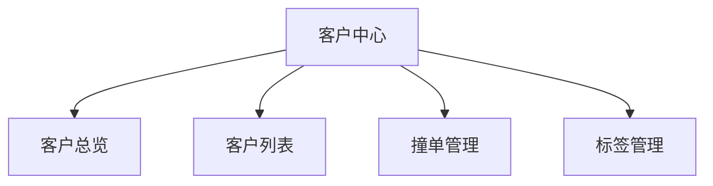
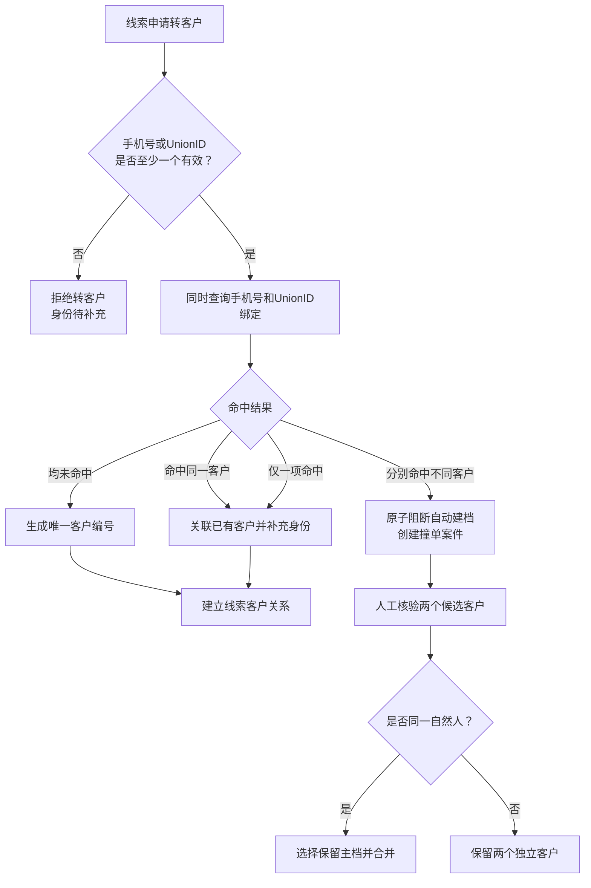

# 合数BOSS V1.0——客户中心详细需求

| 文档属性 | 内容 |
|---|---|
| 所属项目 | 合数BOSS重构项目 |
| 所属版本 | V1.0 |
| 一级菜单 | 客户中心 |
| 文档版本 | V1.13 |
| 文档状态 | 产品需求评审稿 |
| 更新日期 | 2026-08-28 |

> 客户生命周期、客户360°档案、服务人员流转及详细数据模型以 [合数BOSS客户360°档案与生命周期需求](./合数BOSS客户360档案与生命周期需求文档.md) 为专项基线，本文负责客户中心各菜单页面和操作要求。

## 1. 文档目标

客户中心以家长客户为唯一经营主体，统一管理客户身份、360°档案、当前归属、历史服务人、标签和SABC等级。客户中心不设置“跟进记录”“等级管理”“公海客户”或“商机管理”二级菜单：历史服务与互动信息在客户档案内聚合展示；客户等级在客户列表操作中编辑。撞单管理纳入 V1.0，用于处理手机号与 UnionID 分别命中不同客户的强身份冲突；公海和商机能力已取消，不纳入任何当前版本规划。

V1.0必须实现“一个家长一个客户主档、所有线索和业务关联同一客户编号、所有归属和阶段变化可追溯、冲突可裁决、误操作可恢复”。

## 2. 核心口径

- 家长是客户、系统用户、课程学员和服务权益归属人；
- 孩子不是客户、用户或独立学员，仅作为家长名下附属对象；
- 手机号或UnionID任一有效即可创建或关联唯一客户；每个有效客户主档最多保存一个主手机号；
- 两种身份均缺失时只保留线索，不得转为正式客户；
- 订单、权益、交付、归属和生命周期归属于家长客户；
- 问卷、测评、诊断和课程匹配可选关联孩子作为业务背景；
- 任一时点每个客户只有一个有效主负责人，但可同时有一转、二转、班主任、规划师等不同服务角色。
- “首次来源”回答客户从哪个平台、渠道、店铺、商品或IP而来；“添加方式”只回答客户通过什么动作进入客户池，两者独立保存、独立筛选，禁止复用同一字段。

### 2.1 客户添加方式统一枚举

字典编码为 `customer_add_method`，V1.0 仅允许以下三个稳定值：

| 字典项值 | 页面文案 | 判定口径 |
|---|---|---|
| `LINK` | 通过链接添加 | 客户通过带参链接、落地页或可识别分享链接完成添加 |
| `BUSINESS_CARD` | 名片 | 客户通过员工名片或客户名片完成添加 |
| `QR_CODE` | 扫描二维码 | 客户扫描员工活码或其他可识别二维码完成添加 |

添加方式由客户首次成功进入客户池的事件写入。系统回调能够识别时自动填写；人工建档时必选。该字段是稳定事实，后续再次扫码、点击链接或转介绍不自动覆盖；确需纠错必须具备编辑权限、填写原因并记录变更前后值。历史数据无法还原时显示“—”，不得用首次来源反推或批量伪造。

## 3. 范围与菜单

| 二级菜单 | 主要职责 | 优先级 |
|---|---|---|
| 客户总览 | 客户规模、生命周期、首次来源、添加方式、等级、归属和转化概览 | P1 |
| 客户列表 | 唯一客户、身份、添加方式、首次来源、360°档案、负责人、客户画像及等级编辑 | P0 |
| 撞单管理 | 手机号与 UnionID 跨档案命中时自动建案、证据核验、身份划归和审计 | P0 |
| 标签管理 | 人工、规则、来源和等级标签 | P1 |

## 4. 客户身份与建档

### 4.1 创建与关联决策

### 4.2 身份规则

1. 手机号先做国家区号、空格、分隔符等标准化，UnionID按来源CorpID和应用上下文校验；
2. 原值加密保存，标准化哈希用于查重，不以明文建立普通索引；
3. 客户手机号采用单值主手机号模型：一个有效客户主档最多保存一个主手机号，不提供备用手机号、多个手机号或手机号数组；
4. 主手机号在所有未合并、未删除的有效客户中全局唯一，同一手机号不得同时绑定两个有效客户；
5. V1.0 中国大陆手机号按标准化后的11位号码校验；未填写手机号时必须存在有效UnionID，否则不得建档；
6. 新建或转客时手机号已命中客户，系统关联原客户，不重复创建；仅当手机号和UnionID分别命中不同客户时进入撞单管理；
7. 主手机号补录或更换必须具备客户身份维护权限，提交原因并重新执行格式、唯一性和撞单校验。旧手机号只进入身份变更历史与审计，不继续作为当前有效手机号参与查重；
8. 客户合并时目标主档只能保留一个经裁决确认的主手机号，从档手机号解除有效绑定并保留历史快照，不得将两个手机号并列写入目标客户；
9. 同一类型有效身份只能属于一个有效客户；
10. 客户编码由服务端生成、永久不变且不得复用；
11. 企微ExternalUserID、第三方平台ID和旧系统编号作为辅助身份或来源标识，不能单独绕过手机号/UnionID转客户条件；
12. 合并后原客户编码保留为历史别名，拆分依据原始身份、线索和审计关系恢复；
13. 身份新增、解绑、设为主身份、合并和拆分均为高风险操作并保存原因。

## 5. 页面详细需求

### 5.1 客户总览

展示客户总量、生命周期分布、SABC等级、首次来源、添加方式、归属组织、负责人、流失候选、成交和退款回退。顶部使用统一数据权限组件展示当前可见范围，并提供“全部授权数据/仅看我的数据、归属组织、当前客户负责人”组合筛选。业务筛选包含客户创建时间、首次来源、客户等级和添加方式；客户创建时间默认最近一个月。添加方式按“通过链接添加、名片、扫描二维码”展示数量及占比。全部指标、分布和下钻明细必须继承权限、客户创建时间及业务筛选快照。

### 5.2 客户列表与360°档案

列表字段至少包含客户编号、客户名称、生命周期、SABC等级、手机号、客户标签、企微状态、添加方式、首次来源、负责人、归属组织、创建时间和操作。右上角只展示齿轮设置图标，悬浮提示“字段设置”，不展示按钮文字；点击后打开可记忆的字段设置。客户编号、客户名称和操作为固定列且不可取消，其他字段允许自由选择。添加方式使用 `customer_add_method` 字典解析，不允许页面自行维护另一套文案；列表、详情、新建/编辑、筛选、导出和接口返回必须保持一致。

客户列表提供生命周期、客户等级、添加方式和客户标签筛选。生命周期固定为线索客户、意向客户、成交客户、流失客户、无效客户；不再使用“正常、待移交、停用”作为列表主筛选。客户标签筛选采用弹窗多选，展示已选标签，支持按名称搜索，并仅按“系统、企业微信”两类来源分组展示。添加方式支持 `LINK`、`BUSINESS_CARD`、`QR_CODE` 精确匹配。

客户列表列名统一展示为“手机号”，底层仍为客户唯一主手机号。默认脱敏展示，旁边提供眼睛图标；具备字段查看权限时可临时预览完整号码，预览行为必须记录审计。新建弹窗只提供一个手机号输入框，输入时去除空格和分隔符并校验11位大陆手机号。手机号已被客户占用时不得创建第二个客户；手机号与UnionID跨档案冲突时提示案件编号并跳转撞单管理。

客户列表单条操作提供“变更手机号”，规则与引流线索保持一致：先校验后提交；未占用可直接变更并保留旧号审计；已占用禁止直接覆盖；双方属于同一一转负责人时允许人工确认合并并以新手机号命中的客户为保留主档；负责人不同必须阻断。提交阶段必须二次校验、幂等并写入完整操作日志。

客户标签列最多直接展示2个标签，超过2个显示“+N”；点击打开全部标签弹窗，仅按“系统、企业微信”分组展示。两类标签在客户列表均为只读，不提供人工新增、编辑或删除操作。

**企业微信客户同步**

- 客户列表右上方提供“同步客户”操作，展示上次成功同步时间；权限码建议为 `customer:wecom:sync`。
- “全量同步”用于首次接入或人工对账：遍历应用可见范围内开通客户联系的员工，逐人获取客户列表及客户详情。“增量同步”用于日常补偿，同步上次成功后新增或变更的客户与跟进关系。
- 日常主链路为“企微客户联系事件回调 → 快速返回成功 → 异步队列 → 按 `external_userid` 查询详情 → 更新本地客户及跟进关系”。回调重复必须幂等，详情暂不稳定时延迟重试，并使用定时全量对账补偿丢失事件。
- `external_userid` 是企微客户身份标识，不使用名称或头像匹配。客户主档与员工跟进关系分开保存，跟进关系以 `external_userid + userid` 唯一，允许同一客户关联多个员工。
- 同步字段包含客户名称、头像、类型、性别、企业，以及跟进员工、添加时间、`add_way`、`state`、备注、描述和企微标签。`add_way` 表示企微判定的添加方式，`state` 保存自建渠道参数。
- `add_way=2` 仅表示员工通过搜索手机号添加，不代表企微会返回真实手机号。仅在存在 `remark_mobiles` 时作为备注号码同步；客户主手机号仍需通过线索、订单、表单或受权人工操作完成唯一性校验与绑定。
- 同步必须记录任务类型、可见员工数、检查/新增/更新/失败数、失败原因、开始结束时间、操作人和 `trace_id`；任务后台执行，同一范围内不得重复并发。

**来源于引流线索的手机号变更与档案合并**

- 引流线索执行手机号变更时，客户中心主手机号唯一约束必须实时参与预校验；新手机号未占用时，同时更新线索及其已关联客户主手机号，旧手机号只进入身份变更历史。
- 新手机号已归属于其他有效客户时不得直接覆盖。若两个手机号对应档案属于同一一转负责人，可在具备合并权限并人工确认后执行合并；若负责人不同则阻断，提示当前与目标客户归属，后续通过归属协调或撞单流程处理。
- 同负责人以 `owner_id` 为首选、员工编号为兼容依据，不使用负责人姓名判断；双方都未分配不得视为同负责人。
- 合并时以新手机号命中的有效客户为保留主档，来源客户标记 `MERGED` 并保存指向；线索、问卷、订单、交付/服务、标签和旅程等关系迁移或改指，不物理删除来源档案。
- 合并后目标客户仍只有一个主手机号；直接变更或合并均需提交阶段二次校验、幂等控制、完整审计和受权反向恢复。

客户总览与客户列表统一提供“权限范围、全部授权数据/我的数据、客户归属组织、客户负责人”筛选。客户归属组织采用公司—部门—小组级联树，选择部门时包含直属员工和下属小组；客户负责人支持姓名和员工编号搜索，并随组织选择联动缩小候选范围。员工在职、停用及离职状态统一由员工管理处理，不作为客户筛选项。本人数据岗、小组管理岗、部门管理岗、公司数据管理岗和获批特别授权人员只能在有效数据岗位范围内筛选，页面不得返回超出授权范围的组织、员工、数量或汇总指标；业务角色只决定是否有客户页面及相关操作权限。

客户列表按当前客户负责人及当前责任组织查询，适合日常跟进和移交；客户总览中的新增、转化、成交等历史指标使用业务发生时负责人和组织快照，员工调岗或客户改派不得重写历史业绩。无负责人的客户仅在用户具有待分配、部门或公司级数据权限时展示，并可单独筛选。

当前客户档案页签为基本档案、线索记录、学习交付、服务人员、问卷测评和客户时间轴。基本档案至少展示昵称、手机号及授权预览、地址、性别、客户编号、企微客户ID和UnionID；线索记录展示线索编号、来源、所属期次、当前状态和创建时间；问卷测评展示答卷编号、名称、来源、得分、评定等级和提交时间。客户时间轴按时间聚合建档、企微关系同步、问卷、标签、订单及生命周期等事件，只追加不覆盖。

客户主表只保存当前核心状态和汇总，不把线索、订单、问卷答案、课程和服务人员历史堆叠为客户字段。

### 5.3 撞单管理（V1.0）

#### 5.3.1 进入条件与事务边界

同时满足以下条件时自动进入撞单管理：本次业务数据携带有效手机号与有效 UnionID；手机号命中客户 A；UnionID 命中客户 B；且 A、B 为两个不同的有效客户主档。触发来源包括线索转客户、人工建档、企微同步和数据导入。

同一手机号和 UnionID 命中同一客户、只命中一个客户或只有一个有效强身份时不进入撞单，按正常创建/关联规则执行。撞单产生时必须在同一事务内完成“停止客户创建或身份覆盖、冻结本次来源动作、创建撞单案件和写入审计日志”，不得先覆盖身份再补记异常。

开放案件幂等键建议为 `hash(标准化手机号 + UnionID + 手机号命中客户ID + UnionID命中客户ID)`；同一冲突的重复回调、拉取或导入只能补充证据，不得重复建案。

#### 5.3.2 案件列表

列表展示案件编号、触发时间、本次进入身份、手机号命中客户、UnionID命中客户、触发来源、来源业务单号、处理状态和处理人。支持按案件/客户/身份关键词、触发来源、状态和触发日期筛选。页面不展示风险等级，不提供风险筛选，也不把风险状态作为案件查询或处理条件。

状态固定为：`PENDING`（待处理）→ `PROCESSING`（处理中）→ `RESOLVED`（已解决）。页面顶部只展示待处理、处理中和已解决数量。领取案件后锁定主处理人；管理员可转派，但必须留痕。

#### 5.3.3 证据核验

详情将两个候选客户并排展示，至少包含客户编号、姓名、手机号、UnionID、SABC等级、生命周期、当前归属组织/负责人、首次来源、创建时间、订单数量、问卷数量和历史服务摘要。差异字段突出显示，并展示来源线索/订单/企微事件及案件时间轴。手机号和 UnionID 明文仅对具备敏感身份查看权限的裁决人展示，每次查看写入访问日志。

#### 5.3.4 处理结论

| 结论 | 适用条件 | 系统动作 |
|---|---|---|
| 合并至手机号命中客户 | 核验为同一自然人，手机号主档更可信 | 手机号命中客户作为主档，迁移 UnionID及从档业务关系，从档标记 `MERGED` |
| 合并至UnionID命中客户 | 核验为同一自然人，企微/UnionID主档更可信 | UnionID命中客户作为主档，迁移手机号及从档业务关系，从档标记 `MERGED` |
| 确认不同自然人 | 身份采集或历史绑定错误，实际为两个人 | 两个客户均保留，记录核验依据并修正错误来源关系，不合并主档 |

裁决必须填写不少于 8 个字的理由，并确认已核验身份、订单、问卷和服务记录。客户合并不物理删除从档；客户编号保留为历史别名，线索、订单、问卷、标签、服务人、等级和审计记录迁移或建立指向主档的关系。合并前快照、字段冲突策略、操作人、时间和 `trace_id` 必须保存，用反向业务操作恢复，禁止直接删除或修改审计历史。

#### 5.3.5 权限与时效

撞单查看受两个候选客户数据范围的并集约束；撞单裁决为独立按钮权限。本人作为直接利益方时不得单独完成跨组织裁决；跨部门案件由公司数据管理岗或双方上级处理。待处理超过 24 小时进入超时提醒，超过 48 小时升级给客户主数据治理负责人。V1.0 暂不做自动裁决，任何权重或 AI 建议只能作为证据提示。

### 5.5 标签管理

标签管理当前仅包含“标签库、标签组”两个页签，标签来源锁定为“系统、企业微信”。当前版本不提供自动规则、外部标签映射、标签治理、BOSS人工、外部SCRM、规则或AI标签能力。

| 来源 | 产生方式 | BOSS侧权限 | 生命周期 |
|---|---|---|---|
| 系统 | 营期归属、客户阶段、订单支付/退款等业务事实事件 | 只读查看，不允许人工修改 | 随业务事实动态生成，历史关系永久保留 |
| 企业微信 | 企微客户联系标签回调或定时补偿同步 | 只读；通过映射统一展示口径 | 跟随企微状态，保留外部标签ID和同步历史 |

标签库列表展示标签名称（同时展示标签ID）、对象、分类、来源、状态和操作；主列表不展示“生成方式、覆盖对象、有效期”三列。支持按名称/ID/来源系统搜索，并按对象、来源和状态筛选。生成依据、覆盖关系和生命周期仍作为标签详情、规则配置及治理数据保留，不因主列表删列而删除底层字段或历史记录。

标签组用于客户画像分区、页面筛选和批量打标，可配置适用对象、标签集合、展示顺序、维护组织和状态；标签加入或移出标签组不改变标签自身来源、有效期或历史关系。

系统标签由业务事件生成，企微标签通过客户联系回调与同步任务接入。两类标签均保留稳定ID、来源、历史关系和变更时间，不提供BOSS侧人工改写。

### 5.6 客户等级（客户列表操作）

客户中心不设置独立“等级管理”菜单。客户列表展示当前等级及来源，并在单条客户操作中提供“编辑等级”；等级历史在客户档案内查看。

线索等级和客户等级共用字典 `lead_customer_grade`，可配置值为 S、A、B、C；“未定级”是系统保留状态，不作为可配置业务等级。字典只维护稳定枚举，问卷评分条件、分值区间、优先级和版本继续在线索配置—等级规则中维护。

新客户首次建档时复制来源线索的当前有效等级，并记录来源线索、评级来源、规则版本或人工记录及继承时间；命中存量客户时不得覆盖存量等级。客户建档后，线索等级与客户等级分别维护：客户侧人工改级必须具备权限、选择 S/A/B/C、填写原因并保存变更前后值、操作人和时间；不反向修改来源线索，后续线索改级也不得自动覆盖客户等级。详见《[合数BOSS V1.0——线索中心需求文档](./合数BOSS V1.0线索中心需求文档.md)》第 5.4.6 节。

## 6. 客户生命周期

V1.0生命周期为线索客户、意向客户、成交客户、流失客户和无效客户。流失、无效、退款回退和重新激活规则详见 [客户360°档案与生命周期需求](./合数BOSS客户360档案与生命周期需求文档.md)。

客户生命周期、线索状态、SABC等级、订单状态和交付状态必须分开维护。

## 7. 核心数据模型

| 数据域 | 核心实体 |
|---|---|
| 客户主数据 | `CUSTOMER`（含 `add_method`）、`CUSTOMER_IDENTITY`、`CUSTOMER_ACCOUNT`、`CHILD_PROFILE` |
| 线索关系 | `LEAD_CUSTOMER_RELATION` |
| 生命周期与归属 | `CUSTOMER_LIFECYCLE_HISTORY`、`CUSTOMER_OWNER_RELATION` |
| 跟进标签等级 | `FOLLOW_UP_RECORD`、`TAG_DEFINITION`、`TAG_GROUP`、`TAG_GROUP_RELATION`、`TAG_RULE_VERSION`、`EXTERNAL_TAG_MAPPING`、`CUSTOMER_TAG_RELATION`、`TAG_OPERATION_LOG`、`CUSTOMER_GRADE_HISTORY` |
| 撞单 | `CUSTOMER_IDENTITY_COLLISION_CASE`、`CUSTOMER_IDENTITY_COLLISION_EVIDENCE`、`CUSTOMER_IDENTITY_COLLISION_AUDIT` |
| 服务关系 | `CUSTOMER_SERVICE_RELATION` |
| 360°聚合 | `CUSTOMER_EVENT`及各业务模块关联索引 |

任一时点每个客户只允许一个有效主负责人；服务角色可以并存，但每段关系必须具有开始、结束和业务来源。所有阶段、等级、归属、合并和拆分使用追加式历史。

## 8. 接口与事件

主要接口：客户创建/关联（接收并校验 `addMethod`）、身份查询、客户列表/详情、企微客户全量/增量同步任务、同步任务详情/重试、撞单列表/详情、领取撞单、提交裁决、负责人改派、跟进登记、系统/企微标签库查询、标签组维护和等级试算/发布。

主要事件：`customer.created`、`customer.identity_linked`、`customer.owner_changed`、`customer.lifecycle_changed`、`customer.grade_changed`、`customer.tag_attached`、`customer.tag_detached`、`external_tag.synced`、`tag_rule.matched`、`tag_governance.issue_created`、`customer.duplicate_detected`。

## 9. 权限与脱敏

- 菜单权限控制客户中心当前二级页面；
- 按钮权限控制身份明文、身份解绑、合并、拆分、撞单裁决、人工改级和跨组织改派；
- 标签权限当前仅控制标签库/标签组查看及标签组维护；系统和企业微信标签不可获得人工编辑能力；企微客户同步使用独立权限 `customer:wecom:sync`；
- 数据范围支持本人、协作、组织及下级、自定义和全部；
- 手机号、UnionID、问卷答案、诊断报告和订单金额分别配置字段权限；
- 明文查看、导出、高风险变更和批量操作记录审计及trace_id。

## 10. 验收标准

- [ ] 手机号或UnionID任一有效可创建或关联唯一客户；两者分别命中不同客户时进入撞单；
- [ ] 每个有效客户最多保存一个主手机号；新建、详情、筛选、导出和接口均不出现备用手机号、多手机号数组或第二个有效手机号；
- [ ] 主手机号在有效客户中全局唯一；重复手机号只能关联已有客户，不能生成重复客户；手机号与UnionID跨档案命中才进入撞单；
- [ ] 主手机号补录、更换和客户合并均重新校验唯一性并记录原因、变更前后值、操作人和时间；历史手机号不再作为当前有效身份参与查重；
- [ ] 家长是客户、用户和学员，孩子不会被错误创建为独立客户或学员；
- [ ] 客户360°档案可以查看线索、订单、交付、服务人、售后、问卷、测评和报告历史；
- [ ] 任一时点只有一个有效主负责人，历史负责人和多角色服务关系完整；
- [ ] 两个强身份分别命中不同客户时，自动建档和身份覆盖被原子阻断，并且只生成一个开放撞单案件；
- [ ] 撞单支持领取、双档案证据对比、合并至任一主档或确认不同人，结论和理由完整留痕；
- [ ] 撞单管理不展示风险统计、风险筛选或风险等级，顶部仅展示待处理、处理中、已解决，列表状态与查询条件一致；
- [ ] 合并不物理删除从档，历史客户编号和业务关系可追溯，误操作可通过反向业务操作恢复；
- [ ] 客户中心不展示“跟进记录”和“等级管理”二级菜单；
- [ ] 新客户建档继承线索当前等级，客户可在列表操作中独立编辑 S/A/B/C 并保留历史；
- [ ] 线索与客户共用等级字典，任一侧人工编辑不会互相覆盖；
- [ ] 客户列表、详情、新建/编辑、筛选及导出均展示统一的添加方式；枚举仅为“通过链接添加、名片、扫描二维码”；
- [ ] 客户列表右上角字段设置仅展示齿轮图标并提供悬浮说明，客户编号、客户名称和操作始终固定展示；
- [ ] 添加方式与首次来源分别存储、分别筛选和分别统计，二者不会相互覆盖；历史无法还原的数据展示“—”；
- [ ] 客户总览展示添加方式分布，点击任一数量可携带筛选条件下钻客户列表；
- [ ] 标签库可按对象、来源和状态筛选，来源仅有系统和企业微信，两类均只读；
- [ ] 标签库主列表不展示生成方式、覆盖对象和有效期；页面仅保留标签库和标签组，不展示自动规则、外部映射或标签治理；
- [ ] 客户列表可发起企微客户全量/增量同步，同步范围受应用可见员工限制，任务结果可查看检查、新增、更新和失败数；
- [ ] 客户档案的基本档案、线索记录、问卷测评和客户时间轴均有明确字段及数据状态，时间轴只追加不覆盖；
- [ ] 已使用标签只能停用，历史关系、来源ID、命中证据和变更日志完整保留；
- [ ] 标签和等级变更保留历史；

## 11. 发布与回滚

- 身份规则、等级规则和生命周期规则采用版本化发布；
- 合并、拆分、归属裁决和人工改级均使用反向业务操作回滚；
- 新规则先试算或灰度，异常时恢复上一已发布版本；
- 回滚不得删除客户编码、身份别名、线索、跟进、订单、服务关系和审计历史；
- 360°聚合索引可以重建，但原始业务数据不得依赖聚合索引作为唯一存储。

## 12. 待确认事项

- 意向客户必选识别条件；
- 线索客户和意向客户流失时限；
- 撞单各证据权重和复核角色；
- 一转、二转、班主任和规划师同时存在时主负责人定义；

## 13. 版本记录

| 版本 | 日期 | 内容 |
|---|---|---|
| V1.13 | 2026-08-28 | 客户档案补充基本档案、线索记录、问卷测评和客户时间轴字段；客户列表新增企微客户全量/增量同步、跟进关系、幂等补偿及手机号限制；标签来源收口为系统和企业微信，标签管理仅保留标签库和标签组 |
| V1.12 | 2026-08-28 | 客户列表字段设置改为仅展示齿轮图标；撞单管理移除风险统计、风险筛选和风险等级，仅保留待处理/处理中/已解决；标签库主列表移除生成方式、覆盖对象和有效期三列，详情、规则和历史数据保持不变 |
| V1.11 | 2026-08-27 | 客户总览统一数据权限并按客户创建时间筛选、默认最近一个月；客户列表新增可记忆字段设置并固定客户编号/客户名称/操作，主筛选改为生命周期；新增客户标签列与分源标签筛选/添加；手机号列增加授权预览并补充与引流线索一致的变更、占用校验及同负责人合并规则 |
| V1.10 | 2026-08-26 | 取消公海和商机能力，删除对应菜单、页面、数据对象、接口、事件、权限、规则和验收项；超时与离职客户统一通过待办提醒及人工改派处理 |
| V1.0 | 2026-08-17 | 从主需求文档独立形成客户中心专项需求，并引用客户360°档案基线 |
| V1.1 | 2026-08-19 | 客户总览与客户列表增加权限范围、公司/部门/小组级联和客户负责人筛选；明确当前归属与历史组织快照口径 |
| V1.2 | 2026-08-24 | 移除员工状态筛选，员工停用、离职及客户移交统一由员工管理和离职继承处理 |
| V1.2 | 2026-08-19 | 明确等级规则统一在线索配置维护；新增客户首次建档继承线索等级、存量客户不覆盖、建档后客户主档权威及统一人工调整流水 |
| V1.3 | 2026-08-24 | 移除离职继承菜单、页面、接口、数据对象和 V1.0 验收项；员工停用仍由系统管理阻断登录和新增接待 |
| V1.4 | 2026-08-25 | 移除跟进记录和等级管理菜单；客户等级并入客户列表操作；统一线索/客户 SABC 字典并明确仅建档时继承、后续独立调整 |
| V1.5 | 2026-08-25 | 标签管理升级为统一标签中心：新增标签库、标签组、自动规则、外部标签映射和标签治理；明确六类来源、分源编辑权限、历史保留及验收口径 |
| V1.6 | 2026-08-25 | 客户总览、客户列表和360°档案新增“添加方式”；统一 `customer_add_method` 字典及 LINK/BUSINESS_CARD/QR_CODE 三项枚举，明确与首次来源分离、自动识别、人工建档和历史兼容口径 |
| V1.7 | 2026-08-25 | 撞单管理纳入 V1.0；明确手机号与 UnionID 跨档案命中的自动建案、幂等阻断、双档案证据核验、三类人工裁决、合并历史保留、权限、时效和验收口径 |
| V1.8 | 2026-08-25 | 客户主手机号调整为严格单值模型：一个有效客户仅允许一个主手机号，号码全局唯一；补充重复关联、换号、合并、审计及页面验收口径 |
| V1.9 | 2026-08-26 | 补充引流线索变更手机号对客户主档的联动：未占用直接变更、已占用禁止覆盖、同一一转负责人允许人工确认合并、跨负责人阻断，并明确主档保留、关系迁移、审计与恢复规则 |
