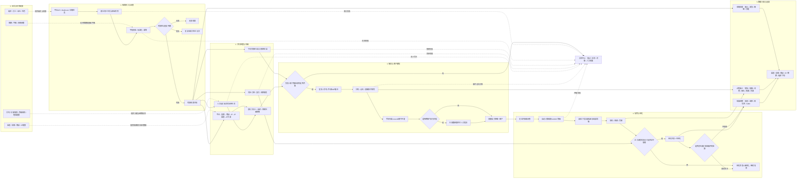
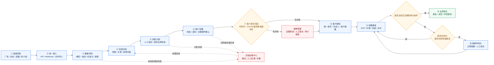
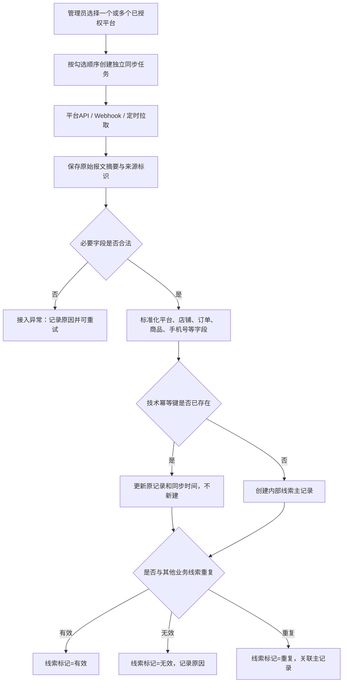
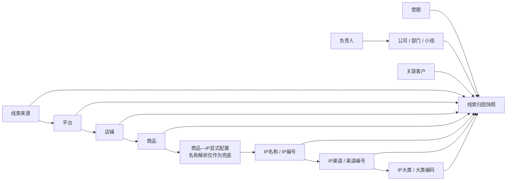
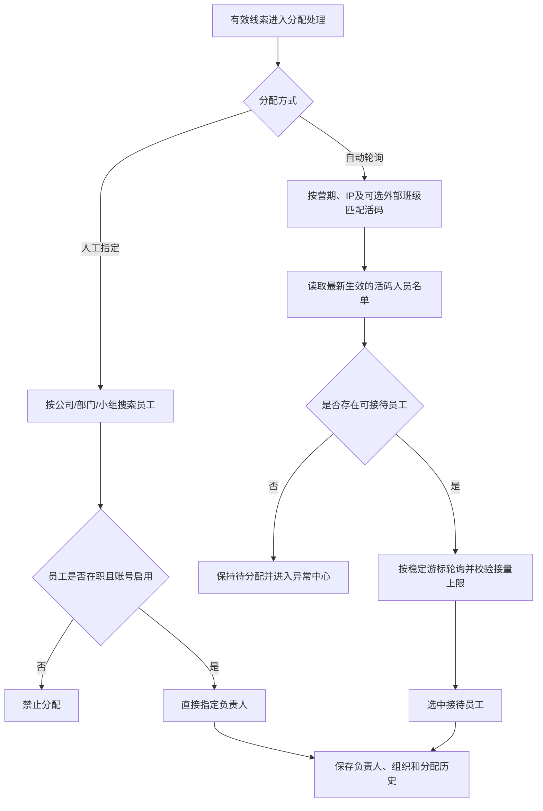
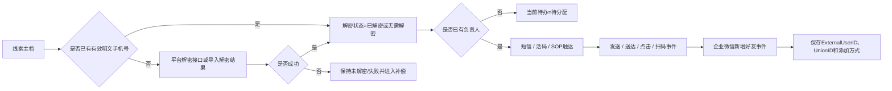
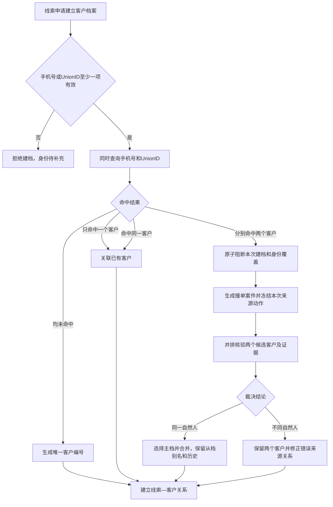
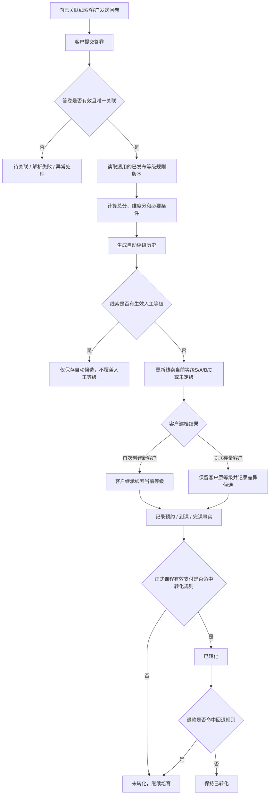
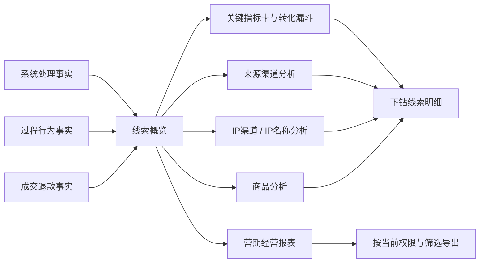

# 合数BOSS V1.0整体业务流程与关键规则说明

| 文档属性 | 内容 |
|---|---|
| 产品名称 | 合数BOSS |
| 产品定位 | 合数统一管理平台下，围绕客户关系的业务主系统 |
| 所属版本 | V1.0 |
| 文档版本 | V1.0 |
| 文档状态 | 产品需求评审稿 |
| 更新日期 | 2026-08-25 |
| 适用对象 | 产品、业务、研发、测试、数据及项目验收人员 |

> 本文档用于统一解释合数BOSS V1.0从线索接入、线索治理、分配与触达、客户建档、问卷评级到业务转化及经营分析的完整流程。页面、字段和交互细节仍以各模块专项PRD为准；当本文与专项PRD冲突时，以产品经理最新确认及对应专项PRD的较新版本为准。

## 1. 文档目标

本文档重点解决以下问题：

1. 对外能够用一张总体流程图讲清合数BOSS V1.0解决什么业务问题；
2. 对内能够明确每个关键行为的业务定义、输入、输出和完成标志；
3. 研发能够识别串行流程、并行流程、判断条件、异常补偿和幂等要求；
4. 测试能够按照关键规则和完成标志形成可执行的验收用例；
5. 数据团队能够统一线索归因、过程指标、结果指标和下钻维度。

## 2. V1.0流程范围与边界

### 2.1 纳入本流程的能力

| 业务域 | V1.0能力 |
|---|---|
| 首页 | 线索概览、渠道分析、IP渠道分析、商品分析、营期经营报表及指标下钻 |
| 线索中心 | 引流线索、线索配置、活码管理、渠道管理、店铺管理、IP列表、商品列表、短信配置 |
| 客户中心 | 客户总览、客户列表、客户360°档案、撞单管理、标签管理、客户等级编辑 |
| 问卷管理 | 问卷、答卷、线索/客户关联、S/A/B/C自动评级输入及异常处理 |
| 业务配置 | 异常、短信、应用、配置和微信客服相关配置 |
| 系统管理 | 组织、员工、岗位、角色、菜单、系统参数、字典、日志和地区管理 |

### 2.2 不纳入V1.0的能力

- 三方品线索属于V1.5；公海和商机能力已取消；
- 不设置独立订单中心，但保留第三方订单事实的同步、关联、支付、退款和统计；
- 不设置班级管理菜单，班级只能作为外部只读编号或活码的可选引用，不在合数BOSS维护；
- 交付中心及营期管理整体规划到 V2.0；V1.0 只消费外部/历史系统提供的营期只读主数据，用于线索、活码、问卷和统计筛选，不提供维护入口；
- 不设置离职继承菜单；员工停用、负责人改派及历史责任关系由员工、线索和客户现有能力承接；
- 测评管理、直播管理、正式课程交付、诊断订单及1v1诊断属于后续版本或外部业务系统；
- 引流线索列表不允许人工新增线索；“导入解密数据”只能为已存在线索回填手机号。

## 3. 关键行为定义

| 关键行为 | 业务定义 | 主要输入 | 完成标志 |
|---|---|---|---|
| 线索接入 | 将第三方平台、店铺、活动或历史系统产生的引流订单/线索送入合数BOSS接入任务 | 平台编码、第三方店铺ID、第三方订单号、来源数据及原始报文 | 接入任务有唯一任务号、原始摘要、处理状态和追踪号 |
| 线索同步 | 通过API、Webhook或平台拉取任务，将来源订单及其后续状态持续同步到合数BOSS | 已授权平台、同步范围、游标/时间区间、来源订单号 | 来源记录完成幂等落库，成功/失败数量可追踪、失败可重试 |
| 线索清洗 | 对来源字段进行格式校验、标准化、技术幂等、业务查重和有效性判断 | 来源记录、平台/店铺/商品映射、清洗规则 | 形成有效、无效或重复标记，并保留主记录及证据关系 |
| 线索归因 | 识别线索属于哪个平台、店铺、商品、IP、IP渠道、IP大类、营期、负责人和组织 | 来源数据、店铺商品主档、IP配置、分配结果 | 生成带规则版本和名称快照的归因记录，历史不随配置变更重写 |
| 线索分配 | 将可经营线索分给具体接待员工，并形成当前负责人和责任组织 | 线索、活码、营期、IP、可选外部班级、员工名单及分配方式 | 保存负责人、分配方式、规则/名单版本、时间和完整历史 |
| 手机号解密 | 将平台加密手机号转换为经授权可使用的手机号，或通过固定模板回填已解密结果 | 平台解密接口，或订单编号+手机号固定模板 | 更新既有线索的手机号、解密状态和解密时间，不创建新线索 |
| 业务触达 | 通过短信、员工活码、企微及外部SOP推动客户建立联系 | 有效线索、负责人、手机号/UnionID/活码、短信模板 | 保存发送、送达、点击、扫码、加微及失败事实 |
| 转客户 | 使用手机号或UnionID判断自然人身份，创建或关联唯一客户主档 | 当前线索、标准化手机号、UnionID、添加方式及归因快照 | 创建或关联客户编号，并建立线索—客户关系；冲突时生成撞单案件 |
| 撞单裁决 | 手机号与UnionID分别命中不同客户时，对两个候选主档进行人工核验和身份划归 | 冲突身份、候选客户、来源证据、订单/问卷/服务历史 | 完成合并或确认不同自然人，保留裁决理由、前后快照和审计 |
| 问卷评级 | 有效答卷关联线索/客户后，通过已发布规则计算S/A/B/C等级 | 问卷版本、答卷、等级规则版本、客户/线索关系 | 产生评级历史；首次新建客户继承线索当前有效等级 |
| 业务转化 | 正式课程订单支付成功并命中已发布转化规则 | 订单支付、商品类型、客户和线索关系、规则版本 | 线索转化状态更新为已转化；退款按规则决定是否回退 |
| 数据复盘 | 对系统处理、过程转化和经营结果进行统一统计及下钻 | 接入、清洗、触达、客户、问卷、订单、退款和归因事实 | 指标带统计时间、口径版本、权限范围并可下钻到明细 |

### 3.1 容易混淆的概念

| 概念 | 正确口径 |
|---|---|
| 订单编号与内部线索ID | 业务页面以订单编号作为首列和主要识别字段；系统内部仍使用不可变的`lead_id`维护关系，但不向普通业务用户展示 |
| 线索标记与转化状态 | 有效/无效/重复描述数据是否可经营；已转化/未转化描述是否完成正式业务成交，两者不能合并 |
| 当前待办与环节事实 | 当前待办用于提示下一步动作；分配、解密、短信、加微、问卷等状态分别保存，不能由单一线性状态覆盖 |
| 转客户与已转化 | 转客户是建立唯一客户档案；已转化是正式课程成交，转客户不等于已转化 |
| 添加方式与线索来源 | 添加方式是通过链接添加、名片、扫描二维码；线索来源是抖店、小红书、有赞等平台或渠道 |
| IP渠道与来源渠道 | 来源渠道回答线索从哪里进入；IP渠道由IP主播的经营归属组成，例如阿留属于“阿留专属”，皮皮老师属于“店播” |

## 4. V1.0整体业务流程图

### 4.1 V1.0核心闭环图（对外讲解版）

### 4.2 对外讲解口径

合数BOSS首先通过已授权平台的接口、回调和同步任务接入引流订单，完成字段标准化、幂等去重和有效性判断；随后并行处理手机号解密、订单同步、线索归因和负责人分配。线索具备负责人和可触达身份后，通过短信、员工活码及外部SOP推动客户加微，并以手机号或UnionID建立唯一客户档案。客户填写问卷后，系统按照版本化规则生成S/A/B/C等级，再持续记录预约、到课、完课、正式课程成交和退款事实。最终所有数据按渠道、店铺、商品、IP、营期和组织进行统一复盘，形成从获客投入到最终转化的可追踪闭环。

## 5. 核心流程一：线索接入、同步与清洗

### 5.1 关键规则

| 规则编号 | 规则 |
|---|---|
| BR-ACCESS-001 | 来源订单幂等键为“平台编码+第三方店铺ID+第三方订单号”；重复回调、拉取和重放只能更新原来源订单 |
| BR-ACCESS-002 | 合数BOSS内部使用`lead_id`作为关系主键，业务页面以订单编号作为第一业务列，不展示线索编号 |
| BR-ACCESS-003 | 不同平台可能存在相同订单号，订单号不得脱离平台和店铺上下文作为全局唯一键 |
| BR-ACCESS-004 | 同步订单支持多选平台，按用户勾选顺序创建后台任务；平台任务相互独立，前一任务失败不阻断后一任务 |
| BR-ACCESS-005 | 原始来源数据与标准化业务字段分开保存；清洗不得覆盖或删除原始证据 |
| BR-ACCESS-006 | 技术幂等解决“同一来源记录重复进入”，业务查重解决“多个来源是否指向同一经营线索”，两者不得混用 |
| BR-ACCESS-007 | 引流线索页面不提供新增线索；历史迁移使用受控迁移任务，不使用普通业务页面新增 |
| BR-ACCESS-008 | “导入解密数据”固定模板仅包含订单编号和手机号，必须精确匹配既有线索，只回填手机号和解密状态，不创建线索 |

### 5.2 清洗结果定义

| 清洗结果 | 定义 | 后续处理 |
|---|---|---|
| 有效 | 必要来源标识可识别，业务允许继续经营 | 参与分配、解密、触达、归因和分析 |
| 无效 | 格式、来源、黑名单或业务规则判定不可经营 | 停止自动经营，保留无效原因和人工复核入口 |
| 重复 | 与另一条主线索指向同一业务机会或重复来源证据 | 关联主线索，不重复计入核心漏斗，保留来源与订单关系 |

## 6. 核心流程二：线索归因

### 6.1 归因关系图

### 6.2 归因层级与稳定标识

| 层级 | 归因对象 | 稳定标识 | 取得方式 |
|---:|---|---|---|
| 1 | 线索来源 | `source_code` | 接入接口、同步任务或来源映射 |
| 2 | 平台 | `platform_code` | 来源平台字典及应用授权 |
| 3 | 店铺 | 内部店铺ID+第三方店铺ID | 店铺管理和平台授权 |
| 4 | 商品 | 内部商品ID+第三方商品ID | 商品同步及显式映射 |
| 5 | IP | IP编号 | 商品—IP配置优先，名称解析兜底 |
| 6 | IP渠道 | 渠道编号 | IP配置自动带出 |
| 7 | IP大类 | 大类编码 | 字典和IP配置 |
| 8 | 营期 | 营期ID | 商品规则、活码、订单或人工补充 |
| 9 | 负责人/组织 | 员工ID、员工编号、组织ID | 分配结果和员工主档 |
| 10 | 客户 | 客户编号 | 手机号或UnionID唯一匹配 |

### 6.3 关键规则

- 创建线索时先完成平台、店铺、商品、IP和营期等基础归因；分配和转客户后再补齐负责人、组织和客户；
- 显式商品—IP配置优先于商品名称解析；名称多义、无法解析或配置冲突进入异常中心；
- 示例链路：`抖音直播 → 抖店 → 阿留教育规划精华课 → IP阿留 → 阿留专属渠道 → 教育规划大类`；
- 每次归因保存稳定ID、当时名称、规则版本、来源字段、命中依据和时间；
- 店铺、商品、IP或组织后续改名不得重写历史归因；必要时通过新版本重算并形成新历史；
- 当前归属用于日常查询，业务发生时归因快照用于业绩和经营统计，两者不得混算。

## 7. 核心流程三：活码匹配与线索分配

### 7.1 人工指定与自动轮询对比

| 规则项 | 人工指定 | 自动轮询 |
|---|---|---|
| 选择范围 | 当前用户有权操作的组织及员工 | 最新营期对应活码的生效人员名单 |
| 营期名单限制 | 不限制 | 必须在名单中 |
| 接量上限限制 | 不限制 | 达到上限后退出轮询 |
| 基础校验 | 员工在职、账号启用、操作者有改派/分配权限 | 员工在职、账号启用、活码有效、日期有效、名单生效、未达上限 |
| 记录要求 | 操作人、原因、目标员工和时间 | 规则版本、名单版本、容量快照、轮询游标和时间 |

### 7.2 活码匹配规则

- 活码可以关联营期、IP和可选外部班级引用；营期、接量日期和班级均为选填，未配置时按通用活码处理；
- 活码关联IP后自动带出只读IP渠道名称和渠道编号，不允许在活码内另行覆盖；
- 接量日期未设置时长期有效；设置后仅在日期区间内参与自动轮询；
- 单人活码只能配置一名员工，多人活码可配置多名员工及各自接量上限；
- 员工停用或账号禁用后立即停止新增轮询接待；历史分配关系保留；
- 分配、解密和订单同步可以并行，允许出现“已解密但未分配”“已分配但未解密”等合法组合。

## 8. 核心流程四：解密、触达与加微

### 8.1 关键规则

- 完整手机号属于敏感身份字段，查看、导入、解密、导出和调用必须分别受权限控制并记录审计；
- 普通日志、异常消息和失败文件不得记录完整手机号；
- 导入解密数据以订单编号精确匹配一条既有线索，未命中、多命中和格式错误均不得覆盖；
- 短信群发先过滤无有效手机号、退订、黑名单和无权限数据，再生成异步任务；
- 添加方式统一使用字典：通过链接添加、名片、扫描二维码；添加方式不替代渠道归因；
- 企微回调、短信回执和扫码事件按外部事件ID幂等处理；无法关联的事件进入异常中心。

## 9. 核心流程五：客户建档与撞单裁决

### 9.1 客户唯一身份规则

| 规则编号 | 规则 |
|---|---|
| BR-CUSTOMER-001 | 手机号或UnionID任一有效即可创建或关联客户；两者都无效时禁止建档 |
| BR-CUSTOMER-002 | 一个有效客户最多保存一个主手机号，不保存备用手机号或手机号数组 |
| BR-CUSTOMER-003 | 主手机号在所有未合并、未删除的有效客户中全局唯一 |
| BR-CUSTOMER-004 | 手机号已命中客户时复用原客户，不创建第二个客户 |
| BR-CUSTOMER-005 | 手机号与UnionID分别命中不同客户时必须阻断自动处理并生成撞单案件 |
| BR-CUSTOMER-006 | 客户编号由服务端生成，永久不变且不得复用；手机号、UnionID和企微ID都不能作为数据库主键 |
| BR-CUSTOMER-007 | 主手机号更换必须重新校验格式、唯一性和撞单，旧手机号只进入身份变更历史 |
| BR-CUSTOMER-008 | 客户合并不物理删除从档；订单、线索、问卷、等级、标签和服务关系保留来源和审计 |

### 9.2 撞单待裁决期间的状态

- 两个候选客户原生命周期、等级、负责人和组织保持不变，不因撞单自动改派或合并；
- 两个候选客户增加“身份冲突待处理”风险标记，该标记不替代客户生命周期；
- 本次来源线索保持原负责人，客户关联状态记为“待裁决”，不得自动写入任一客户主档；
- 本次身份覆盖、客户创建、客户合并和关系迁移全部暂停；原客户既有业务仍可按权限查询；
- 裁决完成后按照结论一次性恢复来源关系，并写入裁决前后快照、处理人、理由和追踪号；
- 同一冲突的重复回调只补充案件证据，不重复创建案件。

## 10. 核心流程六：问卷评级、客户等级继承与转化

### 10.1 等级规则

- S、A、B、C统一读取字典`lead_customer_grade`，“未定级”为系统保留状态；
- 问卷答案、评分区间、必要条件、优先级和版本在线索配置—等级规则中维护，不放入字典；
- 自动评级必须保存问卷版本、答卷编号、答案快照、规则版本、分数、结果和追踪号；
- 人工评级优先于自动评级，自动重算只能形成候选，不得静默覆盖人工结果；
- 新客户首次建档继承来源线索当前有效等级；关联存量客户不得覆盖其现有等级；
- 客户建档后，线索等级和客户等级分别维护。客户等级从客户列表单条操作编辑，不反向修改线索。

### 10.2 转化规则

- 加微、转客户、填写问卷、预约、到课和完课均属于过程事实，不等于最终已转化；
- V1.0最终转化以正式课程有效支付并命中已发布规则为准；
- 订单中心虽不作为菜单存在，支付、退款、商品和客户关系仍必须作为外部订单事实接入；
- 退款是否回退已转化必须使用订单类型、退款时间和当时规则版本判断；
- 状态重算只追加新历史，不覆盖原成交、支付和退款记录。

## 11. 核心流程七：数据分析、报表与下钻

### 11.1 三层指标体系

| 指标层 | 核心指标 | 目的 |
|---|---|---|
| 系统处理 | 接入数、有效/无效/重复数、解密成功率、分配成功率、异常数、平均处理时长 | 判断系统是否正确完成线索处理 |
| 过程转化 | 短信送达、加微、问卷填写、预约、到课、完课及各环节转化率 | 判断线索在哪个经营环节流失 |
| 经营结果 | 成交、退款、最终转化率、毛GMV、净GMV、单人GMV及团队转化离散率 | 判断最终经营产出和团队差异 |

### 11.2 统计规则

- 默认使用“线索接入时间队列口径”，选择某一时期进入系统的有效线索并追踪其后续结果；
- 可切换“业务发生时间口径”查看某时段实际发生的加微、问卷、成交和退款，但两种口径不得混算；
- 人数类指标按客户/线索业务定义去重，金额类指标按支付和退款事实求和；
- 每个指标必须展示指标名称、数值、计算口径、统计时间、更新时间和口径版本；
- 指标支持按来源、平台、店铺、商品、IP、IP渠道、IP大类、营期、组织和负责人下钻；
- 下钻和导出只能返回当前用户数据岗位和字段权限范围内的数据；
- 导出使用当前筛选快照，文件中的数据量必须能与页面下钻结果对账。

## 12. 多维状态模型与当前待办

### 12.1 独立状态字段

| 状态维度 | 推荐枚举 |
|---|---|
| 线索标记 | 有效、无效、重复 |
| 分配状态 | 待分配、已分配、分配失败 |
| 解密状态 | 未解密、解密中、已解密、解密失败、无需解密 |
| 短信状态 | 未发送、发送中、已送达、发送失败、已点击 |
| 加微状态 | 未加微、已加微、已删除 |
| 问卷状态 | 未发送、待填写、已填写、解析失败 |
| 预约/到课/完课 | 各自独立的是/否或时间事实 |
| 客户关联状态 | 未建档、待裁决、已关联 |
| 转化状态 | 未转化、已转化 |

### 12.2 当前待办计算优先级

当前待办只用于提示“下一步最需要处理什么”，不替代上述事实状态：

1. 已转化、无效或重复：无需处理；
2. 待分配或分配失败：待分配；
3. 身份冲突未裁决：待撞单裁决；
4. 已填写问卷且后续过程未完成：展示待预约、待到课或待完课；
5. 已加微但未填写问卷：待填问卷；
6. 未加微且未获得可用身份：待解密；
7. 已有可触达身份但短信未发送或失败：待触达；
8. 短信已送达未点击：待客户点击；
9. 已点击但未加微：待加微。

示例：一条线索可以同时为“已解密、待分配、未发送短信、未加微、未转化”，当前待办显示“待分配”。系统不得因为线索已解密就将其错误推进为已分配。

## 13. 跨流程关键规则清单

| 规则域 | 核心规则 |
|---|---|
| 主键与编号 | 数据库使用内部不可变ID；订单编号、客户编号、员工编号为业务标识，手机号、UnionID和企微UserID不得作为主键 |
| 幂等 | 接入、同步、解密、企微回调、短信回执、问卷回调、评级和订单更新均必须有业务幂等键 |
| 历史 | 来源快照、分配历史、归因历史、身份历史、评级历史、订单事实和审计日志只追加，不物理删除 |
| 权限 | 角色控制菜单和操作权限，岗位/数据岗位控制本人、小组、部门、公司或特别授权数据范围，敏感字段另行授权 |
| 审计 | 人工指定、改派、完整手机号查看、解密、导入、导出、客户合并、等级调整、规则发布和异常结案必须记录操作人、时间、原因和追踪号 |
| 异常补偿 | 外部失败不得静默丢弃；自动重试后进入异常中心，支持查看原始摘要、重试、补录、忽略和人工结案 |
| 配置版本 | 分配、名单流转、等级和转化规则发布后不可直接覆盖；修改形成新版本，业务记录引用执行时版本 |
| 数据回滚 | 回滚使用反向业务操作、配置版本回退或关闭功能开关，不删除已经产生的业务事实和审计记录 |

## 14. 角色与职责

| 角色 | 主要职责 |
|---|---|
| 运营/渠道人员 | 维护渠道、店铺、商品和IP映射，发起平台同步，处理归因异常并复盘渠道效果 |
| 一转老师/客服 | 承接线索、执行触达、添加跟进、推动加微、问卷、预约、到课、完课及业务转化 |
| 部门或小组负责人 | 查看授权团队数据、人工指定/改派、处理分配异常和团队转化复盘 |
| 客户主数据治理人员 | 处理撞单、客户身份合并、敏感身份修正及跨组织争议 |
| 产品/规则管理员 | 维护活码分配、营期名单、等级和转化规则，执行试算、发布、停用和回退 |
| 系统管理员 | 维护组织员工、岗位角色、系统参数、字典、应用授权和日志，不参与无授权业务裁决 |
| 数据/管理人员 | 使用统一口径查看营期、渠道、IP、商品和组织经营结果，并下钻核验明细 |

## 15. 流程完成定义与验收

### 15.1 单条线索闭环完成标志

- 来源数据具备平台、店铺和第三方订单标识，接入任务可追踪；
- 清洗结果、线索标记和重复关系明确；
- 平台、店铺、商品、IP、IP渠道、IP大类和营期归因可解释；
- 分配方式、负责人、组织及历史完整；
- 解密、短信、点击、扫码、加微和问卷等事实独立记录；
- 手机号或UnionID能够创建/关联唯一客户，冲突有撞单案件；
- 问卷评级具有答卷、规则版本和结果历史；
- 正式课程成交与退款能够正确更新转化状态；
- 全流程事件在线索旅程和审计日志中可回放；
- 关键指标能够从汇总下钻到该线索，且归因与权限一致。

### 15.2 V1.0业务验收场景

| 场景 | 预期结果 |
|---|---|
| 同一平台订单重复回调 | 只更新原记录，不产生重复线索 |
| 已解密但未分配 | 解密状态为已解密，分配状态为待分配，当前待办为待分配 |
| 自动轮询无人可分 | 线索保持待分配，产生异常，不伪造负责人 |
| 人工指定超过活码上限 | 在员工在职且账号启用、操作者有权限时允许指定并完整留痕 |
| 导入解密数据未命中订单 | 该行失败且不新建线索，输出脱敏失败原因 |
| 手机号和UnionID命中同一客户 | 关联已有客户，不进入撞单 |
| 手机号和UnionID分别命中两个客户 | 阻断建档，生成唯一撞单案件，原客户状态和负责人不变 |
| 新客户由已评级线索建档 | 客户继承线索当前有效等级及来源历史 |
| 存量客户命中新评级线索 | 保留客户原等级，只记录评级候选差异 |
| 正式课程支付成功后退款 | 按当时退款回退规则决定是否恢复未转化，历史不覆盖 |
| 用户查看团队分析 | 仅展示岗位授权范围，汇总、下钻和导出范围一致 |

## 16. 相关专项文档

- [合数BOSS V1.0一级菜单专项需求索引](./合数BOSS V1.0需求文档导航.md)
- [合数BOSS V1.0首页详细需求](./合数BOSS V1.0首页需求文档.md)
- [合数BOSS V1.0线索中心需求文档](./合数BOSS V1.0线索中心需求文档.md)
- [合数BOSS V1.0客户中心详细需求](./合数BOSS V1.0客户中心需求文档.md)
- [合数BOSS V1.0问卷管理详细需求](./合数BOSS V1.0问卷管理需求文档.md)
- [合数BOSS V2.0交付中心详细需求](./合数BOSS V2.0交付中心需求文档.md)
- [合数BOSS系统管理1.0 PRD](./合数BOSS V1.0系统管理与业务配置需求文档.md)

## 17. 版本记录

| 版本 | 日期 | 内容 |
|---|---|---|
| V1.0 | 2026-08-25 | 基于当前V1.0范围形成独立整体业务流程、关键行为定义、七项核心流程、多维状态、关键规则和验收说明 |
