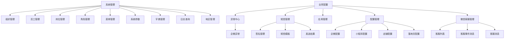
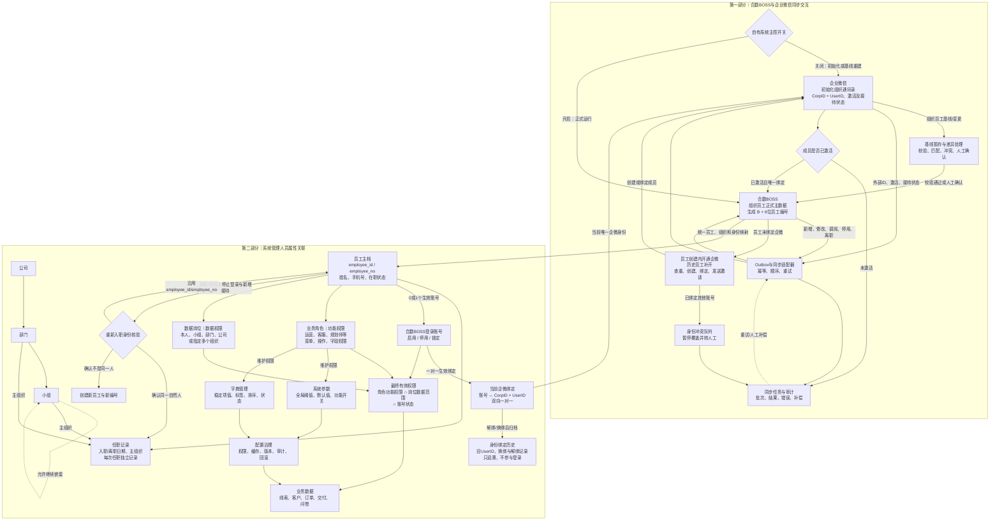
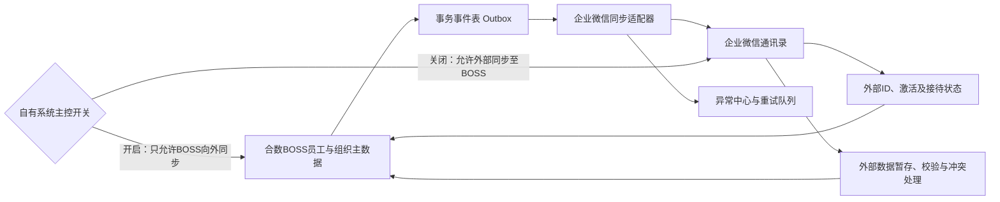
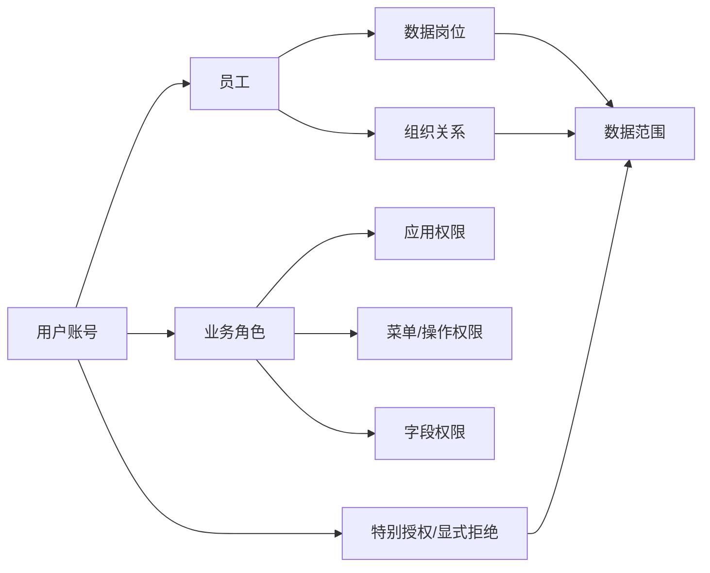

# 合数BOSS V1.0系统管理与业务配置需求文档

> 本文是合数BOSS V1.0“系统管理”的唯一需求基线，并收录与系统管理直接相关的业务配置能力。原《系统管理全景图》《组织员工与企业微信同步方案》和《系统管理与业务配置详细需求》已统一整合至本文，不再分别维护业务规则。总体背景和跨模块规则以[合数BOSS需求文档1.0版本](./合数BOSS V1.0产品需求总文档.md)为准。

| 文档属性 | 内容 |
|---|---|
| 所属项目 | 合数BOSS重构项目 |
| 所属版本 | V1.0 |
| 需求确认周期 | 2026-08-20—2026-09-14 |
| 版本基线完成 | 2026-09-14 前 |
| 项目正式启动 | 2026-09-15 |
| 文档版本 | V2.6 |
| 文档状态 | 需求确认稿 |
| 更新日期 | 2026-09-03 |
| 模块归属 | 合数BOSS应用内的“系统管理”；附带与其直接相关的业务配置能力 |
| 主要范围 | 组织、员工、企微身份、岗位、角色、菜单、系统参数、字典、日志、地区、同步和权限；业务配置承载异常、短信、应用、配置和微信客服 |

> **V2.6 当前生效补充：**岗位数据范围页面名称统一为“本人数据、本部门、本部门及下级部门、自定义组织、当前公司全部”。“本部门”表示当前员工归属部门范围；“本部门及下级部门”表示当前员工归属部门及组织树内全部下级部门范围。岗位表单移除独立“范围扩展”配置，不再提供“包含所选组织的全部下级组织”开关；后文与本补充冲突的旧名称及旧交互均不再生效。

## 1. 文档目标

本文件细化 V1.0 **合数BOSS应用内部**的系统管理与业务配置需求，作为合数BOSS产品原型、前后端开发、数据建模、测试验收和外部系统接入的共同基线。

本文中的“系统管理”和“业务配置”不是合数统一管理平台外层的公共系统管理。用户从统一平台应用中心进入合数BOSS后，才在合数BOSS左侧菜单中看到两个模块。业务配置固定展示在系统管理上方：系统管理负责组织员工映射、角色菜单、系统参数、字典、日志与地区治理；业务配置负责应用接入、企微、短信、微信客服、异常和运行配置。

### 1.1 与统一平台的边界

| 能力 | 责任系统 |
|---|---|
| 统一登录、平台应用入口、统一会话 | 合数统一管理平台 |
| 合数BOSS内组织与员工可见范围、合数BOSS角色和菜单 | 合数BOSS系统管理 |
| 企微、短信、微信客服、店铺、小程序和落地页配置 | 合数BOSS业务配置 |
| 企业微信原始组织员工信息 | 企业微信 |
| 线索、客户、活码、跟进和撞单 | 合数BOSS业务模块 |

统一平台可以向合数BOSS传递登录用户和统一会话，但不得替代合数BOSS的业务权限判断；组织员工初始化只读取整改后的企微基线，正式切换后由合数BOSS通过适配器向企微下发，禁止跨库修改。

## 2. V1.0 目标与边界

### 2.1 版本目标

1. 建立组织、员工、岗位、角色、菜单和应用的统一管理关系，并承接企业微信员工身份；岗位负责数据可见范围，角色负责菜单、操作和字段权限；
2. 支持账号密码与单一 CorpID 企业微信扫码登录；
3. 根据用户、角色、组织和合数BOSS授权动态生成应用内菜单，不在前端写死；
4. 为合数BOSS首期业务提供组织员工、账号状态、数据范围和菜单权限；
5. 建立异常、日志和外部配置入口，满足联调、审计和问题定位需要；
6. 建立系统参数与业务字典两类全局治理能力，避免把运行参数、枚举值和业务规则写死在前后端代码中；
7. 复用现有组织管理原型的树形列表、新增、编辑、停用和删除交互。

### 2.2 范围分级

| 层级 | V1.0 定义 |
|---|---|
| P0 必须可用 | 系统管理：组织、员工、岗位、角色、菜单、系统参数、字典、日志；业务配置：应用管理与合数BOSS接入权限 |
| P1 达到配置可用 | 业务配置：异常、短信、配置、微信客服；系统管理：地区管理 |
| 已移出当前范围 | 支付管理、群机器人；不生成菜单、路由、页面和本期验收项 |
| P2 可配置占位或后续启用 | 复杂短信计费与供应商路由、客服会话内容归档、店铺/落地页高级运营配置 |

V1.0 不要求重新实现所有历史 SCRM 管理能力。已有稳定服务优先通过统一入口和适配接口接入；尚未具备接口的模块可先完成菜单、权限、页面框架、基础配置和审计，具体业务能力按后续迭代启用。

## 3. 信息架构与菜单

### 3.1 系统管理全景图

本图同时表达两条主线：第一部分说明企业微信组织员工如何进入合数BOSS，以及正式运行后合数BOSS如何向企业微信同步；第二部分说明员工、组织、岗位、角色、账号、企微身份和业务数据之间的关系。

全景图的核心口径：

- 企业微信只在初始化阶段提供组织员工基线，并在运行期负责企微身份、激活、客户联系及接待状态；
- 合数BOSS生成并永久维护员工主键和员工编号，正式运行后是姓名、手机号、在职状态、主组织和岗位的唯一主写源；
- 岗位决定“能看哪些数据”，角色决定“能做哪些操作”，账号状态决定当前能否登录；三者必须同时满足；
- 一个登录账号最多绑定一个生效企微身份，同一 `CorpID + UserID` 也只能绑定一个账号；
- 离职不删除员工、身份和业务历史，必须先指定继承人，再移交客户、线索、待办和服务关系；
- 重新入职确认同一自然人时沿用原员工主键和员工编号，但权限、客户、活码和待办不自动恢复。

### 3.2 菜单展示规则

- 左侧只展示当前用户有权访问的业务配置和系统管理菜单；无下级权限的父菜单不展示；业务配置固定排序在系统管理上方；
- 点击一级菜单时，若存在下级菜单则展开/收缩；只有一个下级页面时可直接进入该页面；
- 点击菜单动态生成“系统管理 · 页面名称”页签，内容区同步切换；相同页面不重复生成页签；
- 菜单顺序、层级、名称、图标、路由、可见性和状态来自菜单配置；
- 禁用菜单不允许新访问，已打开页签再次操作时提示“功能已停用”；
- 切换组织后重新计算数据权限并刷新当前页面；未保存表单需先确认；
- 企微、短信、客服等入口只在合数BOSS的系统管理侧栏中展示，不出现在统一平台外层导航。

## 4. 通用页面与交互规范

### 4.1 列表页面

采用“页面标题 + 搜索筛选 + 主要操作 + 数据表格 + 分页”的统一结构。

| 能力 | 统一要求 |
|---|---|
| 查询 | 支持关键词与业务状态筛选；查询条件可清空；回车可触发搜索 |
| 列表 | 支持加载、空数据、错误、无权限状态；长字段省略并悬浮显示完整值 |
| 操作 | 主操作位于右上；行操作包括查看、编辑、启停，危险操作使用红色并二次确认 |
| 批量处理 | 仅在勾选数据后启用；显示影响数量；完成后返回成功、失败和失败原因 |
| 刷新 | 保留当前筛选和分页；按钮进入加载状态，避免重复点击 |
| 导出 | 按当前数据权限和筛选条件导出；敏感字段脱敏；生成审计记录 |
| 分页 | 支持页码、每页数量和总数；树形组织列表可不分页但需支持虚拟滚动或懒加载 |

### 4.2 新增与编辑弹窗

- 默认使用居中弹窗，复杂配置使用抽屉或独立页面；
- 标题明确显示“新增/编辑 + 对象名称”；右上支持关闭；底部固定取消和确认按钮；
- 必填项使用红色星号，失焦和提交时校验，错误信息紧邻字段展示；
- 提交中锁定确认按钮；成功后关闭弹窗、刷新列表并反馈；失败时保留已填写内容；
- 编辑页面回填当前值；并发修改时提示数据已更新，禁止静默覆盖；
- 有未保存内容时，关闭、切页签或返回均需二次确认。

### 4.3 状态视觉

| 状态 | 视觉表现 |
|---|---|
| 加载中 | 表格骨架屏或局部加载，不清空已展示数据 |
| 空数据 | 空状态插图/图标、说明和有权限时的“新增”入口 |
| 加载失败 | 错误说明、请求追踪号和重试按钮；保留最近成功数据时标明可能过期 |
| 无权限 | 显示无权限结果页和权限申请指引，不显示敏感数据 |
| 已启用 | 蓝色或绿色状态标签 |
| 已停用 | 灰色状态标签；不可执行依赖该对象的新业务动作 |
| 危险操作 | 红色文字/按钮及二次确认，不只依赖颜色表达风险 |

## 5. 功能详细需求

### 5.1 组织管理（P0）

组织管理沿用参考系统的字段逻辑，但统一为合数 BOSS 视觉与交互：页面采用“左侧组织树 + 右侧当前节点直接下级列表”的主从结构。左侧负责定位与展开层级，右侧负责查询、查看、新增、编辑和删除。

#### 5.1.1 页面结构与交互

| 区域 | 要求 |
|---|---|
| 页面头部 | 显示页面名称、用途说明和“新增下级组织”主按钮；新增时默认以上一次选中节点为上级组织 |
| 左侧组织树 | 按公司、部门、小组三级展示；默认展开已有节点；节点显示类型标识、名称和直接下级数量 |
| 左侧搜索 | 按组织名称或组织编码模糊查询；有关键词时右侧展示跨层级搜索结果，并明确结果数量 |
| 右侧上下文 | 展示当前组织路径、当前组织名称及编码；“查看当前组织”打开只读详情 |
| 右侧列表 | 默认仅展示当前节点的直接下级；空数据时说明可通过“新增下级”继续创建 |
| 行操作 | 详情、编辑、删除；删除为危险操作，必须校验依赖并二次确认 |
| 新增/编辑弹窗 | 双列表单展示上级组织、组织类型、名称、系统生成编码、负责人、联系电话、邮箱和状态；详情态复用同一字段但只读 |

| 列表字段 | 说明 |
|---|---|
| 组织编码 | 系统创建时自动生成的全局唯一业务编码，可搜索；只读且永久不变 |
| 组织名称 | 当前选中节点的直接下级名称；点击进入该组织节点 |
| 组织类型 | 固定为公司、部门、小组三类 |
| 负责人 | 关联有效员工 |
| 人数 | 当前组织有效员工数量，不包含下级组织 |
| 组织状态 | 开启/关闭 |
| 创建时间 | 精确到秒 |
| 操作 | 详情、编辑、删除；按权限显示。新增下级位于页面头部与当前节点操作区 |

新增/编辑字段：上级组织、组织名称、组织编码、组织类型、负责人、联系电话、邮箱、状态。组织编码由系统保存时生成并只读；组织名称、组织类型和状态必填；联系电话、邮箱按实际资料选填。负责人必须来自有效员工。页面不提供人工排序，树和列表按创建时间升序稳定展示。

#### 5.1.2 组织编码规则

统一格式为 `ORG-{TYPE}-{SEQ}`，示例：`ORG-DPT-000123`。

| 组成 | 长度 | 规则 | 示例 |
|---|---:|---|---|
| 固定前缀 `ORG` | 3 | 表示组织主数据，固定大写 | `ORG` |
| 类型缩写 `TYPE` | 3 | 公司 `COM`、部门 `DPT`、小组 `TEM` | `DPT` |
| 流水号 `SEQ` | 6 | 系统全局递增数字，左侧补零，不按组织层级分别计数 | `000123` |

编码生成与治理规则：

- 编码由后端在创建事务中生成，前端不得提交自定义编码；保存前显示“保存后自动生成”；
- 数据库对组织编码建立唯一约束；流水号生成必须支持并发，不得通过“查询最大值加一”作为生产实现；
- 编码不包含地区、上级组织、名称或成立年份，避免组织改名、迁移和行政区调整后产生错误语义；
- 编码一经生成永久不可修改，组织移动、改名、停用或重新启用均保持原编码；
- 已删除或停用组织的编码不得复用；历史业务、审计和外部映射继续引用原编码；
- 组织类型仅允许公司、部门、小组，不接受个人或其他自定义类型；
- 历史组织导入时，系统仍生成新编码；旧系统编码保存在“外部组织标识映射”中，不占用本编码字段。

类型口径说明：组织结构固定为“公司 → 部门 → 小组”。公司为根节点；部门只能挂在公司下；小组只能挂在部门下且为叶子节点，不允许继续新增组织。个人不是组织类型；员工主组织可以直接归属部门，也可以归属部门下的小组，以兼容没有小组的部门；个人数据权限通过 `employee_id` 和员工组织关系计算。

业务规则：

- 公司根组织不可删除；上级组织不可选择自身或自己的下级；
- 组织编码全局唯一；同一上级下组织名称不得重复。搜索同时命中组织名称、组织编码、组织类型和负责人；
- 组织树采用固定三级父子校验：公司 → 部门 → 小组；不允许越级、同级嵌套或在小组下新增组织节点；
- 员工直接关联部门或部门下小组，同一员工的主组织只能有一个，可按员工管理规则维护兼任关系；
- 同一上级下组织名称不得重复；组织最大深度固定为公司、部门、小组三层；
- 存在下级组织、有效员工、岗位或业务归属时禁止删除；提示必须分别给出下级组织数和有效员工数，并引导先迁移或停用，不得只提示“删除失败”；
- 停用组织后禁止新增下级、员工、岗位和业务归属，历史关系及审计保留；
- 启停、负责人变更和层级调整均记录变更前后值；
- 移动组织属于高风险操作，必须预览受影响的下级组织、员工和数据权限后确认。

#### 5.1.3 页面状态与验收

- 首次进入默认选中公司根节点，右侧展示其直接下级，组织树与右侧上下文保持一致；
- 选择任一节点后，路径、组织编码、列表和新增默认上级同步变化；
- 搜索无结果时展示明确空状态；清空搜索后恢复当前节点的直接下级列表；
- 停用组织使用灰色状态标签，仍可查看历史详情，但不能新增下级、员工、岗位或新业务归属；
- 删除无依赖的非根组织时二次确认；存在依赖时直接显示影响数量和处理指引；
- 新增或编辑成功后关闭弹窗、刷新组织树和列表并提示成功；失败时保留填写内容；
- 新增页面不可手工输入组织编码；保存成功后列表与详情显示同一个自动编码，编辑、移动、改名后编码保持不变；
- 1366×768 及以上分辨率下左树、列表和操作列不得重叠；窄屏时列表允许横向滚动；
- 所有新增、编辑、停用、删除操作记录操作者、时间、对象、变更前后值和 trace_id。

### 5.2 员工管理（P0）

| 功能 | 要求 |
|---|---|
| 员工列表 | 合数BOSS员工编码、员工名称、真实姓名、手机号、邮箱、所属组织、数据岗位、业务角色、外部身份绑定、账号状态 |
| 新增/同步 | 首次接收整改后的企微组织员工基线；支持自有系统主控开关控制唯一同步方向；不接入其他办公平台员工数据 |
| 新增员工并开通企微 | “新增员工”使用一个统一入口；保存员工时可选“同时创建或绑定企微成员”。主控开启时先按手机号查重，已存在且未绑定则建立绑定，不存在才创建并发送激活邀请 |
| 组织与岗位 | 员工直接关联所属部门或该部门下小组；默认绑定一个数据岗位，可绑定多个业务角色；组织、岗位和角色关系均保留生效时间 |
| 账号处理 | 支持启用、停用、重置密码、解除企微绑定；高风险操作二次确认 |
| 离职处理 | 停止合数BOSS访问和新业务接待，保留历史负责人及操作记录；存量业务按对应页面改派，不创建继承任务 |

系统管理中的员工管理不直接修改客户或线索归属。系统管理只负责身份停用和事件通知；存量业务如需调整负责人，由具备权限的管理员在对应业务页面执行改派。

#### 5.2.0 页面结构与交互

| 区域 | 要求 |
|---|---|
| 页面头部 | 显示员工管理说明、同步记录、企微基线导入、同步企微、立即差异扫描和新增员工；不再单独展示“创建企微成员”入口及主写源关系说明卡片 |
| 左侧组织树 | 展示公司、部门、小组三级组织；选择节点后列表包含该节点及全部下级组织员工；节点显示直接归属员工数 |
| 工具栏 | 左侧提供新增员工和批量操作，右侧提供账号状态筛选及关键词搜索 |
| 搜索 | 支持员工编号、员工名称、真实姓名、手机号和邮箱模糊查询；回车触发，清空后恢复当前组织范围 |
| 批量操作 | 勾选员工后才可用；首期支持批量启用、批量停用，并显示选择数量和处理结果 |
| 员工列表 | 支持多选、固定操作列、分页及每页数量切换；手机号按权限脱敏 |
| 详情 | 使用右侧抽屉展示身份、联系方式、所属组织、业务角色、数据岗位、有效数据范围及企微绑定状态 |
| 日志与同步记录 | 员工日志按时间倒序展示初始化、资料修改、启停和身份绑定；页面头部“同步记录”集中展示实时回调、主动下发、手工扫描和每日全量差异扫描任务 |

页面业务规则：

- 参考旧系统保留“组织筛选 + 员工列表 + 详情/日志”工作方式，但危险操作不提供物理删除，统一使用停用；
- 选择公司时包含全部部门和小组员工，选择部门时包含下属小组员工，选择小组时只展示该小组员工；
- 员工名称用于业务展示，真实姓名用于身份核验；真实姓名、手机号、邮箱受字段权限控制；
- 岗位为独立主数据并生成岗位编码，只配置数据范围，不继承或授予菜单、操作权限；业务角色只配置菜单、操作和字段权限，不配置数据范围；
- 批量停用前提示影响员工数及未结业务数量；确认后停止登录和新增接待，不自动创建继承任务；
- 详情和日志按 `employee_id` 查询，员工改名、换组织或更换手机号后仍使用同一员工主键。

页面验收：组织筛选、状态筛选、关键词搜索可叠加；勾选跨页不默认保留；空数据、加载失败和无权限状态完整；1366×768 下关键字段及固定操作列可用，表格允许横向滚动。

#### 5.2.0.1 新增员工逻辑

新增员工使用一个弹窗完成，按“员工身份—任职与权限—账号设置—企微开通”组织信息。“创建企微成员”不再作为独立的页面头部功能；创建员工时可选“同时创建或绑定企微成员”。企微 UserID 仍由后端生成或通过查重命中后绑定，不允许页面手工填写。

| 字段 | 必填 | 规则 |
|---|---:|---|
| 员工名称 | 是 | 2–32 个字符，用于业务页面展示，可与真实姓名不同 |
| 真实姓名 | 是 | 2–32 个字符，用于身份核验，受敏感字段权限控制 |
| 手机号 | 是 | 中国大陆 11 位手机号；有效员工范围内全局唯一；保存前执行去重校验 |
| 邮箱 | 否 | 填写时校验格式与唯一性 |
| 员工编号 | 系统生成 | 新员工按 `B` + 6 位全局流水号生成，例如 `B000001`；生成后不可修改、不可复用；并发环境使用数据库序列，不使用最大值加一 |
| 主组织 | 是 | 只能选择启用的部门或小组，公司不能直接作为主组织；一个员工同一时刻只能有一个主组织 |
| 数据岗位 | 是 | 从启用岗位库中选择一个；岗位决定本人、小组、部门、自定义组织或当前公司数据范围，不授予功能权限 |
| 业务角色 | 是 | 至少选择一个，可多选；角色决定菜单、操作和敏感字段权限，不扩大岗位数据范围 |
| 创建登录账号 | 否 | 默认开启；登录名默认使用手机号；关闭时只创建员工主档，账号状态为停用 |
| 账号状态 | 条件必填 | 创建登录账号时选择立即启用或暂不启用；初始密码仅在创建成功后展示一次 |
| 同时创建或绑定企微成员 | 否 | 新增时默认开启；仅自有系统主控开启时可用。系统先按手机号查询企微：已存在且未绑定则绑定，不存在才创建并邀请；已绑定其他账号则进入身份冲突 |

保存逻辑：

1. 前端先完成必填、长度、手机号和邮箱格式校验，提交中禁用保存按钮；
2. 服务端再次校验手机号、邮箱、外部身份和员工编码唯一性，并校验主组织处于启用状态且类型为部门或小组；
3. 员工主档、主组织关系、角色关系和登录账号在同一事务中保存，任一步失败则全部回滚；
4. 保存成功后生成永久 `employee_id` 和只读 `employee_no`，写入来源 `MANUAL`、创建人、创建时间和 trace_id；
5. 若创建账号，系统生成一次性初始密码并仅展示一次，首次登录强制修改；不得通过日志、接口响应重放或员工列表再次显示明文密码；
6. 保存成功后关闭弹窗、刷新当前组织范围列表并定位新员工；失败时保留填写内容并展示可执行的错误原因；
7. 勾选“同时创建或绑定企微成员”时，员工主档事务提交成功后再创建异步企微开通任务；企微失败不得回滚或删除已创建员工，员工显示“企微开通失败/待重试”，任务进入同步记录，连续失败或身份冲突进入异常中心；
8. 未勾选时员工显示“未开通”，历史未绑定员工可从列表行操作“补开企微”；
9. 新增员工不得迁移或改写既有客户、线索、订单和活码归属；业务分配必须通过对应业务模块完成。

异常与拦截：手机号或邮箱重复时提示已关联员工并引导查看现有档案；主组织已停用或在提交期间被停用时拒绝保存；无角色分配权限的管理员只能使用其可授权角色集合；无敏感字段权限的操作者保存后只看到脱敏手机号。所有成功、失败和重复拦截均记录审计日志。

验收标准：默认带入当前选中的启用部门或小组；选中公司时主组织留空并要求选择；校验失败不关闭弹窗；连续点击不会生成重复员工；保存成功后员工编号、组织、岗位、角色和账号状态与详情一致；勾选企微开通后显示创建中、待激活、已绑定、失败或冲突中的准确状态；刷新页面后数据仍存在。

#### 5.2.0.2 统一入口中的企微创建与绑定流程

“开通企微”在产品层定义为：合数BOSS调用企业微信通讯录接口创建成员或绑定已存在成员，并发送激活邀请。系统不能替代员工完成企微激活，因此必须区分“创建成功、邀请成功、激活成功、绑定成功”。

入口与页面：

- 员工列表新增“企微状态”列，枚举为未开通、创建中、待邀请、待激活、已激活并绑定、失败、身份冲突；
- 新员工在“新增员工”弹窗勾选“同时创建或绑定企微成员”；未绑定且账号启用的历史员工显示“补开企微”行操作；页面头部不再提供独立的创建入口；
- 补开弹窗展示员工编号、姓名、脱敏手机号、主组织、企微部门映射、拟生成UserID及“一账号一企微身份”规则；
- 自有系统主控关闭时入口禁用，并提示“请先在企业微信创建成员，再同步至合数BOSS”。

前置校验：

1. 员工在职、登录账号启用，且员工、账号均不存在生效企微绑定；
2. 姓名、手机号、主组织完整，主组织已映射至启用的企微部门；
3. 单一CorpID配置有效，通讯录写权限、成员查询权限和邀请能力校验通过；
4. 操作人拥有 `system:employee:wecom:create` 权限；
5. 先按手机号和历史身份映射查询企微成员：未命中才创建；命中未绑定成员需管理员确认后绑定；命中已绑定其他BOSS账号时停止并进入身份冲突队列。

执行流程：

1. 创建带唯一请求号的企微开通任务，记录员工、账号、CorpID、目标部门和拟生成UserID；
2. UserID由后端按稳定规则生成，不允许页面手工输入；创建成功后立即保存 `CorpID + UserID` 外部身份及当前绑定；
3. 保存绑定后发送激活邀请；邀请接口失败时保留已创建成员，将任务标为“邀请失败”并允许重发，不删除成员；
4. 企业微信回调或定时差异扫描更新激活状态；只有企微已激活且唯一绑定有效时，页面显示“已激活并绑定”；
5. 企微创建成功但BOSS落库失败时，补偿任务按请求号、UserID及手机号查询并补建映射，禁止再次盲目创建；
6. 重复提交同一员工开通请求必须命中原任务或当前身份，不能产生重复企微成员。

审计与错误：记录操作人、时间、请求号、员工、CorpID、UserID、各步骤状态、企微错误码、重试次数和处理结论；手机号仅记录脱敏值，Secret和访问令牌不得落日志。权限不足、主控关闭、手机号重复、部门未映射、已绑定、企微权限不足和频率限制均提供可执行提示。

#### 5.2.1 员工统一身份规则

现状中旧系统没有独立员工编号，历史业务关系主要使用企业微信 `UserID`。新系统不得继续把外部平台 ID 直接作为员工主键，采用以下三层标识：

| 标识 | 示例用途 | 规则 |
|---|---|---|
| 合数BOSS内部员工主键 `employee_id` | 合数BOSS数据库关联 | 合数BOSS生成，永不复用，不随姓名、组织、手机号或外部账号变化 |
| 合数BOSS员工编码 `employee_no` | 页面展示、合数BOSS业务编号 | 一律由合数BOSS按 `B` + 6 位全局流水号生成并维护；旧系统编号只作历史别名，不继承为正式编号 |
| 外部身份 | 企业微信 `CorpID + UserID`、历史SCRM员工标识 | 保存在员工外部身份表，记录来源、CorpID、状态和生效时间，不直接替代内部主键 |

当前企微身份与合数BOSS登录账号采用双向一对一生效绑定：一个账号最多绑定一个企微 `CorpID + UserID`，同一企微身份也只能绑定一个账号。历史 SCRM 中的企微 `UserID`、解绑记录和换绑前身份必须保留为只读历史映射，确保客户负责人、活码、跟进和历史操作能够找到合数BOSS员工，但不得参与当前登录、权限计算和新业务归属。

#### 5.2.1.1 历史员工与重新入职规则

历史员工、重新入职员工和企微身份变更必须围绕同一个自然人员工主档治理，禁止因为外部账号、手机号或任职区间变化重复创建员工编号。

| 场景 | 处理规则 |
|---|---|
| 历史员工首次导入 | 先进入暂存区，完成身份匹配和冲突处理后建立正式员工主档，由合数BOSS生成 `B` + 6 位员工编号 |
| 多个历史编号 | 旧SCRM员工ID和旧企微UserID进入别名/外部身份表，关联同一个 `employee_id`，不得直接作为正式员工编号 |
| 同一员工企微换绑 | 任一时刻仅保留一个生效企微身份；先解除旧绑定并写入历史，再将新 `CorpID + UserID` 绑定到原登录账号；禁止并行生效 |
| 离职 | 停用账号与新增接待能力；保留员工编号、任职记录、外部身份、客户服务关系及全部审计历史 |
| 重新入职且确认为同一人 | 恢复原 `employee_id/employee_no`，新增任职记录，重新配置主组织、数据岗位、业务角色、账号和企微身份，不生成新编号 |
| 无法确认是否同一人 | 进入身份冲突队列，未经授权人员确认不得自动合并或新建 |

重新入职不自动恢复离职前权限、客户、活码、待办和服务关系；只有本次任职重新授权或重新分配后才生效。历史业务仍显示当时实际操作的企微身份，同时可通过员工编号聚合查看该员工的完整历史。

#### 5.2.2 历史初始化与数据合并

1. 业务先在企业微信完成组织和人员整改，再将企微部门、成员、UserID和状态全量导入来源暂存区，作为正式基线候选；
2. 初始化只处理经业务确认的企微基线数据，不接收未经确认的其他组织员工数据源；
3. 优先依据已确认人工映射和企微 `CorpID + UserID` 合并；旧SCRM员工ID和已验证手机号可以作为辅助证据，但不得仅凭姓名自动合并；
4. 同一手机号或企微 UserID 命中不同员工时进入“员工身份冲突”队列，暂停自动覆盖；
5. 冲突页面展示两个来源的姓名、组织路径、手机号脱敏值、在职状态和更新时间，由授权管理员选择合并、新建或暂不处理；
6. 合并后保留来源快照、处理人、处理理由和原始标识；误合并应支持按映射历史拆分恢复；
7. 初始化完成并由业务对账签字后执行主数据切换，此后姓名、手机号、在职状态、主组织和岗位均以合数BOSS为准；企微只回写外部身份、激活/接待状态和执行结果。

#### 5.2.3 字段主责原则

| 字段 | 正式主责 | 冲突处理 |
|---|---|---|
| 合数BOSS员工编码 | 合数BOSS | 一律由合数BOSS生成且永久不复用；旧系统员工标识只作历史别名 |
| 企业微信身份及接待状态 | 企业微信 | `account_id`与`CorpID + UserID`双向唯一，冲突不得覆盖 |
| 姓名、手机号、在职状态 | 合数BOSS | 企微差异只告警，不得反向覆盖 |
| 主组织和岗位 | 合数BOSS | 企微差异告警，并按合数BOSS重新下发 |

#### 5.2.4 合数BOSS与企业微信同步方案

采用“合数BOSS单主写、事务Outbox、企微适配器下发、企微外部状态回写”的架构。其他办公平台不进入初始化或在线同步链路。

##### 5.2.4.1 初始化与正式切换步骤

| 阶段 | 处理步骤 | 完成判断 |
|---|---|---|
| 初始化准备 | 业务先完成企微组织、部门、小组、成员和在职状态整改；确认单一 CorpID、接口权限、负责人及冻结窗口 | 企微通讯录结构通过业务确认，接口可全量读取，初始化时间窗已确定 |
| 基线拉取 | 全量拉取企微部门、成员、`CorpID + UserID`、手机号和状态至暂存区，不直接写入正式员工表 | 拉取数量、分页完整性、必填字段和来源批次可核对 |
| 校验与冲突处理 | 校验组织层级、手机号、企微身份和历史SCRM映射；无法唯一判断的记录进入人工冲突队列 | 循环组织、孤儿节点、双向绑定冲突和未处理高风险记录均为0 |
| 建立正式主档 | 经确认后创建或合并员工主档，由合数BOSS生成永久员工编号，建立账号、组织、岗位、角色和企微绑定 | 正式员工编号覆盖率100%，一个账号与一个企微身份双向唯一 |
| 对账签字 | 按公司、组织、在职状态和关键字段与企微基线核对，并保留批次快照 | 产品、技术和业务验收人员确认基线结果 |
| 正式切换 | 开启自有系统主控，后续组织员工主数据由合数BOSS通过Outbox下发企微；企微回写外部身份和运行状态 | 主数据方向唯一、增量任务可重试、当日对账无未解释差异 |
| 日常运行 | 实时或准实时处理增量事件，每日全量对账；失败进入异常中心，按幂等键重试或人工补偿 | 无重复员工、无重复绑定、失败任务均有明确处理状态 |

基线拉取、正式切换和回滚必须使用不同任务批次。切换期间禁止一边从企微覆盖正式主档、一边从合数BOSS下发同一字段；主控方向变更前必须处理或冻结在途任务，并保存切换前快照。

同步顺序：先创建或更新上级组织，再处理下级组织，最后处理员工及其组织关系；离职时先停止新增业务接待和登录，再停用外部账号，并保留历史业务关系。组织移动必须拆分为可审计的关系变更，不通过删除员工重建实现。

| 项目 | 建议方案 |
|---|---|
| 增量同步 | 自有系统保存成功后立即写入 Outbox，目标 1 分钟内开始下发，正常情况下 5 分钟内完成 |
| 全量对账 | 每日 `02:00`（Asia/Shanghai，可在系统参数中调整）与企业微信执行一次全量差异扫描；只修复企微或进入待确认队列，不反向覆盖合数BOSS核心字段 |
| 人工补偿 | 异常中心支持按员工、组织、批次重新下发，重试必须幂等 |
| 幂等键 | `source_version + object_type + object_id + target_system` |
| 顺序控制 | 同一组织或员工按自有系统版本号串行消费，旧版本事件不得覆盖新版本 |
| 删除策略 | 自有系统采用停用；外部优先停用/离职，不直接物理删除；历史映射永久保留 |
| 回写内容 | 企微 UserID、外部部门 ID、激活/接待状态、同步状态、时间、错误码和重试次数 |
| 失败告警 | 连续失败 3 次或超过 15 分钟未成功时告警；进入人工处理但不阻断其他对象 |

为防止管理员在企微人工修改后形成漂移，夜间对账发现差异时生成告警，并以合数BOSS值重新下发；高风险字段不做静默双向合并。

##### 企业微信回调、差异展示与一致性规则

企业微信回调是“变化事件”，不是必须向所有用户弹出的业务消息。合数BOSS接收回调后应先快速验签、按事件唯一键幂等落库并返回成功，再由异步任务获取成员最新详情、计算字段差异和执行同步，避免在回调请求内完成耗时业务。

| 场景 | 平台展示位置 | 处理规则 |
|---|---|---|
| 正常回调且处理成功 | 员工管理—同步记录 | 展示事件类型、企微UserID、接收时间、处理时间、变更摘要、结果和trace_id；不生成面向全员的消息提醒 |
| 回调字段与合数BOSS一致 | 同步记录标记“无需处理” | 只留审计，不重复写库、不重复下发 |
| 企微运行字段变化 | 员工详情及同步记录 | 企微UserID、激活状态、接待状态等企微运行字段允许自动回写 |
| 合数BOSS主数据字段被企微修改 | 员工列表“一致性=待处理”、同步记录；严重冲突同时进入业务配置—异常中心 | 姓名、手机号、主组织、在职状态、业务角色、数据岗位等不得被企微静默覆盖；保留差异，按规则重新下发BOSS值或由管理员确认 |
| 重复绑定、身份无法唯一匹配、连续失败 | 业务配置—异常中心 | 阻断自动合并，展示原值/新值、影响对象、错误码、重试次数和处理动作 |

允许差异短期存在，但必须有明确的“一致、待处理、同步中、失败”状态、责任人和处理期限，禁止无标记的永久差异。未处理的旧差异不会使企业微信重复发送同一条回调；只有企微对象再次发生真实变更时，才会产生新的变更事件。因此系统必须依靠每日全量差异扫描发现漏回调、处理失败和长期漂移，不能把回调当成唯一一致性保障。

对于由合数BOSS主动创建或更新的企微成员，发送接口成功后由当前任务直接更新本地同步状态，不等待“自己写入自己回调”；随后由查询接口或夜间扫描复核。回调载荷只作为事件线索，系统应以 `CorpID + UserID` 再查询成员当前信息，避免直接信任可能缺字段的回调正文。

##### 自有系统主控开关

| 状态 | 同步规则 | 典型使用阶段 |
|---|---|---|
| 开启 | 合数BOSS为主写源，只允许合数BOSS向企微下发主数据；企微仅回写外部身份、激活/接待状态和执行结果 | 正式运行期，默认状态 |
| 关闭 | 暂停合数BOSS向外主数据下发，允许企微组织员工数据同步至合数BOSS；数据仍需经过暂存、校验、冲突处理和审计 | 首次初始化、专项迁移或经批准的基线重建 |

该开关属于全局高风险配置，仅超级管理员可见。切换必须二次确认并填写原因；系统应先暂停原方向任务、等待或处置在途事件、保存快照和游标，再启用新方向。任一时刻只允许一个方向写入主数据，禁止形成无约束双向循环。所有切换记录必须包含操作人、时间、切换前后状态、原因、受影响对象数、在途任务处理结果和 trace_id。

#### 5.2.5 同步接口责任与频率

| 工作项 | 产品责任 | 技术责任 | 运行频率 |
|---|---|---|---|
| 自有系统字段与业务规则 | 张铭钰 | 陈庆焕 | 实时变更 |
| 企业微信接口联调 | 张铭钰 | 陈庆焕指定企微接口开发人（姓名待补充） | 增量 1—5 分钟；每日全量对账 |
| 数据质量及同步测试 | 张铭钰 | 陈庆焕配合 | 每次发布及每日自动对账 |

字段映射至少包含：自有组织 ID/编码、父组织、组织类型、名称、状态；员工 ID、员工编号、姓名、手机号、在职状态、主组织、兼任组织、岗位；企微 CorpID/UserID 与部门 ID。字段映射表需要记录方向、格式、必填、枚举、转换规则和失败处理。

### 5.3 岗位管理（P0）

岗位是合数BOSS的数据权限载体，不等同于员工的业务职位名称。岗位用于回答“该员工能看哪些业务数据”，不得配置菜单、按钮、接口操作或敏感字段明文权限。

| 页面能力 | 需求说明 |
|---|---|
| 岗位列表 | 展示岗位编码、岗位名称、数据范围摘要、关联员工数、状态和操作；支持名称/编码搜索及范围、状态筛选 |
| 新增/编辑 | 配置岗位名称、岗位编码、范围类型、指定组织、协作数据策略、排除项、说明和状态；不展示独立范围扩展开关 |
| 数据范围 | 支持本人数据、本部门、本部门及下级部门、自定义组织、当前公司全部五种基础范围 |
| 关联员工 | 一个员工默认绑定一个生效数据岗位；调整岗位前展示数据可见范围变化和受影响业务模块 |
| 影响预览 | 保存前展示受影响员工数、组织数及预计扩大/缩小的数据范围；高风险扩权需二次确认并审计 |
| 启停删除 | 停用后禁止新绑定；已关联员工必须先迁移到其他岗位；有生效员工的岗位不得删除 |

岗位范围编码及计算方式：

| 范围编码 | 页面名称 | 计算方式 | 典型岗位 |
|---|---|---|---|
| `SELF` | 本人数据 | 当前员工是业务数据当前负责人，或被明确加入协作/服务关系 | 本人数据岗 |
| `MANAGED_GROUP` | 本部门 | 当前员工归属部门内的授权业务数据 | 部门数据岗 |
| `MANAGED_DEPARTMENT` | 本部门及下级部门 | 当前员工归属部门及组织树内全部下级部门的授权业务数据 | 部门管理岗 |
| `CUSTOM_ORG` | 自定义组织 | 岗位配置一个或多个公司、部门、小组，仅按明确选中的组织计算，不通过独立开关扩展下级范围 | 跨部门管理岗 |
| `CURRENT_COMPANY` | 当前公司全部 | 当前登录公司内的全部授权业务数据，不跨公司 | 公司数据管理岗 |

岗位范围只控制“行数据是否可见”。手机号明文、导出、改派、删除、批量操作等高风险能力仍必须由业务角色中的独立功能权限控制。系统管理员角色不自动获得公司全部业务数据；若确需查看，必须同时绑定对应数据岗位。

特殊临时扩权不通过新增业务角色或修改基础岗位实现，应使用有生效时间、审批人、授权理由的用户级特别授权；到期自动失效。显式排除组织或业务对象优先于岗位允许范围。

页面验收：岗位列表范围摘要与配置一致；员工换岗后服务端权限缓存及时失效；本人、小组、部门、自定义和公司五级范围均能通过列表、详情、统计、导出用例；岗位不能出现菜单或操作授权入口；角色不能出现数据范围入口。

### 5.4 角色管理（P0）

- 列表字段：角色名称/编码、角色描述、关联员工数、状态、功能权限摘要和操作；
- 页面顶部支持新增角色；列表支持按角色名称、编码、描述搜索及按状态筛选；角色详情、关联员工和功能权限使用右侧抽屉承载；
- “操作权限”入口配置菜单、查看、新增、编辑、删除、导入、导出等功能动作，敏感字段明文权限作为其中的独立高风险权限；
- 角色名称按真实业务职责设计，例如运营、客服、规划师、一转老师、课程顾问、财务专员；“小组负责人、部门负责人、公司数据管理员”属于数据岗位，不作为业务角色；
- 角色页面不得出现本人、小组、部门、公司或自定义组织等数据范围配置；数据范围统一到岗位管理维护；
- 系统内置超级管理员角色不可删除、不可移除必要平台权限；
- 修改角色权限前显示影响用户数，保存后刷新相关用户的权限缓存；
- 已登录用户权限变更应在可控时间内生效，高风险权限收回需立即生效；
- 角色复制不得复制成员，只复制权限并生成新的角色编码。

页面验收：角色只出现菜单、操作和字段权限，不出现数据范围入口；有成员的角色不可删除并提示人数；内置角色展示明确标记；权限变更均产生审计日志。

#### 5.4.1 用户角色冲突规则

1. 菜单和操作权限采用用户直接角色的允许集合；
2. 增加独立的显式拒绝项，显式拒绝优先级最高，用于收回高风险权限；
3. 员工多个业务角色的菜单、操作权限取并集，但不会扩大其数据岗位范围；显式拒绝功能权限始终优先；
4. 字段权限遵循最小暴露原则：只要任一生效规则要求脱敏，该字段就按更严格规则展示；显式授权查看明文必须是单独高风险权限；
5. 权限详情页必须解释权限来源，功能权限显示来自哪个业务角色，数据范围显示来自哪个数据岗位或特别授权；
6. 权限变更保存前预览最终权限和影响用户，收回高风险权限后立即使已有会话失效。

#### 5.4.2 角色功能权限配置交互

数据范围不在角色管理配置，原“数据权限”入口迁移到第 5.3 节岗位管理。角色功能权限抽屉仅配置以下内容：

- 应用和菜单可见权限；
- 页面查看、新增、编辑、删除、导入、导出、分配、改派、审批等操作权限；
- 手机号、邮箱、问卷答案等敏感字段的脱敏或明文权限；
- 显式拒绝项及权限生效、失效时间；
- 保存前的关联员工及功能影响预览。

员工最终权限按“业务角色功能权限 + 数据岗位基础范围 + 用户特别授权 - 显式拒绝/排除”计算。其中功能权限与数据范围必须同时满足，任一不满足都不得返回或操作业务数据。

岗位管理的数据范围配置使用以下固定枚举：

| 范围编码 | 页面名称 | 计算方式 | 典型岗位 |
|---|---|---|---|
| `SELF` | 本人数据 | 当前用户是业务数据当前负责人，或被明确加入协作/服务人员关系 | 本人数据岗 |
| `MANAGED_GROUP` | 本部门 | 当前用户归属部门内的授权业务数据 | 部门数据岗 |
| `MANAGED_DEPARTMENT` | 本部门及下级部门 | 当前用户归属部门及组织树内全部下级部门的授权业务数据 | 部门管理岗 |
| `CURRENT_COMPANY` | 当前公司全部数据 | 当前登录公司内的全部授权业务数据，不跨公司 | 公司数据管理岗 |
| `CUSTOM_ORG` | 自定义组织 | 管理员明确选择一个或多个公司、部门、小组，不提供独立范围扩展开关 | 跨部门管理岗 |

页面同时提供以下配置：

- “负责人范围预览”：展示按当前组织负责人关系解析出的公司、部门和小组，避免只显示抽象范围名称；
- “包含协作数据”：控制是否包含用户作为协作人、服务人、班主任、规划师等关系参与的数据，默认开启；
- “排除组织/对象”：用于临时隔离或高风险数据限制，显式排除始终高于允许范围；
- “权限影响预览”：保存前展示受影响员工数、组织数和预计可见业务数据变化；
- 岗位列表的数据范围摘要分别显示“本人数据”“本部门”“本部门及下级部门”“当前公司全部”或“自定义N个组织”；不得展示“负责小组”“负责部门及下级”或独立“范围扩展”配置。

公司管理者和中台部门人员只有绑定 `CURRENT_COMPANY` 数据岗位或获批特别授权后才能查看全公司数据；系统不得通过部门名称包含“中台”、业务角色名称或菜单权限自动推导全公司数据权限。系统管理员默认管理配置，不自动拥有全部线索、客户、订单等业务数据。

### 5.5 菜单管理（P0）

页面采用“查询区 + 树形菜单表格 + 新增/编辑弹窗”结构。查询区支持菜单名称、权限标识、组件路径关键词及状态筛选；表格默认展开已有层级，目录、页面和操作权限均在同一棵树中维护。一级新增位于页面头部和表格头部；行内提供修改、新增下级和删除。

| 字段 | 说明 |
|---|---|
| 所属模块 | 合数BOSS内的业务模块或系统管理模块 |
| 上级菜单 | 构成应用内菜单树 |
| 菜单类型 | 目录、页面、操作权限 |
| 名称/编码 | 编码在应用内唯一，名称用于显示 |
| 路由/组件标识 | 页面导航和前端组件映射；操作权限无需路由 |
| 图标/顺序 | 用于动态侧栏显示 |
| 可见/状态 | 控制是否展示及是否可访问 |
| 权限标识 | 供前后端统一鉴权，例如 `system:org:create` |

菜单树不得形成循环；删除存在下级、角色授权或已发布路由的菜单前必须先解除依赖。后端必须对接口再次鉴权，不能只依赖菜单隐藏。

新增/编辑时，上级菜单、菜单类型、名称和状态必填；页面类型必须填写路由及组件，操作权限必须填写权限标识且不填写路由。权限标识在合数BOSS内唯一。停用目录时需展示受影响下级菜单和角色数；行内“新增”默认将当前行作为上级。页面验收需覆盖树形展开、组合查询、层级校验、依赖删除拦截和动态菜单刷新。

### 5.6 异常中心—企微异常（P1）

- 页面采用“异常概览 + 查询区 + 异常列表 + 详情抽屉”结构；概览分别展示待处理、重试中和转人工数量；
- 汇总企微授权、回调验签、事件解析、通讯录同步、活码和客户联系等异常；
- 列表字段：异常编号、请求地址、错误码、异常摘要、业务类型、发生次数、最近请求时间、状态和详情操作；
- 支持按请求地址、异常编号、错误码、异常信息、时间范围和处理状态组合查询；
- 支持查看脱敏请求摘要、处理轨迹、重试、忽略、转人工和关闭；
- 重试必须幂等；超过阈值进入告警，关闭时填写处理结论；
- 密钥、完整手机号、原始授权凭证不得在页面或普通日志展示。

详情抽屉至少展示异常编号、业务类型、请求地址、首次/最近发生时间、累计次数、追踪号、脱敏请求摘要和处理建议。立即重试、忽略、转人工、关闭均写入审计日志；重复异常可按“接口 + 错误码 + 关联对象”聚合，次数递增但每次原始事件仍需可追溯。页面验收需覆盖时间查询、长地址省略、状态区分、脱敏、幂等重试和处理轨迹。

### 5.7 短信管理（P1）

- 左侧导航在“短信管理”下设置三个三级菜单：签名管理、短信模板、发送结果；每个三级菜单使用独立路由、查询条件和列表，不在短信管理页面内使用页签切换；
- **签名管理**：签名名称、供应商、审核状态、适用场景、状态和有效期；只有审核通过且启用的签名可用；
- **短信模板**：模板编码、名称、内容、变量、签名、供应商模板编号、审核状态和启停状态；发送前校验变量；
- **短信结果**：提交结果、供应商回执、送达状态、失败码和计费条数，按业务请求号追踪完整链路；
- V1.0 **复用历史短信服务**，通过适配层接入，不更换供应商，不重复建设供应商结算与智能路由能力。

### 5.8 应用管理（P0）

- 字段：应用编码、应用名称、应用描述、入口地址、图标、负责人、接入状态、启停状态、排序；
- 支持内部应用注册、编辑、启停、配置默认页面和查看关联菜单；
- 该页面管理接入合数BOSS的业务应用、渠道应用或第三方应用，不管理统一平台应用中心；
- 用户只看到已启用且获得合数BOSS权限的接入应用；
- 应用停用后不可在合数BOSS内发起新调用，已打开配置页面提示停用；不得影响合数BOSS其他模块；
- 入口地址采用白名单和统一跳转策略，禁止配置不受信任脚本地址；
- 应用 Secret 等凭证加密保存，只允许重新生成，不允许再次查看完整明文；
- V1.0 至少完成企业微信、短信服务和微信客服等本期实际依赖的应用登记；旧 SCRM 数据接口作为迁移/并行接入对象管理。

### 5.9 配置管理（P1）

- 左侧导航在“配置管理”下设置四个三级菜单：企微配置、小程序配置、店铺配置、落地页配置；每个三级菜单使用独立路由、列表和新增编辑表单，不在配置管理页面内使用页签切换；
- **企微配置**：单一 CorpID，包含企业标识、AgentId、回调地址、通讯录/客户联系权限、授权状态和最近校验时间；敏感凭证加密且不回显；
- **小程序配置**：AppID、应用名称、环境、业务域名、授权状态和负责人；密钥仅支持更新或轮换；
- **店铺配置**：店铺编码、名称、所属组织、外部平台、状态和关联应用；V1.0 不承担订单业务管理；
- **落地页配置**：作为“配置管理”下的独立三级菜单和路由展示，页面内不再重复展示企微、小程序、店铺、落地页切换页签。列表支持按落地页名称、启停状态筛选，展示落地页编码、名称、H5地址、主跳转方式、兜底方式优先级、状态和创建时间；
- V1.0 维护已有落地页配置，不在页面提供新增入口。单条操作包含手机端预览、编辑、启用/停用；仅停用记录展示删除，删除前必须二次确认；
- 编辑支持落地页名称（必填、50字以内）、H5地址（必填且以 `http://` 或 `https://` 开头）、主跳转方式和兜底优先级。主跳转方式固定单选“获客助手、小程序、微信客服”；其余方式作为兜底项，可上移、下移调整尝试顺序，主方式不可同时出现在兜底列表；
- 手机端预览展示落地页编码、H5域名、名称、示例权益、主跳转方式及兜底顺序；预览不产生真实跳转或业务数据。保存、启停和删除均需权限校验、幂等控制并写入配置审计；
- 通用配置支持草稿、校验、发布和停用；生产配置变更要求权限、二次确认、审计和版本回退。
- 小程序、店铺和落地页在 V1.0 必须达到“可配置”状态，不以空白占位页作为完成；至少支持新增、编辑、校验、启停、测试连接/链接和配置审计。

### 5.10 微信客服管理（P1）

| 子页面 | 需求 |
|---|---|
| 客服列表 | 客服账号、名称、关联组织、接待员工、状态、企微同步状态和更新时间 |
| 客服事件消息 | 企微回调事件、事件号、类型、客服账号、外部联系人、处理状态和失败原因，支持幂等重试 |
| 客服消息 | 发送/接收方向、消息类型、时间、处理状态和关联客户；按合规范围脱敏或仅保留摘要 |

V1.0 重点完成客服账号映射、事件接入和问题追踪，不默认将全部聊天内容作为合数BOSS跟进记录。

微信客服复用历史服务及现有企微客服接入，不重新选择供应商；V1.0 通过适配层承接账号、事件和消息状态。

### 5.11 日志查询（P0）

- 日志类型包含登录日志、操作审计、配置变更、权限变更、接口调用和异步任务；
- 支持按时间、用户、组织、应用、对象、操作类型、结果和追踪号查询；
- 关键操作展示变更前后值，敏感值必须脱敏；
- 日志只允许授权角色查询，不提供普通删除功能；
- 导出日志需要单独权限、填写原因并形成二次审计；
- 在线热日志保留 6 个月，满足快速查询；超过 6 个月转入公司受控对象存储或日志归档库，操作审计、权限变更、配置发布和数据导出日志建议总计保留 3 年；普通调试日志可按必要最短周期清理；
- 归档文件加密、按月分区并校验完整性，只有安全审计管理员可恢复查询；
- 日志导出由申请人直属负责人审批；涉及全量、敏感字段或跨组织数据时增加系统负责人/数据安全负责人审批。V1.0 暂由技术负责人陈庆焕作为系统审批人，业务审批人待确认。

合规依据与口径：现行《网络安全法》要求相关网络日志留存不少于 6 个月；《个人信息保护法》要求个人信息仅保存实现处理目的所必要的最短时间，并要求个人信息保护影响评估报告和处理情况记录至少保存 3 年。因此“普通网络日志热存 6 个月、关键审计建议总计 3 年”是本项目的分层建议，不代表所有包含个人信息的明细都必须无差别保存 3 年。参考：[中华人民共和国网络安全法](https://www.gjbmj.gov.cn/n1/2026/0421/c409088-40705863.html)、[中华人民共和国个人信息保护法](https://www.npc.gov.cn/WZWSREL25wYy9jMi9jMzA4MzQvMjAyMTA4L3QyMDIxMDgyMF8zMTMwODguaHRtbD9yZWY9aW1i)。

### 5.12 地区管理（P1）

- 接入国家地区标准数据源，当前页面维护到国家、一级行政区和二级行政区，不使用含义模糊的“省/市”作为统一层级名称；
- 一级行政区按法定类型标注为省、自治区、直辖市、特别行政区；二级行政区按法定类型标注为地级市、自治州、地区、盟，以及直辖市下的市辖区等；
- 页面使用树形结构展示“国家 → 一级行政区 → 二级行政区”，字段包括标准地区编码、名称、行政层级、法定类型、上级、状态和数据版本；
- 官方地区编码唯一；存在有效下级或业务引用时禁止删除；
- 停用地区不影响历史地址展示，但不可用于新数据选择；
- 支持标准数据批量导入、差异预览和按版本更新。
- 国家地区同步必须保存数据来源、发布日期和版本号；行政区划调整通过差异更新生效，不直接覆盖历史业务地址快照。
- 地区管理不提供“新增下级”操作。管理员先选择国家，再通过标准数据同步获得该国家的一级、二级行政区；确需补录时走数据源修订或受控导入流程，避免人工创建不符合国家标准的行政区。

### 5.13 系统参数（P0，全局设置）

系统参数用于维护影响合数BOSS整体运行行为的少量全局参数，不承载可枚举业务选项，也不替代线索配置、等级规则等业务规则中心。其典型内容包括安全阈值、批量任务上限、默认保护周期、功能开关和外部接入技术参数。

#### 5.13.1 页面与字段

页面采用“标题说明 + 全局影响提示 + 筛选区 + 参数列表 + 新增/编辑弹窗 + 版本历史抽屉”的结构。

| 字段 | 说明与约束 |
|---|---|
| 参数名称 | 中文业务名称，必填，50 字以内 |
| 参数键 | 全局唯一，建议采用 `业务域.对象.含义`；创建后不可修改或复用 |
| 参数分组 | 支持选择或创建，如线索规则、客户规则、安全设置、集成设置 |
| 参数类型 | 文本、数值、开关、JSON、密钥；保存时按类型校验 |
| 参数值 | 必填；密钥编辑时留空表示不修改原值 |
| 是否敏感 | 敏感参数由服务端加密保存，页面、接口、日志和导出永不回显明文 |
| 状态 | 启用、停用；停用前展示全局影响提示 |
| 参数说明 | 说明用途、单位、默认值和影响模块 |
| 版本信息 | 版本号、修改人、修改时间和变更说明 |

#### 5.13.2 核心规则

1. 参数新增、编辑、启停均为高风险操作，需权限 `system:parameter:manage`，并记录操作人、前后版本、对象和追踪号；审计记录不得包含密钥原文。
2. 参数键和参数类型创建后不可直接修改；确需替换时新建参数键、完成引用迁移后再停用旧键。
3. 数值、布尔和 JSON 必须在服务端再次校验；前端校验不能替代后端校验。
4. 保存成功后版本号递增并刷新参数缓存；业务服务读取失败时使用上一有效缓存或明确的代码默认值，不允许因单个参数异常导致核心链路整体不可用。
5. 导出只包含名称、键、分组、类型、状态、说明和版本；敏感值不导出，非敏感值是否导出由独立权限控制。
6. 全局参数不用于维护“线索来源、客户等级、订单状态”等枚举项；这类选项统一进入字典管理。包含复杂条件、优先级和动作的规则进入对应业务规则中心。

### 5.14 字典管理（P0）

字典管理用于统一维护页面筛选、表单选项、状态标签和接口枚举的“显示名称—稳定值”映射。页面采用左侧字典类型、右侧当前字典项的主从布局，不再额外生成“字典项管理”菜单。

#### 5.14.1 字典类型

| 字段/操作 | 说明与约束 |
|---|---|
| 字典名称 | 中文业务名称，如线索来源、线索/客户等级 |
| 字典编码 | 全局唯一，建议小写下划线；创建后不可修改或复用 |
| 状态 | 启用、停用；停用后业务页面不可继续选择该字典，但历史值仍可解析 |
| 说明 | 描述使用模块、业务口径和维护责任人 |
| 操作 | 新增、编辑、启停；已有引用时禁止物理删除 |

#### 5.14.2 字典项

| 字段/操作 | 说明与约束 |
|---|---|
| 字典项标签 | 页面展示文案，可在不改变业务含义时修改 |
| 字典项值 | 接口和数据库稳定值；同一字典内唯一，创建后不可修改或复用 |
| 排序 | 数值越小越靠前；相同排序按创建顺序展示 |
| 标签颜色 | 仅控制页面视觉，不参与业务判断 |
| 状态 | 停用后不可用于新数据，历史数据继续按原标签展示并标记“已停用” |
| 说明 | 解释口径、适用范围和特殊限制 |

#### 5.14.3 使用与兼容规则

1. 业务表只保存字典项值，不保存当前中文标签；显示时通过字典服务解析，以便统一调整文案。
2. 代码不得根据中文标签判断业务逻辑；确需稳定逻辑的系统状态应由代码枚举维护，并在字典管理中标记“系统内置、禁止删除”。
3. 字典或字典项停用不回写、不清空历史数据；列表、详情和导出仍能解析旧值。
4. 字典变更后发布字典版本并刷新缓存；前端重新拉取，失败时可使用最近成功版本并提示数据可能过期。
5. 权限拆分为查看、维护类型、维护字典项和启停；批量删除默认不提供。
6. 初始字典至少包括线索来源、线索/客户等级、客户添加方式、客户生命周期和IP大类；线索与客户等级共用字典编码 `lead_customer_grade`，业务项仅为 S、A、B、C，“未定级”是系统保留状态；客户添加方式字典编码为 `customer_add_method`，稳定值仅为 `LINK/通过链接添加`、`BUSINESS_CARD/名片`、`QR_CODE/扫描二维码`；IP大类字典编码为 `ip_category`，首个字典项为“教育规划/EDUCATION_PLANNING”，其中字典项值即大类编码；业务模块新增枚举前需明确责任人和稳定值命名。
7. “IP渠道”不是IP大类字典项，统一引用渠道管理主数据及稳定渠道编号；初始渠道为“店播/CH000001”“阿留专属/CH000002”，渠道名称可调整但编号不可修改或复用。

## 6. 权限模型

最终权限为有效账号、有效员工、业务角色功能权限、数据岗位范围及特别授权/拒绝规则的共同结果。前端负责可见性，后端负责最终鉴权；导出、密钥、权限、组织移动和日志查询为高风险权限，必须独立授权和审计。

### 6.1 数据范围建议

| 数据岗位类型 | 默认数据范围 | 业务数据示例 | 可查看敏感信息 |
|---|---|---|---|
| 本人数据岗 | `SELF` 本人数据 | 本人负责的线索、客户、订单、待办；本人明确参与的服务关系 | 由业务角色字段权限决定，默认脱敏 |
| 部门数据岗 | `MANAGED_GROUP` 本部门 | 当前员工归属部门内的业务数据及部门待分配队列 | 由业务角色字段权限决定 |
| 部门管理岗 | `MANAGED_DEPARTMENT` 本部门及下级部门 | 当前员工归属部门及全部下级部门的业务数据、待分配及异常 | 由业务角色字段权限决定；批量导出仍需独立授权 |
| 公司数据管理岗 | `CURRENT_COMPANY` 当前公司全部 | 当前公司线索、客户、订单、交付和经营统计 | 全公司范围不自动获得敏感字段明文 |
| 跨部门管理岗 | `CUSTOM_ORG` 自定义组织 | 明确选择的多个部门或小组 | 不因跨部门范围自动获得明文或高风险操作 |
| 特别授权 | 有审批和有效期的临时范围 | 审计、项目协作或临时支援数据 | 只读/明文能力分别授权，到期自动失效 |

#### 6.1.1 组织负责人解析

- 小组负责人以组织管理中生效的“负责人关系”为准，不根据岗位文本、角色名称或员工是否在该小组内猜测；
- 部门负责人范围包含部门直属员工以及所有下属小组。部门没有小组时，仍可查看直接归属该部门员工负责的数据；
- 同一员工负责多个小组或部门时，各有效负责人范围取并集；临时负责人需保存生效和失效时间；
- 组织负责人变更后，系统重新计算动态范围并立即刷新权限缓存，不需要修改历史业务数据或重新绑定岗位；
- 员工兼任组织只影响其本人组织关系，不自动获得兼任组织的管理范围；只有被登记为该组织负责人或获得自定义组织授权才可查看该组织团队数据。

#### 6.1.2 业务数据归属计算

所有业务表必须保存当前负责人 `owner_employee_id`、当前责任组织 `owner_org_id` 和当前公司 `company_id`，并由服务端统一拼接数据范围条件：

1. 本人范围匹配当前负责人，或匹配明确的协作/服务关系；“创建人”不等同于“当前负责人”，数据移交后原创建人不因此继续拥有查看权；
2. 小组和部门范围按 `owner_org_id` 及组织路径计算；负责人改变或改派后同步更新当前责任组织，同时保留归属历史；
3. 当前公司范围必须附带 `company_id = 当前登录公司`，不得跨公司查询；
4. 尚未分配的数据不得向全部普通员工开放，只对具备相应小组/部门/公司待分配权限的负责人或中台角色可见；
5. 列表、详情、搜索、统计、首页看板、接口和导出调用相同的数据权限服务；禁止仅在前端隐藏或各模块自行实现不同口径；
6. 基础数据范围来自员工生效岗位，用户级特别授权可在审批和有效期内扩展；显式排除组织/对象取差集并优先；多个业务角色只合并功能权限；
7. 字段明文、导出、改派、批量操作是独立权限。拥有全公司数据范围只代表行可见，不代表可以查看完整手机号或执行高风险操作。

权限计算建议使用“用户—业务角色—数据岗位—负责人关系—组织闭包—特别授权”的统一服务；缓存必须包含用户、当前公司、组织关系版本、岗位版本和角色版本，负责人、岗位或角色变更后主动失效。

### 6.2 字段脱敏口径

| 字段 | 默认展示 | 明文权限与导出 |
|---|---|---|
| 手机号 | `138****5678` | `pii:mobile:view`；导出另需 `pii:mobile:export` 和审批 |
| 身份证件 | 仅展示末 4 位 | V1.0 原则上不提供普通明文查看；确有场景需单独立项授权 |
| 邮箱 | 用户名保留首尾字符，如 `z***g@example.com` | 明文查看需字段权限，导出需审批 |
| 企业微信用户标识 | 页面仅展示部分字符 | 管理员可用于排障，导出需审批 |
| Secret、Token、Webhook | 永不回显完整值 | 只允许重置/轮换，不允许导出 |
| 客户跟进、问卷答案 | 按数据范围可见 | 批量导出需业务负责人审批并记录用途 |

脱敏必须由服务端执行，前端不得先接收明文再遮盖。搜索手机号可使用完整值精确搜索，但结果仍按权限脱敏展示。

## 7. 核心数据模型

| 实体 | 关键关系与约束 |
|---|---|
| `sys_organization` | 自关联组织树；组织编码唯一；软删除；保存层级路径和排序 |
| `sys_employee` | 合数BOSS内部员工主键、员工编码、姓名和汇总状态；不使用企微 ID 作为主键 |
| `sys_employee_external_identity` | `employee_id`、来源类型、租户/CorpID、外部用户标识、来源员工编号、状态、生效区间；有效外部身份联合唯一 |
| `sys_user_wecom_binding` | 当前企微绑定；`account_id`唯一、`employee_id`唯一、`CorpID + UserID`联合唯一，保证账号与企微身份双向一对一 |
| `sys_user_wecom_binding_history` | 解绑与换绑历史；记录原账号、员工、CorpID、UserID、绑定/解绑时间、操作人及原因，只用于审计追溯 |
| `sys_employee_source_snapshot` | 保存企业微信基线与同步的原始字段摘要、来源版本和批次，用于差异定位 |
| `sys_employee_identity_conflict` | 保存疑似同人、身份冲突、证据、处理结论和拆分恢复信息 |
| `sys_wecom_provision_task` | 企微成员开通任务；请求号唯一，记录员工/账号、CorpID、目标UserID、当前步骤、状态、企微错误码、创建/邀请/激活时间及重试次数 |
| `sys_employee_org` | 员工与组织多对多；标明主组织、关系类型和生效区间 |
| `sys_user` | 登录账号；绑定员工；记录账号、锁定和企微绑定状态 |
| `sys_role` | 角色编码唯一；区分内置/自定义；关联适用应用 |
| `sys_user_role` | 用户与角色关系；记录授权来源、生效区间和授权人 |
| `sys_position` | 数据岗位编码和名称唯一；保存范围类型、协作策略、状态和版本；不保存独立范围扩展字段，不保存菜单操作权限 |
| `sys_position_org_scope` | 数据岗位明确选择的自定义组织及显式排除项；不保存包含下级标记 |
| `sys_employee_position` | 员工与数据岗位关系；一个员工同一时刻仅一个基础岗位，记录生效区间和调整人 |
| `sys_user_special_scope` | 用户级临时扩展或排除范围；记录审批单、理由、生效和失效时间 |
| `sys_organization_manager` | 组织负责人关系；记录组织、负责人类型、生效/失效时间和授权来源，支持一人负责多个组织 |
| `sys_data_scope_exclusion` | 岗位或用户级显式排除组织/业务对象，高于允许范围 |
| `sys_application` | 应用注册、入口、状态和负责人；应用编码唯一 |
| `sys_menu` | 应用内菜单树；目录/页面/操作；权限标识在应用内唯一 |
| `sys_role_permission` | 角色与应用、菜单、操作和字段授权；不得存储数据范围 |
| `sys_parameter` | 参数名称、唯一参数键、类型、分组、参数值/密文引用、敏感标记、状态和版本；参数键不可修改 |
| `sys_dictionary_type` | 字典名称、唯一编码、状态、说明和维护责任；编码不可修改 |
| `sys_dictionary_item` | 归属字典、稳定项值、显示标签、排序、颜色、状态和说明；同一字典内项值唯一 |
| `sys_config`、`sys_config_version` | 按类型保存配置及发布版本；敏感值引用密钥服务，不保存明文 |
| `sys_integration_exception` | 外部异常、关联对象、错误码、状态、重试和处理轨迹 |
| `sys_audit_log` | 操作者、组织、应用、对象、前后快照、结果和追踪号 |
| `sys_region` | 标准地区树；地区编码唯一；支持版本和停用 |

所有核心表统一包含创建人、创建时间、更新人、更新时间、版本号和删除标记。多组织场景必须包含组织或租户隔离字段，唯一约束应同时考虑隔离边界。

## 8. 接口与事件要求

| 接口/事件 | 方向 | V1.0 要求 |
|---|---|---|
| 统一登录上下文 | 统一平台 → 合数BOSS | 传递登录用户和会话；合数BOSS再计算应用内角色、菜单和数据范围 |
| 企微基线导入 | 企业微信 → 合数BOSS暂存区 | 企微整改完成后导入 CorpID、UserID、部门关系和状态；经业务确认后建立正式映射 |
| 组织员工主数据下发 | 合数BOSS → 企业微信 | 合数BOSS主写姓名、手机号、状态和组织关系，通过Outbox增量下发并每日对账 |
| 创建企微成员 | 合数BOSS → 企业微信 | 主控开启时先查重再创建通讯录成员；按请求号幂等，创建成功后保存身份映射并发送激活邀请 |
| 企微激活状态回写 | 企业微信 → 合数BOSS | 回写邀请/激活状态；创建成功不得直接视为激活成功，重复回调按事件号幂等 |
| 员工身份合并/冲突处理 | 合数BOSS内部 | 依据映射规则生成合数BOSS员工；歧义进入人工队列，不自动覆盖 |
| 员工停用事件 | 合数BOSS系统管理 → 合数BOSS业务域 | 包含员工、组织、停用时间和事件号；各业务域据此停止新增分配并保留历史关系 |
| 合数BOSS菜单查询 | 合数BOSS服务端 → 合数BOSS前端 | 按用户返回应用内动态菜单、默认页面及操作权限 |
| 合数BOSS权限校验 | 合数BOSS前端/服务端 | 服务端最终鉴权；权限变更可及时失效 |
| 全局参数查询/发布 | 合数BOSS系统管理 ↔ 各业务服务 | 按参数键读取有效值；修改后递增版本、刷新缓存并发布失效事件；敏感值不通过通用查询接口返回 |
| 字典类型/字典项查询 | 合数BOSS系统管理 → 合数BOSS各页面 | 管理端可查询全部状态，业务端默认只返回启用项；历史值解析允许读取已停用项 |
| 企微授权与回调 | 企业微信 ↔ 合数BOSS | 验签、解密、幂等、异步处理、重试和异常中心追踪 |
| 配置发布事件 | 合数BOSS系统管理 → 合数BOSS业务域 | 包含配置类型、版本、适用范围；消费者失败可重放 |

## 9. V1.0 验收标准

### 9.1 功能验收

- [ ] 系统管理菜单按本文层级展示，并能根据角色权限动态变化；
- [ ] 组织树、新增下级、编辑、展开收缩、搜索、启停、删除拦截和导出符合原型；
- [ ] 组织、员工、岗位、角色、菜单和应用能够形成完整授权链路；岗位只控制数据范围，角色只控制功能权限，员工正确绑定两者；
- [ ] 新用户获得授权后能看到对应应用和菜单，权限收回后不能继续调用接口；
- [ ] 员工停用后禁止访问合数BOSS，并在合数BOSS内产生可追踪的待继承任务；
- [ ] 企业微信配置完成单一 CorpID 校验，敏感凭证不回显；
- [ ] 企微异常可查询、重试和关闭，重复重试不产生重复数据；
- [ ] 登录、权限、配置和危险操作均可在日志中按追踪号查询；
- [ ] 所有页面具备加载、空数据、失败和无权限状态；
- [ ] 菜单切换时页签、侧栏和内容同步变化，不再展示固定演示页面。
- [ ] 系统参数支持查询、新增、编辑、启停和版本历史；参数键不可修改，数值/开关/JSON按类型校验，敏感值不回显不导出；
- [ ] 字典管理支持字典类型与字典项的主从维护；编码和项值不可修改，停用后新业务不可选而历史数据仍能正确展示；

### 9.2 数据与质量验收

- [ ] 组织树不存在循环、孤儿节点或重复有效编码；
- [ ] 公司、部门、小组严格按三级关联；员工可直接归属部门或部门下小组，无小组部门的数据权限和统计结果正确；
- [ ] 企业微信整改后的员工、组织关系、外部身份及关键字段完成基线对账；
- [ ] 历史企微 UserID 能够稳定映射到合数BOSS员工，正式员工编号覆盖率达到100%且不存在未解释重复；
- [ ] 初始组织员工数据仅来自业务确认后的企业微信基线，未确认来源数据未进入暂存、正式表或身份映射；
- [ ] 一个登录账号最多存在一个生效企微绑定，同一 `CorpID + UserID` 最多绑定一个账号，重复数均为0；
- [ ] 从BOSS开通企微覆盖新建、命中已有成员、身份冲突、邀请失败重试、待激活和激活成功；重复提交不会新增重复企微成员；
- [ ] 自有系统主控关闭时不能从BOSS创建企微成员，主控开启时外部主数据不能反向覆盖BOSS；
- [ ] 换绑先归档旧关系再创建新关系，历史关系不可用于企微扫码登录或业务授权；
- [ ] 同人合并和冲突处理可追溯，无法唯一判断的员工不会被自动错误合并；
- [ ] 角色权限不存在越权，服务端接口鉴权覆盖率达到 100%；
- [ ] 本人数据范围只能查看本人负责或明确协作的数据；本部门范围只能查看当前归属部门数据；本部门及下级部门范围可查看当前归属部门及全部下级部门数据；公司管理者及已授权中台角色可查看当前公司数据；
- [ ] 无小组部门、一个负责人管理多个组织、临时负责人到期、负责人调岗、员工兼任组织和停用场景的数据范围计算正确；
- [ ] 同一用户多角色取并集、显式排除优先、字段脱敏与导出权限独立生效，列表、详情、统计、搜索、接口和导出结果一致；
- [ ] 密码、Secret、Token、手机号等敏感数据不以明文写入日志；
- [ ] 参数与字典变更后缓存按版本失效，接口、筛选项、表单和历史详情的显示口径一致；
- [ ] 关键写接口具备幂等和并发控制；
- [ ] 组织列表、员工列表和菜单加载达到合数BOSS性能标准；
- [ ] P0/P1 缺陷清零后才允许将 V1.0 标记为基线完成。

## 10. 发布与回滚小结

| 变更类型 | 完成判断 | 改坏后的处理 |
|---|---|---|
| 菜单与应用配置 | 权限抽样、默认页和路由全部正确 | 回退到上一配置版本并刷新权限缓存，不删除菜单历史 |
| 系统参数 | 类型校验、影响功能、缓存版本和审计通过 | 停用问题版本并恢复上一有效参数值，刷新缓存，不删除版本历史 |
| 业务字典 | 新旧数据解析、筛选和表单选项一致 | 停用新增项并恢复上一字典版本；历史值保留，不批量回写业务数据 |
| 角色权限 | 正反向权限用例通过，无越权 | 立即冻结相关角色，恢复上一授权快照并审计受影响用户 |
| 组织员工同步 | 全量/增量数量及关键字段对账通过 | 暂停消费者，保留事件，按批次恢复映射后重放 |
| 企业微信配置 | 授权校验和测试回调通过 | 切回上一有效配置，暂停新回调消费，积压事件后续重放 |
| 数据库结构 | 迁移脚本、兼容性和备份验证通过 | 应用回退兼容旧结构；数据按迁移批次补偿，不直接删除生产数据 |
| 前后端发布 | 页面、接口、鉴权、日志和监控均通过 | 切回上一制品；关闭系统管理新功能开关 |

出现任一确认的权限越权、组织关系大范围错误、账号无法登录或凭证泄露时，立即停止放量并执行回滚。详细迭代记录使用[迭代验收与回滚模板](../05-testing/ACCEPTANCE_ROLLBACK.md)。

## 11. 已确认决策与剩余事项

### 11.1 已确认决策

| 事项 | 决策 |
|---|---|
| 员工核心字段主责 | 姓名、手机号、在职状态、主组织和岗位以自有系统为准 |
| 历史初始化 | 企微整改后作为唯一组织员工基线导入暂存区；只有经业务确认的企微数据可进入正式主档 |
| 员工编号 | 合数BOSS按 `B` + 6 位全局流水号生成并永久维护；旧SCRM员工标识只作为历史别名 |
| 后续同步 | 合数BOSS为组织员工主数据唯一主写源并向企业微信下发；企微仅回写外部身份、激活/接待状态和执行结果 |
| 组织层级 | 固定支持公司、部门、小组三级；禁止越级、同级嵌套及小组下新增组织节点 |
| 岗位与角色 | 岗位用于本人、小组、部门、自定义组织和公司级数据范围；角色用于运营、客服、规划师等业务功能授权；员工绑定两者后共同计算有效权限 |
| 数据范围与脱敏 | 按第 6.1、6.2 节执行，服务端鉴权与脱敏 |
| 历史服务 | 当前范围仅复用短信和微信客服历史服务，通过适配层接入 |
| 外部配置 | 小程序、店铺和落地页在 V1.0 达到可配置、可校验、可启停和可审计 |
| 范围排除 | 支付管理和群机器人不属于当前业务配置、开发及验收范围 |
| 日志 | 热数据 6 个月；关键审计建议总计 3 年；超过热周期加密归档 |
| V1.0 产品负责人 | 张铭钰 |
| V1.0 技术负责人 | 陈庆焕 |
| V1.0 测试负责人 | 张铭钰 |

### 11.2 仍需补充

1. 企业微信接口开发人及日常同步运维责任人；
2. 企微在职员工、手机号、组织关系和UserID的数据完整性报告；
3. 合数BOSS与企微正式字段映射表及枚举转换；
4. 日志归档使用的具体存储位置、数据安全负责人和业务导出审批人；
5. 系统管理 V1.0 业务验收人员；
6. 产品与测试同由张铭钰承担时，最终发布测试结论是否需增加独立复核人。

## 12. 版本记录

| 版本 | 日期 | 内容 |
|---|---|---|
| V2.6 | 2026-09-03 | 岗位数据范围名称统一为“本部门”“本部门及下级部门”，移除独立“范围扩展/包含下级组织”配置，并同步范围计算与页面验收口径 |
| V2.5 | 2026-09-01 | 落地页配置的主跳转方式和兜底方式统一将“微信客户”更名为“微信客服”，与业务配置菜单及实际接入能力口径一致 |
| V2.4 | 2026-09-01 | 落地页配置完善独立三级页面：新增名称/状态筛选、字段列表、手机端预览、编辑主跳转与兜底优先级、启停及停用后删除规则；页面内移除配置切换页签 |
| V2.3 | 2026-08-25 | 员工新增与企微成员创建合并为一个入口；移除员工页主写源关系说明卡片；新增企微实时回调展示、短期差异处理和每日02:00全量差异扫描规则 |
| V2.2 | 2026-08-24 | 移除离职继承模块及其任务、入口和验收项；员工停用仅阻断登录和新增接待，存量业务通过对应页面改派 |
| V2.1 | 2026-08-24 | 短信管理移除“下单短信”，仅保留签名管理、短信模板和发送结果；同步删除菜单、路由和验收项 |
| V2.0 | 2026-08-24 | 合并系统管理全景图、企微组织员工同步方案和原系统管理详细需求，形成系统管理1.0唯一需求基线；初始化统一采用经确认的企微基线，并清理已移出范围的历史功能方案 |
| V1.8 | 2026-08-21 | 业务配置移除支付管理和群机器人；不再生成菜单、路由、页面与验收项 |
| V1.9 | 2026-08-21 | 优化员工身份基线：初始化统一使用经确认的企微基线；登录账号与企微身份采用双向一对一约束，换绑必须归档旧关系并保留审计历史 |
| V1.10 | 2026-08-21 | 新增从合数BOSS创建并邀请企微成员：补充主控限制、手机号查重、已有成员绑定、创建/邀请/激活分态、失败补偿、幂等、权限、审计与验收 |
| V0.1 | 2026-08-14 | 根据系统管理菜单和已有组织管理原型形成详细需求，补充 P0/P1/P2 范围、权限、数据、验收及回滚 |
| V0.2 | 2026-08-14 | 形成早期多来源员工身份合并方案；该方案已由V1.6替代 |
| V0.3 | 2026-08-14 | 明确本模块归属于合数BOSS，而非统一平台公共系统管理；调整应用、权限、组织员工及离职继承的系统边界 |
| V0.4 | 2026-08-14 | 形成早期多系统初始化与同步方案；该同步方向已由V1.6替代，其余岗位、权限、脱敏和日志要求继续有效 |
| V1.0 | 2026-08-17 | 纳入合数BOSS V1.0一级菜单专项需求体系，更新版本定位及维护责任 |
| V1.1 | 2026-08-18 | 原系统管理拆分为业务配置与系统管理两个一级菜单，组织员工、角色菜单、日志和地区保留在系统管理 |
| V1.2 | 2026-08-19 | 补充本人、小组、部门、公司和自定义组织五级数据范围；明确负责人动态解析、中台显式授权、多角色合并、业务数据归属、统一服务端鉴权、数据模型及验收场景 |
| V1.3 | 2026-08-19 | 将数据范围从角色管理迁移至独立岗位管理；明确业务角色仅配置菜单、操作和字段权限，员工绑定一个数据岗位及多个业务角色，并补充特别授权、岗位数据模型和验收标准 |
| V1.4 | 2026-08-19 | 调整组织员工同步方案：企微整改后用于一次性基线导入，合数BOSS成为唯一主写源并向企微下发 |
| V1.5 | 2026-08-19 | 历史版本曾支持多个企微身份及重新入职编号复用；新增自有系统主控开关，确保同一时刻只有一个主数据同步方向 |
| V1.6 | 2026-08-20 | 最终确认初始组织员工数据全部以整改后的企业微信为准；取消其他办公平台员工数据的导入、核验、比对和归档 |
| V1.7 | 2026-08-21 | 当前企微身份与合数BOSS登录账号改为双向一对一，换绑需归档旧关系并执行唯一性校验 |
| V1.7.1 | 2026-08-20 | 系统管理新增系统参数与字典管理：明确全局参数、字典类型/字典项、权限、敏感值、缓存、历史兼容、数据模型、接口、验收与回滚要求 |
