# 合数BOSS V1.0——线索中心需求文档

| 文档属性 | 内容 |
|---|---|
| 所属项目 | 合数BOSS重构项目 |
| 所属版本 | V1.0 |
| 一级菜单 | 线索中心 |
| 文档版本 | V1.61 |
| 文档状态 | 产品需求评审稿 |
| 更新日期 | 2026-09-01 |

> 本文档是线索中心 V1.0 的唯一现行需求入口，已完整合并原《线索关键节点流程图与讲解说明》《线索中心流转全景图》《线索等级自动评级与客户继承规则》。菜单、页面、流程、规则、数据、接口、权限、验收与回滚均以本文档为准。

> **V1.57 当前生效补充：**修改加微状态时，已加企微/已加个微必须具有实际 `wechat_added_at`；已加个微允许人工填写或修正时间，已加企微的关联客户和只读时间规则按 V1.59 执行。改为“否”时清空当前加微方式和当前加微时间，但历史旅程不删除。线索标签来源仅为“系统、企业微信”且均只读。后文与本补充冲突的旧表述均不再生效。

> **V1.58 当前生效补充：**经营数据在加微率前展示“有效线索数”，该字段仅展示数量并支持下钻；期次名称全局唯一，新增、编辑和批量创建发现任一重名时均阻止保存，不自动跳过或部分创建。后文与本补充冲突的旧表述均不再生效。

> **V1.59 当前生效补充：**引流线索“修改加微状态”选择“已加企微”时，必须先按客户名称或手机号搜索并选择有效客户；关联客户展示在加微时间上方，选中后自动带出该客户的添加时间作为加微时间且不允许修改，提交时再次校验客户及其添加时间并绑定线索。选择“已加个微”时加微时间仍由人工选择。单条“更多”移除“变更线索标记”，但线索标记筛选和列表展示保留。后文与本补充冲突的旧表述均不再生效。

> **V1.60 当前生效补充：**引流线索移除订单、商品、客户信息共用的综合关键词，拆分为三组可组合条件：客户筛选通过下拉在“客户手机号、客户名称/微信昵称”间切换，其中客户名称/微信昵称同时匹配客户名称、线索客户称呼和微信昵称；订单编号使用独立输入框；商品筛选通过下拉在“商品名称、商品ID”间切换。新增线索标签筛选，交互与客户列表一致，支持搜索、按系统/企业微信分组、多选、移除、清空和确认，多个标签按命中任意一个处理。后文与本补充冲突的旧表述均不再生效。

## 1. 文档目标

线索中心 V1.0 统一承接引流线索从接入、解密、清洗、标准化、去重、同步、列表内分配、活码加微到转客户的完整过程，并统一管理渠道、店铺和业务IP归因。三方品线索规划在 V1.5 建设，V1.0 不提供菜单入口且不纳入验收。

V1.0目标是保证每条线索“来源清楚、状态清楚、分给谁清楚、为什么分给他清楚、加微结果清楚、失败可以补偿”。

## 2. 范围与菜单

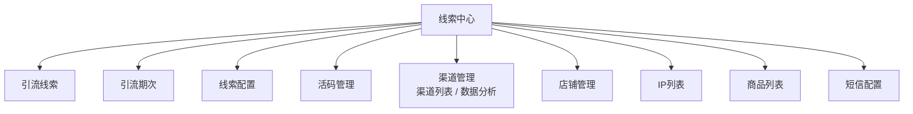

| 二级菜单 | 主要职责 | 优先级 |
|---|---|---|
| 引流线索 | 广告、活动、直播、落地页等引流线索及扩展字段；承载分配、改派和分配历史 | P0 |
| 引流期次 | 管理待开始、接量期、转化期、追单期和已停用阶段，支持批量生成、启停、引用校验和变更日志 | P0 |
| 线索配置 | 以规则中心分类管理活码分配和营期名单流转，支持条件组合、试算、冲突检测、发布停用和版本回退 | P0 |
| 活码管理 | 活码分组、新旧活码、接待员工、备用人员、企微标签、内部标签、创建人、营期和效果 | P0 |
| 渠道管理 | 渠道列表维护渠道、来源映射、归因口径和启停；数据分析页签展示接入、有效、分配、加微、转客户及成交分析 | P1 |
| 店铺管理 | 店铺、主体、应用、组织和线索来源映射 | P1 |
| IP列表 | 维护老师IP主档、IP大类与大类编码、带编号的归因渠道及关联商品/平台 | P1 |
| 商品列表 | 统一查看第三方商品、店铺归属、活码分配与关联IP | P1 |
| 短信配置 | 按商品与活码配置购买后、授权后及手动提醒策略 | P1 |

导入、同步、任务进度、失败下载和数据对账属于引流线索页面操作，不单独生成菜单。三方品线索沿用统一线索主模型及独立扩展字段，统一在 V1.5 开放菜单和页面能力。

本次恢复“IP列表”菜单并放在店铺管理之后，商品列表紧随IP列表；此前 V1.23 的“移除 IP 管理”仅作为历史决策保留，由 V1.28 起失效。

## 3. 核心业务流程

线索处理不是严格串行流程。线索落库后，分配、手机号解密、订单同步可以并行执行，例如来源已经提供明文手机号时，线索可能“已解密但仍待分配”。系统以各环节独立状态保存事实，再按优先级计算“当前待办状态”，不得通过一个线性状态字段覆盖其他事实。

本章同时提供业务讲解版、研发实现版和关键规则说明。对外讲解使用六段式流程；产品、业务和技术评审使用研发全景；实际开发必须结合并行状态、归因快照、异常补偿和版本边界执行。

### 3.1 端到端主流程

```mermaid
flowchart LR
    A["渠道/API/Webhook/文件导入"] --> B["建立接入任务"]
    B --> C["字段校验与标准化"]
    C --> D["幂等去重与来源归因"]
    D --> E["创建线索主档与来源快照"]

    E --> F1["分配处理"]
    E --> F2["身份与手机号处理"]
    E --> F3["订单同步处理"]

    F1 --> G1{"分配方式"}
    G1 --> G11["人工指定"]
    G1 --> G12["轮询"]
    G11 --> H1["负责人及员工活码"]
    G12 --> H1

    F2 --> G2{"是否已有可用手机号"}
    G2 -- "是" --> H2["标记已解密/无需解密"]
    G2 -- "否" --> I2["发起解密或导入结果"]
    I2 --> H2

    F3 --> G3["按来源单号同步订单"]
    G3 --> H3["保存订单及支付状态"]

    H1 --> J{"是否满足触达条件"}
    H2 --> J
    J -- "有负责人且有可触达身份" --> K["短信/活码/SOP触达"]
    J -- "条件不足" --> J1["保持相应待办并持续补偿"]
    K --> L["客户点击或扫码加微"]
    L --> M["企微/第三方事件回写"]
    M --> N["手机号或UnionID匹配客户"]
    N --> O{"身份是否冲突"}
    O -- "否" --> P["创建或关联唯一客户档案"]
    O -- "是" --> Q["阻断自动建档并生成撞单案件<br/>进入客户中心—撞单管理"]
    P --> R["发送并回收问卷"]
    R --> S["问卷完成与SABC定级"]
    S --> T["预约并完成测评"]
    T --> U["持续跟进与订单转化"]
    H3 --> U
    U --> V{"正式课转化规则是否命中"}
    V -- "是" --> W["转化状态=已转化"]
    V -- "否" --> X["转化状态=未转化"]

    C -. "字段异常" .-> Z["异常中心"]
    D -. "重复或幂等冲突" .-> Z
    I2 -. "解密失败" .-> Z
    G3 -. "订单同步失败" .-> Z
    M -. "事件无法关联" .-> Z
```

### 3.2 并行环节与状态更新

| 环节 | 触发条件 | 成功结果 | 失败或等待结果 | 是否阻塞其他环节 |
|---|---|---|---|---|
| 线索接入 | 接收API、Webhook或文件记录 | 创建线索、来源快照及幂等键 | 进入接入异常任务 | 只阻塞本条线索落库 |
| 分配 | 线索落库且符合分配范围 | 保存负责人、员工编号、活码和分配历史 | 保持待分配或记录分配失败 | 不阻塞解密、订单同步 |
| 解密 | 存在加密手机号或外部解密条件 | 保存解密结果及解密时间 | 未解密、解密中或解密失败 | 不阻塞分配、订单同步 |
| 订单同步 | 存在来源订单号或可查询身份 | 保存订单、商品、金额及支付状态 | 保存同步任务和失败原因 | 不阻塞分配、解密 |
| 触达 | 已有负责人且具备手机号、UnionID或可用活码 | 更新短信、点击和加微状态 | 保持对应待办或进入异常补偿 | 受分配和可触达身份约束 |
| 客户建档 | 已获得手机号或UnionID | 创建或关联唯一客户 | 手机号与UnionID命中不同客户时阻断并自动生成撞单案件 | 不直接改变转化状态；裁决完成后按结果恢复 |
| 问卷/测评 | 已建立可运营客户关系 | 独立更新问卷、测评状态 | 保持待填写或待测评 | 不覆盖其他环节状态 |
| 业务转化 | 正式课订单有效支付或命中已发布规则 | 转化状态改为已转化 | 保持未转化 | 不覆盖当前待办及环节事实 |

### 3.3 当前待办状态计算

当前待办状态用于告诉业务人员“下一步最需要处理什么”，由系统根据独立环节状态实时计算，不作为唯一业务事实保存。计算先判断终态，再采用“下游事实优先”防止状态倒退：

1. 已转化、无效或重复：无需处理；
2. 未转化且分配状态为待分配或分配失败：待分配；
3. 问卷已填写：测评未完成则待测评，测评已完成则已完成当前培育；
4. 已加微但问卷未完成：待填问卷，不再回退要求短信点击；
5. 尚未加微且解密状态为未解密、解密中或解密失败：待解密；
6. 已有可触达身份但短信未发送或发送失败：待触达；
7. 短信已发送未点击：待客户点击；
8. 短信已点击但尚未加微：待加微。

例如“已解密但未分配”的线索，其当前待办状态仍为“待分配”，同时保留“解密状态=已解密”“短信状态=未发送”“转化状态=未转化”；若客户已通过其他渠道完成加微，即使短信仍为“已发送未点击”，当前待办也应为“待填问卷”，不得倒退为“待客户点击”。

### 3.4 对外讲解版六段式流程

| 阶段 | 回答的问题 | 核心输出 |
|---|---|---|
| 线索接入 | 数据从哪里来，是否完整进入系统 | 订单编号、接入任务、来源记录、原始快照 |
| 数据治理 | 是否重复、是否有效、能否继续经营 | 线索标记、主重复关系、标准字段、异常记录 |
| 活码与分配 | 应由哪组人员接待，为什么分给该员工 | 匹配活码、负责人、组织、规则版本、分配历史 |
| 线索归因 | 这条线索属于哪个平台、店铺、商品、IP、营期和团队 | 完整归因链和不可覆盖的归因快照 |
| 培育与转化 | 客户走到了短信、加微、问卷、直播还是成交 | 独立过程状态、S/A/B/C等级、最终转化状态 |
| 数据复盘 | 哪个环节损失、哪个来源和团队产生结果 | 系统监控、过程漏斗、转化率、退款、GMV和下钻分析 |

### 3.5 研发流转全景与关键判断

```mermaid
flowchart LR
    S1["S1 来源接入<br/>API / Webhook / 文件 / 手工"] --> K1{"K1 接入数据是否合格"}
    K1 -- "否" --> EX["异常中心<br/>修复 / 重试 / 补录 / 对账"]
    K1 -- "是" --> S2["S2 清洗与幂等<br/>标准化 / 技术去重 / 业务查重"]
    S2 --> K2{"K2 是否有效或重复"}
    K2 -- "无效" --> INVALID["无效线索<br/>记录原因并停止自动经营"]
    K2 -- "重复" --> DUP["重复线索<br/>关联主线索并保留来源证据"]
    K2 -- "有效" --> MASTER["创建线索主档、来源快照和唯一编号"]

    MASTER --> ATTR1["基础归因<br/>来源 / 平台 / 店铺 / 商品 / IP / 营期"]
    MASTER --> P1["分配处理"]
    MASTER --> P2["手机号或身份处理"]
    MASTER --> P3["来源订单同步"]

    ATTR1 --> QR["匹配活码<br/>营期+IP+班级 → 通用活码"]
    QR --> K3{"K3 人工指定还是自动轮询"}
    K3 -- "人工指定" --> OWNER["保存负责人、组织、活码及人工原因"]
    K3 -- "自动轮询" --> K4{"K4 名单中是否存在可接待员工"}
    K4 -- "否" --> EX
    K4 -- "是" --> OWNER

    P2 --> K5{"K5 是否已有明文手机号或UnionID"}
    K5 -- "是" --> IDREADY["身份可触达"]
    K5 -- "否" --> DECRYPT["按权限主动解密或补录"]
    DECRYPT --> K6{"K6 解密是否成功"}
    K6 -- "否" --> EX
    K6 -- "是" --> IDREADY

    P3 --> ORDER["保存订单、商品、金额、支付和退款事实"]
    OWNER --> READY{"K7 负责人和可触达身份是否齐备"}
    IDREADY --> READY
    READY -- "否" --> WAIT["按优先级计算当前待办并持续补偿"]
    READY -- "是" --> TOUCH["短信 / 员工活码 / SOP触达"]
    TOUCH --> WECOM["扫码或企微事件回写"]
    WECOM --> MATCH{"K8 手机号或UnionID是否唯一命中"}
    MATCH -- "冲突" --> EX
    MATCH -- "新身份" --> CUSTOMER["创建唯一客户档案"]
    MATCH -- "存量身份" --> CUSTOMER["关联存量客户，不重复建档"]

    CUSTOMER --> ATTR2["补齐归因快照<br/>客户 / 负责人 / 公司 / 部门 / 小组"]
    ATTR2 --> QUESTION["问卷提交与解析"]
    QUESTION --> GRADE["版本化规则计算S/A/B/C<br/>人工等级优先"]
    GRADE --> LIVE["预约 / 到课 / 完课"]
    LIVE --> CONVERT{"正式课有效支付是否命中转化规则"}
    ORDER --> CONVERT
    CONVERT -- "是" --> DONE["转化状态=已转化"]
    CONVERT -- "否" --> CULTIVATE["转化状态=未转化，继续培育"]
    DONE --> REFUND{"是否发生满足回退规则的退款"}
    REFUND -- "是" --> CULTIVATE
    REFUND -- "否" --> RESULT["保留已转化"]

    EX --> RETRY{"修复后是否允许幂等重放"}
    RETRY -- "是" --> S2
    RETRY -- "否" --> MANUAL["人工结案并保留完整证据"]
```

| 判断点 | 产品规则 | 研发约束 |
|---|---|---|
| K1 接入合格 | 来源、必要标识和字段格式通过校验 | 不合格数据不得静默丢弃；保存失败任务和原始摘要 |
| K2 有效/重复 | 有效、无效、重复属于线索标记 | 技术幂等与业务重复分开处理；重复数据关联主线索 |
| K3 分配方式 | 仅人工指定和自动轮询 | 人工指定不受名单和容量限制；自动轮询受活码名单、在职启用和上限约束 |
| K4 可接待员工 | 名单内至少有一人在职、启用、活码有效且未满额 | 无人可分保持待分配并进入异常，不得伪造成功 |
| K5 可用身份 | 明文手机号、UnionID或平台允许的合法解密条件 | 解密与分配可并行，允许“已解密未分配” |
| K7 触达条件 | 有负责人且有可触达身份 | 当前待办只做计算，不覆盖独立事实状态 |
| K8 客户唯一性 | 手机号或UnionID唯一匹配 | 跨档案冲突时阻断自动建档，由V1.0撞单管理承接裁决 |
| 转化判断 | 正式课有效支付命中已发布规则 | 转客户、加微、问卷和完课均不等于最终已转化 |
| 退款回退 | 按订单类型、退款时间和规则版本判断 | 重算形成新历史，不覆盖原成交和退款事实 |

### 3.6 两阶段归因与关系表

线索归因分两阶段完成：创建线索时先完成平台、店铺、商品、IP和营期等基础归因，分配和转客户后再补齐负责人、组织及客户。每次归因均保存规则版本和当时名称快照，基础配置后续变更不得改写历史。

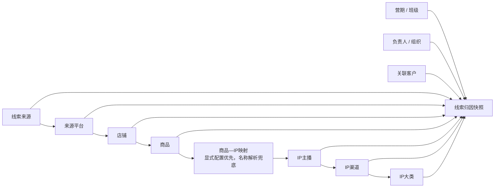

| 层级 | 归因对象 | 稳定标识 | 取得方式 | 历史处理 |
|---:|---|---|---|---|
| 1 | 线索来源 | `source_code` | 接入接口、导入批次或人工选择 | 保存接入时快照 |
| 2 | 来源平台 | `platform_code` | 来源映射 | 平台改名不改历史编码 |
| 3 | 店铺 | 内部店铺ID + 第三方店铺ID | 店铺配置及平台授权 | 保留当时店铺名称快照 |
| 4 | 商品 | 内部商品ID + 第三方商品ID | 订单或线索商品映射 | 显式ID映射优先 |
| 5 | IP主播 | IP编号 | 商品—IP配置；名称解析仅兜底 | 多义或未命中进入归因异常 |
| 6 | IP渠道 | 渠道编号 | IP配置 | 例如阿留→阿留专属，皮皮老师→店播 |
| 7 | IP大类 | 字典项值 | IP配置中的IP大类 | 从字典读取，不使用自由文本 |
| 8 | 引流期次/直播组 | 期次ID、直播组ID | 引流期次、商品规则、订单或人工补充 | 两个维度独立保存；变更保留历史，不改接入快照 |
| 9 | 负责人/组织 | 员工ID、员工编号、组织ID | 分配结果 | 改派新增关系，不覆盖历史负责人 |
| 10 | 关联客户 | 客户编号 | 手机号或UnionID唯一匹配 | 冲突阻断并记录异常 |

推荐链路示例：`抖音直播 → 抖店 → 阿留教育规划3天精华课 → IP阿留 → 阿留专属渠道 → 教育规划大类`。商品名称解析只用于无法取得显式映射的兜底场景，名称多义或未命中必须进入异常中心补齐后重算。

### 3.7 指标体系与统一统计口径

| 指标层 | 解决的问题 | 核心指标 | 统一口径 |
|---|---|---|---|
| 系统处理监控 | 系统有没有正确处理线索 | 接入数、清洗成功率、有效/无效/重复数、解密成功率、分配成功率、平均处理时长、异常数 | 按接入幂等结果对应的内部记录去重，页面以订单编号识别 |
| 过程转化指标 | 线索在哪个经营环节损失 | 短信送达率、加微率、问卷填写率、预约率、到课率、完课率 | 当前环节去重人数÷上一环节去重人数 |
| 结果经营指标 | 最终产生了多少业务结果 | 成交数、转化率、退款数、退款率、最终转化率、GMV、净GMV | 以有效线索为统一起点 |

默认采用“线索接入时间队列口径”：选择某一时段进入系统的线索并持续追踪其后续结果。页面可切换“业务发生时间口径”查看特定时段实际发生的加微、预约、成交和退款，但两种口径不得混算。所有指标支持按来源、平台、店铺、商品、IP、IP渠道、IP大类、引流期次、直播组、组织和负责人下钻，并展示指标口径版本。

### 3.8 讲解口径

**对外讲解（约1分钟）**

合数BOSS先将人工导入和各平台自动产生的线索统一接入，通过清洗、去重和有效性判断建立唯一线索；再根据营期、IP和班级匹配活码与接待员工，并把平台、店铺、商品、IP、负责人和组织固化为完整归因链。运营过程中持续记录短信、加微、问卷、预约、到课、完课和正式课成交，最终既能看到每个环节的转化损耗，也能按平台、店铺、商品、IP、营期和团队复盘最终转化率。

**内部评审（约5分钟）**

1. 接入层解决数据有没有进入、是否重复进入；
2. 清洗层解决数据是否可经营、是否已有主线索；
3. 基础归因先解析平台、店铺、商品、IP和营期，为活码匹配提供条件；
4. 分配层按精确优先级匹配活码，自动轮询受名单与容量约束，人工指定作为有审计的例外通道；
5. 分配及建档后补齐负责人、组织和客户，形成不可被配置变化改写的归因快照；
6. 培育过程以独立事实状态记录短信、加微、问卷、预约、到课和完课，避免异步事件互相覆盖；
7. 问卷产生S/A/B/C等级，但最终已转化仍由正式课成交规则判定；
8. 数据分析分为系统处理、过程转化和结果经营三层，并统一时间、分母、去重和退款回退口径。

## 4. 通用页面与交互

- 列表采用“标题、筛选、主要操作、表格、分页”结构；
- 引流线索和首页—线索概览页面筛选区顶部统一展示当前员工由数据岗位及特别授权计算出的有效范围，并提供“全部授权数据/我的数据、归属组织、当前线索负责人”筛选；归属组织采用公司—部门—小组级联树，支持搜索、选择任一层级并自动包含其下级组织；业务角色只决定线索页面和操作是否可用；
- 归属组织和负责人候选项只能来自当前用户已授权范围，筛选不得扩大数据权限。普通员工仅能查询本人，小组负责人可查询其负责小组，部门负责人可查询部门直属员工及下属小组，公司管理者及显式授权中台可查询当前公司；
- 归属组织变化后负责人候选项同步缩小；负责人支持姓名和员工编号搜索；员工在职、停用及离职状态统一在员工管理处理，不作为业务列表筛选项；存量线索如需改派，由有权限人员在线索页面操作；
- 常用搜索展示综合关键词、当前待办状态、线索标记和转化状态；更多条件包含分配、解密、短信、加微、问卷、测评、跟进和订单等独立状态，以及来源、添加方式、负责人、所属期次、直播组、店铺和“日期类型 + 日期区间”；所属期次与所属直播组均支持下拉选择并可输入名称搜索，两者为独立业务维度；
- 手机号等敏感字段按权限脱敏，明文查看必须单独授权并审计；
- 详情采用抽屉或独立页面，展示基础信息、扩展信息、来源、分配、活码、跟进、加微和异常时间轴；
- 标记无效/重复、标记已挖需、分配、改派、短信提醒、备注、导入解密数据和导出非解密数据按按钮权限控制；引流线索页不提供人工新增、编辑线索、添加跟进或人工变更线索等级入口；
- 导入/同步使用任务抽屉展示总数、成功、重复、失败、进度和失败原因；
- 批量操作显示影响数量，返回逐条成功与失败结果；
- 列表加载失败与空数据严格区分，失败保留筛选条件并允许重试。
- 每行操作固定为“详情、旅程、更多”；旅程以时间轴展示线索接入、解密、分配/改派、加微、问卷、测评、客户建档、状态/标记变化、订单同步、转化和退款回退，日志只追加不可删除；“确认加微”不作为人工操作，加微状态由企业微信事件或数据同步回写。
- 列表上方提供“批量操作”，承载分配、变更期次、同步订单、短信群发、导入解密数据和导出非解密数据；分配、变更期次与短信群发处理已勾选线索，同步订单为不依赖列表勾选数据的全局后台任务，导入解密数据按模板内容处理，导出非解密数据按当前查询结果处理；不提供同步手机号和查询异常订单入口。
- 列表上方仅展示设置图标作为“表格设置”入口，允许用户选择展示字段并自动记忆；订单编号、线索来源、操作为不可取消的固定展示列，其他字段可显示、隐藏或恢复默认。

## 5. 功能详细需求

### 5.1 引流线索

页面路由为 `/leads/drainage`。本节直接包含引流线索的页面跳转、全部交互、字段、状态、权限、接口、原型截图和验收要求，不再引用独立页面规格文档。文内截图来自可运行原型并作为页面视觉参考；若历史截图中的字段或按钮与本版文字规则冲突，以 V1.38 文字规则及当前可运行原型为准，历史截图中的线索编号不再展示。

#### 5.1.1 页面目标与入口

引流线索页面统一承接广告、直播、活动、落地页、自有系统等来源线索的查询、批量处理、单条维护、客户建档和全过程追溯。页面应能回答线索从哪里来、由谁负责、当前优先处理什么、各业务环节分别处于什么状态、是否有效或重复、是否转化、关联哪个订单与客户，以及每次变化由谁在何时触发。

| 编号 | 当前页面/状态 | 触发入口 | 目标页面/状态 | 展示方式 |
|---|---|---|---|---|
| P01 | 线索中心 | 左侧“引流线索” | 引流线索列表 | 页签页面 |
| P02 | 列表主页面 | 更多条件 | 高级搜索区展开 | 原页面展开 |
| P03 | 高级搜索区 | 所属直播组 | 可输入搜索的直播组候选项 | 下拉层 |
| P03-1 | 高级搜索区 | 所属期次 | 可输入搜索的引流期次候选项 | 下拉层 |
| P04 | 高级搜索区 | 日期类型 | 多种业务日期候选项 | 下拉层 |
| P05 | 列表主页面 | 批量操作 | 批量操作一级菜单 | 下拉层 |
| P06 | 批量操作菜单 | 选择具体操作 | 类型和范围确认 | 模态弹窗 |
| P07 | 列表主页面 | 设置图标 | 表格字段设置 | 浮层 |
| P08 | 批量操作菜单 | 导入解密数据 | 模板下载、文件上传和校验预览 | 模态弹窗 |
| P09 | 单条线索 | 详情 | 线索详情 | 右侧抽屉 |
| P10 | 单条线索 | 旅程 | 线索生命旅程 | 右侧抽屉 |
| P11 | 单条线索 | 更多 | 单条业务操作 | 下拉层 |

首次进入时创建“线索中心 · 引流线索”页签，重复点击激活已有页签。弹窗、抽屉和浮层不新增页签；关闭后保留查询条件、滚动位置和勾选状态。刷新后恢复表格字段偏好，但不恢复临时勾选数据。

#### 5.1.2 列表主页面

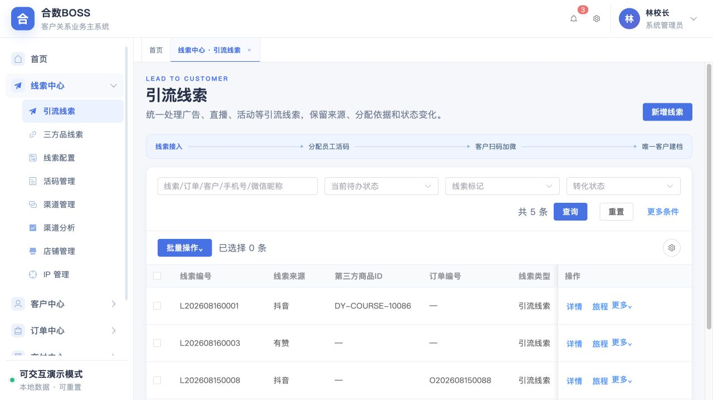

- 页面依次展示标题、核心闭环提示、搜索区、列表工具栏、数据表格和分页；不展示“新增线索”；
- 搜索区默认展示客户维度切换搜索、订单编号、商品维度切换搜索、线索标签、线索标记和转化状态；
- 工具栏展示批量操作、已选择数量及表格设置图标；
- 表格左侧固定复选框、订单编号和线索来源，右侧固定操作列；订单编号是第一业务列；
- 行操作固定展示“详情、旅程、更多”；
- 页面加载、空数据、加载失败和无权限分别展示，不得共用同一提示。

#### 5.1.3 搜索与查询

| 搜索项 | 控件 | 查询规则 |
|---|---|---|
| 数据视图 | 单选下拉 | 全部授权数据、我的数据；“全部”始终指权限边界内全部，不代表全库 |
| 归属组织 | 可搜索组织树 | 公司、部门、小组级联选择；选中上级时包含下级，候选组织必须先经过数据权限裁剪 |
| 当前线索负责人 | 可搜索下拉 | 仅展示所选组织范围内员工，支持姓名或员工编号搜索 |
| 客户信息 | 下拉维度 + 可清空输入框 | 下拉固定为“客户手机号、客户名称/微信昵称”；手机号同时模糊匹配当前、解密前和解密后手机号，名称维度同时模糊匹配客户名称、线索客户称呼和微信昵称；默认选择客户手机号 |
| 订单编号 | 可清空输入框 | 仅模糊匹配订单编号，不与客户或商品字段混合搜索 |
| 商品信息 | 下拉维度 + 可清空输入框 | 下拉固定为“商品名称、商品ID”；按当前选择的单一维度模糊匹配，默认选择商品名称 |
| 线索标签 | 按钮 + 多选弹窗 | 仅引流线索展示；点击后支持标签名称搜索，按系统、企业微信来源分组，多选、移除、清空和确认；按钮展示已选数量，多个标签按 OR 关系命中任意一个 |
| 当前待办状态 | 单选下拉 | 精确匹配待分配、待解密、待触达、待客户点击、待加微、待填问卷、待测评、已完成培育或无需处理 |
| 线索标记 | 单选下拉 | 有效线索、无效线索、重复线索 |
| 转化状态 | 单选下拉 | 未转化、已转化 |

点击“查询”按全部条件组合查询；点击“重置”同时清空常用条件、标签选择和更多条件，并将客户筛选恢复为“客户手机号”、商品筛选恢复为“商品名称”、日期类型恢复为线索创建时间。查询必须先经过数据权限过滤，再进行字段脱敏。

业务列表按线索当前负责人和当前责任组织筛选；数据分析按事件发生时保存的负责人及组织快照统计。员工调岗、组织调整或线索改派不得重写已经发生的历史业绩和转化指标。

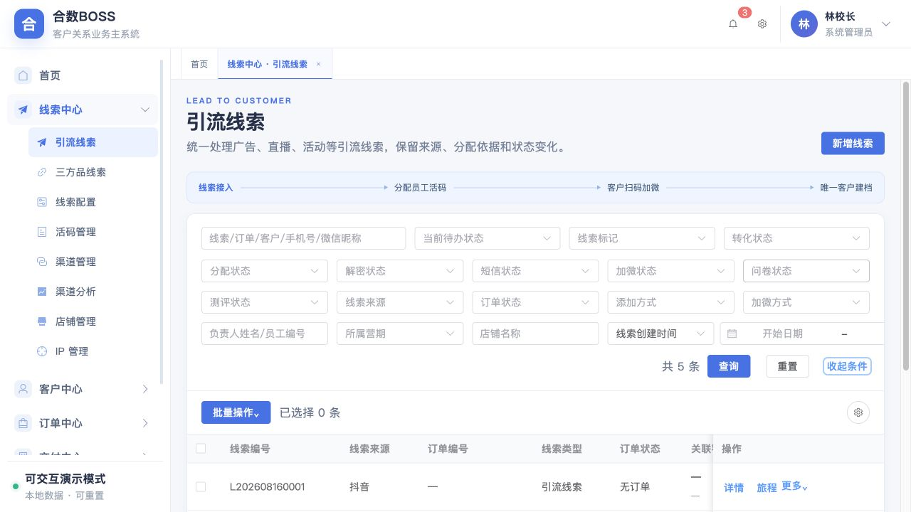

- 点击“更多条件”展开分配、解密、短信、加微、问卷、测评、跟进和订单状态，以及线索来源、添加方式、负责人、所属期次、所属直播组、店铺名称及业务日期；各环节状态可以组合查询；
- 再次点击“收起条件”只收起区域，不清空已选条件；
- 负责人支持姓名或员工编号模糊查询，店铺名称支持模糊查询；
- 当前结果数量必须来自本次查询，不得使用全库总量代替。

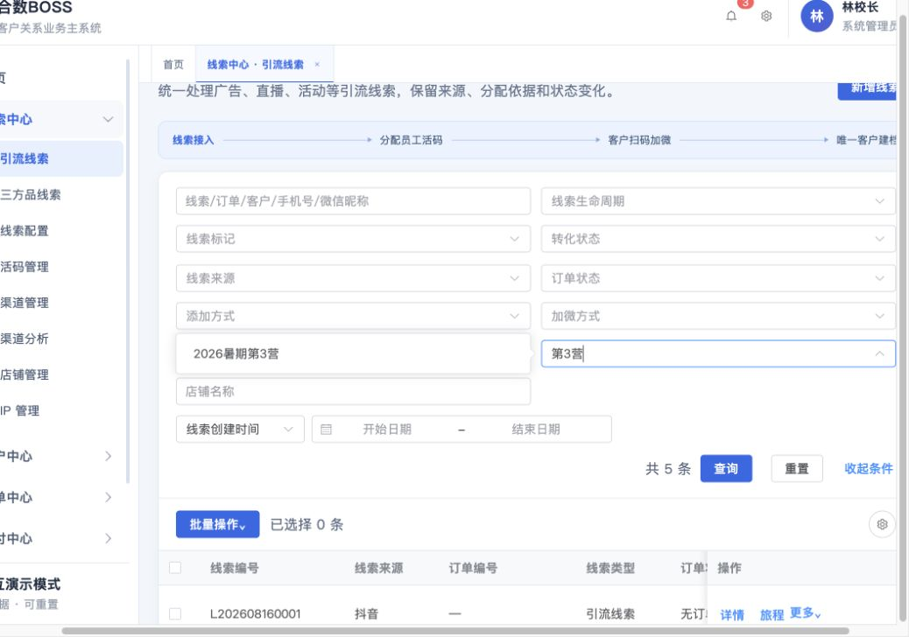

- 所属直播组既可下拉选择，也可输入名称、年份、期数等关键词过滤；
- 候选项展示有效直播组及仍被历史数据引用的直播组；
- 查询使用直播组ID，页面展示直播组名称，避免重名误匹配。为兼容现有接口和存量数据，V1.0 可继续沿用 `camp_id/camp_name` 技术字段，但前端与业务文档统一展示为“所属直播组”。

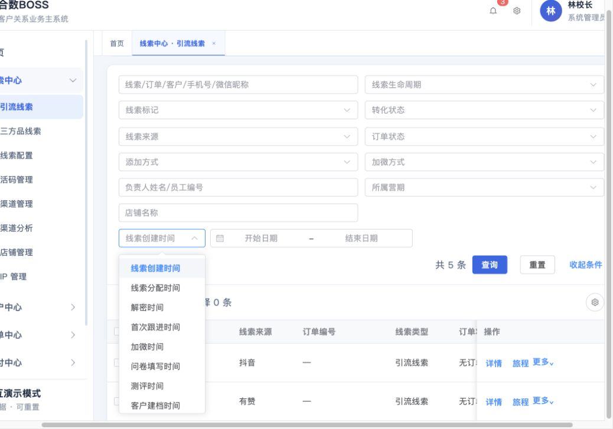

日期筛选由“日期类型 + 开始日期 + 结束日期”组成，支持线索创建、线索分配、解密、首次跟进、加微、问卷填写、测评、客户建档、转化和售后时间。查询采用起止日闭区间，目标日期为空的记录不命中，开始日期不得晚于结束日期。

#### 5.1.4 批量操作

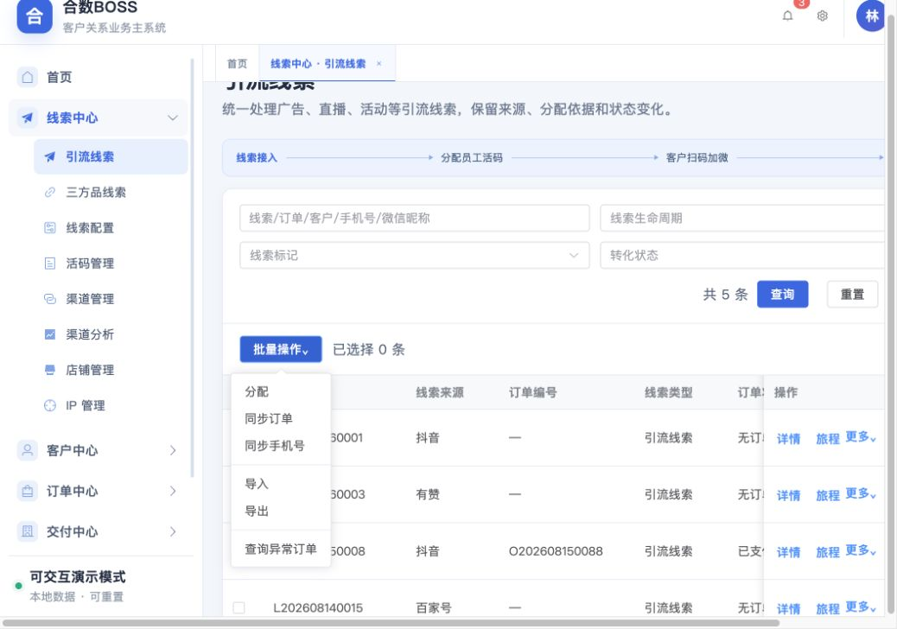

| 一级操作 | 作用范围 | 具体类型/配置 | 关键规则 |
|---|---|---|---|
| 分配 | 已勾选线索 | 人工指定、轮询分配 | 仅处理待分配线索；人工指定通过组织架构选择员工；轮询按最新启用引流期次的活码人员名单执行 |
| 变更期次 | 已勾选线索 | 独立勾选变更期次、变更直播组，至少选择一项 | 可只变期次、只变直播组或两者同时变更；未勾选维度保持原值；逐条记录变更前后值 |
| 同步订单 | 全局任务，无需勾选线索 | 多选抖店、百家号、有赞、小鹅通、小红书、快手、视频号等已接入平台 | 不读取当前列表勾选结果；按用户勾选平台的先后顺序为每个平台创建独立后台任务；平台内按来源系统和外部订单号幂等执行 |
| 短信群发 | 已勾选线索 | 选择已审核启用的签名与模板，预览发送内容 | 校验有效手机号、退订和黑名单；异步发送并记录供应商回执、成功/失败及费用 |
| 导入解密数据 | 导入文件 | 固定模板仅包含订单编号、手机号 | 只匹配并覆盖既有引流线索手机号，不创建线索，不修改其他业务字段 |
| 导出非解密数据 | 当前查询结果 | 强制筛选解密状态为未解密且订单编号不为空 | 导出待第三方解密的订单清单，手机号仅输出掩码值 |

分配、同步订单、短信群发、导入解密数据和导出非解密数据属于整体数据能力，只能从列表工具栏进入，不出现在单条线索“更多”中。原“同步手机号”和“查询异常订单”在引流线索页下线。

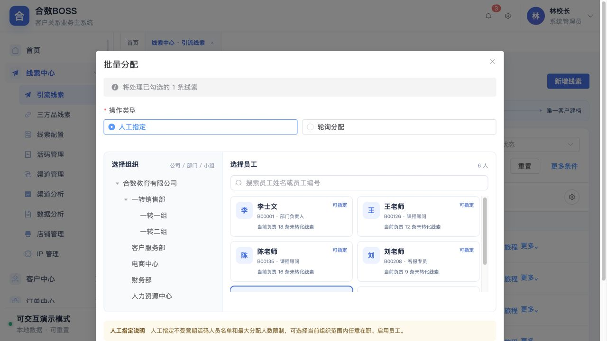

- 弹窗明确影响范围及预计数量，选择具体操作类型后才可确认；同步订单弹窗明确提示“无需勾选线索”，不得显示或使用已勾选线索数量；
- 人工指定先在左侧选择公司、部门或小组，再从右侧员工列表选择接收人；员工列表上方提供“搜索员工姓名或员工编号”输入框，在当前所选组织及其下级组织范围内实时筛选；员工卡片展示员工编号、岗位和当前负责的未转化线索数；人工指定不受引流期次活码人员名单和最大分配人数限制；
- 轮询分配展示“根据最新启用引流期次配置的活码人员名单轮询分配”，并展示本次采用的期次及当前可参与轮询人数；
- 原“员工负载分配”入口删除；人数上限只在活码人员配置中维护，并且仅用于轮询分配资格判断；人工指定不校验该上限；
- 同步订单入口无论当前是否勾选线索均可打开；弹窗允许多选平台，平台卡片按用户点击顺序显示 1、2、3……序号；确认后依该顺序创建全局后台任务。每个平台任务独立保存任务号、序号、进度、成功数、失败数和失败原因，前一平台失败不阻断后续平台，失败任务可单独重试；
- 短信群发只对已勾选线索生效，必须选择审核通过且启用的模板；发送前排除无有效手机号、退订、黑名单及无权限数据，任务记录签名、模板版本、内容快照、接收数量、供应商回执、费用与失败原因；
- 确认后生成任务编号，保存发起人、查询快照、勾选ID、类型、时间及成功/重复/失败统计；
- 支持查看进度、失败重试及失败明细下载；
- 取消只关闭弹窗，不改变列表数据和勾选状态。

#### 5.1.5 表格字段设置

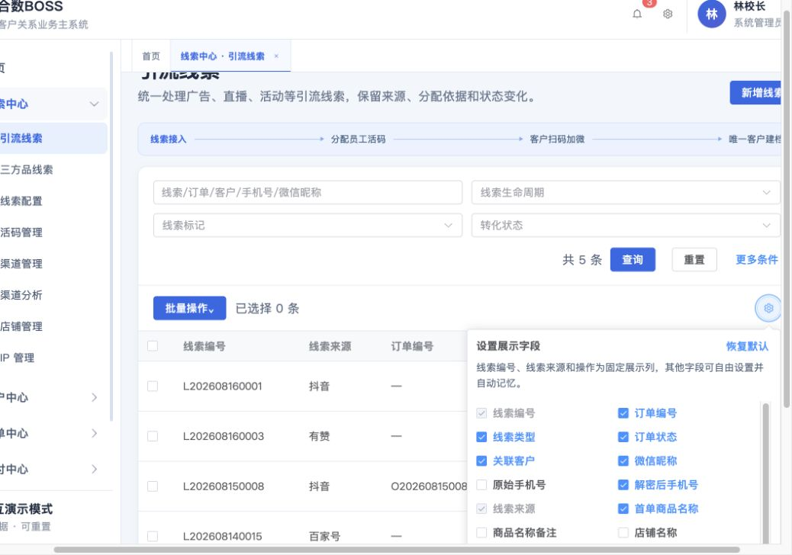

- 工具栏只展示设置图标，悬浮提示“表格设置”；
- 用户可即时勾选或取消展示字段；
- 订单编号、线索来源、操作为固定列，不允许取消；订单编号始终位于第一业务列；
- 引流线索默认展示“IP大类”和“线索标签”字段；两者均可通过字段设置隐藏，三方品线索不展示这两个引流归因字段；
- “恢复默认”恢复产品定义的默认字段；
- 设置按“用户ID + 页面编码”记忆，重新进入或登录后恢复；
- 隐藏字段只影响页面展示，不改变权限、导出和后端数据。

#### 5.1.6 列表字段

| 分组 | 字段名称 | 字段编码 | 类型 | 默认展示及说明 |
|---|---|---|---|---|
| 固定 | 订单编号 | `order_no` | varchar(64) | 第一业务列并固定左侧；展示本次引流关联订单编号，无订单显示“—” |
| 固定 | 线索来源 | `lead_source` | varchar(64) | 固定左侧；抖音、有赞、小鹅通等 |
| 固定 | 操作 | — | — | 固定右侧；详情、旅程、更多 |
| 商品 | 第三方商品ID | `third_party_product_id` | varchar(128) | 默认展示在线索来源之后；保留来源平台原始商品ID，无值显示“—” |
| 归因 | IP大类 | `ip_category` | varchar(64) | 仅引流线索默认展示；按线索归因快照中的稳定大类编码读取 `ip_category` 字典中文名称，历史数据不随字典名称调整而改写归因 |
| 标识 | 线索类型 | `source_type` | enum | 引流线索、三方品线索、转介绍 |
| 订单 | 订单状态 | `order_status` | enum | 无订单、未支付、已支付、退款中、已退款 |
| 客户 | 关联客户 | `customer_id/customer_no/customer_name` | bigint/varchar | 展示名称与编号，可进入客户档案 |
| 客户 | 微信昵称 | `wechat_nickname` | varchar(128) | 默认展示 |
| 标签 | 线索标签 | `lead_tags` | array | 仅引流线索默认展示；最多展示2个标签及“+N”，标签关系归属于当前线索 |
| 身份 | 原始手机号 | `original_mobile` | varchar(32) | 默认脱敏，保存来源快照，不允许覆盖 |
| 身份 | 解密后手机号 | `decrypted_mobile` | varchar(32) | 默认展示脱敏值；明文查看需授权和审计 |
| 商品 | 首单商品名称 | `first_product_name` | varchar(128) | 默认展示 |
| 商品 | 商品名称备注 | `product_remark` | varchar(255) | 商品别名、活动或来源补充 |
| 商品 | 店铺名称 | `shop_name` | varchar(128) | 根据来源店铺映射 |
| 订单 | 实付金额 | `paid_amount` | decimal(12,2) | 单位为元；零金额显示“—” |
| 归属 | 当前负责人/员工编号 | `owner_name/owner_employee_no` | varchar | 默认展示；历史变化写旅程日志 |
| 状态 | 当前待办状态 | `current_action_status` | derived | 默认展示；根据各独立状态按优先级实时计算 |
| 状态 | 分配状态 | `assignment_status` | enum | 待分配、已分配、分配失败、已改派 |
| 状态 | 解密状态 | `decrypt_status` | enum | 无需解密、未解密、解密中、已解密、解密失败 |
| 状态 | 短信状态 | `sms_status` | enum | 未发送、发送中、已发送未点击、已点击、发送失败 |
| 状态 | 加微状态 | `wechat_status` | enum | 否、已加企微、已加个微 |
| 状态 | 问卷状态 | `questionnaire_status` | enum | 未发送、已发送未填写、已填写 |
| 状态 | 测评状态 | `assessment_status` | enum | 未预约、已预约未测评、已测评 |
| 状态 | 线索标记 | `lead_mark` | enum | 有效、无效、重复 |
| 状态 | 转化状态 | `conversion_status` | enum | 未转化、已转化 |
| 状态 | 跟进状态 | `follow_status` | enum | 未跟进、跟进中、已跟进 |
| 过程 | 是否挖需 | `demand_mined` | boolean | 默认否；未挖需时可直接勾选，确认后变为已挖需并锁定，不允许从列表取消 |
| 过程 | 挖需标记时间 | `demand_mined_at` | datetime | 首次标记已挖需的时间，只写一次 |
| 过程 | 挖需标记人 | `demand_mined_by` | varchar(64) | 首次标记操作人的姓名与员工编号快照 |
| 时间 | 首次跟进时间 | `first_follow_at` | datetime | 首条有效跟进发生时间，只写一次 |
| 时间 | 线索创建时间 | `created_at` | datetime | 默认展示；进入合数BOSS时间 |
| 时间 | 线索分配时间 | `assigned_at` | datetime | 最近一次成功分配时间 |
| 时间 | 加微时间 | `wechat_added_at` | datetime | 默认展示；企微/个微确认添加时间 |
| 时间 | 解密时间 | `decrypted_at` | datetime | 首次成功解密时间 |
| 时间 | 问卷填写时间 | `questionnaire_at` | datetime | 首次提交有效问卷时间 |
| 时间 | 测评时间 | `assessment_at` | datetime | 首次完成有效测评时间 |
| 时间 | 客户建档时间 | `customer_linked_at` | datetime | 首次关联唯一客户，不代表成交 |
| 时间 | 已转化时间 | `converted_at` | datetime | 正式课有效支付时间 |
| 时间 | 售后时间 | `after_sale_at` | datetime | 首次退款或售后事件时间 |
| 来源 | 添加方式 | `entry_method` | enum | 渠道、公域、导入、合作推送、转介绍 |
| 来源 | 加微方式 | `wechat_method` | enum | 企业微信、个人微信 |
| 业务 | 所属期次 | `period_id/period_name` | bigint/varchar | 默认展示；保存引流期次ID和名称快照；与所属直播组为两个独立业务维度 |
| 业务 | 所属直播组 | `camp_id/camp_name` | bigint/varchar | 默认展示；保存直播组ID和名称快照；V1.0沿用原技术字段兼容存量数据 |
| 触达 | 短信发送次数 | `sms_send_count` | int | 成功提交供应商的次数 |
| 备注 | 线索备注 | `remark` | varchar(500) | 默认展示；超长省略并可查看全文 |

时间统一显示为 `YYYY-MM-DD HH:mm:ss`。手机号和UnionID等敏感字段必须同时受到字段权限、脱敏和审计约束。

点击线索标签区域打开全部标签弹窗，按企业微信、系统两个来源分组展示；两类标签均只读，不提供新增、编辑或删除操作。线索转客户不得覆盖原线索标签关系及来源记录。

第三方商品ID按字符串保存，不转换为数值，避免长整型截断、前导零丢失或平台字母前缀被移除。该字段只在同一来源平台内具有业务含义，对账和匹配使用“线索来源/平台编码 + 第三方商品ID”的组合，不得把第三方商品ID单独作为合数BOSS商品或线索的全局唯一键。

#### 5.1.7 导入解密数据与导出非解密数据

引流线索由平台接口、Webhook、同步任务或受控数据接入形成，列表页不允许人工新增。业务人员需要补回第三方已解密手机号时，从“批量操作—导入解密数据”进入固定模板流程。

**导入模板与校验**

| 模板列 | 必填 | 格式与用途 |
|---|---|---|
| 订单编号 | 是 | 字符串原样保存，用于精确匹配已存在的引流线索 `order_no` |
| 手机号 | 是 | 中国大陆11位手机号；用于覆盖命中线索的手机号及解密后手机号 |

- 页面提供“下载固定模板”，模板列名、顺序和含义受版本控制；V1.0支持CSV，单批最多5000行；
- 上传后先完成空值、手机号格式、同文件订单编号重复校验，并展示前5条脱敏预览；有格式错误时禁止提交；
- 订单编号必须精确命中一条已存在的引流线索。未命中返回 `ORDER_NOT_FOUND`，命中多条返回 `ORDER_NOT_UNIQUE`，同一文件重复返回 `DUPLICATE_IN_FILE`；这些记录均不得覆盖；
- 成功记录仅更新 `mobile`、`decrypted_mobile`、`decrypt_status=DECRYPTED` 和首次 `decrypted_at`。不得新增线索，不得改变订单编号、内部记录主键、来源、归因、负责人、组织、营期、客户或转化状态；
- 重复导入同一订单只更新原线索，不产生重复记录；首次解密时间已存在时保持不变；
- 每条成功覆盖写入线索旅程，批次保存操作人、文件名、模板版本、总数、成功数、失败数和失败原因。失败明细可下载，原始完整手机号不得写入失败文件、普通日志或消息。

**导出非解密数据**

- 从“批量操作—导出非解密数据”发起，不依赖行勾选；
- 以当前列表全部查询条件及当前用户数据权限为快照，再强制增加 `decrypt_status=PENDING` 且订单编号不为空；
- 导出列为订单编号、线索来源、店铺名称、原始手机号掩码和解密状态；不得导出线索编号或完整手机号；
- 当前结果无符合条件数据时不生成空文件，并提示“当前列表中没有待解密线索订单”；
- 导出任务记录发起人、筛选快照、导出数量和时间，保证页面数量与文件数量可核对。

#### 5.1.8 详情、旅程和单条操作

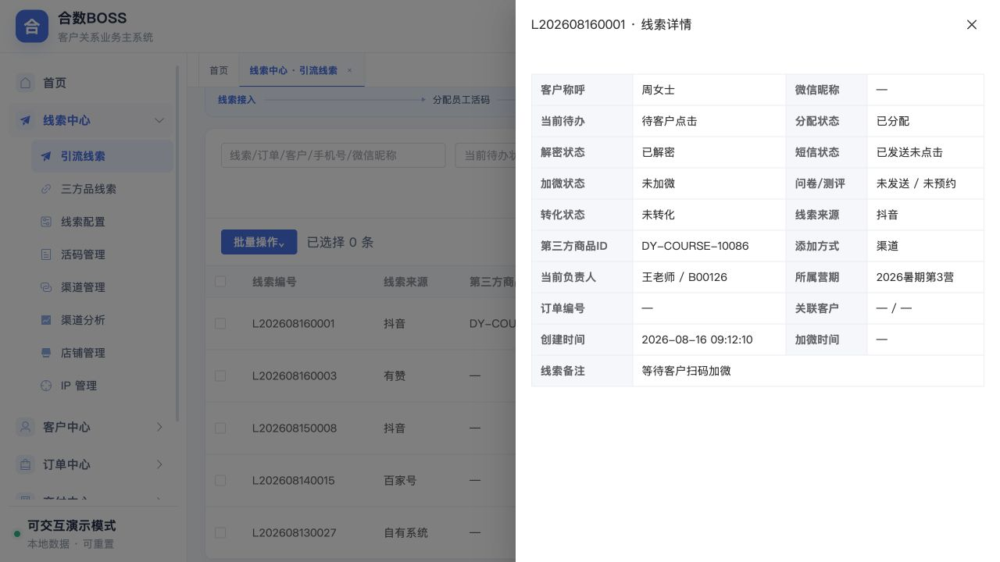

- 详情从右侧打开，不改变列表条件和页签；
- 展示客户称呼、微信昵称、当前待办状态、各环节独立状态、转化状态、来源、添加方式、负责人、员工编号、所属期次、所属直播组、订单、客户、关键时间及备注；
- 敏感字段按权限展示；
- 客户编号和订单编号存在时，可分别在多页签框架打开客户档案和订单详情；
- 关闭后回到原列表位置。

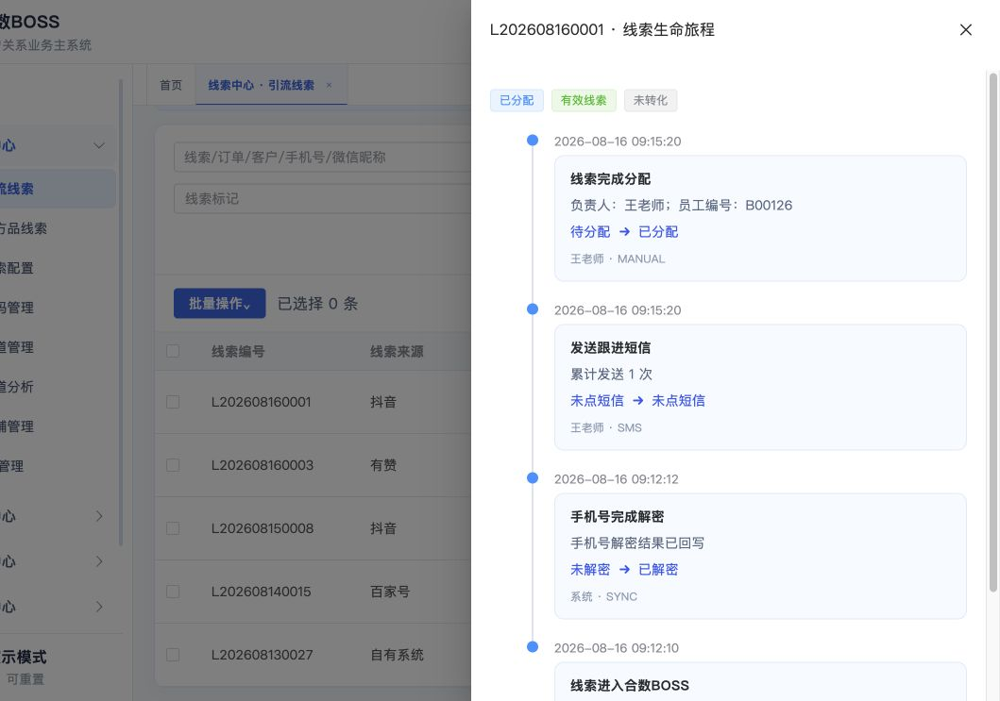

- 顶部展示当前待办状态、分配/解密/短信/加微/问卷/测评状态、线索标记和转化状态；
- 时间轴倒序展示接入、清洗、解密、分配/改派、触达、加微、问卷、测评、客户建档、状态/标记变化、订单同步、转化和退款回退；
- 每个事件展示事件名称、业务说明、变更前后值、操作人、员工编号、操作来源和时间；
- 日志只追加，不允许物理修改或删除，并通过traceId关联审计日志；
- 系统回调、人工操作、批量任务及异常补偿使用不同来源标识。

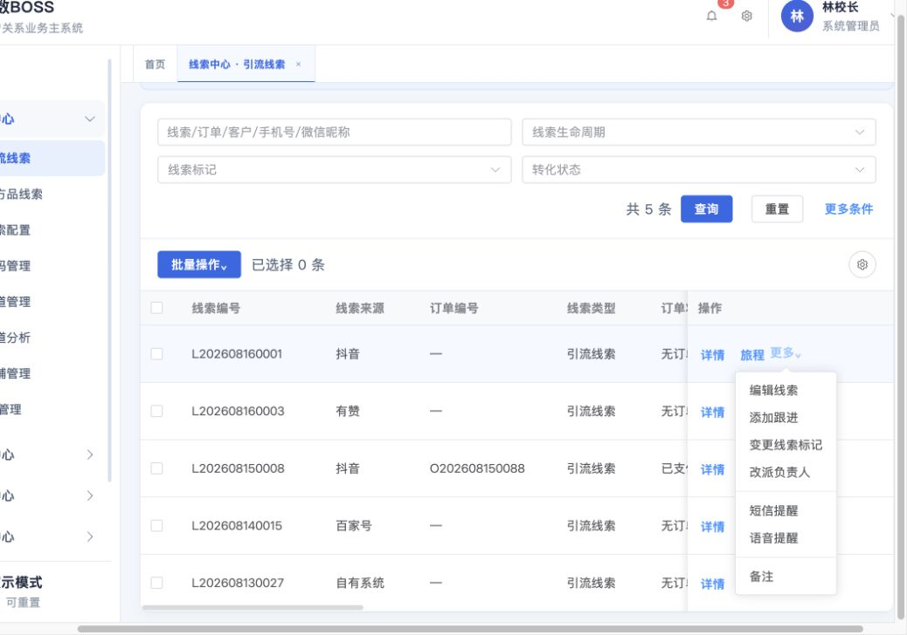

| 操作 | 显示条件 | 功能说明 |
|---|---|---|
| 建立客户档案 | 已加微至已测评且未关联客户 | 使用手机号或UnionID匹配唯一客户；跨档案冲突时阻断并自动生成撞单案件 |
| 变更手机号 | 有手机号变更权限 | 输入新手机号并先行校验；未占用可直接变更，已占用禁止直接覆盖，同一一转负责人时可人工确认合并档案 |
| 修改加微状态 | 引流线索且有加微状态修正权限 | 回显当前状态，可改为“否、已加企微、已加个微”；提交后刷新列表并写入线索旅程与审计日志 |
| 变更期次 | 有期次变更权限 | 可独立选择变更引流期次和/或所属直播组，至少选择一项；未选择的维度保持原值，并记录各维度变更前后值、操作人和时间 |
| 改派负责人 | 有改派权限且存在目标员工 | 记录原负责人、新负责人、原因和待办结果 |
| 短信提醒 | 具备手机号及发送权限 | 选择模板、预览、确认费用并保存发送结果 |
| 备注 | 有编辑权限 | 追加或修改备注并保存变更日志 |

**变更手机号与同负责人档案合并**

1. 从单条“更多—变更手机号”打开弹窗。弹窗展示当前脱敏手机号、当前客户/线索名称、当前一转负责人、新手机号输入框及“校验手机号”按钮；未完成校验前不得提交。
2. 新手机号去除空格、短横线和 `+86` 后，按中国大陆手机号 `^1[3-9]\\d{9}$` 校验。新手机号与当前手机号相同、格式无效或线索已失效时禁止提交。
3. 后端同时检索有效客户主档和存量线索，不以前端缓存作为结论。手机号未被任何有效档案占用时，允许直接更新当前线索及其关联客户的主手机号。
4. 手机号已被占用时一律禁止直接覆盖，并展示“当前手机号档案”和“新手机号命中档案”的客户编号/订单编号、一转负责人及归属差异：
   - 两档案一转负责人相同：可显示“确认合并档案”；负责人必须优先按稳定 `owner_id` 判断，兼容数据才可回退员工编号，禁止按姓名判断；双方均未分配不视为同一负责人。
   - 两档案一转负责人不同：阻断变更，明确提示“当前手机号客户归属于××，新手机号客户归属于××”；如业务确认同一自然人，须先完成归属协调或进入撞单处理后重新发起。
5. 同负责人合并以“新手机号命中的有效客户档案”为保留主档。系统迁移来源档案关联的线索、问卷、订单、交付/服务记录及旅程关系，来源客户标记为 `MERGED` 并保存 `merged_into_customer_no`，不得物理删除来源档案；关系迁移以业务关联表为准，不得用文本覆盖历史记录。
6. 合并后仍满足“一个有效客户只允许一个主手机号、一个手机号只归属一个有效客户”。客户等级按既有客户合并策略处理，手机号不得触发等级自动变化。
7. 直接变更和合并均写入只追加旅程与审计：原/新手机号脱敏值、动作类型、校验结论、双方客户编号、原/新归属、迁移对象计数、操作人、时间、traceId。完整手机号只在受控业务字段保存，不进入普通日志、消息或失败文件。
8. 提交时后端必须再次校验手机号占用及负责人归属，避免校验后到提交前数据变化；结果变化时整单失败并提示重新校验。重复提交必须幂等，不得重复合并或重复写旅程。
9. 手机号直接变更与客户档案合并使用独立按钮权限；无合并权限的用户即使同负责人，也只能看到命中信息，不展示确认合并按钮。已合并档案的恢复只能由受权管理员通过带审计的数据纠错流程执行。

**修改加微状态**

1. 入口为“引流线索—单条操作—更多—修改加微状态”，按钮权限为 `lead:wechat_status:update`；无权限时不展示入口。
2. 弹窗必须回显当前状态，单选枚举固定为：`NOT_ADDED`（否）、`WECOM_ADDED`（已加企微）、`PERSONAL_WECHAT_ADDED`（已加个微）。不再使用含义不清的“已加微/已删除”枚举。
3. 选择“已加企微”时，在加微时间上方展示必填的“关联客户”。支持按客户名称或手机号远程搜索，候选项展示客户名称、脱敏手机号和客户编号；仅允许选择未合并且有效存在的客户。
4. 选中关联客户后，系统自动将该客户的添加时间带入 `wechat_added_at`。该时间只读、不允许人工修改；客户缺少添加时间时禁止关联并提示处理数据。提交时后端必须重新校验客户有效性并以客户最新添加时间覆盖前端值，随后写入 `customer_id/customer_no/customer_name`，将当前线索绑定到该客户。
5. 选择“已加个微”时不要求关联客户，但必须人工选择实际加微时间；改为“否”时清空当前加微方式和当前加微时间，但不得删除历史加微记录、UnionID、外部身份或既有旅程。
6. 状态、加微时间和关联客户均未变化时不重复写入；任一有效变化提交后，列表状态应立即重新计算并刷新。
7. 每次有效变更必须在线索旅程和审计日志中追加记录：修改前后状态、加微时间、关联客户编号、操作人、员工编号、操作时间、来源 `MANUAL`、原因/备注及 traceId；历史记录只追加不可覆盖。
8. 企业微信事件和第三方同步仍是正常状态来源，人工修改仅用于异常纠正。后续收到可信外部事件时可再次更新当前状态，并继续追加新旅程，不得因为曾人工修改而停止接收事件。

单条“更多”不得出现编辑线索、添加跟进、变更线索等级、变更线索标记，以及分配、同步订单、导入解密数据、导出非解密数据及短信群发等整体数据操作。线索标记筛选和列表展示继续保留，当前阶段不提供人工修改入口。

**是否挖需规则**

- 列表新增“是否挖需”列，展示“未挖需/已挖需”；未挖需记录提供复选框，有 `lead:demand_mined:mark` 权限的用户可直接勾选；
- 勾选后必须二次确认，确认成功写入 `demand_mined=true`、首次 `demand_mined_at`、`demand_mined_by`，并在线索旅程追加 `DEMAND_MINED` 事件；
- 已挖需复选框锁定，不允许取消或反向提交；重复请求必须幂等，不得重复写旅程。确需纠错时只能由受权管理员通过数据纠错流程处理并保留完整反向审计；
- “是否挖需”是独立业务事实，不得根据备注、跟进、问卷或线索等级自动推断；
- 常用/高级筛选新增“是否挖需”，枚举为全部、是、否；筛选受当前数据权限和其他组合条件约束。

#### 5.1.9 页面状态、权限与异常

| 场景 | 页面表现 |
|---|---|
| 无菜单权限 | 不展示菜单；直接访问显示403 |
| 无按钮权限 | 隐藏或禁用批量、编辑、改派、导入解密数据、导出非解密数据等入口 |
| 无字段权限 | 手机号、UnionID等脱敏或隐藏，表格设置不可绕过 |
| 加载中 | 表格显示加载状态并禁止重复提交 |
| 空数据 | 显示“暂无线索”，保留搜索与批量操作入口 |
| 查询失败 | 展示失败原因及重试入口，保留搜索条件 |
| 批量部分失败 | 展示成功/失败数，支持下载和重试失败明细 |
| 状态已变化 | 阻止基于旧状态提交，提示刷新后重试 |

#### 5.1.10 页面接口

| 能力 | 接口建议 | 关键参数/返回 |
|---|---|---|
| 列表查询 | `GET /api/v1/leads` | 分页、关键词、状态、来源、负责人、期次ID、直播组ID、店铺、日期类型与区间 |
| 变更期次 | `POST /api/v1/leads/change-period` | 线索ID集合或查询快照、目标期次ID、变更原因；返回成功、失败与失败原因 |
| 导入解密数据 | `POST /api/v1/leads/import-decrypted` | 固定模板解析后的订单编号和手机号；返回总数、成功数、失败数及失败明细 |
| 导出非解密数据 | `POST /api/v1/lead-tasks` | 类型 `EXPORT_UNDECRYPTED`、当前查询快照；返回任务编号或文件 |
| 批量任务 | `POST /api/v1/lead-tasks` | 操作类型、子类型、勾选ID或查询快照；返回任务编号 |
| 任务查询 | `GET /api/v1/lead-tasks/{taskId}` | 总数、进度、成功/重复/失败数及失败明细 |
| 详情 | `GET /api/v1/leads/{id}` | 基础、来源、订单、客户、归属、时间和扩展字段 |
| 旅程 | `GET /api/v1/leads/{id}/journey` | 事件、前后值、操作人、来源、时间、traceId |
| 手机号变更预校验 | `POST /api/v1/leads/{id}/mobile-change/validate` | 新手机号；返回 `AVAILABLE`、`MERGE_ALLOWED` 或阻断状态及双方脱敏档案与归属 |
| 手机号变更/合并 | `POST /api/v1/leads/{id}/mobile-change` | 新手机号、动作 `CHANGE/MERGE`、校验令牌；返回保留客户编号、来源客户编号和审计结果 |
| 字段偏好 | `GET/PUT /api/v1/user-preferences/lead-table` | 页面编码、展示字段、固定列版本 |

列表和批量任务必须进行后端权限校验，前端隐藏按钮不能替代权限控制；分页、排序、筛选和导出使用同一查询口径。

#### 5.1.11 引流线索页面验收

- [ ] 左侧菜单可进入或激活引流线索页签，刷新后页面正常恢复；
- [ ] 常用条件与更多条件可组合查询，收起不清空，重置全部清空；
- [ ] 客户信息、订单编号和商品信息为三组独立条件；客户可切换“客户手机号、客户名称/微信昵称”，商品可切换“商品名称、商品ID”，切换后仅按当前维度匹配且可与其他条件组合；
- [ ] 引流线索提供线索标签筛选，支持名称搜索、系统/企业微信分组、多选、已选移除、清空和确认；按钮展示已选数量，多标签按 OR 关系过滤，重置后清空；
- [ ] 营期支持下拉及输入搜索，日期支持10种业务日期类型；
- [ ] 批量操作只包含分配、同步订单、短信群发、导入解密数据和导出非解密数据；同步订单无需勾选线索，可多选平台并按平台勾选顺序创建独立全局后台任务；页面无新增线索、同步手机号和查询异常订单入口，单条操作无语音提醒；
- [ ] 单条“更多”不出现整体数据操作；
- [ ] 单条“更多”提供“变更手机号”；未占用手机号可直接变更，已占用手机号不得直接覆盖，同一一转负责人可确认合并，不同负责人必须阻断并展示双方归属；提交阶段再次校验且全过程可审计、可幂等；
- [ ] 单条“更多”提供“修改加微状态”，弹窗回显并支持“否、已加企微、已加个微”；选择已加企微时必须先搜索并选择有效客户，关联客户位于加微时间上方，选中后自动带出只读的客户添加时间，提交阶段再次校验并绑定线索；选择已加个微时人工填写加微时间；相同状态、时间及客户不重复写入，有效变更刷新列表并写入只追加旅程与审计；
- [ ] 单条“更多”不提供“变更线索标记”，但线索标记筛选、列表字段及历史旅程展示正常；
- [ ] 表格设置即时生效并可记忆，恢复默认有效；
- [ ] 订单编号为第一业务列，且与线索来源、操作始终展示、不可取消；页面、表格设置、详情标题、旅程标题及导出文件均不展示线索编号；
- [ ] 固定模板只包含订单编号和手机号；导入仅匹配覆盖既有引流线索，零命中、多命中、文件内重复和手机号格式错误均被阻止并返回原因；
- [ ] 导出以当前查询结果为基础，只导出未解密且有订单编号的线索订单，手机号保持掩码；
- [ ] 详情字段、脱敏和关联跳转符合权限；
- [ ] 旅程日志完整记录关键变化且不可删除；
- [ ] 当前待办状态计算正确，各独立环节状态可以同时成立并支持组合筛选；
- [ ] “已解密但未分配”等非标准顺序能够正确展示和查询；
- [ ] 线索标记、转化、跟进和订单状态分别维护，客户建档不直接改变转化状态；
- [ ] 加载、空数据、失败、无权限和批量部分失败状态正确；
- [ ] 文内现行交互均可在当前原型复现，旧截图不得使已下线入口重新出现。

当前待办状态、各环节状态、线索标记和转化状态分别维护：当前待办只表示下一步优先事项；分配、解密、短信、加微、问卷、测评、跟进和订单状态保存独立事实；线索标记表示有效、无效或重复；转化状态只保留未转化、已转化两个最终结果。建立唯一客户档案不等同于已转化。

引流扩展字段至少支持广告账户、广告计划、广告组、素材、落地页、投放平台、IP、店铺和转化组件。稳定用于查询、分配和统计的字段必须结构化保存，不允许全部写入无约束JSON。

### 5.2 三方品线索（V1.5）

与引流线索共用主模型和通用操作，通过扩展结构保存合作方、三方产品、合作批次、外部业务单号、结算归属等差异字段。两类线索使用不同列表列、筛选项和导入模板，但不得形成两套客户身份和分配逻辑。

### 5.3 线索列表内分配操作

“线索分配”不设置独立菜单。V1.0 的待分配筛选、人工指定、批量分配、轮询分配、改派、失败重试和分配历史通过引流线索页面的按钮、批量操作、抽屉和详情时间轴承载；三方品线索对应能力在 V1.5 开放。

支持人工指定和轮询分配两种方式：

| 方式 | 规则 |
|---|---|
| 人工指定 | 点击后展示“公司—部门—小组—员工”的组织人员选择器；可选择组织，并按员工姓名或员工编号实时搜索该组织及下级组织中的在职、启用员工；不校验营期活码名单和最大分配人数 |
| 轮询分配 | 根据最新启用引流期次配置的活码人员名单按稳定顺序轮询，校验最大分配人数，保存期次、名单版本和轮询游标 |

“员工负载分配”不再作为分配方式。原“员工负载”统一定义为员工在活码配置中的**最大可分配人数上限**：

- 活码人员配置保存所属期次、员工、有效活码、已分配人数、最大分配上限、启停状态和备用接待人；
- 员工搜索支持姓名模糊匹配和员工编号模糊匹配，忽略英文字母大小写；清空关键词后恢复当前组织范围内的完整员工列表，无匹配结果时展示引导性空状态；
- 人工指定仅校验员工是否在职且账号启用，不要求员工进入最新期次活码名单，也不校验或阻断最大分配人数；
- 人工指定员工卡片展示“当前负责的未转化线索数”作为管理参考，但该数值不影响能否选择；
- 轮询只从最新期次活码人员名单中选取在职、账号启用、活码有效且未达到上限的员工；
- 达到上限、未配置上限、离职、停用或活码失效的员工自动跳过；全部人员不可用时线索保留待分配并生成异常；
- 上限调整只影响后续分配，不自动回收已经分配的线索；配置变更必须保留操作人、时间和前后值。

每次分配保存分配方式、目标员工、执行结果、操作人和时间；轮询额外保存期次、候选人员名单版本、员工已分配人数与上限快照、轮询游标和目标活码；人工指定保存组织范围、搜索条件和人工选择结果，不保存或校验轮询上限。无可用员工时继续停留待分配队列，不得丢弃或自动标记成功。

改派必须记录原员工、新员工、原因、待办处理、客户关系影响和通知结果。已转客户后的负责人变更由客户中心负责，线索中心只保存来源分配历史。

### 5.4 线索配置

线索配置页面采用“**规则中心**”模式，不按每一种规则新增独立菜单。页面左侧按规则域分类，右侧使用统一规则列表和统一版本机制；V1.0 首批开放“分配与接待”“期次名单流转”和“等级规则”三类，后续可继续注册清洗、标签、回收、提醒等规则域，而不改变页面主体结构。

#### 5.4.1 页面结构

| 页面区域 | 功能要求 |
|---|---|
| 规则分类 | 展示全部规则、分配与接待、期次名单流转、等级规则及数量；选中分类后只展示该类规则 |
| 汇总信息 | 展示规则总数、已发布数量、草稿数量，并提示已发布版本不可直接覆盖 |
| 查询区 | 支持按规则名称/编号/条件/动作、规则分类、状态和触发方式组合查询 |
| 规则列表 | 展示规则名称、编号、分类、版本、触发、判断条件、执行动作、适用范围、优先级、状态和最后更新信息 |
| 规则链预览 | 每行必须以“触发 → 判断条件 → 执行动作”直接展示核心内容，不能只展示无法理解的规则编号 |
| 操作区 | 支持详情、试算、编辑、复制为草稿、版本记录、发布、停用和版本回退 |
| 新建/编辑抽屉 | 分为基础与触发、条件与动作、试算与发布三个步骤；切换规则分类后展示对应专用字段 |

规则状态包括草稿、已发布和已停用。历史回退不是覆盖旧版本，而是基于目标历史版本重新生成一个可发布的新版本。

#### 5.4.2 统一规则模型

每条规则至少保存：规则ID、规则编码、规则分类、名称、说明、适用范围、触发类型、触发配置、条件组、执行动作、冲突策略、失败策略、优先级、状态、版本、生效时间、创建人、更新人和审计时间。

- 触发类型支持事件触发、定时触发和手动试算；
- 条件支持条件组内 `AND`、条件组间 `OR`，V1.0 页面先提供与当前两类规则相关的业务字段；
- 优先级数值越小越先执行；同一对象的多个规则按优先级依次判断；
- 冲突策略支持命中后停止、合并非冲突动作和高优先级覆盖；可能写入同一负责人或同一名单的规则若未配置冲突策略，禁止发布；
- 所有执行保存规则ID、版本、输入快照、命中条件、输出结果、追踪号和异常信息；业务记录永久引用执行时规则版本。

#### 5.4.3 活码分配规则

该规则用于自动轮询，不取代引流线索页面的人工指定操作。

| 配置项 | 规则 |
|---|---|
| 推荐触发 | 客户扫码、批量轮询任务 |
| 适用范围 | 活码、活码分组、引流期次、班级、渠道、店铺、组织或岗位 |
| 基础条件 | 活码启用；员工在职且账号启用；员工进入适用活码的轮询名单；设置接量日期时当前日期在有效区间内 |
| 容量条件 | 当前负责的未转化线索数小于该员工在活码中的最大分配上限 |
| 动作 | 按稳定轮询顺序或配置顺序选出接待员工，并保存负责人、活码、期次、名单版本、容量和游标快照 |
| 无人可分 | 线索保留待分配，生成异常记录，不得丢弃或伪造成功 |

人工指定只校验员工在职及账号启用，不受期次活码名单和最大分配上限约束；规则页面中的名单和上限只控制自动轮询。

#### 5.4.4 期次名单流转规则

该规则用于根据上一引流期次的员工表现，自动生成或更新下一引流期次的活码轮询人员名单。判断对象为员工，不是线索。

| 配置项 | 规则 |
|---|---|
| 来源期次 | 已结束或进入结算阶段的上一引流期次，从期次库选择 |
| 目标期次 | 待开始或进行中的下一引流期次，不得与来源期次相同 |
| 推荐触发 | 来源期次结束后每日 02:00 定时重算，同时保留管理员手动试算和补跑 |
| 核心指标 | 员工上一期次转化率=`已转化有效线索数 ÷ 有效分配线索数`；退款是否回退转化按统一转化口径执行 |
| 最小样本 | 必须同时设置最小有效分配量，默认建议30条，防止少量样本造成虚高转化率 |
| 资格条件 | 有效分配量达到下限、转化率达到阈值、员工在职且账号启用 |
| 执行动作 | 将符合条件的员工加入目标期次指定活码或活码分组的轮询名单，可同步默认接量上限 |
| 重复策略 | 已在目标名单则跳过或按明确配置更新上限；不得删除管理员手工加入的员工 |
| 幂等键 | 来源期次ID + 目标期次ID + 规则版本 + 员工ID；重复执行不得重复插入 |
| 失败处理 | 自动重试后进入异常中心，保留失败员工、原因和补跑入口 |

若来源期次统计口径或转化率定义发生变更，必须发布新口径版本，并在试算结果和名单记录中保留指标口径版本。

#### 5.4.5 试算、发布与版本

1. 草稿保存不影响线上业务；
2. 发布前必须执行规则试算，展示数据范围、命中对象、未命中对象、冲突、异常和样例明细；
3. 活码分配规则试算展示命中线索、候选员工和容量分布；期次名单流转规则试算展示员工有效分配量、转化率、是否入选及未入选原因；
4. 已发布规则不可直接修改，编辑时生成新草稿版本；发布时保存版本说明、发布人、生效时间和审批记录；
5. 停用只阻止后续执行，不撤回已完成的分配或名单同步；
6. 版本回退必须形成新版本，并可对回退前后的命中结果做差异预览。

#### 5.4.6 等级规则与客户继承

用户提交有效问卷后，系统按已发布等级规则自动生成线索 S/A/B/C 或未定级结果；S/A/B/C 枚举统一读取字典 `lead_customer_grade`，“未定级”为系统保留状态。线索列表支持等级筛选与展示，详情支持有权限人员填写原因后人工调整。人工等级优先于自动结果，后续自动重算只生成候选结果，不静默覆盖人工等级。

新客户首次建档继承线索当前有效等级；命中存量客户时不得直接覆盖客户等级，只记录评级候选及差异。建档后等级以客户主档为准，线索展示关联客户当前等级并保留线索发生时快照。

**职责边界**

| 模块 | 职责 |
|---|---|
| 问卷管理 | 保存问卷、答卷、答案快照、解析结果及线索/客户关联，不维护等级区间 |
| 线索配置—等级规则 | 等级规则唯一配置入口，维护适用问卷、条件、分值、等级区间、优先级、版本、试算、发布和停用 |
| 引流线索 | 展示和筛选当前等级，查看评级来源与历史；有权限时人工变更等级 |
| 客户中心—客户列表 | 首次建档继承线索等级；在客户单条操作中编辑当前等级并在客户档案查看历史，不设置独立等级管理菜单 |

**评级与继承流程**

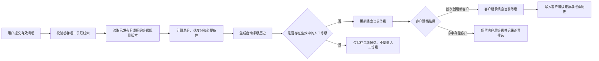

**自动评级规则**

1. 仅有效答卷完成关联与解析，或管理员发起规则重算时触发；未关联、重复关联、解析失败及作废答卷不得评级；
2. 使用计算发生时已发布且适用的规则版本，保存问卷版本、答卷编号、答案快照、规则版本、总分、维度分、必要条件、命中等级、计算时间和追踪号；
3. 未命中规则时结果为“未定级”并记录原因；计算失败进入异常中心，可按答卷编号和规则版本幂等重试；
4. 同一答卷和同一规则版本重复回调不得重复生成当前结果；重新解析或新版本重算应新增历史记录，不覆盖旧记录；
5. 等级区间必须连续、不重叠并覆盖允许分值范围；发布前必须试算并展示样本量、各等级分布、与当前等级差异、人工锁定数量和异常明细。

**等级维护边界**

- V1.0 引流线索页面不提供“变更线索等级”操作，线索等级仅由有效问卷和已发布等级规则自动计算；
- 历史系统已有人工等级只作为迁移快照和历史记录保留，不作为新系统当前等级的人工编辑入口；
- 线索已建立客户档案后，客户首次继承线索当前有效等级；客户等级如需调整，从客户列表“编辑等级”操作并填写原因、独立留痕，不回写线索；
- 规则重算生成新的等级历史，禁止覆盖既有计算记录；当前等级取最新有效自动评级结果。

**客户建档继承规则**

| 场景 | 处理规则 |
|---|---|
| 创建全新客户 | 继承线索当前有效等级，并保存来源线索、评级来源、规则/人工记录ID和继承时间 |
| 线索未定级 | 客户初始化为未定级 |
| 手机号或UnionID命中存量客户 | 不覆盖存量客户等级；保存本次线索评级候选和差异记录 |
| 建档后新问卷评级 | 继续更新关联线索的评级事实和候选结果，不自动覆盖客户当前等级 |
| 客户人工改级 | 从客户列表单条操作选择 S/A/B/C、填写原因，更新客户当前等级并写入客户等级历史，不回写线索 |

**列表、详情和核心数据**

- 列表展示“线索等级”和来源（问卷自动、历史迁移、未定级），支持筛选和表格设置；
- 详情只读展示当前等级、来源、规则版本和评级时间，不提供人工变更等级入口；
- 旅程记录问卷提交、自动评级、历史等级迁移、客户继承和异常重算；
- 线索主表仅保存 `current_grade`、`grade_source` 和当前结果ID；完整计算、候选及人工操作写入不可覆盖的等级历史表；
- 等级历史至少包含 `grade_rule_version_id`、`questionnaire_submission_id`、`score`、`dimension_scores`、`migration_source`、`source_lead_id`、`effective_at`、`invalid_at`。

### 5.5 引流期次

引流期次用于给线索接入、活码接量、人员轮询和经营分析提供统一的时间归属。它属于线索中心，不等同于交付中心的“营期”，也不等同于引流线索的“所属直播组”。三者必须分别保存独立ID和名称快照，禁止复用同一字段。

#### 5.5.1 页面入口与列表

- 菜单路径：`线索中心 / 引流期次`；路由：`/leads/periods`；
- 查询条件：期次名称、启停状态、期次开始时间、期次结束时间；名称支持模糊搜索；
- 列表字段：期次名称、期次开始时间、期次结束时间、状态、活码引用数、业务数据引用数、创建人、创建时间、操作；
- 引流期次不设置阶段字段，业务仅通过起止时间与启停状态管理；
- 状态枚举为：`启用`、`停用`。停用后不再作为新建活码、轮询名单和线索变更期次的可选目标，但不影响历史数据查询；
- 单条操作包含编辑、启用/停用、日志和删除。编辑不能修改期次稳定ID和已产生数据的历史归属。

#### 5.5.2 新建与编辑规则

| 字段 | 必填 | 规则 |
|---|---|---|
| 期次名称 | 是 | 50字以内；全局唯一，不允许与任何已有期次重名；校验时忽略首尾空格及英文字母大小写 |
| 期次开始时间 | 是 | 精确到分钟，必须早于结束时间 |
| 期次结束时间 | 是 | 精确到分钟，必须晚于开始时间 |
| 状态 | 是 | 默认启用，可手动停用 |
| 备注 | 否 | 200字以内 |

- 创建人ID、创建人姓名和创建时间由系统写入，不允许前端伪造；
- 新增期次保存前必须校验名称唯一性；编辑期次允许保留自身原名称，但不得修改为其他已有期次名称；校验失败时阻止保存并提示用户更换名称；
- 编辑开始或结束时间时，若已被活码或线索引用，页面需展示影响提示并记录修改前后值；
- 期次名称变化只更新主档显示名称，不回写已产生业务记录中的名称快照。

#### 5.5.3 批量创建

顶部提供“批量创建”，支持从指定期次开始时间起按固定周期生成当月期次：

1. 选择“期次开始时间”，并输入每个周期固定天数；
2. 系统从所选日期开始生成至当月最后一天，不跨月；
3. 默认期次名称采用该期期次开始日期的 `YYYYMMDD` 格式，例如 `20260803`；
4. 系统先生成预览，展示期次名称、开始时间、结束时间及冲突提示；预览中的每个期次名称均可直接修改；
5. 用户确认后按预览顺序创建，实际保存名称以用户最后修改结果为准；
6. 提交前同时校验预览内部名称及全部已有期次名称；任一期次名称重复时整体阻止提交并指出冲突名称，不允许自动跳过或部分创建；
7. 批量任务保存任务编号、创建参数、成功数、失败数和逐条失败原因，重复提交同一任务不得重复创建。

#### 5.5.4 引用、停用与删除

- 活码选择期次后形成“活码引用”；线索、分配、统计快照或任务引用期次后形成“业务数据引用”；
- 删除前必须实时查询引用关系并二次确认；只有`活码引用数=0`且`业务数据引用数=0`时允许物理删除；
- 已被活码引用、已有线索归属或已有统计数据的期次禁止删除，页面明确展示阻断原因和引用数量，并引导使用“停用”；
- 停用只限制后续选择和自动任务，不清除历史引用、不改写既有线索和报表；
- 期次被活码引用时，活码详情可反向查看期次；期次列表可查看引用活码清单。

#### 5.5.5 线索变更期次 / 直播组

- 引流线索批量操作和单条“更多”均提供“变更期次”，弹窗同时承载期次和直播组变更；
- “变更所属期次”和“变更所属直播组”为两个独立勾选项，至少勾选一项；支持只变期次不变直播组、只变直播组不变期次，或同时变更两者；
- 期次仅可选择启用中的引流期次并支持名称搜索；直播组支持选择已有项或输入目标直播组名称；
- 系统按勾选项记录线索、各维度原值与目标值、操作人、时间和请求追踪号；未勾选维度保持原值；
- 批量变更逐条校验权限和线索状态，允许部分成功，失败项返回具体原因，不回滚成功项；
- 本操作不改变负责人、客户关系和来源归因；
- 线索旅程展示每一次期次变更，历史报表按事件发生时的期次快照保持不变。

#### 5.5.6 日志、接口与验收

主要接口：

| 场景 | 接口 | 说明 |
|---|---|---|
| 期次列表 | `GET /api/v1/acquisition-periods` | 支持名称、阶段、状态、开始/结束时间筛选 |
| 新建期次 | `POST /api/v1/acquisition-periods` | 创建单个期次 |
| 编辑期次 | `PUT /api/v1/acquisition-periods/{id}` | 更新可编辑字段并留痕 |
| 批量生成 | `POST /api/v1/acquisition-periods/batch-generate` | 先预览后确认，返回批次结果 |
| 启停 | `PATCH /api/v1/acquisition-periods/{id}/status` | 启用或停用 |
| 引用查询 | `GET /api/v1/acquisition-periods/{id}/references` | 返回活码和业务数据引用明细 |
| 删除 | `DELETE /api/v1/acquisition-periods/{id}` | 服务端再次执行引用校验 |
| 日志 | `GET /api/v1/acquisition-periods/{id}/logs` | 查看新增、编辑、启停、引用和删除尝试 |
| 线索变更期次 / 直播组 | `POST /api/v1/leads/change-period` | 支持单条或批量，两个维度可独立选择 |

验收要求：

- [ ] 列表字段、筛选、编辑、日志、启停和分页可正常使用；
- [ ] 批量创建可按固定天数生成月度或年度期次并预览；预览内部或与已有期次重名时阻止整批创建并明确提示冲突名称；
- [ ] 有活码或业务数据引用的期次不可删除，无引用期次可删除；
- [ ] 停用期次不再出现在新建活码、轮询和线索变更的可选项中；
- [ ] 引流线索支持单条和批量独立变更期次、直播组，可任选一个或同时变更，未选维度保持原值；
- [ ] 所有新增、编辑、启停、删除尝试和线索变更均可审计。

### 5.6 活码管理

- 新活码统一由合数BOSS创建和管理；
- 旧活码继续使用并保存旧SCRM来源及外部编号映射；
- 页面左侧提供**活码分组**，默认包含“全部活码”和“默认分组”，管理员可新增分组；点击分组后右侧列表仅展示该分组数据，分组项同步展示活码数量；
- 活码列表支持按活码名称/编号、关联IP名称/编号、IP渠道、员工、所属期次和活码状态查询，展示二维码、活码名称与编号、活码类型、活码分组、关联IP、自动带出的IP渠道、所属期次、所属班级、接量日期区间、接待员工、接量容量、企微标签、内部标签、创建人、创建日期、扫码/加微数据和状态；
- 活码可选关联一个启用IP。选择后系统从IP主档自动带出只读的IP渠道名称与渠道编号，不允许在活码中另行选择或覆盖；未选择IP时按无IP归因的通用活码保存；
- **所属期次为选填项**。从“线索中心—引流期次”选择启用期次并支持名称搜索，不允许自由填写；不选择时按通用活码保存，不限定引流期次；
- **接量日期区间为选填项**。不设置时活码长期有效；设置后仅在开始日到结束日参与轮询，开始日前为“待生效”，结束日后自动变为“已结束”并退出轮询；
- **所属班级为非必填项**。班级作为独立可选归属，不由引流期次强制联动；不选择班级不影响保存和使用；
- 活码支持单人活码、多人活码，支持绑定一个或多个在职启用员工，并逐人配置轮询接量上限；接量上限仅限制轮询资格，不限制管理员人工指定；
- 活码标签分为**企微标签**和**内部标签**。企微标签在扫码加微成功后同步写入企业微信；内部标签仅用于合数BOSS内部筛选、运营和数据分析，两类标签分别存储、分别展示，不允许混用；
- 支持下载活码、复制短链、查看详情、编辑、启停和使用明细；
- 员工离职或停用后立即停止新接待，切换备用人员或进入待配置异常；
- 扫码、加微和删除好友事件按企业微信事件编号幂等保存；
- 活码效果展示扫码数、加微数、有效关联数和异常数，统计口径可追溯。

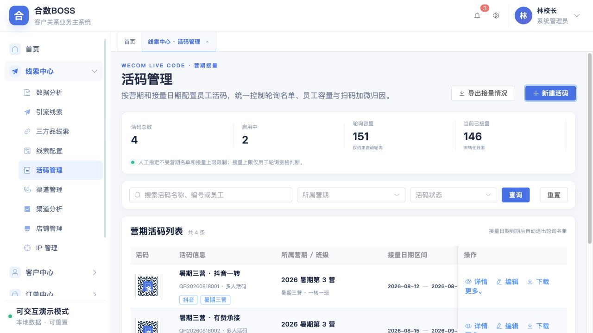

#### 5.6.1 新建/编辑校验

| 字段 | 必填 | 规则 |
|---|---|---|
| 活码名称 | 是 | 30字以内；同一有效期次内名称不可重复 |
| 活码类型 | 是 | 单人活码、多人活码 |
| 活码分组 | 是 | 从活码分组中选择；新建分组成功后可立即选用；不允许保存到已删除分组 |
| 关联IP | 否 | 从IP配置中搜索IP名称或IP编号；只允许选择启用IP，保存不可变IP编号 |
| IP渠道 | 自动 | 选择IP后按IP配置自动带出渠道名称和稳定渠道编号；只读，不允许单独修改 |
| 所属期次 | 否 | 从启用的引流期次中选择，保存期次ID和名称快照；不选择时按通用活码保存 |
| 所属班级 | 否 | 独立选择并保存班级ID和名称快照，不与引流期次强制联动 |
| 接量日期区间 | 否 | 不设置时长期有效；设置后开始日期不得晚于结束日期 |
| 接待员工 | 是 | 至少一名在职启用员工；单人活码只能选择一人 |
| 轮询接量上限 | 是 | 每名员工独立配置，正整数；达到上限自动退出轮询 |
| 企微标签 | 否 | 扫码加微成功后同步写入企业微信客户标签，保存企微标签ID和名称快照 |
| 内部标签 | 否 | 仅写入合数BOSS内部标签体系，保存内部标签ID和名称快照 |

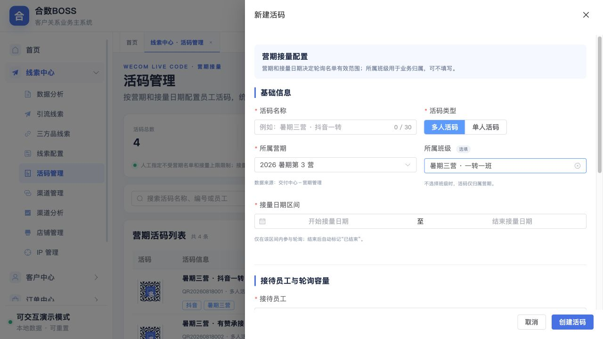

#### 5.6.2 状态和审计

- 状态包括待生效、启用、停用和已结束；日期自动状态与人工停用分别保存，不互相覆盖；
- 活码启停、期次/班级、接量日期、员工名单和上限修改必须记录修改前后值、操作人和时间；
- 关联IP变更必须记录原IP、新IP、变更时渠道编号快照、操作人和时间；IP主档后续改渠道不得静默改写既有扫码和线索的历史归因快照；
- 活码记录必须保存创建人ID、创建人姓名和创建时间；创建人名称变化不覆盖历史名称快照；
- 分组新增、活码移组、企微标签和内部标签变更均进入配置变更记录；
- 已产生扫码或加微数据的活码禁止物理删除，只允许停用；
- 详情页展示基础信息、员工接量明细、扫码/加微数据及配置变更记录。

### 5.7 渠道管理

渠道管理使用单一菜单入口，页面内部采用“渠道列表 / 数据分析”两个页签。渠道列表保存渠道编码、名称、类型、上级渠道、归因规则、负责人、状态及外部映射；数据分析展示渠道从线索进入到成交的效果。两个页签共用渠道身份、归因版本、权限范围和筛选上下文，但保持独立路由参数与权限点。

数据分析页签至少支持接入量、有效量、分配量、加微量、转客户量、成交量、净GMV和转化率，并按时间、渠道、组织、引流期次和店铺筛选。指标可以下钻到权限范围内的线索明细；启停渠道不得改写历史统计。

### 5.8 线索概览（菜单归属：首页）

页面路由保持为 `/leads/analytics`，作为首页模块唯一页面和登录后的默认入口，名称统一为“线索概览”。该页面用于回答“线索在哪个环节流失、最终成交质量如何、哪个店铺、IP渠道、IP名称或团队需要优先改善”。页面不是静态报表，所有指标必须能够通过统一筛选、指标口径说明和权限范围回溯到来源数据。历史 `/dashboard` 地址仅做兼容跳转，不再渲染独立工作台。

#### 5.8.1 页面结构与交互

| 区域 | 功能要求 |
|---|---|
| 全局筛选 | 期次、期次时间、线索创建时间、渠道、店铺、IP大类、IP渠道、IP名称、组织及负责人；期次、渠道、店铺、IP大类、IP渠道和IP名称支持多选；IP大类读取启用的 `ip_category` 字典项；默认选择距当前日期最近的启用期次并带出其起止时间；查询条件对整页看板、下钻和导出统一生效；员工在职状态不作为筛选项 |
| 经营数据 | 单选期次时展示一行期次数据；多选期次时第一行展示汇总数据，其后逐行展示各期次数据；不选择期次、仅按线索创建时间筛选时正常汇总后续转化结果，期次列留空。期次列固定且不可取消，其他指标可通过表头设置自由选择、自动记忆并恢复默认 |
| 转化链路 | 按有效线索、加微、填写问卷和成交展示阶段人数和环节转化率，补充当前在线与退款结果信号；不再展示预约直播、到课和完课三个链路节点 |
| 经营指标 | 过程转化按有效线索数、加微率、问卷填写率以及DAY1/2/3到课率和完课率排列；有效线索数仅展示数量并支持下钻；结果质量含退款率、最终转化率、GMV完成率；经营效能含人服比、单人净GMV、团队转化离散率、当前在线；成交金额含毛GMV、退款金额、净GMV |
| 指标下钻 | 点击经营数据或转化链路中的蓝色人数，打开继承当前期次、期次时间、线索创建时间、业务筛选和权限快照的明细抽屉 |
| 渠道分析 | 独立区块按来源渠道展示线索、加微、问卷、成交、转化率和净GMV |
| IP渠道分析 | 独立区块按IP渠道展示渠道编号、IP数、线索、加微、成交、退款、最终转化率和净GMV |
| 成交趋势 | 按当前筛选范围同时展示成交订单数（个）和成交金额（万元） |
| 指标口径 | 抽屉展示指标定义、公式、数据源、更新时间、是否待接入；外部数据未接入时显示“待接入”，不得按0计算 |
| 导出 | 顶部导出当前统计主体的经营概览、渠道和IP渠道数据；各保留分析区和下钻抽屉支持独立导出 |

页面链路标题统一为“转化链路”，经营模块统一命名为“经营数据”。筛选摘要、下钻和导出必须继承当前筛选，不通过模块改名表达统计差异。

经营数据新增 DAY1 到课率、DAY1 完课率、DAY2 到课率、DAY2 完课率、DAY3 到课率、DAY3 完课率，各指标同时展示对应人数并支持下钻。列表右上角提供表头设置，期次列固定且不可取消，其他字段可自由勾选；设置即时生效、自动记忆并支持恢复默认。

#### 5.8.2 指标字典

| 指标 | V1.0默认口径 | 计算方式 | 主要数据源 |
|---|---|---|---|
| 有效线索数 | 线索标记为有效、解密状态为已解密，按线索唯一编号去重 | `COUNT(DISTINCT lead_id)` | 线索中心 |
| 加微数 | 所选周期内完成加微的去重客户数；默认可切换day1口径 | `COUNT(DISTINCT customer_id WHERE wechat_added=true)` | 企微事件、线索 |
| 问卷填写数 | 提交有效答卷的去重客户数；默认可切换day1口径 | `COUNT(DISTINCT customer_id WHERE valid_answer=true)` | 问卷管理 |
| 预约数 | 已订阅所选期次直播的去重客户数 | `COUNT(DISTINCT customer_id WHERE reserved=true)` | 直播系统 |
| 到课数 | 所选直播在线时长大于0的去重客户数 | `COUNT(DISTINCT customer_id WHERE online_seconds>0)` | 直播系统 |
| 完课数 | 所选直播在线时长大于50分钟的去重客户数 | `COUNT(DISTINCT customer_id WHERE online_seconds>3000)` | 直播系统 |
| 在线数 | 查询时点在线状态为在线的去重客户数 | `COUNT(DISTINCT customer_id WHERE online=true)` | 直播系统 |
| 成交数 | 支付成功且能关联线索的正式课去重付款客户数 | `COUNT(DISTINCT customer_id WHERE paid=true)` | 统一订单数据 |
| 退款数 | 支付后30日内退款成功的去重客户数 | `COUNT(DISTINCT customer_id WHERE refund_success=true)` | 订单、退款 |
| 加微/问卷/预约/到课/完课/成交转化率 | 默认使用同一筛选范围的有效线索数为分母 | `对应人数 / 有效线索数` | 对应业务表 |
| 退款率 | 当前默认参考口径 | `退款人数 / 有效线索数` | 订单、线索 |
| 最终转化率 | 扣除退款后的最终成交客户占比 | `(成交数-退款数) / 有效线索数` | 订单、退款、线索 |
| 2980退款率 | 2980正式课退款质量 | `2980退款客户数 / 2980成交客户数` | 正式课订单 |
| 毛GMV | 支付成功订单金额，包含之后发生退款的订单 | `SUM(paid_amount)` | 统一订单数据 |
| 退款金额 | 归属所选周期的退款成功金额 | `SUM(refund_amount)` | 退款数据 |
| 净GMV | 真实留存成交金额 | `毛GMV-退款金额` | 订单、退款 |
| GMV完成率 | 与营期目标比较 | `净GMV / 营期目标GMV` | 目标、订单 |
| 人服比 | 私域服务承载 | `私域用户总数 / 服务人员数` | 客户、组织员工 |
| 单人净GMV | 团队人效 | `净GMV / 带班人数` | 订单、组织员工 |
| 团队转化离散率 | 团队表现差异 | `团队转化率标准差 / 团队平均转化率` | 线索、组织 |

#### 5.8.3 统计与归属规则

- 人数指标按客户身份去重；客户身份尚未形成时按线索唯一编号去重，不得将同一客户多渠道重复接入重复计数；
- 默认期次为线索所属引流期次；渠道、团队、负责人等维度采用事件发生时快照，人员改派不得重写历史统计；
- 退款成功时间距下单时间不超过30日时回冲原销售期次；原销售期次无归属记录时顺延到下一期次，此规则上线前由业务与财务共同确认；
- 比率分子、分母必须使用同一日期、期次、权限和去重范围；分母为0时展示“—”，不得展示0%；
- 数据分析服务按口径版本计算并保存更新时间；数据修复后支持重算，但必须保留重算批次与差异日志；
- 直播预约、到课、完课、在线、目标GMV等外部数据未接入时展示“待接入”，不得使用演示值进入生产报表。

#### 5.8.4 权限、下钻与验收

- 员工默认只看本人或被授权团队，主管按组织数据范围查看，财务金额指标需要独立字段权限；
- 点击转化链路、经营数据、渠道或IP渠道中的蓝色人数，进入带相同筛选快照的明细，不得出现汇总有值而明细无法核对；
- [ ] IP大类支持多选并读取启用字典项；全局筛选对转化链路、经营数据、渠道、IP渠道、成交趋势、指标下钻和导出同时生效；
- [ ] 经营数据支持单期、多期汇总和无期次仅按线索创建时间汇总；DAY1/2/3到课率、完课率及其他指标按指标字典计算；
- [ ] 页面保留渠道和IP渠道分析，移除商品分析；
- [ ] 毛GMV、退款金额、净GMV和目标完成率名称及公式无歧义；
- [ ] 外部数据缺失展示“待接入”，分母为0展示“—”；
- [ ] 汇总与下钻明细在相同权限、口径版本下可核对；
- [ ] 当前筛选经营报表、各保留分析分区和下钻明细均支持导出，导出数量与页面当前筛选一致；
- [ ] 经营报表包含经营概览、渠道分析和IP渠道分析三个数据区；
- [ ] 导出包含筛选条件、指标口径版本、生成时间和数据权限说明。

#### 5.8.5 IP渠道分析

- 统计主体为稳定的 `IP渠道编号`，名称修改不得拆分历史数据；
- 表格字段为IP渠道名称/编号、IP数、线索数、加微数、问卷填写数、预约数、到课数、完课数、成交数、退款数、最终转化率和净GMV；
- IP数按当前筛选范围内与该渠道建立有效关系的IP主档去重，不随线索数量累加；
- 点击线索、加微、问卷、预约、到课、完课、成交或退款数字，打开对应阶段线索明细；
- 点击IP渠道名称进入同一页面的渠道筛选结果，不跳转到渠道主数据配置页，避免经营分析与配置维护混用；
- 导出文件名采用 `IP渠道分析_期次_日期区间_生成时间.csv`，并写入渠道编号及所有当前筛选条件。

#### 5.8.6 经营报表与导出

顶部导出按当前期次、期次时间、线索创建时间、业务筛选、数据权限和指标口径生成经营报表，包含以下三个数据区：

1. **经营概览**：期次、线索数、加微数、问卷填写数、DAY1/2/3到课与完课人数及比率、在线数、成交数、退款数、结果质量、经营效能和成交金额；未选择期次时期次列留空；
2. **渠道分析**：来源渠道、线索、加微、问卷、成交、转化率和净GMV；
3. **IP渠道分析**：采用5.8.5字段。

导出文件头必须记录期次、期次时间、线索创建时间、来源渠道、店铺、IP渠道、IP名称、组织、负责人、负责人组织、生成账号、生成时间、口径版本和权限范围。数据量较小时前台直接生成；超过系统参数阈值时转异步任务。生产环境不得导出演示数据，外部数据未接入的指标写“待接入”而非0。

#### 5.8.8 指标下钻明细

- 下钻采用右侧抽屉，保留首页上下文，不新增不可追踪的临时统计页面；
- 标题显示“指标名称 + 当前数值”，顶部展示期次、日期、店铺、IP渠道、IP名称及数据权限快照；
- 默认字段为订单编号、客户名称、手机号（按字段权限掩码或明文）、来源、店铺、商品、IP渠道、IP名称、当前负责人、负责人组织、所属期次、事件时间和阶段；
- 负责人组织取业务事件发生时的组织归属快照；当前员工后续调岗、转组或离职不得重写历史期次明细；
- 每一条明细必须能进入线索详情或订单关联信息，无法定位的记录标记为归因异常；
- 下钻导出继承相同口径与权限，不允许用户在导出时扩大范围；
- 汇总值、下钻条数与导出条数需可通过同一口径版本核对，差异必须进入异常中心并记录重算批次。

### 5.9 店铺管理

店铺管理用于统一维护各外部交易或获客平台中的店铺身份、责任人和访问范围，为线索、订单、商品及渠道归因提供标准店铺主数据。

#### 5.9.1 店铺列表

- 店铺档案查询与经营统计范围分区展示，前者只筛选店铺主数据，后者控制列表指标与经营详情，二者不得混用；
- 店铺档案查询条件包括综合搜索、平台类型、店铺负责人、店铺状态，以及“日期类型 + 日期区间”；综合搜索支持店铺名称、第三方店铺ID和负责人姓名；
- 店铺档案日期类型包括创建时间、更新时间和启停时间，分别读取店铺创建、最后修改和最后一次启停状态变更时间；
- 列表字段包括平台类型、店铺名称、第三方店铺ID、店铺负责人、线索数/加微数、下单数/支付订单数、净GMV、权限范围、创建人、创建时间、状态和操作；
- 平台类型包括抖音、有赞、小鹅通、淘宝、小红书和其他，后续通过字典扩展；
- 操作包括经营详情、新增、编辑、店铺权限、启用和停用；
- 停用店铺后不得用于新线索、订单和商品归因，但必须保留历史映射、历史订单、历史线索和统计数据。

#### 5.9.2 新增与编辑

| 字段 | 必填 | 规则 |
|---|---|---|
| 平台类型 | 是 | 从平台类型字典选择 |
| 店铺名称 | 是 | 50字以内，作为合数BOSS内部统一展示名称 |
| 第三方店铺ID | 是 | 保存外部平台原始唯一ID；同一平台内不可重复，不允许用店铺名称代替 |
| 店铺负责人 | 是 | 从在职启用员工中选择，支持按姓名或员工编号搜索 |
| 店铺状态 | 是 | 启用、停用 |

- 店铺唯一身份由“平台类型 + 第三方店铺ID”共同确定；
- 新增成功后，店铺负责人默认获得查看店铺、编辑店铺和查看关联线索权限；
- 编辑平台类型或第三方店铺ID前必须进行影响预览，已关联业务数据时记录变更前后值，不得覆盖历史快照；
- 新增、编辑、启停和权限变更必须记录操作人、操作时间、修改前后值及请求追踪号。

#### 5.9.3 店铺权限

店铺权限用于控制哪些组织和员工可以查看或操作指定店铺，不代替系统角色权限；用户必须同时具备系统功能权限和店铺数据权限。

| 权限维度 | 说明 |
|---|---|
| 可见组织 | 选择公司、部门或小组，组织范围内具备对应系统权限的员工可访问店铺 |
| 单独授权员工 | 补充组织范围之外的指定员工，支持姓名或员工编号搜索 |
| 查看店铺 | 基础权限，允许查看店铺基础信息，不可取消 |
| 编辑店铺 | 允许修改店铺名称、负责人和状态等配置 |
| 查看关联线索 | 允许查看归属于该店铺的线索及转化数据 |
| 导出店铺数据 | 允许导出店铺及其业务统计，受字段脱敏和导出审批约束 |

- 店铺负责人和系统管理员始终保留店铺管理权限，避免出现无人可管理的店铺；
- 组织权限与员工权限取并集，具体操作权限取用户角色权限和店铺授权的交集；
- 权限调整即时生效，已打开页面的用户在下一次请求时重新鉴权；
- 权限变更记录永久保留，不随员工离职或组织调整删除。

#### 5.9.4 验收标准

- [ ] 可以按平台类型、店铺名称、第三方店铺ID、负责人、状态及创建/更新/启停日期查询；
- [ ] 店铺档案日期筛选只影响店铺范围，不得被误用为线索、订单、支付或退款统计日期；
- [ ] 同一平台的第三方店铺ID重复时阻止保存，不同平台允许使用相同外部ID；
- [ ] 新增和编辑表单必填校验、负责人搜索和状态操作可用；
- [ ] 新增店铺后负责人自动获得默认权限；
- [ ] 店铺权限支持组织、员工和四类操作权限配置并正确生效；
- [ ] 无店铺数据权限的员工不能通过列表、详情、接口或导出越权访问；
- [ ] 停用店铺不再参与新业务归因，历史数据仍可按权限查询。

#### 5.9.5 经营统计范围与日期口径

店铺经营统计必须先选择统计方式、业务日期区间和营期，并在列表、详情、下钻及导出中保持同一筛选快照。

| 统计方式 | 日期选择 | 计算规则 | 适用场景 |
|---|---|---|---|
| 线索归因口径（默认） | 固定为线索进入时间 | 先按线索进入时间圈定同一批店铺归因线索，再持续追踪这批线索后续加微、转客户、下单、支付和退款结果 | 比较不同店铺、渠道或营期引入线索的最终转化质量 |
| 业务发生口径 | 支持线索进入、加微、转客户、下单、支付和退款时间 | 各指标按自身业务事件实际发生时间统计；加微看加微时间、订单看下单时间、GMV看支付成功时间、退款看退款成功时间 | 经营日报、财务核对、业务事件量和当期产出分析 |

- 禁止使用“下单时间”统一计算线索数、加微数、支付GMV和退款金额；
- 业务发生口径下的日期类型用于切换重点事件视图，各汇总指标仍必须按自身事实发生时间计算；
- 列表顶部必须展示当前统计方式、日期类型、日期区间和营期，防止用户误读；
- 切换统计方式时，线索归因口径自动选中线索进入时间，业务发生口径默认选中支付时间；
- 下钻、导出和接口响应必须携带 `statistics_mode`、`date_type`、`date_range`、`camp_id` 和口径版本。

#### 5.9.6 店铺经营指标

| 指标 | 计算口径 |
|---|---|
| 线索数 | 归因到当前店铺的去重线索数量，按线索唯一编号去重 |
| 有效线索数 | 线索数中排除无效标记后的数量 |
| 加微数 | 通过线索身份关联到店铺的加微成功客户数，按客户身份去重 |
| 加微率 | 加微数 ÷ 有效线索数 |
| 客户数 | 已从该店铺归因线索转为正式客户的去重人数 |
| 下单数 | 已创建的去重订单数，包含未支付订单 |
| 支付订单数 | 支付成功的订单数 |
| 支付率 | 支付订单数 ÷ 下单数 |
| 支付GMV | 支付成功金额合计 |
| 退款订单数 | 退款成功的订单数 |
| 退款金额 | 退款成功金额合计 |
| 净GMV | 支付GMV－退款金额 |
| 归因异常数 | 未匹配店铺订单、线索无店铺、第三方ID冲突和重复订单数量 |

- 人数类指标按客户身份去重，尚未形成客户身份时按线索唯一编号去重；
- 比率分子与分母必须使用相同的日期、营期、权限和去重范围，分母为0时展示“—”；
- 列表仅展示线索/加微、下单/支付和净GMV等关键指标，避免经营指标挤占基础信息；
- 每个指标保留口径版本和数据更新时间，点击指标可下钻到使用相同筛选快照的业务明细。

#### 5.9.7 店铺经营详情

经营详情采用独立抽屉展示，共用列表的统计方式、业务日期类型、日期区间和营期筛选，包含：

1. **线索到成交漏斗**：线索数、有效线索数、加微数、客户数、下单数、支付订单数，并展示相邻环节转化率；
2. **近7日转化趋势**：按日对比线索、加微和支付订单变化；
3. **订单与收入**：下单数、支付订单数、支付GMV、退款订单数、退款金额和净GMV；
4. **商品归因构成**：按商品名称和第三方商品ID展示线索数、支付订单和GMV；
5. **归因异常**：展示待处理异常数量并进入异常明细。

店铺经营详情验收要求：

- [ ] 列表汇总与经营详情在同一筛选范围下能够核对；

- [ ] 支持在线索归因口径和业务发生口径之间切换，并明确展示当前口径说明；
- [ ] 线索归因口径可追踪同批线索的后续结果；业务发生口径中各指标使用自身事件时间；
- [ ] 漏斗各阶段可点击下钻，明细继承店铺、日期和营期筛选；
- [ ] 下单数与支付订单数、支付GMV与净GMV名称和口径不混用；
- [ ] 商品归因必须保留第三方商品ID；
- [ ] 归因异常可以查看来源数据、匹配过程、失败原因和处理状态；
- [ ] 导出文件包含筛选条件、数据更新时间、口径版本和店铺权限说明。

#### 5.9.8 店铺归因规则

- 线索首次接入时保存平台类型、第三方店铺ID、店铺内部ID、第三方商品ID、归因时间、归因来源和规则版本快照；
- 加微事件通过订单关联、客户身份或内部关联主键定位原始记录并继承店铺快照，同一客户重复扫码不重复计算加微人数；
- 订单优先按“外部平台 + 第三方店铺ID”匹配，再通过订单关联线索和客户身份补充匹配；
- 无法唯一匹配时不得猜测归因，统一进入归因异常；
- 店铺改名、换负责人或停用不得重写历史线索和订单的店铺快照。

### 5.10 IP列表

IP列表用于维护以老师为主体的业务IP主档。IP名称应填写老师姓名或对外使用名称，例如“阿留皮皮”，不再使用“研究院”“品牌中心”等机构名称代替老师IP。

#### 5.10.1 列表与筛选

| 字段 | 规则 |
|---|---|
| IP名称 | 老师姓名或老师对外名称，例如“阿留皮皮”；IP编号在名称下方以次级编码展示 |
| IP编号 | 系统按 `IP` + 6位流水号自动生成，创建后不可修改；不再占用独立列表列 |
| IP大类 | 从字典 `ip_category` 解析中文标签；初始仅提供“教育规划”。大类编码在IP大类名称下方以次级文本展示，初始为 `EDUCATION_PLANNING`，用于接口、筛选及历史归因 |
| IP渠道 | 展示渠道名称及稳定渠道编号；初始为“店播/CH000001”“阿留专属/CH000002” |
| 关联商品 | 展示数量，点击进入对应商品列表 |
| 关联平台 | 最多直接展示3个平台，超出部分折叠，点击弹窗查看完整列表 |
| 创建人/创建时间 | 保存主档的实际创建人和时间 |
| 状态 | 启用、停用；停用后不可用于新关联，历史关系保留 |

筛选支持IP名称、IP编号或创建人综合搜索，以及IP大类（支持按名称或大类编码检索）、IP渠道、关联平台和状态。列表操作包括IP配置、商品详情下钻、编辑、启用和停用。

#### 5.10.2 IP配置

IP配置是IP列表页内的统一配置抽屉，不新增左侧菜单。它集中维护和查看“IP名称—IP大类—IP渠道”的生效关系，IP列表主档是唯一数据源，不另建一份重复主档。

- 配置列表按行展示IP名称及其下方的IP编号、IP大类及其下方的大类编码、IP渠道及其下方的渠道编号、状态和操作；
- 新增配置复用新增IP表单，编辑配置复用IP编辑表单；保存时一次性校验IP名称、IP大类和IP渠道关系；
- 同一IP编号同一时点只能存在一组生效的大类与渠道关系；修改关系必须记录修改前后值和生效时间；
- 停用IP后不能再被新活码选择，但历史活码、扫码、线索及订单仍按原IP编号和渠道快照追溯；
- 活码管理只引用IP编号并解析当前IP配置，禁止在活码侧维护第二套IP大类或IP渠道关系。

#### 5.10.3 新增、编辑与字典联动

- 新增和编辑必填IP名称、IP大类、IP渠道；IP说明和关联平台选填；
- IP大类只读取系统管理—字典管理中编码为 `ip_category` 且处于启用状态的字典项；
- 选择IP大类后，页面自动带出只读的大类编码。大类编码取字典项值，不能在IP表单中单独编辑；
- 初始字典项为“教育规划”，大类编码为 `EDUCATION_PLANNING`；业务表只保存大类编码，不保存中文标签；
- IP渠道不使用自由文本，也不重复维护为IP大类字典。页面从渠道主数据选择，保存渠道内部ID和稳定渠道编号；初始渠道为“店播/CH000001”“阿留专属/CH000002”；
- 渠道名称允许调整，渠道编号创建后不可修改或复用；历史IP及线索归因均按渠道编号追溯；
- 后续增加IP大类时由有权人员维护字典，不修改IP页面代码；停用大类后不得用于新建或编辑，但历史IP仍按原值展示；
- 新增、编辑、启停和关联商品/平台变更均需记录操作日志。

#### 5.10.4 验收标准

- [ ] IP列表在“IP大类”同一单元格内展示大类名称，并在名称下方展示大类编码；两者来自同一个 `ip_category` 字典项；
- [ ] IP列表在“IP名称”同一单元格内展示名称，并在名称下方展示IP编号；列表不再出现独立IP编号列；
- [ ] 点击“IP配置”可集中查看和编辑IP名称、IP大类与IP渠道的唯一生效关系；
- [ ] IP大类筛选可按中文名称或大类编码搜索，并按选中值准确过滤；
- [ ] IP列表展示IP渠道名称与渠道编号，并支持按IP渠道筛选；
- [ ] 新增、编辑表单可选择启用的IP大类，初始可选项只有“教育规划”；选择后自动带出只读大类编码 `EDUCATION_PLANNING`；
- [ ] 示例及新增IP名称使用老师名称口径，可录入“阿留皮皮”；
- [ ] 字典中新增启用大类后，IP页面无需发版即可选择；停用大类不影响历史展示；
- [ ] IP编号自动递增且不可修改，商品和平台关系可下钻查看。
- [ ] 新建或编辑活码选择IP后自动带出只读IP渠道；保存后列表和详情展示同一IP编号、渠道编号，变更留痕可追溯。

### 5.11 商品列表

商品列表是线索中心内的第三方商品查询与关联页面，用于回答“哪个外部商品属于哪家店铺、是否已分配活码、归属哪个业务IP”。本模块与V2.0产品中心的“商品管理”边界不同：V1.0只承接第三方商品同步、归因和内部备注，不负责自有商品定价、权益或上下架策略。

#### 5.11.1 页面字段

| 字段 | 规则 |
|---|---|
| 序号 | 当前筛选结果内的分页序号 |
| 创建时间/更新时间 | 第三方商品首次同步时间与最近一次同步更新时间 |
| 商品名称 | 保存第三方原始名称，可通过内部备注补充说明但不得覆盖原始值 |
| 是否分配活码 | 是、否；来自商品与活码有效关联事实 |
| 商品ID | 第三方平台原始商品ID，按字符串保存，不进行数值转换 |
| 商品状态 | 在线、下线；由同步结果更新，下线商品保留历史线索与订单关系 |
| 店铺名称/店铺类型 | 关联店铺主档快照及平台类型，如百家号、抖店、有赞、小鹅通、小红书 |
| 关联IP | 展示IP名称和不可变IP编号；支持从IP列表带入IP编号下钻筛选 |
| 内部备注 | 仅在合数BOSS内使用，不回写第三方平台 |

#### 5.11.2 筛选与操作

- 支持商品名称、商品ID或店铺名称综合搜索，并支持店铺类型、商品状态、活码分配状态和关联IP筛选；
- 从IP列表点击“关联商品”后打开商品列表并自动带入 `ipNo`，页面明确展示当前IP，可一键清除并查看全部商品；
- 页面级操作包括同步商品、导出；点击“同步商品”后，首项固定展示“同步所有商品”，其后依次展示“同步抖店商品、同步百度商品、同步小红书商品、同步快手商品、同步微信小店商品”；
- “同步所有商品”按抖店 → 百度 → 小红书 → 快手 → 微信小店的固定顺序创建并执行独立后台任务。每个平台任务必须幂等，记录来源、批次、开始/完成时间、成功数、失败数和失败原因；单个平台失败不得阻塞后续平台，并支持失败平台单独重试；
- 单条操作首期仅提供修改内部备注，外部商品名称、ID、状态和店铺关系由同步链路维护，不允许页面直接篡改；
- 商品唯一匹配至少使用“平台/店铺 + 第三方商品ID”，第三方商品ID必须按字符串保存；无法唯一匹配时进入同步异常，不得自动覆盖。

#### 5.11.3 验收标准

- [ ] 线索中心存在独立“商品列表”入口，且IP商品数量可下钻进入并自动筛选；
- [ ] 列表完整展示创建/更新时间、商品名称、是否分配活码、商品ID、商品状态、店铺名称、店铺类型和关联IP；
- [ ] 商品ID长数字不丢位，导出结果与列表筛选范围一致；
- [ ] 修改备注不改变第三方原始字段，也不回写外部平台；
- [ ] 下线商品仍可查看历史IP、线索、订单关联，不得物理删除。
- [ ] 同步商品弹层首项为“同步所有商品”，随后按抖店、百度、小红书、快手、微信小店展示单平台操作，全部同步严格按该顺序执行且任务结果可追踪。

### 5.12 短信配置

短信配置位于商品列表下方，用于把“什么商品、通过哪个活码、在什么业务时点触发哪类提醒”配置成可审计策略。本页面只负责商品级提醒策略，不维护短信签名、模板正文和供应商回执；后三者继续由“业务配置—短信管理”统一维护。

#### 5.12.1 页面结构与字段

| 区域/字段 | 规则 |
|---|---|
| 短信分组 | 左侧分组用于按IP、团队或营期整理配置；支持新增分组和分组筛选 |
| 商品 | 必选；从已同步商品主档选择，自动带出商品ID、店铺名称和店铺类型 |
| 活码 | 必选；从有效活码中选择，用于区分同一商品的不同接量或运营策略 |
| 购买后提醒 | 不提醒、用户下单、支付成功后5分钟、支付成功后1小时 |
| 授权后提醒 | 不提醒、用户授权、授权成功后10分钟 |
| 手动提醒 | 不提醒、用户提醒、运营手动触发 |
| 状态 | 启用、停用；停用后不再产生新触发任务，历史发送记录保留 |
| 创建/更新时间 | 记录配置首次创建及最近一次修改时间 |

#### 5.12.2 交互与规则

- 支持按商品ID、商品名称、店铺或活码搜索，并按店铺类型、配置状态和左侧短信分组筛选；
- 支持新增、编辑、删除和批量设置；批量设置只更新提醒策略与状态，不改变原商品、活码和分组；
- 同一“商品 + 活码 + 提醒类型”只能存在一条生效配置，重复保存应提示冲突，不得生成重复触发任务；
- 触发业务事件后，系统读取当前生效策略并调用业务配置中的短信模板与签名；短信发送结果统一进入“业务配置—短信管理—发送结果”；
- 所有新增、编辑、启停、删除和批量设置操作记录操作人、变更前后值及时间；已产生发送记录的配置只允许停用或逻辑删除。

#### 5.12.3 权限与验收

- 页面权限至少拆分为查看、新增、编辑、批量设置、启停和删除；商品、店铺、活码候选项受当前用户数据权限裁剪；
- [ ] 商品列表下方存在独立“短信配置”菜单，页面支持分组、筛选、列表和新增/编辑弹窗；
- [ ] 新增配置必须选择商品和活码，并可分别设置购买后、授权后、手动提醒；
- [ ] 批量设置不覆盖商品、活码和分组，停用后不再生成新短信任务；
- [ ] 签名、模板和发送回执仍由业务配置短信管理维护，两处职责不重复。

## 6. 多维状态模型

### 6.1 设计原则

- 各环节可能并行、补录或乱序回写，不再使用“待分配→已分配→未解密→已解密……”的单线生命周期；
- 分配、解密、短信、加微、问卷、测评、跟进和订单分别保存独立状态；
- 当前待办状态是面向运营的计算结果，不代替各环节事实；
- 转化状态独立表示是否满足正式业务转化口径；
- 线索标记独立表示有效性和重复关系；
- 接入、清洗和同步任务状态归任务模型管理，不混入线索业务状态。

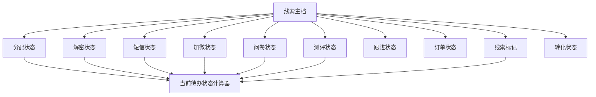

### 6.2 状态字段与枚举

| 状态维度 | 字段编码 | 枚举 |
|---|---|---|
| 当前待办状态 | `current_action_status` | `PENDING_ASSIGNMENT` 待分配、`PENDING_DECRYPTION` 待解密、`PENDING_OUTREACH` 待触达、`PENDING_SMS_CLICK` 待客户点击、`PENDING_WECHAT` 待加微、`PENDING_QUESTIONNAIRE` 待填问卷、`PENDING_ASSESSMENT` 待测评、`NURTURE_COMPLETED` 已完成培育、`NO_ACTION` 无需处理；由规则计算，不作为唯一事实 |
| 分配状态 | `assignment_status` | `PENDING` 待分配、`ASSIGNED` 已分配、`FAILED` 分配失败、`REASSIGNED` 已改派 |
| 解密状态 | `decrypt_status` | `NOT_REQUIRED` 无需解密、`PENDING` 未解密、`PROCESSING` 解密中、`DECRYPTED` 已解密、`FAILED` 解密失败 |
| 短信状态 | `sms_status` | `NOT_SENT` 未发送、`SENDING` 发送中、`SENT_NOT_CLICKED` 已发送未点击、`CLICKED` 已点击、`FAILED` 发送失败 |
| 加微状态 | `wechat_status` | `NOT_ADDED` 否、`WECOM_ADDED` 已加企微、`PERSONAL_WECHAT_ADDED` 已加个微 |
| 问卷状态 | `questionnaire_status` | `NOT_SENT` 未发送、`SENT_NOT_FILLED` 已发送未填写、`FILLED` 已填写 |
| 测评状态 | `assessment_status` | `NOT_BOOKED` 未预约、`BOOKED_NOT_COMPLETED` 已预约未测评、`COMPLETED` 已测评 |
| 跟进状态 | `follow_status` | `NOT_FOLLOWED` 未跟进、`FOLLOWING` 跟进中、`FOLLOWED` 已跟进 |
| 订单状态 | `order_status` | `NO_ORDER` 无订单、`UNPAID` 未支付、`PAID` 已支付、`REFUNDING` 退款中、`REFUNDED` 已退款 |
| 线索标记 | `lead_mark` | `VALID` 有效线索、`INVALID` 无效线索、`DUPLICATE` 重复线索 |
| 转化状态 | `conversion_status` | `UNCONVERTED` 未转化、`CONVERTED` 已转化 |
| 线索类型 | `source_type` | `DRAINAGE` 引流线索、`THIRD_PRODUCT` 三方品线索、`REFERRAL` 转介绍 |
| 添加方式 | `entry_method` | `CHANNEL` 渠道、`PRIVATE_DOMAIN` 公域、`IMPORT` 导入、`PARTNER_PUSH` 合作推送、`REFERRAL` 转介绍 |
| 加微方式 | `wechat_method` | `WECOM` 企业微信、`PERSONAL_WECHAT` 个人微信 |

### 6.3 状态组合示例

| 业务场景 | 当前待办 | 分配 | 解密 | 短信 | 加微 | 问卷 | 测评 | 转化 |
|---|---|---|---|---|---|---|---|---|
| 已解密但未分配 | 待分配 | 待分配 | 已解密 | 未发送 | 未加微 | 未发送 | 未预约 | 未转化 |
| 已分配但解密失败 | 待解密 | 已分配 | 解密失败 | 未发送 | 未加微 | 未发送 | 未预约 | 未转化 |
| 已发送短信未点击 | 待客户点击 | 已分配 | 已解密 | 已发送未点击 | 未加微 | 未发送 | 未预约 | 未转化 |
| 已加微待填问卷 | 待填问卷 | 已分配 | 已解密 | 已点击 | 已加微 | 已发送未填写 | 未预约 | 未转化 |
| 已测评尚未成交 | 已完成培育 | 已分配 | 已解密 | 已点击 | 已加微 | 已填写 | 已测评 | 未转化 |
| 正式课已支付 | 根据环节事实计算 | 已分配 | 已解密 | 已点击 | 已加微 | 已填写 | 已测评 | 已转化 |

### 6.4 事件联动规则

| 业务事件 | 更新字段 | 更新结果 | 不得影响 |
|---|---|---|---|
| 新线索接入 | 分配、解密、短信、加微、问卷、测评、标记、转化 | 按来源数据初始化 | 不得虚构已经发生的动作 |
| 分配员工活码 | `assignment_status` | → 已分配；保存负责人、活码和分配历史 | 解密、订单、转化状态 |
| 手机号解密成功 | `decrypt_status` | → 已解密；保存手机号与时间 | 分配状态 |
| 手机号解密失败 | `decrypt_status` | → 解密失败；生成异常任务 | 分配状态 |
| 短信提交供应商 | `sms_status` | → 发送中 | 分配、解密状态 |
| 短信发送成功 | `sms_status` | → 已发送未点击 | 其他环节状态 |
| 客户点击短信 | `sms_status` | → 已点击 | 加微状态，直至加微事件回写 |
| 客户添加微信 | `wechat_status` | → 已加微 | 分配、解密、短信状态 |
| 发送问卷 | `questionnaire_status` | → 已发送未填写 | 测评、转化状态 |
| 客户提交有效问卷 | `questionnaire_status` | → 已填写 | 测评、转化状态 |
| 客户完成测评 | `assessment_status` | → 已测评 | 转化状态 |
| 建立唯一客户档案 | 客户关联字段 | 保存客户ID、编号和建档时间 | 转化状态 |
| 2980正式课支付成功 | `conversion_status`、`order_status` | → 已转化、已支付 | 当前待办和其他环节事实 |
| 唯一正式课全额退款 | `conversion_status`、`order_status` | → 未转化、已退款 | 客户、旅程及历史状态记录 |
| 标记无效或重复 | `lead_mark` | → 无效或重复；退出自动待办 | 各环节历史事实 |

手机号或UnionID至少存在一项才可建立客户档案；两者命中不同客户时，系统必须原子性阻断自动建档、保留冲突证据并生成唯一撞单案件，由客户中心—撞单管理完成主档合并或确认不同人。加微结果只允许企业微信事件或数据同步回写，不提供人工确认加微。所有状态、负责人、客户、订单及关键字段变化必须保存前值、后值、事件、操作人、时间和追踪号。

当前待办采用“终态与下游事实优先”计算：已转化、无效或重复线索直接为无需处理；问卷已填写时不再回退检查短信与加微，进入待测评或已完成培育；已加微时不再要求短信点击，进入待填问卷；仅在尚未加微时检查解密和短信状态。该规则用于避免异步回写、人工补录或跨渠道加微造成状态倒退。

## 7. 核心数据模型

| 实体 | 作用 |
|---|---|
| `LEAD` | 两类线索公共主模型 |
| `LEAD_DRAINAGE_EXT` | 引流线索扩展字段 |
| `LEAD_THIRD_PRODUCT_EXT` | 三方品线索扩展字段 |
| `LEAD_SOURCE_SNAPSHOT` | 原始来源和归因快照 |
| `LEAD_ASSIGNMENT` | 分配方式、候选名单版本、人数上限快照、轮询游标、目标员工和结果历史 |
| `LEAD_ASSIGNMENT_RULE_VERSION` | 规则版本、营期、活码人员名单及适用条件 |
| `EMPLOYEE_QR_CODE` | 员工活码及新旧映射 |
| `LEAD_WECHAT_EVENT` | 扫码、加微等企微事件 |
| `LEAD_CUSTOMER_RELATION` | 线索转客户及合并关系 |
| `EXTERNAL_ORDER` | 三方订单标准主表，保存平台、店铺、外部订单号、状态、金额及归因快照 |
| `LEAD_ORDER_RELATION` | 线索与订单多对多关系，区分来源首单、后续订单和人工关联 |
| `EXTERNAL_ORDER_RAW` | 三方原始报文、来源事件ID、报文版本和接收时间，只追加不覆盖 |
| `SENSITIVE_DECRYPT_TASK` | 手机号等敏感字段的主动解密任务、申请原因、执行结果和审计信息 |
| `LEAD_JOURNEY_LOG` | 线索全生命周期事件、状态前后值、操作人、来源、业务关联和追踪号 |
| `IMPORT_SYNC_TASK` | 导入、同步、进度和失败明细 |
| `CHANNEL`、`SHOP`、`BUSINESS_IP` | 渠道、店铺和IP主数据 |

关键约束：

- `lead_id` 仅作为数据库内部关系主键，不在业务页面、表格设置、详情标题、旅程标题或导出文件中展示；订单编号是引流线索的首要业务识别字段。内部关联不得直接以订单号替代数据库主键，一条内部线索记录关联多笔订单时通过 `LEAD_ORDER_RELATION` 维护；列表展示本次引流订单或主订单编号；
- 三方订单幂等键为“平台编码 + 第三方店铺ID + 第三方订单号”，重复回调、重复拉取和重复导入只能更新原订单；
- 手工导入存在第三方订单号时沿用订单幂等键；没有订单号但有第三方线索ID时，使用“平台编码 + 来源账号/店铺 + 第三方线索ID”；两者都没有时，使用“文件指纹 + 工作表 + 行号”生成来源记录编号，并进入潜在重复校验，不自动合并；
- 潜在重复校验可使用手机号哈希、平台用户ID、商品、营期和事件时间，只产生提醒或异常任务；
- 同一企微事件编号只处理一次；分配、归因与规则版本采用追加式历史；外部原始数据和清洗结果均保留快照。

## 8. 接口与事件

### 8.1 三方平台接入清单

| 平台编码 | 页面展示名称 | 官方接入入口 | 本期需确认的能力 |
|---|---|---|---|
| `DOUYIN_SHOP` | 抖店 | [抖店开放平台](https://op.jinritemai.com/)；[API调用指南](https://op.jinritemai.com/docs/guide-docs/10/23) | 店铺授权、订单列表/详情、订单事件、商品、售后退款、手机号解密 |
| `KUAISHOU_SHOP` | 快手 | [快手电商开放平台](https://open.kwaigobuy.com/) | 店铺授权、订单/商品/退款接口、敏感信息能力及回调范围 |
| `WECHAT_SHOP` | 微信小店 | [微信小店管理后台](https://channels.weixin.qq.com/shop/home/)；[微信小店开放接口](https://developers.weixin.qq.com/doc/store/shop/API) | 小店订单、商品、售后、消息回调和用户标识 |
| `XIAOHONGSHU` | 小红书 | [小红书开放平台](https://school.xiaohongshu.com/en/open/index.html) | 应用与店铺授权、订单列表/详情、商品、售后及敏感字段规则 |
| `BAIDU_COMMERCE` | 百度电商 | [百度电商开放平台](https://trade.baidu.com/newPlatform/) | 实际交易载体、订单/商品/退款接口和签名方式 |

“视频号”是流量场景，不作为交易平台编码；若实际订单由微信小店承载，平台编码统一使用 `WECHAT_SHOP`，另在来源场景保存“视频号直播/视频号短视频”。“百家号”属于内容账号，开发前必须确认实际交易承载方是百度电商、度小店、基木鱼、自建商城还是其他系统，不得仅按页面展示名称开发接口。以上网址为官方接入入口，具体接口路径、权限包、费用、限流和字段以联调时平台控制台中已授权文档为准。

### 8.2 统一接入架构

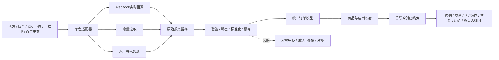

平台适配器必须隔离平台字段和签名差异；领域层只接收合数BOSS标准模型。禁止业务页面直接调用平台接口或使用平台字段驱动客户身份、归因和权限逻辑。

### 8.3 同步、补偿与对账

| 接入方式 | 用途 | 产品规则 |
|---|---|---|
| Webhook/消息 | 新单、支付、关闭、退款等状态实时更新 | 先验签并快速落原始事件，再异步处理；同一来源事件ID幂等 |
| 增量拉取 | 弥补漏回调和历史状态变化 | 默认每5分钟执行一次，按平台能力配置游标/更新时间窗口，不作为平台固定要求 |
| 人工导入 | 未开放接口、历史数据和应急兜底 | 先预校验和预览，生成批次号；逐行返回新增、更新、重复、失败和待确认结果 |
| T+1对账 | 检查前一自然日数据完整性 | 对比订单数、支付金额、退款金额和状态分布，差异生成异常任务 |

所有同步均生成 `IMPORT_SYNC_TASK`，保存平台、店铺、时间窗口、游标、总数、成功数、更新数、跳过数、失败数、失败原因和重试次数；支持按任务重试、按订单重拉、失败明细下载和人工关闭。平台状态变化不得覆盖更高版本数据，乱序事件按平台更新时间、状态版本或业务规则处理。

### 8.4 订单与线索关联规则

1. 先按“平台编码 + 第三方店铺ID + 第三方订单号”查找订单；命中后更新原订单，不创建新记录。
2. 再按已有 `LEAD_ORDER_RELATION`、平台用户ID、手机号哈希、UnionID（平台实际提供时）依次匹配线索或客户。
3. 唯一匹配时建立关系；无匹配时创建新的 `lead_id`；匹配多个对象或身份冲突时进入异常中心，不自动选择。
4. 第一笔触发获客的订单可标记为“来源首单”，后续订单继续关联同一线索/客户，不改变原始来源快照。
5. 订单、线索、客户均使用独立内部编号；业务关联靠关系表，不通过共用一个编号实现。

统一订单至少保存：平台及店铺、第三方订单号、平台用户标识、第三方商品/SKU、数量和金额、订单/支付/退款/售后状态、下单/支付/退款/平台更新/系统同步时间、店铺/商品/IP/IP渠道/IP大类/营期/组织/负责人归因、关联线索/客户/内部商品、同步方式/任务/结果/失败原因/重试次数，以及原始报文和来源事件ID。

### 8.5 手机号解密与结果回传

平台返回的手机号密文只能通过该平台授权接口或经合规授权的服务商能力解密，合数BOSS不得自行推导平台密文算法。只有掩码手机号且没有可查询订单号、平台用户标识或密文时，不能还原手机号，必须进入异常中心补充凭据。

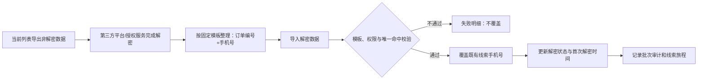

V1.0 引流线索页不提供“同步手机号”操作。平台在线解密能力可以由后端适配器或第三方授权服务单独执行；当前页面闭环统一为“导出非解密数据—外部合规解密—导入解密数据”。页面打开、订单拉取和普通数据导入不得自动触发解密。

导入时系统按菜单、按钮和数据范围权限校验，并只按订单编号覆盖已存在的引流线索手机号。系统不得从导入文件创建新线索，也不得用手机号反向猜测订单或客户；失败明细使用稳定错误码与处理建议。

建议请求模型：`platformCode`、`externalStoreId`、`externalOrderNo`、`sourceCiphertext`、`sensitiveType`、`requestedBy`、`reason`、`requestId`。敏感字段至少保存：`source_mobile_ciphertext`、`mobile_masked`、`mobile_ciphertext`（合数BOSS字段级加密后的密文）、`mobile_hash`、`decrypt_status`、`decrypt_channel`、`decrypted_at`、`decrypted_by`、`decrypt_reason`、`decrypt_task_id`、`decrypt_fail_code`、`decrypt_failure_type`。数据库、消息和应用日志禁止保存手机号明文。

| 来源数据情况 | 处理方式 |
|---|---|
| 已有完整手机号 | 校验后立即转为合数BOSS字段级密文并计算哈希，状态记“无需平台解密” |
| 平台密文 + 订单/授权凭据 | 由平台适配器调用授权解密接口 |
| 掩码手机号 + 可查询订单 | 先查订单详情或平台指定解密能力 |
| 只有掩码手机号 | 进入缺少凭据异常，不允许猜测或拼接 |
| 通过固定模板回传明文 | 按订单编号唯一命中既有引流线索后校验、加密、哈希，来源标记为解密结果导入 |
| 只有UnionID | 可按客户身份规则建档，手机号保持待补充 |

`decrypt_status` 继续使用未解密、解密中、已解密、无需解密、解密失败；失败时用 `decrypt_failure_type=RETRYABLE/FINAL` 区分是否允许再次由用户主动发起。对平台明确禁止的订单状态、额度用尽、授权关闭等错误不得无限重试。

抖店正式调用域名为 `https://openapi-fxg.jinritemai.com`，解密接口路径为 `/order/batchDecrypt`；调用需使用应用和店铺授权的 `access_token` 及签名。抖店要求解密由商家业务动作主动触发，禁止在批量拉取存量订单时自动解密、失败后无限轮询，以及为查看单个字段而同时解密无关字段；具体参见[批量解密接口清单](https://op.jinritemai.com/docs/api/84/7277?docLabel=&from=list)、[调用合规治理公告](https://op.jinritemai.com/docs/question-docs/21/2196)和[加解密字段说明](https://op.jinritemai.com/docs/g/115/4192?docLabel=&from=list)。其他平台的实际解密路径、可解密状态、次数额度和数据保留期在取得账号权限后逐一补入接口台账，不得套用抖店接口。

### 8.6 使用第三方解密服务的约束

- 必须具备平台应用/店铺正式授权和数据处理协议；优先采用 OAuth 或平台应用授权，不向普通服务商直接提供 AppSecret；
- 明确服务商需要的订单号、密文和授权凭据，确认是否支持批量、可解密订单状态、额度、限流、明文返回方式和测试环境；
- 明确敏感数据留存周期、传输与存储加密、访问审计、授权撤销后的删除与停用机制；
- 每次请求必须有 `requestId`、申请人、用途和订单范围，可追踪到平台响应；
- 合数BOSS只接收业务必需字段，解密结果不得写入通用日志、报错堆栈、导入失败文件或前端缓存。

### 8.7 领域接口与事件

主要接口：线索接入、文件导入、线索查询、三方订单回调/增量同步/单笔重拉、手机号解密任务、分配试算、执行分配、活码创建、企微事件回调、渠道映射、对账和任务查询。

主要事件：`lead.received`、`lead.cleaned`、`external_order.received`、`external_order.updated`、`mobile.decrypt_requested`、`mobile.decrypted`、`mobile.decrypt_failed`、`lead.assigned`、`lead.assignment_failed`、`qr_code.created`、`wechat.friend_added`、`lead.customer_linked`。事件必须包含事件ID、来源、业务主键、发生时间、版本和追踪号，并支持重放和补偿。

## 9. 权限要求

- 菜单权限控制各二级页面；
- 按钮权限控制导入解密数据、导出非解密数据、手机号变更、客户档案合并、编辑、无效、跟进、分配、改派、规则发布和活码下载；
- 数据权限支持本人、本组织及下级、自定义组织和全部；
- 手机号、UnionID和原始来源参数按字段权限展示；
- 导出、批量分配、规则发布和跨组织改派记录审计。

## 10. 验收标准

- [ ] 引流与三方品共用主模型，同时保留差异字段和独立模板；
- [ ] API、Webhook和文件导入重复提交不产生重复线索；
- [ ] 人工指定可按组织架构选择任意在职、启用员工且不受引流期次活码名单和人数上限限制；轮询按最新启用引流期次活码人员名单及人数上限执行；两种方式均可追溯和重试；
- [ ] 达到活码配置最大分配上限的员工仍可被管理员人工指定，但不得参与自动轮询；
- [ ] 规则按“触发—条件—动作”分类配置；活码分配规则和营期名单流转规则字段、试算结果及执行对象互不混用；
- [ ] 上一引流期次员工达到最小有效分配量和转化率阈值后可幂等加入下一引流期次名单；未达阈值、离职停用、重复人员和失败原因均可解释；
- [ ] 已发布规则不能被直接覆盖；编辑、发布、停用和回退均保留版本、操作人、时间、前后值和执行快照；
- [ ] 无可用员工时线索保留在待分配队列；
- [ ] 新旧活码均能接收并关联扫码、加微结果；
- [ ] 员工停用后不再接待新客户，并正确切换备用人员；
- [ ] 渠道管理的数据分析页签指标可下钻并与线索明细核对；
- [ ] 字段、分配、活码和关联异常能够进入异常中心并补偿；
- [ ] 线索转客户后历史线索和分配记录完整保留。
- [ ] 搜索常用项与更多条件均可组合查询，重置后条件全部清空；
- [ ] 每条线索可查看完整生命旅程，关键变更包含前后值、操作人、来源、发生时间及追踪号，且不可删除。
- [ ] 批量分配、同步订单、短信群发、导入解密数据和导出非解密数据只从列表批量操作进入，并生成可追踪记录；
- [ ] 表格字段设置可即时生效并在重新进入页面后恢复，订单编号、线索来源和操作始终展示，订单编号位于第一业务列；引流线索的IP大类默认展示并可隐藏。
- [ ] 三方订单按“平台编码 + 第三方店铺ID + 第三方订单号”幂等，重复回调、拉取和导入不产生重复订单；
- [ ] 手工导入有订单号、有第三方线索ID和两者均无三种场景均能生成稳定来源记录编号，并对潜在重复记录提示而不误合并；
- [ ] 一条内部线索记录可关联多笔订单，内部关系主键、内部订单编号和第三方订单号相互独立且可追溯；业务页面不展示内部线索编号；
- [ ] Webhook、增量拉取、人工导入和T+1对账均生成可追踪任务，支持失败重试、单笔重拉和差异处理；
- [ ] V1.0页面不提供同步手机号；导入解密数据只能由有权限用户发起，必须按订单编号唯一命中既有引流线索并记录完整审计；
- [ ] 已有明文、平台密文、掩码加订单、只有掩码、人工明文和仅UnionID六类数据能按规则处理；明文不写数据库、日志和消息；
- [ ] 平台禁止解密、额度用尽、授权失效和缺少凭据能够区分可重试/终态失败，禁止无限重试。
- [ ] 有效问卷提交后按发布版本生成可解释的S/A/B/C或未定级结果，重复回调不重复评级；
- [ ] 引流线索列表不展示编辑线索、添加跟进和变更线索等级操作；线索等级仅由问卷规则自动计算，客户等级仍可在客户中心独立编辑并留痕；
- [ ] “是否挖需”支持按是/否筛选；未挖需可在列表勾选并二次确认，成功后不可取消，重复提交不重复写日志，旅程可追溯标记人和时间；
- [ ] 新客户准确继承线索当前等级，命中存量客户时只生成差异候选，线索、客户和等级历史口径一致；
- [ ] 业务讲解版流程、研发全景、两阶段归因、状态模型和三层指标口径均可在本文档内直接评审，无需跳转其他现行文档。

## 11. 发布与回滚

- 接入适配器、分配规则和归因规则均按版本及功能开关发布；
- 新分配规则先试算和灰度，异常时切回上一已发布版本；
- 新活码异常时停用新活码并恢复旧活码或备用接待；
- 解密数据导入不创建记录；发现误导入时只能由受权人员按批次执行手机号字段修复并追加反向审计，不允许删除线索旅程或直接覆盖审计历史；
- 回滚不得删除线索、分配、企微事件、客户关联和审计历史。

## 12. 待确认事项

- 各营期不同岗位的默认最大分配上限及调整审批人；
- 各营期无可用员工时的兜底人员；
- 渠道首触、末触及辅助归因口径；
- 旧活码数据接口、字段和事件覆盖范围；
- 引流与三方品扩展字段最终清单。
- 百度系订单的实际交易承载系统及开放平台应用负责人；
- 快手、微信小店、小红书和百度电商的正式应用、店铺授权、回调范围、敏感字段接口、额度及保留期限；
- 各平台订单、商品、退款状态映射表及T+1对账负责人；
- 第三方解密服务商的授权方式、数据处理协议、安全评审和退出清除方案。

## 13. 版本记录

| 版本 | 日期 | 内容 |
|---|---|---|
| V1.61 | 2026-09-01 | 线索概览全局筛选新增IP大类多选项并统一读取启用字典；引流线索列表新增IP大类默认字段，展示归因快照对应中文名称并纳入可记忆字段设置 |
| V1.60 | 2026-08-31 | 引流线索综合关键词拆分为客户、订单、商品三组独立筛选；客户支持客户手机号与客户名称/微信昵称下拉切换，商品支持商品名称与商品ID下拉切换；新增与客户列表一致的线索标签分源搜索和多选筛选，多个标签按 OR 关系命中 |
| V1.59 | 2026-08-31 | 修改加微状态选择已加企微时必须搜索并关联有效客户，关联客户位于加微时间上方；选中后自动带出只读的客户添加时间，提交时再次校验并绑定线索；已加个微仍人工填写时间；单条更多移除变更线索标记操作，保留筛选和展示 |
| V1.58 | 2026-08-31 | 经营数据在加微率前新增“有效线索数”，仅展示数量并支持下钻；引流期次名称调整为全局唯一，新增、编辑、批量预览内部及批量与已有期次重名时均阻止保存，不再自动跳过 |
| V1.56 | 2026-08-28 | 引流线索新增“线索标签”默认字段：列表最多展示2个及“+N”，点击按企业微信/BOSS人工/系统规则分组查看全部标签，并支持添加不重名的BOSS人工标签；三方品线索不展示该字段 |
| V1.53 | 2026-08-28 | 线索概览链路名称统一为“转化链路”；未筛选期次和期次时间、仅筛选线索创建时间时，按线索创建时间汇总并贯穿指标、下钻和导出 |
| V1.54 | 2026-08-28 | 经营模块统一命名为“经营数据”；单期一行，多期展示汇总及各期次行，不选期次时正常汇总且期次列留空 |
| V1.55 | 2026-08-28 | 经营数据过程转化新增DAY1/2/3到课率与完课率；右上角新增可记忆表头字段设置，期次列固定不可取消 |
| V1.52 | 2026-08-27 | 同步当日最终确认：引流期次批量创建补回按月/按年并拆分固定周期与期次时长，预览名称和起止时间可编辑；渠道列表移除归因规则、负责人、上级渠道；店铺移除负责人/权限、详情和业务发生口径并统一全部期次；IP移除当前IP、IP配置、关联商品/平台并统一字段顺序；商品移除关联IP；成交趋势展示成交订单数与成交金额 |
| V1.51 | 2026-08-27 | 首页线索概览移除预约直播、到课、完课和商品分析，筛选支持多选并拆分期次时间与线索创建时间；引流线索页面移除当前待办展示和筛选，新增默认展示的解密前手机号 |
| V1.50 | 2026-08-27 | 引流期次移除阶段概念；批量创建由目标月份改为期次开始时间，默认按开始日期 YYYYMMDD 命名，并支持在预览中逐条修改期次名称 |
| V1.49 | 2026-08-27 | 引流线索单条及批量“变更期次”支持独立变更所属期次、所属直播组，可只改一个或同时修改，未勾选维度保持原值 |
| V1.48 | 2026-08-27 | 引流期次的期次阶段新增“待开始”和“已停用”，完整枚举为待开始、接量期、转化期、追单期、已停用 |
| V1.45 | 2026-08-26 | 同步订单调整为无需勾选线索的全局后台任务，继续按平台勾选顺序创建任务；引流线索筛选、列表、详情及字段说明中的“所属营期”统一更名为“所属直播组”，底层兼容沿用 `camp_id/camp_name` |
| V1.44 | 2026-08-26 | 引流线索单条操作新增变更手机号：补充新手机号预校验、已占用禁止覆盖、同一一转负责人允许人工确认合并、跨负责人阻断、主档保留、关联数据迁移、二次校验、幂等、审计和回退要求 |
| V1.43 | 2026-08-25 | 引流线索移除编辑线索、添加跟进和变更线索等级操作；新增“是否挖需”列表列与是/否筛选，支持未挖需单向勾选、确认后锁定，并记录标记人、时间及只追加旅程事件 |
| V1.41 | 2026-08-25 | 商品同步入口重构为“同步所有商品”与抖店、百度、小红书、快手、微信小店单平台任务；新增商品下方“短信配置”，按短信分组、商品、活码配置购买后、授权后和手动提醒，并与业务配置短信管理划清边界 |
| V1.42 | 2026-08-25 | 线索概览按产品确认从营期经营列表回退为卡片式经营看板；保留渠道分析、IP渠道分析、商品分析、成交趋势、关键指标下钻和当前营期完整报表导出 |
| V1.40 | 2026-08-25 | 首页线索概览新增营期经营报表条、IP渠道分析、商品分析和关键指标下钻；完整报表统一导出经营概览、IP渠道、商品三个数据区，金额指标规范为毛GMV、退款金额和净GMV |
| V1.38 | 2026-08-24 | 引流线索列表移除线索编号展示；订单编号调整为第一业务列并固定左侧，同时从表格设置、综合搜索、详情/旅程标题、等级调整及导出文件移除线索编号；数据库继续保留不对外展示的内部关系主键 |
| V1.37 | 2026-08-24 | 引流线索页移除新增线索、同步手机号和查询异常订单；导入收敛为固定模板解密数据回传，按订单编号唯一命中并仅覆盖既有线索手机号；导出收敛为当前查询结果中的未解密线索订单，并补充失败码、脱敏、审计、验收与回滚口径 |
| V1.0 | 2026-08-17 | 从主需求文档独立形成线索中心专项需求 |
| V1.1 | 2026-08-17 | 移除线索分配独立菜单，将分配操作、失败处理及分配历史并入引流线索和三方品线索页面 |
| V1.17 | 2026-08-18 | 三方品线索调整至 V1.5；V1.0 移除菜单入口并不纳入验收，保留统一线索模型及扩展字段设计 |
| V1.2 | 2026-08-18 | 线索状态调整为待分配至已测评的生命周期；新增有效/无效/重复线索标记；转化状态统一为未转化、已转化 |
| V1.3 | 2026-08-18 | 优化列表常用/更多搜索条件和操作分组；新增只追加的线索生命旅程日志与验收要求；移除历史负责人列表字段 |
| V1.4 | 2026-08-18 | 操作列收敛为详情、旅程、更多并移除确认加微；线索进入方式更名为添加方式；日期筛选调整为可选日期类型与日期区间 |
| V1.5 | 2026-08-18 | 新增列表级批量操作并将同步、导入、导出、异常查询和分配从单条操作移出；新增可记忆的表格字段设置，固定展示线索编号、线索来源和操作 |
| V1.6 | 2026-08-18 | 新增引流线索页面交互与功能规格，补充11个页面/交互状态截图、跳转关系、字段展示、状态联动、权限异常、接口和验收标准 |
| V1.7 | 2026-08-18 | 将引流线索页面交互规格、字段状态说明、11张页面截图及页面级验收完整合并到线索中心需求文档，取消独立规格文档跳转 |
| V1.8 | 2026-08-18 | 将11张引流线索原型截图转为文档内嵌图片数据，文档可直接显示图片且不再依赖外部图片目录 |
| V1.9 | 2026-08-18 | 修复部分Markdown编辑器将Base64图片数据显示为乱码的问题，恢复标准Markdown图片展示格式 |
| V1.10 | 2026-08-18 | 废弃单线生命周期，改为当前待办状态与分配、解密、短信、加微、问卷、测评等独立状态；细化线索接入后的并行处理、汇合条件、异常补偿和转化流程 |
| V1.11 | 2026-08-18 | 线索列表新增第三方商品ID，默认展示在线索来源之后；同步补充搜索、表格设置、详情、新增、数据模型及“平台+商品ID”组合匹配规则 |
| V1.12 | 2026-08-18 | 线索中心新增数据分析模块，补充线索至成交漏斗、直播过程、退款与GMV、团队效能指标字典、筛选下钻、口径版本和验收要求 |
| V1.13 | 2026-08-18 | 批量分配收敛为人工指定和轮询两种方式；人工指定新增组织到人员选择；轮询改为按最新营期活码名单执行；原员工负载统一为活码人员最大分配上限 |
| V1.14 | 2026-08-18 | 人工指定新增员工姓名/员工编号搜索框；搜索与组织范围组合生效，支持实时筛选、清空恢复和无结果空状态 |
| V1.15 | 2026-08-18 | 人工指定取消营期活码名单和最大分配人数限制，仅校验员工在职及账号启用；活码名单与人数上限只约束轮询分配 |
| V1.16 | 2026-08-18 | 完善活码管理页面与配置规则：所属营期和接量日期区间必填，所属班级选填且受营期联动；新增员工轮询容量、列表、详情、启停及审计要求 |
| V1.18 | 2026-08-18 | 活码管理新增左侧活码分组和分组筛选；列表新增创建人及活码标签，标签拆分为企微标签和内部标签；同步补充分组、创建人、标签配置及审计规则 |
| V1.19 | 2026-08-18 | 所属营期和接量日期区间调整为选填；未选营期按通用活码保存，未设日期按长期有效处理；同步调整状态计算、班级联动与校验规则 |
| V1.20 | 2026-08-18 | 新增可交互店铺管理页面需求：明确平台类型、店铺名称、第三方店铺ID、负责人字段，补充新增、编辑、启停及组织/员工/操作三级店铺权限规则与验收标准 |
| V1.21 | 2026-08-18 | 店铺列表新增线索/加微、下单/支付和净GMV；新增店铺经营详情，覆盖转化漏斗、趋势、订单退款、商品归因和归因异常；补充指标字典、归因规则及验收标准 |
| V1.22 | 2026-08-18 | 店铺档案筛选新增创建、更新、启停日期；经营指标独立增加线索归因/业务发生两类口径、业务日期类型、日期区间和营期，禁止使用下单时间统一计算全链路指标 |
| V1.23 | 2026-08-18 | 移除 IP 管理独立菜单；渠道分析合并到渠道管理，页面采用渠道列表/数据分析双页签并保留独立权限、筛选和下钻能力 |
| V1.24 | 2026-08-19 | 线索配置重构为可扩展规则中心；首批明确活码分配与营期名单流转两类规则，补充统一规则模型、触发条件动作、员工转化率口径、最小样本、试算、冲突、幂等、版本及验收要求 |
| V1.25 | 2026-08-19 | 引流线索和数据分析统一增加权限范围、数据视图、公司/部门/小组级联及当前线索负责人筛选；明确候选项权限裁剪、当前归属与历史快照口径 |
| V1.36 | 2026-08-24 | 数据分析迁移并更名为“首页—线索分析”，新增店铺、IP渠道和IP名称筛选；引流线索、线索分析、客户及订单共用筛选移除员工状态条件 |
| V1.39 | 2026-08-24 | 首页模块仅保留“线索概览”，原线索分析统一更名；登录默认入口及历史 `/dashboard` 地址均进入 `/leads/analytics` |
| V1.26 | 2026-08-19 | 新增问卷自动评定线索SABC等级、人工改级、客户首次建档继承、存量客户差异候选及线索配置等级规则；明确人工结果优先和完整评级历史 |
| V1.27 | 2026-08-19 | 新增线索中心流转全景图，统一标注来源接入、清洗幂等、分配/解密/订单并行、活码加微、客户唯一身份、问卷等级、转化退款、异常审计及 V1.0/V1.5 边界 |
| V1.28 | 2026-08-20 | 恢复店铺管理后的IP列表菜单；新增IP大类列、筛选及字典联动，初始大类为教育规划；明确IP名称采用老师名称口径并以“阿留皮皮”为示例 |
| V1.29 | 2026-08-21 | IP列表新增IP渠道和稳定渠道编号；初始渠道为店播/CH000001、阿留专属/CH000002；新增独立商品列表及IP下钻、同步、筛选、导出和备注规则 |
| V1.30 | 2026-08-21 | IP列表将“IP类别”统一升级为“IP大类”，新增独立“大类编码”展示及表单自动带出；大类编码复用 `ip_category` 字典项值，保持历史数据和接口兼容 |
| V1.31 | 2026-08-21 | 优化IP列表信息层级：取消独立“大类编码”列，编码改在“IP大类”名称下方展示；新增编辑表单仍在IP大类下方自动带出只读编码 |
| V1.32 | 2026-08-21 | IP编号调整至IP名称下方展示；IP列表新增页内IP配置，统一维护IP名称—IP大类—IP渠道关系；活码管理新增关联IP并自动带出只读IP渠道，补充历史归因快照与验收规则 |
| V1.33 | 2026-08-21 | 新增线索关键节点流程与讲解文档，统一接入、清洗、活码分配、两阶段归因、问卷直播转化和三层统计口径；补充线索归因关系表与对内外讲解话术 |
| V1.34 | 2026-08-24 | 汇总抖店、快手、微信小店、小红书和百度电商接入入口；新增Webhook/增量拉取/导入/对账架构、订单与线索独立编号及幂等规则、手工导入兜底、主动解密流程、敏感数据安全、第三方解密约束和验收标准 |
| V1.35 | 2026-08-24 | 合并关键节点讲解、研发流转全景和线索等级继承三份补充文档；新增六段式流程、研发判断点、两阶段归因关系、统一指标口径、对内外讲解话术及完整等级规则，本文档成为线索中心唯一现行需求入口 |
| V1.46 | 2026-08-26 | 引流线索单条“更多”新增“修改加微状态”；固定支持否、已加企微、已加个微，提交后刷新列表并追加线索旅程与审计记录，禁止覆盖历史身份数据 |
