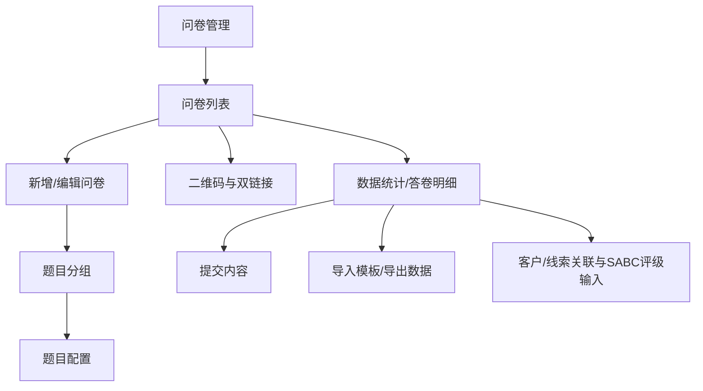
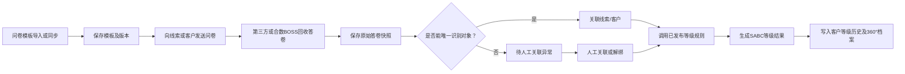
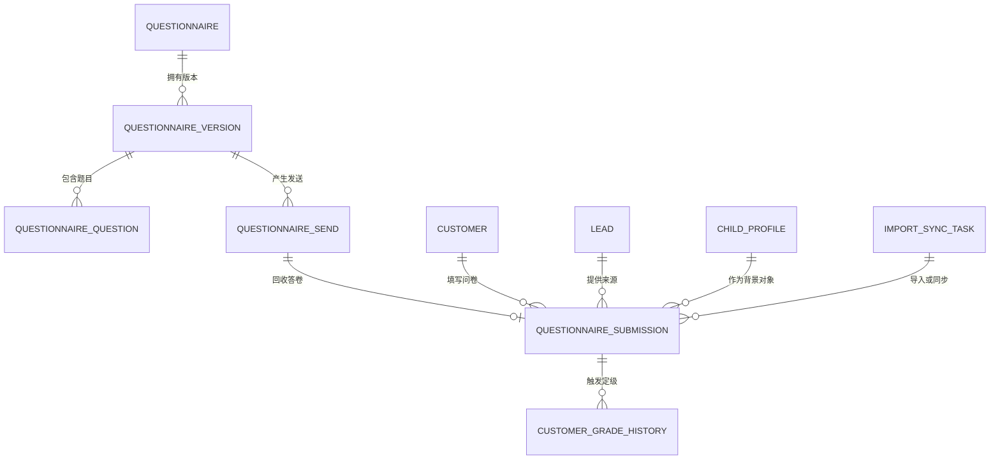

# 合数BOSS V1.0——问卷管理详细需求

| 文档属性 | 内容 |
|---|---|
| 所属项目 | 合数BOSS重构项目 |
| 所属版本 | V1.0 |
| 一级菜单 | 问卷管理 |
| 文档版本 | V1.2 |
| 文档状态 | 产品需求评审稿 |
| 更新日期 | 2026-08-26 |

## 1. 文档目标

问卷管理统一承接问卷模板、发送、回收、同步、答卷、客户关联和SABC定级输入，使每次问卷结果能够追溯到发送人、填写人、模板版本、原始答案和定级规则版本。

V1.0只有“问卷列表”一个二级菜单。测评管理和测评列表属于V2.0，不在本模块中混建。

## 2. 范围与菜单

新增编辑、二维码、答卷明细、导入导出、关联异常和定级结果通过列表操作及弹窗承载，不新增左侧菜单。问卷对外投放通过填写链接或二维码完成，企微查询使用独立只读链接。

## 3. 核心业务流程

## 4. 页面与交互

### 4.1 问卷列表

页面顶部支持按问卷名称模糊查询、启用状态筛选、查询、重置和添加问卷。列表字段如下：

| 字段 | 说明 |
|---|---|
| 问卷名称 | 展示名称，下方展示题目分组数和题目数 |
| 是否启用 | 启用/停用标签；启用后填写链接可提交 |
| 介绍语 | 问卷填写页的业务说明 |
| 企微标签 | 答卷有效提交后需同步的企业微信标签，可多值 |
| 回收答卷 | 已提交答卷数量，点击可进入数据统计 |
| 创建时间 | 问卷首次创建时间 |
| 操作 | 编辑、删除、二维码、数据统计 |

默认按创建时间倒序。已产生答卷的问卷不得物理删除，只允许停用；未产生答卷的草稿问卷删除前二次确认。列表需提供加载中、空数据、请求失败和无搜索结果状态。

### 4.2 新增/编辑问卷

编辑弹窗采用左右双栏：左侧维护问卷信息，右侧维护题目分组和题目。字段及规则如下：

| 区域 | 字段/能力 | 规则 |
|---|---|---|
| 问卷信息 | 问卷名称 | 必填，同一有效问卷名称不可重复 |
| 问卷信息 | 介绍语 | 选填，展示于填写页头部 |
| 问卷信息 | 头部图片/底部图片 | 选填，支持预览、替换和删除；需限制文件类型及大小 |
| 问卷信息 | 问卷状态 | 停用/启用；至少存在1道有效题目后方可启用 |
| 问卷信息 | 企微标签 | 选填、多选；提交成功后按配置同步，失败进入重试任务 |
| 题目分组 | 分组标题/描述 | 标题必填；支持新增、删除、折叠、展开和拖动排序 |
| 题目 | 题目名称 | 必填；同一分组内排序稳定 |
| 题目 | 题目类型 | 输入框、文本域、单选组、多选组、省市区 |
| 题目 | 是否必填/输入提示 | 必填校验在提交时执行，错误定位到具体题目 |
| 题目 | 选项 | 单选组、多选组必须至少配置2个不重复选项 |

编辑已产生答卷的问卷时，不得直接改变历史题目结构；结构变化需生成新版本，历史答卷继续关联提交时版本和题目快照。

### 4.3 二维码与链接

点击“二维码”展示问卷二维码、填写链接和企微查询链接，并提供分别复制。二维码内容必须指向当前已发布版本；问卷停用后填写链接显示停用页，不得新提交，但企微查询链接仍可查询历史答卷。复制成功或失败均需明确反馈。

### 4.4 数据统计与答卷记录

点击“数据统计”打开该问卷答卷页，筛选项至少包括物流单号、地址、提交状态、用户昵称、登录手机号、下单手机号、是否成交、跟进人、是否发货、是否退款、是否售后、提交时间和支付时间。

答卷列表至少展示用户、问卷姓名、登录手机号、下单手机号、问卷手机号、历史修改手机号、物流单号、地址、提交状态、提交时间和操作。操作包含“编辑”和“提交内容”：

- “提交内容”只读展示提交时题目与答案快照、关联对象、问卷得分和建议线索等级；
- “编辑”仅允许具备权限的人员补充物流单号、地址等运营字段，不得覆盖原始答案；
- 手机号等敏感字段按字段权限脱敏，查看明文与导出均记录审计；
- 筛选无结果时保留筛选条件并展示空状态，不能误显示全量数据。

### 4.5 导入与导出

支持下载标准导入模板、导入补充答卷运营字段、导出当前筛选结果和导出一转数据。导入需生成后台任务并展示总数、成功、重复、失败和失败原因；重复数据按答卷唯一键更新允许补充的字段，不得重复创建答卷。导出严格应用当前用户数据范围、字段权限和脱敏规则。

## 5. 模板与版本规则

- 问卷编号稳定，列表中的问卷名称可调整，模板每次结构变化生成新版本；
- 已发布版本不可直接修改，编辑产生草稿新版本；
- 答卷永久关联填写时的模板版本和题目快照；
- 题目删除、选项调整和分值改变不得影响历史答卷；
- 停用问卷后填写链接不能新提交，但二维码、历史答卷、企微查询链接和定级仍可查询；
- 外部问卷保留来源系统、外部问卷ID和外部版本；
- 标准模板导入必须校验题目编码和选项编码稳定性。

## 6. 身份关联规则

1. 优先使用UnionID匹配客户；
2. 其次使用已校验手机号；
3. 可使用已确认的外部客户编号或发送任务与线索/客户的绑定关系；
4. 同一标识命中多个客户时不得自动选择；
5. 两种身份分别命中不同客户时进入撞单或问卷关联异常；
6. 无法唯一匹配时保存答卷但标记待处理，不丢弃数据；
7. 人工关联、解绑或改绑必须填写原因、具备权限并保存审计；
8. 孩子仅作为答卷背景关联，问卷填写人和客户主体仍为家长。

## 7. SABC定级

问卷管理负责提供原始答案和解析结果；“线索配置—等级规则”负责规则配置、试算、发布和版本；客户列表负责查看当前等级、人工调整及等级历史。线索和客户共用 `lead_customer_grade` 字典的 S/A/B/C 值；有效答卷优先对关联线索自动评级，新客户首次建档继承线索当前等级，建档后客户等级独立维护；完整规则见《[合数BOSS V1.0——线索中心需求文档](./合数BOSS V1.0线索中心需求文档.md)》第 5.4.6 节。

定级结果必须保存问卷版本、答卷编号、等级规则版本、总分、各维度得分、必要条件、命中规则、计算时间和是否当前有效。

重新同步、重新解析或规则重算必须产生新的等级记录，不覆盖旧结果。未命中有效规则时客户显示“未定级”，并记录未命中原因。

## 8. 状态模型

| 对象 | 状态 |
|---|---|
| 问卷模板 | 草稿、已发布、已停用 |
| 发送记录 | 待发送、发送中、已发送、发送失败、已失效 |
| 答卷 | 待解析、已解析、解析失败、待关联、已关联、已作废 |
| 同步任务 | 待执行、执行中、成功、部分成功、失败、已取消 |
| 定级 | 未计算、计算成功、未命中、计算失败、已失效 |

问卷状态、发送状态、答卷状态、关联状态和定级状态分别保存。

## 9. 核心数据模型

原始答卷与解析结果分开保存；原始报文只追加不覆盖；外部答卷以来源系统和外部答卷ID幂等；发送任务、答卷、客户关联和等级结果均保留历史。

## 10. 异常处理

以下情况进入页面异常队列并同步异常中心：模板结构不兼容、题目编码缺失、答卷解析失败、UnionID/手机号冲突、命中多个客户、发送失败、重复答卷内容冲突和定级规则执行失败。

异常支持查看原始数据、重新解析、重新关联、忽略、关闭和重试。忽略必须填写原因，不得删除原答卷。

## 11. 接口与事件

主要接口：问卷同步、模板导入、问卷查询、发送、答卷回调/导入、答卷关联、重新解析和定级触发。

主要事件：`questionnaire.published`、`questionnaire.sent`、`questionnaire.submitted`、`questionnaire.link_failed`、`questionnaire.linked`、`customer.grade_calculated`。回调和同步按外部事件ID或答卷ID幂等。

## 12. 权限要求

- 菜单权限控制问卷列表；
- 新增、编辑、删除、启停、二维码、模板导入、查看完整答案、人工关联、解绑和导出分别配置按钮/字段权限；
- 问卷答案、手机号、UnionID和诊断相关敏感信息按字段权限脱敏；
- 数据范围按问卷适用组织、发送人、客户负责人和授权角色计算；
- 人工关联、解绑、导出和模板发布记录审计。

## 13. 验收标准

- [ ] 问卷列表支持名称/状态筛选、查询、重置、分页和明确状态反馈；
- [ ] 新增/编辑支持问卷基础信息、图片、企微标签、题目分组和五类题型；
- [ ] 启用前校验至少存在1道有效题目；
- [ ] 二维码、填写链接和企微查询链接可生成、复制并对应正确问卷版本；
- [ ] 数据统计支持业务筛选、答卷查看、授权补充、模板导入和按权限导出；
- [ ] 已产生答卷的问卷模板不能覆盖或物理删除；
- [ ] 原始答卷、模板版本和题目快照完整保留；
- [ ] 答卷可按UnionID或手机号唯一关联线索/客户；
- [ ] 多客户冲突时进入异常，不自动选择；
- [ ] 人工关联或解绑可审计；
- [ ] 问卷结果可触发可解释的SABC定级并保留等级历史；
- [ ] 重新定级不覆盖旧结果；
- [ ] 导入、同步和回调重复提交不产生重复答卷；
- [ ] 测评管理不会出现在V1.0菜单中。

## 14. 发布与回滚

- 问卷模板和等级规则均采用版本发布；
- 新模板先灰度发送，异常时停用新版本并恢复上一版本；
- 错误客户关联通过解绑及重新关联恢复；
- 错误定级通过失效错误结果并生成新结果恢复；
- 同步适配器异常时关闭自动同步，切换人工导入；
- 回滚不得删除发送记录、答卷、原始报文、关联历史和等级历史。

## 15. 待确认事项

- V1.0使用的问卷来源系统和接口负责人；
- 标准模板与历史问卷字段映射；
- 问卷重复发送时间窗；
- SABC等级规则的业务负责人和发布审批人；
- 哪些问卷必须关联孩子背景；
- 历史答卷可迁移范围和身份覆盖率。

## 16. 版本记录

| 版本 | 日期 | 内容 |
|---|---|---|
| V1.0 | 2026-08-17 | 从主需求文档独立形成问卷管理专项需求 |
| V1.1 | 2026-08-19 | 明确有效问卷自动评级线索、等级规则统一在线索配置维护，以及新客户首次建档继承线索当前等级 |
| V1.2 | 2026-08-26 | 按现行原型重构问卷列表、新增编辑、题目分组、五类题型、二维码双链接、答卷统计、模板导入和权限导出规格 |
