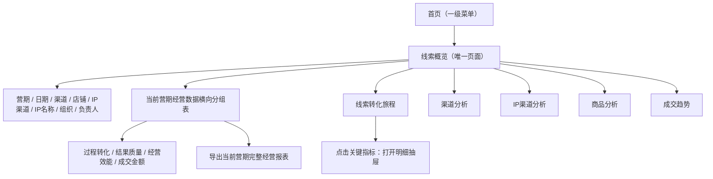

# 合数BOSS V1.0——首页详细需求

| 文档属性 | 内容 |
|---|---|
| 所属项目 | 合数BOSS重构项目 |
| 所属版本 | V1.0 |
| 一级菜单 | 首页 |
| 文档版本 | V1.7 |
| 文档状态 | 产品需求评审稿 |
| 更新日期 | 2026-08-25 |

## 1. 文档目标

首页是合数BOSS的经营入口，一级菜单下仅保留“线索概览”一个页面。线索概览承接原“线索分析”能力，用于查看线索全链路经营表现，不再提供独立“首页工作台”页面或入口。

线索概览不生成独立业务数据，只聚合各模块统计结果并下钻原始业务页面；所有数据必须遵循当前员工的数据岗位范围、业务角色功能权限和字段权限。

## 2. 页面信息架构

| 页面区域 | V1.0内容 |
|---|---|
| 线索概览 | 以当前所选营期为主体展示横向分组经营数据表；集中展示过程转化、结果质量、经营效能、成交金额以及渠道、IP渠道、商品和成交趋势，支持指标下钻、分区导出和当前营期完整报表导出 |

## 3. 页面与交互详细说明

### 3.1 页面入口与默认行为

- 点击一级菜单“首页”仅展开“线索概览”一个二级菜单，不再展示其他首页下级页面；
- “线索概览”使用 `/leads/analytics`，是登录成功后的默认页面和不可关闭的固定首页页签；
- 历史 `/dashboard` 地址自动跳转到 `/leads/analytics`，不得继续渲染旧工作台；
- 原线索分析统一更名为“线索概览”，保留原渠道分析，并扩充营期经营报表、IP渠道分析和商品分析；
- 首次进入默认选择当前有效营期，并加载该营期最近7日和当前用户默认数据范围；用户可切换其他单一营期；
- 页面刷新、打开其他系统页签后返回、关闭浏览器后再次登录，均恢复该用户最近一次成功查询条件；已失效或已无权限的筛选值自动清除并提示；
- 主管可按授权组织切换，普通员工只能查看本人或已特别授权的数据；任何筛选、下钻和导出均不得突破当前权限范围。

### 3.2 页面区域与展示顺序

| 顺序 | 页面区域 | 详细说明 |
|---|---|---|
| 1 | 页面标题区 | 展示“线索概览”、页面说明、指标口径和刷新数据 |
| 2 | 权限与业务筛选区 | 展示权限范围、数据视图、归属组织、负责人、营期、日期、来源渠道、店铺、IP渠道和IP名称 |
| 3 | 营期经营数据 | 采用横向分组表展示当前营期；左侧固定营期名称，表头依次分为过程转化、结果质量、经营效能、成交金额，右上角保留“导出数据”入口 |
| 4 | 线索转化旅程 | 按有效线索、加微、问卷、预约、到课、完课、成交展示阶段人数和环节转化率，并补充当前在线、退款等结果信号 |
| 5 | 指标下钻 | 营期经营数据中的可下钻指标点击后打开原有明细抽屉；下沉数据、渠道、IP渠道、商品和趋势区域的结构及交互保持不变 |
| 6 | 渠道分析 | 展示来源渠道效果对比，支持指标下钻与独立导出 |
| 7 | IP渠道分析 | 展示IP渠道效果对比，支持指标下钻与独立导出 |
| 8 | 商品分析 | 展示商品、店铺、IP与成交效果，支持指标下钻与独立导出 |
| 9 | 成交趋势 | 展示当前营期按日期聚合的成交数、净GMV等趋势 |
| 10 | 指标明细抽屉 | 点击关键人数打开，不离开当前页面；展示订单、客户、来源、店铺、商品、IP归因、负责人、负责人组织和事件时间 |

### 3.3 筛选项说明

| 筛选项 | 控件与数据来源 | 默认值 | 联动与校验规则 |
|---|---|---|---|
| 权限范围提示 | 只读提示 | 当前岗位可见范围 | 仅提示权限上限，不允许用户自行扩大 |
| 数据视图 | 下拉：全部授权数据、我的数据 | 全部授权数据；普通员工固定为我的数据 | 选择“我的数据”后负责人固定为本人；无公司级权限时不展示超范围选项 |
| 归属组织 | 可搜索公司—部门—小组树 | 当前岗位默认组织范围 | 选择上级包含其全部下级；负责人候选人随组织缩小 |
| 当前线索负责人 | 支持姓名、员工编号搜索 | 全部可见负责人 | 仅展示所选组织和权限范围内员工；离职员工历史数据仍可查询 |
| 所属营期 | 可搜索单选下拉，V1.0 来源为外部/历史系统同步的只读营期库；V2.0 由交付中心统一维护 | 当前有效营期 | 切换后整页看板统一刷新；店铺、IP渠道、IP名称筛选继续生效 |
| 日期区间 | 日期范围 | 当前营期最近7日 | 开始日期不得晚于结束日期；不得超出系统允许查询范围 |
| 来源渠道 | 可搜索下拉，来源为渠道管理 | 全部渠道 | 选择后联动店铺、商品和渠道分析，未匹配选项自动清空 |
| 店铺 | 可搜索下拉，来源为店铺管理 | 全部店铺 | 受来源渠道约束；按第三方店铺ID统计，不按名称模糊归并 |
| IP渠道 | 可搜索下拉，来源为IP配置 | 全部IP渠道 | 选择后IP名称仅显示该渠道下的IP |
| IP名称 | 可搜索下拉，来源为IP列表 | 全部IP | 以IP编号作为查询身份，名称仅用于展示 |
| 查询 | 主按钮 | — | 统一提交全部筛选；查询成功后更新URL查询快照和用户偏好 |
| 刷新数据 | 页面按钮 | — | 保留筛选条件重新请求数据，不重置筛选 |

筛选条件对转化主链路、指标、金额、渠道、IP渠道、商品、趋势、下钻和导出统一生效。跨模块跳转时携带筛选快照：`period`、`dateStart`、`dateEnd`、`sourceChannel`、`storeId`、`ipChannelCode`、`ipId`、`organizationId`、`ownerId`、`viewScope`和`metricVersion`。手机号、UnionID等敏感身份不得写入URL。

### 3.4 点击、下钻与跳转总规则

- **本页抽屉**：点击指标数字先在当前页打开明细抽屉，不新增顶部页签；抽屉继承点击时的筛选、指标、维度、数据权限和字段权限快照；
- **跨模块跳转**：从明细抽屉点击业务对象时，以新的系统页签打开目标模块，线索概览页签继续保留；
- **重复页签**：目标页签已经打开时激活原页签并更新查询条件，不重复创建同一路由页签；
- **返回行为**：关闭目标页签或切回线索概览后，原筛选条件、滚动位置和已加载数据保留；
- **权限不足**：无目标模块菜单权限时字段仅以普通文本展示，不出现链接；无指标下钻权限时数字不可点击；
- **无数据**：数量为0时仍显示0，但点击后展示空明细；分母为0的比率显示“—”且不可下钻；
- **字段脱敏**：手机号等敏感信息根据字段权限展示掩码或明文；导出使用同一权限判定。

### 3.5 页面全部操作点说明

#### 3.5.1 标题、筛选与报表操作

| 操作点 | 点击结果 | 目标/携带信息 | 备注 |
|---|---|---|---|
| 首页—线索概览菜单 | 打开或激活固定首页页签 | `/leads/analytics` | 页签不可关闭 |
| 指标口径 | 打开右侧“数据指标口径”抽屉 | 当前口径版本、指标定义、计算公式、数据源、退款归属规则 | 不改变筛选 |
| 导出本期完整报表 | 导出当前营期完整经营报表 | 当前营期、全部筛选、权限快照、口径版本 | 包含经营概览、渠道、IP渠道和商品四个数据区 |
| 刷新数据 | 重新加载全页聚合数据 | 保留全部筛选 | 更新“更新时间”，失败时保留最近成功数据 |
| 查询 | 应用全部筛选 | 当前页面 | 查询过程中按钮进入加载态，禁止重复提交 |

#### 3.5.2 转化旅程、营期经营数据与下钻

| 操作点 | 点击结果 | 明细默认条件 | 后续可进入 |
|---|---|---|---|
| 有效线索 | 打开线索明细抽屉 | 有效且已解密的去重线索 | 引流线索 `/leads/drainage` |
| 加微 | 打开加微线索明细抽屉 | 已产生有效企微加好友事件 | 引流线索、客户列表 |
| 填写问卷 | 打开问卷线索明细抽屉 | 已提交有效问卷 | 引流线索、客户列表、问卷列表 `/questionnaires/list` |
| 预约直播 | 打开预约线索明细抽屉 | 已完成所选场次预约 | 引流线索、客户列表 |
| 到课 | 打开到课线索明细抽屉 | 直播在线时长大于0 | 引流线索、客户列表 |
| 完课 | 打开完课线索明细抽屉 | 直播在线时长大于50分钟 | 引流线索、客户列表 |
| 成交 | 打开成交线索明细抽屉 | 正式课支付成功且可关联线索 | 引流线索、客户列表 |
| 当前在线 | 打开当前在线明细抽屉 | 查询时点在线状态为在线 | 引流线索、客户列表 |
| 退款 | 打开退款客户明细抽屉 | 退款成功且归属当前统计期 | 引流线索、客户列表 |
| 加微率、问卷填写率、预约率、到课率、完课率、转化率、退款率、最终转化率 | 打开对应分子明细抽屉 | 沿用当前分母口径，抽屉展示分子、分母与比率 | 对应线索/客户列表 |
| 人服比 | V1.0不跳转 | 仅展示该营期汇总值 | 后续版本可增加团队下钻 |
| 毛GMV、净GMV | V1.0不跳转 | 仅展示当前权限范围内金额 | 无金额权限时隐藏或脱敏 |

营期经营数据表的分组及顺序固定如下：

| 一级分组 | 二级指标 | 展示规则 |
|---|---|---|
| 过程转化 | 加微率、问卷填写率、预约率、到课率、完课率 | 主值展示比率，副值展示对应人数；主值或副值点击均沿用原指标下钻 |
| 结果质量 | 退款率、最终转化率、GMV完成率 | 退款率和最终转化率展示比率及人数；GMV完成率展示比率、目标金额与进度条 |
| 经营效能 | 人服比、单人净GMV、团队转化离散率、当前在线 | 汇总展示；当前在线支持打开人员/线索明细，其余指标按权限展示 |
| 成交金额 | 毛GMV、退款金额、净GMV | 使用统一金额口径；退款金额使用警示色，净GMV使用重点色 |

- 横向空间不足时，仅营期经营数据表自身横向滚动，左侧营期列保持固定；
- 本次改版只替换原“本期关键指标”和“成交质量”的顶部展示样式，不修改已有指标计算口径、明细下钻条件及下方分析模块；
- 明细抽屉和明细导出必须同时包含`负责人`、`负责人组织`。负责人组织取业务事实发生时的归属组织快照，禁止因后续调岗重写历史经营归属。

#### 3.5.3 渠道、IP渠道和商品分析

| 操作点 | 点击结果 | 目标/参数 |
|---|---|---|
| 渠道名称 | 新页签打开渠道管理并定位该渠道 | `/leads/channels?channelCode={code}` |
| 渠道线索数、加微数、问卷数、成交数 | 打开当前渠道对应指标明细抽屉 | 继承全局筛选并增加`channelCode`和指标阶段 |
| 导出渠道分析 | 下载当前渠道分析分区 | 当前全部筛选、渠道维度、权限和口径版本 |
| IP渠道名称/编号 | 新页签打开IP列表并筛选该IP渠道 | `/leads/ip?ipChannelCode={code}` |
| IP渠道线索数、加微数、成交数 | 打开当前IP渠道对应指标明细抽屉 | 继承全局筛选并增加`ipChannelCode`和指标阶段 |
| 导出IP渠道分析 | 下载当前IP渠道分析分区 | 当前全部筛选、权限和口径版本 |
| 商品名称/第三方商品ID | 新页签打开商品列表并定位商品 | `/leads/products?productId={platformCode+storeId+thirdPartyProductId}` |
| 商品平台/店铺 | 新页签打开店铺管理并定位店铺 | `/leads/stores?storeId={platformCode+thirdPartyStoreId}` |
| 商品IP名称/IP渠道 | 新页签打开IP列表并定位IP | `/leads/ip?ipId={ipId}` |
| 商品线索数、加微数、成交数 | 打开当前商品对应指标明细抽屉 | 继承全局筛选并增加商品稳定身份和指标阶段 |
| 导出商品分析 | 下载当前商品分析分区 | 当前全部筛选、权限和口径版本；长商品ID按文本导出 |

#### 3.5.4 明细抽屉内跳转

| 明细字段/操作 | 点击结果 | 目标路由与筛选 |
|---|---|---|
| 订单编号 | 打开引流线索并定位订单 | `/leads/drainage?orderNo={orderNo}` |
| 客户名称/客户编号 | 打开客户列表并定位客户 | `/customers/list?customerNo={customerNo}` |
| 来源渠道 | 打开渠道管理 | `/leads/channels?channelCode={channelCode}` |
| 店铺 | 打开店铺管理 | `/leads/stores?storeId={storeId}` |
| 商品 | 打开商品列表 | `/leads/products?productId={productId}` |
| IP渠道/IP名称 | 打开IP列表 | `/leads/ip?ipChannelCode={code}`或`/leads/ip?ipId={ipId}` |
| 负责人 | 打开员工管理并定位员工 | `/system/employees?employeeNo={employeeNo}` |
| 负责人组织 | 打开组织管理并定位组织 | `/system/organizations?organizationId={organizationId}`；无组织菜单权限时仅文本展示 |
| 导出当前明细 | 导出抽屉内全部权限范围明细 | 携带打开抽屉时的筛选和指标快照，不受当前页面后续筛选变化影响 |

### 3.6 页面状态与反馈

| 状态 | 页面表现 |
|---|---|
| 首次加载 | 筛选骨架与各分析模块骨架分别显示；模块并行加载 |
| 查询中 | 保留旧数据并显示局部加载态，查询和刷新按钮禁止重复点击 |
| 全部无数据 | 显示“当前筛选暂无数据”，保留筛选和重置入口，不伪造指标 |
| 单模块失败 | 仅失败模块显示错误、最近成功时间和重试按钮，其他模块正常使用 |
| 数据过期 | 保留最近成功数据并显示“数据可能已过期”和数据时间 |
| 无查看权限 | 不展示对应模块或字段，不以0代替无权限数据 |
| 无导出权限 | 隐藏导出入口；直接访问导出接口返回无权限并记录日志 |
| 分母为0 | 比率显示“—”，口径说明仍可查看 |
| 窄屏 | 指标纵向或两列排列，分析表格容器内横向滚动，不遮挡导航 |

## 4. 指标口径

| 指标组 | 包含指标 | 下钻要求 |
|---|---|---|
| 过程人数 | 线索数、加微数、问卷填写数、预约数、到课数、完课数、在线数 | 点击后展示处于对应阶段的去重线索/客户明细 |
| 结果人数 | 成交数、退款数 | 点击后展示关联订单、客户和退款事实 |
| 转化效率 | 加微率、问卷填写率、预约率、到课率、完课率、在线率、转化率、退款率、最终转化率、2980退款率 | 看板比率显示明确口径，点击对应人数进入明细 |
| 经营金额 | 毛GMV、退款金额、净GMV、GMV完成率 | 金额按字段权限展示，公式固定为净GMV=毛GMV-退款金额 |
| 团队效能 | 人服比、单人净GMV、团队转化离散率 | 支持按组织和负责人范围核对 |

指标接口必须返回口径版本、统计开始/结束时间、计算时间和数据范围。各生命周期节点按客户身份或内部线索主键去重，禁止将事件次数直接当作人数。完整定义、公式、数据源和退款归属规则统一引用《合数BOSS V1.0——线索中心详细需求》5.7节。

## 5. 渠道、IP渠道、商品与导出

- 渠道分析以来源平台/渠道编码为统计身份，展示线索数、加微数、加微率、问卷数、问卷填写率、成交数、转化率和净GMV；
- IP渠道分析以稳定渠道编号为统计身份，展示IP数、线索、加微、问卷、预约、到课、完课、成交、退款、最终转化率和净GMV；
- 商品分析以“平台编码 + 第三方店铺ID + 第三方商品ID”为统计身份，展示商品、平台、店铺、IP、IP渠道、线索、加微、成交、退款、最终转化率和净GMV；
- 渠道、IP渠道和商品均使用业务事件发生时的归因快照，后续修改配置不得重写历史营期报表；
- 顶部“导出本期完整报表”输出当前营期经营概览、渠道分析、IP渠道分析和商品分析四个数据区；各分析模块和下钻明细支持单独导出；
- 导出继承当前筛选、口径版本、数据权限和字段权限，长商品ID按文本输出，手机号按权限掩码或明文；
- 外部数据未接入时显示并导出“待接入”，分母为0时展示“—”，不得伪造0值。

## 6. 权限要求

| 权限 | 说明 |
|---|---|
| 线索概览查看 | 进入合数BOSS后的基础权限 |
| 组织范围切换 | 主管及授权管理角色可用 |
| 指标下钻 | 同时具备目标页面菜单权限和数据权限 |
| 敏感指标 | 金额、手机号等按字段权限脱敏或隐藏 |
| 报表导出 | 同时具备线索概览查看、相应字段权限和导出权限；导出范围不得超过页面范围 |

## 7. 数据与接口

线索概览采用聚合查询，不直接跨库读取业务表。各业务服务提供统计接口，聚合层负责超时、降级、缓存和数据范围透传。

建议事件：`lead.created`、`lead.assigned`、`wechat.friend_added`、`customer.created`、`questionnaire.submitted`、`customer.grade_changed`、`order.paid`、`order.refund_abnormal`、`task.completed`。

## 8. 验收标准

- [ ] 首页模块仅展示“线索概览”，不展示旧“首页工作台”或“线索分析”名称；
- [ ] 登录、根路径和历史 `/dashboard` 地址均进入 `/leads/analytics`；
- [ ] 线索概览固定为首个不可关闭页签，连续打开其他功能时正常保留；
- [ ] 线索概览支持店铺、IP渠道和IP名称筛选，并与日期、营期、渠道、组织和负责人条件组合生效；
- [ ] 业务范围筛选不再展示员工状态条件；
- [ ] 不同角色看到的指标、金额、手机号及组织范围正确；
- [ ] 指标展示周期、更新时间和口径，汇总值、下钻明细及导出条数可核对；
- [ ] 当前营期按“过程转化、结果质量、经营效能、成交金额”横向分组展示，并完整覆盖加微、问卷、预约、到课、完课、退款、最终转化、GMV完成、人服比、单人净GMV、团队转化离散率、当前在线、毛GMV、退款金额和净GMV；
- [ ] 转化旅程、营期经营数据、渠道分析、IP渠道分析、商品分析和成交趋势均独立成区且信息层级清晰；
- [ ] 渠道分析、IP渠道分析和商品分析均支持筛选联动、指标下钻与独立导出；
- [ ] 本期完整报表包含当前营期经营概览、渠道分析、IP渠道分析和商品分析，并写入筛选、口径、生成时间和权限范围；
- [ ] 毛GMV、退款金额和净GMV命名及公式清晰，不出现两个同名GMV；
- [ ] 单个模块加载失败不影响其他模块，并提供重试；
- [ ] 最近成功数据与实时失败状态能够区分；
- [ ] 无目标页面权限时不展示下钻或导出入口；
- [ ] 有效线索、加微、问卷、预约、到课、完课、成交、在线和退款数字均能打开对应明细抽屉，并完整继承页面筛选和权限快照；
- [ ] 看板中的比率能够对应到明确的分子、分母；分母为0时展示“—”且不可下钻；
- [ ] 明细抽屉和明细导出同时展示负责人、负责人组织；订单、客户、渠道、店铺、商品、IP、负责人和负责人组织可按权限进入对应业务页面，并携带正确的稳定编号；
- [ ] 同一目标页面重复点击时复用已有系统页签，不产生重复页签；切回线索概览后筛选、滚动位置和查询结果保持不变；
- [ ] 当前用户缺少目标菜单、数据或字段权限时，链接、明文和导出入口按权限隐藏，不通过URL参数绕过；
- [ ] 完整报表、渠道分析、IP渠道分析、商品分析和明细抽屉导出的筛选条件、数据权限、字段权限及口径版本与页面一致；
- [ ] 查询、刷新、加载、空数据、部分失败、数据过期和异步导出均有明确反馈，且重复点击不会创建重复请求或重复任务；
- [ ] 1366×768分辨率下筛选和营期经营数据表正常使用；经营表和分析表格仅在自身容器内横向滚动且不遮挡页面导航，营期列保持固定。

## 9. 发布与回滚

- 线索概览按转化旅程、营期经营数据、渠道、IP渠道、商品、趋势和下钻明细分别配置功能开关；
- 新指标异常时隐藏对应经营指标列或分析列，不影响其他看板模块；
- 统计口径发布必须带版本，回滚时恢复上一口径版本；
- 线索概览聚合服务异常时降级展示最近成功数据和原业务模块入口；
- 回滚不得删除已生成的待办、提醒及用户个性化配置。

## 10. 待确认事项

- 生产环境完整报表最终采用多工作表XLSX还是保留分区CSV；
- 触发异步导出的数据量阈值及文件有效期；
- 营期目标GMV的维护来源和变更审批责任人。

## 11. 版本记录

| 版本 | 日期 | 内容 |
|---|---|---|
| V1.0 | 2026-08-17 | 从主需求文档独立形成首页专项需求 |
| V1.1 | 2026-08-24 | 首页增加“线索分析”二级菜单，迁移原数据分析能力；新增店铺、IP渠道、IP名称筛选并移除员工状态条件 |
| V1.2 | 2026-08-24 | 首页模块收敛为唯一页面“线索概览”，移除独立首页工作台入口；登录和旧 `/dashboard` 地址统一进入 `/leads/analytics` |
| V1.3 | 2026-08-25 | 线索概览新增营期经营报表条、IP渠道分析、商品分析和关键指标下钻；支持本期完整报表与分区导出，金额指标统一为毛GMV、退款金额和净GMV |
| V1.4 | 2026-08-25 | 恢复原渠道分析独立区块，明确“来源渠道→IP渠道→商品”三级分析层级，并纳入独立导出和本期完整报表 |
| V1.5 | 2026-08-25 | 补充首页区域、筛选联动、全部点击点、指标下钻、跨模块跳转、参数传递、权限控制、页面状态和对应验收要求 |
| V1.6 | 2026-08-25 | 线索概览由卡片式经营看板调整为按营期展示的经营列表；增加营期行展开分析、指标明细下钻、当前列表导出和单营期完整报表导出 |
| V1.7 | 2026-08-25 | 按产品确认回退至V1.5卡片式经营看板；保留渠道分析、IP渠道分析、商品分析、关键指标下钻和当前营期完整报表导出 |
| V1.8 | 2026-08-26 | 顶部本期关键指标与成交质量合并为横向分组“营期经营数据”表；保留下方分析和原明细下钻，并在明细及导出中补充负责人、负责人组织 |
