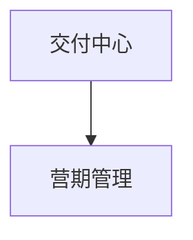

# 合数BOSS V2.0——交付中心详细需求

| 文档属性 | 内容 |
|---|---|
| 所属项目 | 合数BOSS重构项目 |
| 所属版本 | V2.0 |
| 一级菜单 | 交付中心 |
| 文档版本 | V2.0 |
| 文档状态 | 产品需求评审稿 |
| 更新日期 | 2026-08-25 |

## 1. 文档目标

交付中心调整至 V2.0 独立建设，首期仅提供“营期管理”，统一维护营期生命周期、接量窗口和营期状态。该模块不纳入 V1.0 菜单、开发、测试及上线验收范围。

V2.0 交付中心首期不重建完整教务系统。订单、班级、学习和课消等事实如由外部系统提供，可在客户档案或分析页面按权限只读展示，但不形成独立管理入口。

## 2. 核心口径与边界

- 家长客户是业务关系和服务权益归属主体，孩子仅作为课程匹配背景；
- 营期是线索分配、活码配置、问卷规则和经营统计的公共业务维度；
- 课程、班级和学习记录由其权威来源系统维护，合数BOSS仅保存必要外部编号和业务快照；
- 班级管理、自动分班、转班、班主任调整、排课、考勤、作业和课消均不属于本次 V2.0 交付中心首期范围；
- V1.0 如需使用营期筛选、活码营期归属或历史统计，只消费外部/历史系统提供的营期只读主数据，不提供营期维护入口；
- 已发生的订单、课程或班级信息可以进入客户360°档案，但不得反向生成管理入口。

## 3. 范围与菜单

| 二级菜单 | 主要职责 | 优先级 |
|---|---|---|
| 营期管理 | 营期基础数据、开营与结营周期、接量时间窗口和状态管理 | P1 |

## 4. 营期管理

### 4.1 页面与交互

- 页面由“经营摘要、筛选区、营期列表、新建/编辑弹窗”组成，视觉与合数BOSS现有蓝色管理台保持一致；
- 经营摘要展示营期总数、开营中和待开营数量；
- 支持按营期名称、营期状态、开营时间和结营时间组合筛选，并支持一键重置；
- 支持新增、编辑、启用/关闭、单条删除和批量删除；新增与编辑复用同一弹窗；
- 页面及接口不设置班主任字段，不提供班主任筛选、选择和列表展示；
- 开营时间与结营时间构成“营期生命周期轴”，接量开始时间与接量结束时间构成“线索接量轴”，两组时间独立维护，不互相替代，也不强制重合；
- 营期状态不由人工填写，而是根据“是否启用 + 开营时间 + 结营时间”实时计算为待开营、开营中、已结营或已关闭；接量时间不参与营期状态计算；
- 列表必须分别展示“开营/结营时间”和“接量时间”，避免活码接量周期与实际课程营期混算；
- 删除、关闭及修改任一时间轴前必须二次确认；关键变更需记录变更前后值、操作人、时间和原因。

### 4.2 字段

| 字段 | 要求 |
|---|---|
| 营期ID | 系统内部主键，新增时自动生成，不对普通用户开放编辑 |
| 营期名称 | 必填，最多 50 字，全局不允许重名；示例：26.09.09 |
| 开营时间 | 必填，精确到秒；用于营期生命周期状态计算 |
| 结营时间 | 必填，必须晚于开营时间；用于营期生命周期状态计算 |
| 接量开始时间 | 必填，精确到秒；用于判断活码及线索是否允许接入该营期，不改变营期状态 |
| 接量结束时间 | 必填，必须晚于接量开始时间；结束后停止该营期新增接量，不改变营期状态 |
| 是否启用 | 必填，默认启用；关闭后营期状态立即变为“已关闭”，并停止该营期后续业务使用 |
| 营期状态 | 系统计算字段：待开营、开营中、已结营、已关闭 |
| 创建人/创建时间 | 系统自动记录，不允许修改 |
| 备注 | 选填，最多 500 字 |

### 4.3 规则

- 状态优先级为“已关闭”最高：只要 `enabled=false`，无论时间如何均显示“已关闭”；
- 已启用且当前时间早于开营时间，状态为“待开营”；
- 已启用且当前时间处于开营时间（含）至结营时间（含）之间，状态为“开营中”；
- 已启用且当前时间晚于结营时间，状态为“已结营”；
- 重新启用已关闭营期后，系统必须依据当前时间与开营/结营时间重新计算状态，不恢复为固定旧状态；
- 开营/结营时间只决定营期生命周期；接量开始/结束时间只决定活码轮询名单及线索允许接入、分配到该营期的窗口；两组时间允许前后错开或部分重叠；
- 同一营期的结营时间必须晚于开营时间，接量结束时间必须晚于接量开始时间，保存时由前后端分别校验；两组时间之间不做强制包含或重叠校验；
- 在接量窗口内且营期未关闭时，活码、线索配置可以接收或分配线索；超出接量窗口后停止新增接量，但不自动将营期改为“已结营”；
- 待开营或开营中的启用营期可供相关业务选择；已关闭或已结营营期不再进入默认可选范围，但历史数据仍可查询；
- 历史业务使用当时的营期快照，后续编辑不得回写历史线索分配、问卷评级和统计结果；
- 用户确认后可单条或批量删除营期；生产环境采用逻辑删除，审计日志和删除快照继续保留；
- 营期名称、开营/结营时间、接量时间和启用/关闭变更必须写入审计日志，保存接口需具备幂等能力。

## 5. 数据、接口与事件

核心实体建议为 `TERM`、`TERM_SOURCE_MAPPING` 和 `TERM_HISTORY`。业务数据如需记录营期，应保存营期ID及必要快照，不以数组或备注字段表达。

主要接口：营期列表、详情、新增、编辑、单条删除、批量删除、启用/关闭、来源同步和历史查询。

主要事件：`term.created`、`term.updated`、`term.enabled`、`term.disabled`、`term.sync_failed`。

## 6. 权限要求

- 营期管理配置菜单权限；新增、编辑、启用/关闭、同步和导出分别配置按钮权限；
- 数据范围按组织授权，页面候选组织不得超出当前用户授权范围；
- 启用/关闭、同步和导出记录操作人、时间、原因、trace_id 和结果；
- 无权限用户不得通过接口获取营期详情或执行写操作。

## 7. 验收标准

- [ ] 菜单仅展示“营期管理”，不存在班级管理入口或直接路由；
- [ ] 营期可按名称、状态、开营时间和结营时间筛选，并可新增、编辑、关闭/启用和批量删除；
- [ ] 页面、接口和导出均不包含班主任选择、筛选或展示字段；
- [ ] 列表及新增/编辑弹窗分别展示开营/结营时间和接量开始/结束时间；
- [ ] 营期状态仅依据启用/关闭状态和开营/结营时间自动计算为待开营、开营中、已结营或已关闭，跨越时间边界后无需人工修改；
- [ ] 新增/编辑时校验营期名称唯一、结营晚于开营、接量结束晚于接量开始；两组时间无需互相包含；
- [ ] 单条删除和批量删除不再校验或展示业务引用，确认后可执行逻辑删除；
- [ ] 已关闭或已结营营期不进入默认可选范围；接量窗口结束只停止新增接量，不改变营期状态；
- [ ] 历史业务保存的营期快照不因主档编辑而变化；
- [ ] 权限、异常、审计和同步幂等符合统一规范。

## 8. 发布与回滚

- 营期功能使用开关灰度启用，异常时关闭写入及外部同步；
- 错误配置通过恢复上一版本或反向变更修复，不删除历史；
- 外部同步异常时保留最近成功快照并进入异常中心；
- 回滚不得批量删除营期、来源映射和审计历史。

## 9. 待确认事项

- 营期权威来源系统及字段映射；
- 外部营期数据中开营/结营时间、接量开始/结束时间的字段映射；
- 年龄段、年级和营期的具体匹配规则；
- 外部系统可提供的订单、课程、班级及学习摘要范围。

## 10. 版本记录

| 版本 | 日期 | 内容 |
|---|---|---|
| V1.0 | 2026-08-17 | 从主需求独立形成交付中心专项需求 |
| V1.1 | 2026-08-24 | 移除班级管理菜单、页面和 V1.0 验收范围；交付中心收敛为营期管理 |
| V1.2 | 2026-08-25 | 按新版原型补充营期摘要、组合筛选、新建/编辑、自动状态、引用下钻、批量删除与审计规则 |
| V1.3 | 2026-08-25 | 拆分开营/结营与接量双时间轴，移除班主任字段，状态统一为待开营、开营中、已结营、已关闭 |
| V1.4 | 2026-08-25 | 移除业务引用摘要、列表字段、数量下钻和删除拦截；保留删除确认、逻辑删除与审计要求 |
| V2.0 | 2026-08-25 | 交付中心整体调整为 V2.0 独立模块，不再纳入 V1.0 菜单、开发与验收范围；保留营期管理详细需求作为 V2.0 建设基线 |
