# 合数BOSS完整功能菜单规划

| 文档属性 | 内容 |
|---|---|
| 产品 | 合数BOSS |
| 文档定位 | 全量产品功能菜单，不等同于 V1.0 上线范围 |
| 文档版本 | V1.8 |
| 更新日期 | 2026-08-25 |
| 版本标记 | V1.0 首期；V2.0 后续建设 |

## 1. 菜单设计约定

- 左侧菜单只放可独立访问的页面；列表详情、新增、编辑、导入、同步、导出和批量操作属于页面动作；
- 引流线索和三方品线索使用统一线索主模型，但各自拥有扩展字段、筛选项、列表列、详情区块和导入模板；
- 导入与同步任务通过线索页面按钮触发，以任务抽屉或弹窗展示进度，不单独设置菜单；
- 线索人工指定、批量分配、按最新营期活码人员名单轮询、轮询最大分配人数校验、改派、失败重试和分配历史归入引流线索/三方品线索页面，不设置“线索分配”菜单；人工指定不受营期名单和人数上限限制；
- S/A/B/C 评分规则统一放在线索配置；线索与客户共用 `lead_customer_grade` 字典，客户等级在客户列表操作中维护；
- 问卷管理包含问卷列表，规划为 V1.0；测评管理包含测评列表，规划为 V2.0；
- “交付查询”统一更名为“交付中心”；
- 系统管理与业务配置均属于合数BOSS应用内部；业务配置位于系统管理上方，承载各类业务接入和运行配置。

## 2. 完整菜单全景

> 阅读顺序：从左到右依次为业务域一至业务域八；每个业务域内部展示对应一级菜单、二级菜单及版本。

```mermaid
flowchart LR
    PLATFORM["合数BOSS｜完整功能菜单"]

    subgraph ORGBOX["业务域一｜组织与权限中心｜阶段一重点"]
        direction TB
        SYS_ORG["系统管理｜组织管理 · V1.0<br/>员工管理 · V1.0<br/>岗位管理 · V1.0<br/>角色管理 · V1.0<br/>菜单管理 · V1.0"]
    end

    subgraph CUSTOMERBOX["业务域二｜线索与客户中心｜阶段一重点"]
        direction TB
        HOME["首页｜线索概览 · V1.0"]
        LEAD["线索中心｜引流线索 · V1.0<br/>三方品线索 · V1.5<br/>线索配置 · V1.0<br/>活码管理 · V1.0<br/>渠道管理（列表/分析）· V1.0<br/>店铺管理 · V1.0<br/>IP列表 · V1.0<br/>商品列表 · V1.0<br/>短信配置 · V1.0"]
        CUSTOMER["客户中心｜客户总览 · V1.0<br/>客户列表 · V1.0<br/>撞单管理 · V1.0<br/>标签管理 · V1.0"]
        QUESTION["问卷管理｜问卷列表 · V1.0"]
    end

    subgraph PRIVATEBOX["业务域三｜私域销售中心"]
        direction TB
        LIVE["直播管理｜直播管理 · V2.0"]
        CONTENT["内容中心｜内容中心 · V2.0"]
    end

    subgraph TRADEBOX["业务域四｜产品交易中心｜V1.0 + V2.0"]
        direction TB
        PRODUCT["产品中心｜商品管理 · V2.0<br/>课程管理 · V2.0<br/>权益管理 · V2.0"]
        CONTRACT["合同管理｜合同列表 · V2.0"]
        PARTNER["合作方管理｜合作商列表 · V2.0<br/>供应商信息库 · V2.0"]
        FINANCE["财务中心｜财务中心 · V2.0"]
    end

    subgraph TEACHBOX["业务域五｜课程教务中心｜V1.0 + V2.0"]
        direction TB
        DELIVERY["交付中心｜营期管理 · V2.0<br/>作业管理 · V2.0<br/>小鹅通圈子 · V2.0"]
        ASSESS["测评管理｜测评列表 · V2.0"]
    end

    subgraph SERVICEBOX["业务域六｜履约服务中心｜V2.0"]
        direction TB
        DIAGNOSE["诊断中心｜诊断中心 · V2.0"]
        TARGET["目标管理｜目标管理 · V2.0"]
    end

    subgraph AFTERBOX["业务域七｜售后客服中心｜V1.0 + V2.0"]
        direction TB
        AFTER["售后管理｜售后列表 · V2.0"]
        QUALITY["质检中心｜规则配置 · V2.0<br/>质检列表 · V2.0"]
        WECHAT["业务配置｜微信客服管理 · V1.0"]
    end

    subgraph SUPPORTBOX["业务域八｜平台支撑中心｜阶段一重点"]
        direction TB
        BUSINESS_BASE["业务配置｜异常中心 · V1.0<br/>短信管理 · V1.0<br/>应用管理 · V1.0<br/>配置管理 · V1.0<br/>微信客服管理 · V1.0<br/>百家号配置 · V2.0"]
        SYS_BASE["系统管理｜系统参数 · V1.0<br/>字典管理 · V1.0<br/>日志查询 · V1.0<br/>地区管理 · V1.0"]
    end

    PLATFORM --> SYS_ORG
    SYS_ORG ~~~ HOME
    HOME ~~~ LIVE
    LIVE ~~~ DELIVERY
    DELIVERY ~~~ DIAGNOSE
    DIAGNOSE ~~~ AFTER
    AFTER ~~~ BUSINESS_BASE
    BUSINESS_BASE --> SYS_BASE

    classDef phase1 fill:#eff6ff,stroke:#3b82f6,stroke-width:2px,color:#1e3a8a;
    classDef mixed fill:#f0f9ff,stroke:#7dd3fc,stroke-width:1.5px,color:#0c4a6e;
    classDef phase2 fill:#f8fafc,stroke:#94a3b8,stroke-width:1px,color:#475569;
    class SYS_ORG,HOME,LEAD,CUSTOMER,QUESTION,WECHAT,BUSINESS_BASE,SYS_BASE phase1;
    class DELIVERY mixed;
    class LIVE,CONTENT,PRODUCT,CONTRACT,PARTNER,FINANCE,ASSESS,DIAGNOSE,TARGET,AFTER,QUALITY phase2;
```

### 2.1 业务域标注说明

| 业务域 | 对应完整菜单 | 阶段标注 |
|---|---|---|
| 组织与权限中心 | 系统管理：组织管理、员工管理、角色管理、菜单管理 | 阶段一重点 |
| 线索与客户中心 | 首页；线索中心；客户中心；问卷管理 | 阶段一重点 |
| 私域销售中心 | 直播管理；内容中心 | V2.0 |
| 产品交易中心 | 产品中心；合同管理；合作方管理；财务中心 | V2.0；订单事实作为数据能力接入，不设置独立订单中心菜单 |
| 课程教务中心 | 交付中心；测评管理 | 全部 V2.0 |
| 履约服务中心 | 诊断中心；目标管理 | V2.0 |
| 售后客服中心 | 售后管理；质检中心；业务配置中的微信客服管理 | 微信客服管理 V1.0，其余 V2.0 |
| 平台支撑中心 | 业务配置：异常、短信、应用、配置、微信客服；系统管理：全局参数、字典、日志、地区及组织权限 | 除百家号配置为 V2.0 外，其余 V1.0；业务提醒由顶部通知入口承接 |

## 3. 完整功能菜单及说明

| 一级菜单 | 二级菜单 | 页面说明 | 主要操作/功能 | 版本 |
|---|---|---|---|---|
| 首页 | 线索概览 | 合数BOSS唯一默认首页与线索全链路经营概览 | 日期/营期/渠道/店铺/IP渠道/IP名称/组织/负责人筛选、核心指标、漏斗、直播过程、退款与GMV、团队效能、口径与下钻 | V1.0 |
| 线索中心 | 引流线索 | 引流业务线索列表，使用公共主模型和引流扩展字段 | 详情、旅程、编辑、无效、跟进、批量分配、短信群发、按平台勾选顺序同步订单、导入解密数据、导出非解密数据 | V1.0 |
| 线索中心 | 三方品线索 | 合作类及三方品线索列表，使用公共主模型和三方品扩展字段 | 导入、同步、新增、编辑、无效、跟进、导出、批量分配 | V1.5 |
| 线索中心 | 线索配置 | 可扩展线索规则中心 | 分类管理活码分配、营期名单流转和问卷等级规则；条件组合、试算、冲突检测、发布停用、版本回退 | V1.0 |
| 线索中心 | 活码管理 | 新旧员工活码、分组、IP归因、标签和接待配置 | 分组筛选、新增、编辑、启停、下载、关联IP、自动带出只读IP渠道、创建人、企微标签/内部标签、营期/班级配置、备用接待 | V1.0 |
| 线索中心 | 渠道管理 | 通过渠道列表/数据分析页签统一管理渠道基础信息、归因规则及转化效果 | 列表、新增、编辑、详情、启停、筛选、漏斗、下钻及导出 | V1.0 |
| 线索中心 | 店铺管理 | 外部平台店铺身份、负责人、访问范围及经营归因 | 基础档案、新增、编辑、启停、权限、线索/加微、订单/支付、净GMV、经营详情、归因异常 | V1.0 |
| 线索中心 | IP列表 | 老师IP主档、页内IP配置、IP大类、稳定编码、归因渠道及商品/平台关系 | IP名称下展示IP编号、IP大类下展示大类编码、IP配置绑定名称/大类/渠道、商品下钻、平台关系、新增、编辑、启停 | V1.0 |
| 线索中心 | 商品列表 | 第三方商品与店铺、活码、IP的关联主档 | 创建/更新时间、商品名称/ID/状态、活码分配、店铺名称/类型、关联IP、同步所有商品、分平台顺序同步、任务记录、导出、备注 | V1.0 |
| 线索中心 | 短信配置 | 商品与活码维度的业务短信提醒策略 | 短信分组、商品/活码绑定、购买后/授权后/手动提醒、批量设置、新增、编辑、启停 | V1.0 |
| 客户中心 | 客户总览 | 客户经营数据概览 | 按组织、负责人、来源、添加方式、等级筛选，查看生命周期/添加方式分布并下钻明细 | V1.0 |
| 客户中心 | 客户列表 | 唯一客户编码、单一主手机号、UnionID和客户档案 | 查看、编辑、身份补录、主手机号全局唯一校验、添加方式、首次来源、负责人、标签、首次建档继承线索等级、独立编辑客户等级和等级历史 | V1.0 |
| 客户中心 | 撞单管理 | 手机号与 UnionID 分别命中不同客户时的强身份冲突处理 | 自动建案、幂等阻断、证据对比、合并至指定主档、确认不同人、审计与反向恢复 | V1.0 |
| 客户中心 | 标签管理 | 六类来源标签统一展示、分源治理 | 标签库、标签组、自动规则、外部映射、标签治理、新增/编辑/停用、历史保留 | V1.0 |
| 售后管理 | 售后列表 | 退款、退课、换课、转班等售后业务 | 申请、审批、处理、退款结果和历史 | V2.0 |
| 合同管理 | 合同列表 | 客户合同、订单和签署信息 | 新增、签署、归档、变更、作废和查询 | V2.0 |
| 合作方管理 | 合作商列表 | 渠道、产品或服务合作方信息 | 新增、编辑、启停、联系人和协议关系 | V2.0 |
| 合作方管理 | 供应商信息库 | 供应商资质、结算及服务信息 | 新增、编辑、审核、启停和历史 | V2.0 |
| 产品中心 | 商品管理 | 可售商品、价格及适用渠道 | 新增、编辑、上下架、定价和渠道配置 | V2.0 |
| 产品中心 | 课程管理 | 课程基本信息和课程结构 | 新增、编辑、启停、内容及交付映射 | V2.0 |
| 产品中心 | 权益管理 | 商品和订单权益规则 | 新增、编辑、次数、期限和适用范围 | V2.0 |
| 交付中心 | 营期管理 | 营期生命周期与接量窗口 | 列表、新增、编辑、自动状态、启停及双时间轴 | V2.0 |
| 交付中心 | 作业管理 | 作业发布、提交和批改 | 新增、发布、提交、批改和完成统计 | V2.0 |
| 交付中心 | 小鹅通圈子 | 小鹅通圈子、成员、内容和互动 | 同步、查询、成员关联和异常处理 | V2.0 |
| 问卷管理 | 问卷列表 | 问卷列表、答卷及线索/客户关联 | 详情、发送、回收、同步、答卷、关联和异常处理 | V1.0 |
| 测评管理 | 测评列表 | 测评项目、结果及客户/诊断关联 | 新增、编辑、发布、结果查询和客户关联 | V2.0 |
| 质检中心 | 规则配置 | 质检对象、抽检比例、指标和评分 | 新增、编辑、试算、发布、停用和版本 | V2.0 |
| 质检中心 | 质检列表 | 质检任务、记录、问题和整改 | 抽检、评分、复核、整改和关闭 | V2.0 |
| 直播管理 | 直播管理 | 直播组、课程、用户、提单、数字人和评论 | 新增、配置、开播、数据查看和异常处理 | V2.0 |
| 内容中心 | 内容中心 | 素材、话术、短信、支付文案、字幕和投票 | 新增、编辑、审核、发布、分类和检索 | V2.0 |
| 诊断中心 | 诊断中心 | 诊断配置、预约、结果和规划师服务 | 配置、预约、执行、结果和服务记录 | V2.0 |
| 财务中心 | 财务中心 | 收退款、对账和业务财务查询 | 查询、对账、差异处理和导出 | V2.0 |
| 目标管理 | 目标管理 | 组织、团队和员工的线索、转化及 GMV 目标 | 设定、分解、调整、进度和完成分析 | V2.0 |
| 系统管理 | 组织管理 | 公司、部门、小组等可变组织树 | 查询、新增下级、编辑、移动、启停、删除拦截、导出 | V1.0 |
| 系统管理 | 员工管理 | 合数BOSS员工主数据、生命周期及企微身份 | 自有系统主控开关、企微基线导入、同步与差异对账、历史员工/重新入职、编辑、启停、离职触发 | V1.0 |
| 系统管理 | 岗位管理 | 员工数据可见范围主数据 | 本人、小组、部门、自定义组织、公司级范围、关联员工、影响预览 | V1.0 |
| 系统管理 | 角色管理 | 运营、客服、规划师等业务功能角色 | 菜单、操作、字段授权及影响预览；不配置数据范围 | V1.0 |
| 系统管理 | 菜单管理 | 合数BOSS动态菜单配置 | 目录、页面、操作权限、路由、排序和状态 | V1.0 |
| 系统管理 | 系统参数 | 全局设置与运行参数 | 查询、新增、编辑、启停、类型校验、敏感值保护和版本历史 | V1.0 |
| 系统管理 | 字典管理 | 业务枚举与显示口径 | 字典类型、字典项、排序、颜色、启停和历史值兼容 | V1.0 |
| 业务配置 | 异常中心 | 企业微信及同步异常 | 查询、详情、重试、忽略、转人工、关闭 | V1.0 |
| 业务配置 | 短信管理 | 复用历史短信服务 | 签名管理、短信模板和发送结果 | V1.0 |
| 业务配置 | 应用管理 | 接入合数BOSS的外部应用 | 新增、编辑、启停、连接校验和凭证轮换 | V1.0 |
| 业务配置 | 配置管理 | 企微、小程序、店铺和落地页配置 | 新增、编辑、校验、发布、启停和版本回退 | V1.0 |
| 业务配置 | 百家号配置 | 百家号接入、授权和线索映射 | 新增、授权、编辑、启停和同步 | V2.0 |
| 业务配置 | 微信客服管理 | 企业微信客服接入 | 客服列表、客服事件消息和客服消息 | V1.0 |
| 系统管理 | 日志查询 | 登录、操作、权限、配置和接口日志 | 查询、详情、审批导出和归档 | V1.0 |
| 系统管理 | 地区管理 | 国家、省、市、区县标准地区树 | 导入、新增、编辑、启停和差异更新 | V1.0 |

## 4. 业务域详细补充说明

### 4.1 首页

| 二级菜单 | 功能说明 | 版本 |
|---|---|---|
| 线索概览 | 合数BOSS唯一默认首页，展示线索核心指标、全链路漏斗、成交退款、GMV、团队效能及下钻 | V1.0 |

### 4.2 线索中心

| 二级菜单 | 功能说明 | 主要页面动作 | 版本 |
|---|---|---|---|
| 引流线索 | 管理广告投放、落地页、表单等引流来源线索，展示投放、素材和归因扩展字段 | 详情、旅程、编辑、无效、跟进、批量分配、短信群发、按平台勾选顺序同步订单、导入解密数据、导出非解密数据 | V1.0 |
| 三方品线索 | 管理合作类及三方产品线索，展示合作方、产品、批次和外部状态扩展字段 | 详情、导入、同步、新增、编辑、无效、跟进、导出、批量分配 | V1.5 |
| 线索配置 | 分类管理活码分配和基于上一营期员工转化率的下一营期名单流转规则 | 新增、编辑、条件组合、试算、冲突检测、发布、停用、版本回退 | V1.0 |
| 活码管理 | 按活码分组、类型、企微/内部标签、营期和班级配置人员，承接新旧活码及扫码/加微事件 | 分组筛选、新增、编辑、启停、下载、创建人、备用接待、查看效果 | V1.0 |
| 渠道管理 | 渠道列表维护渠道编码、名称、类型、负责人、归因规则和状态；数据分析页签展示线索、分配、扫码、加微、问卷、等级、转客户及成交表现 | 列表、新增、编辑、详情、启停、筛选、下钻、导出 | V1.0 |
| 店铺管理 | 维护外部平台店铺唯一身份、负责人、业务访问范围和经营归因 | 基础档案、权限、线索/加微、订单/支付、净GMV、漏斗趋势、商品归因、异常 | V1.0 |

#### 统一线索模型

| 数据层 | 主要内容 |
|---|---|
| `crm_lead` | 内部关系主键（不对业务用户展示）、引流订单编号、类型、来源、渠道、姓名、手机号、UnionID、地区、负责人、分配和业务状态 |
| `crm_lead_drainage_ext` | 投放计划、素材、落地页、表单、搜索词/IP、访问及归因字段 |
| `crm_lead_third_product_ext` | 合作方、三方产品、合作批次、外部来源记录编号、合作口径及外部状态 |

### 4.3 客户中心

| 二级菜单 | 功能说明 | 版本 |
|---|---|---|
| 客户总览 | 展示客户数量、生命周期、等级、首次来源、添加方式、归属和转化概览 | V1.0 |
| 客户列表 | 管理唯一客户编码、单一主手机号/UnionID/企微身份、档案、添加方式、首次来源、负责人和状态；每个有效客户仅允许一个全局唯一主手机号 | V1.0 |
| 撞单管理 | 处理手机号与 UnionID 跨档案命中，支持自动建案、证据对比、指定主档合并、确认不同人和完整审计 | V1.0 |
| 标签管理 | 管理标签库、标签组、自动规则、外部标签映射和标签治理；系统及外部来源只读，BOSS人工/规则/AI按权限维护 | V1.0 |
### 4.4 订单数据能力（非菜单）

第三方订单通过接口、同步任务或导入进入统一数据层，供线索归因、客户档案和经营分析使用。当前规划不设置“订单中心”一级菜单，也不提供“正式课订单”或“权益列表”独立页面。

### 4.5 售后管理

| 二级菜单 | 功能说明 | 版本 |
|---|---|---|
| 售后列表 | 管理退款、退课、换课、转班及其他售后申请、审批和处理结果 | V2.0 |

### 4.6 合同管理

| 二级菜单 | 功能说明 | 版本 |
|---|---|---|
| 合同列表 | 管理客户合同、签署主体、订单关联、签署状态、归档和变更 | V2.0 |

### 4.7 合作方管理

| 二级菜单 | 功能说明 | 版本 |
|---|---|---|
| 合作商列表 | 管理渠道、产品或服务合作方的主体信息、联系人、合作状态和协议关系 | V2.0 |
| 供应商信息库 | 管理供应商资质、结算信息、服务范围、状态和历史 | V2.0 |

### 4.8 产品中心

| 二级菜单 | 功能说明 | 版本 |
|---|---|---|
| 商品管理 | 管理可售商品、价格、状态和适用渠道 | V2.0 |
| 课程管理 | 管理课程基本信息、课程结构及交付映射 | V2.0 |
| 权益管理 | 管理商品或订单包含的课程、服务、次数和有效期规则 | V2.0 |

### 4.9 交付中心

| 二级菜单 | 功能说明 | 版本 |
|---|---|---|
| 营期管理 | 管理营期生命周期、接量窗口和自动状态，并为线索、活码、问卷和统计提供统一营期维度 | V2.0 |
| 作业管理 | 管理作业发布、提交、批改和完成状态 | V2.0 |
| 小鹅通圈子 | 对接小鹅通圈子、成员、内容和互动数据 | V2.0 |

### 4.10 问卷管理

| 二级菜单 | 功能说明 | 版本 |
|---|---|---|
| 问卷列表 | 保持现有问卷设计，管理问卷列表、详情、发送、回收、答卷、同步及线索/客户关联 | V1.0 |

问卷关联异常在问卷列表页面内通过状态筛选、异常页签或处理抽屉完成，不单独设置菜单。等级计算由“线索配置—等级规则”负责，客户等级在客户列表操作中维护。

### 4.11 测评管理

| 二级菜单 | 功能说明 | 版本 |
|---|---|---|
| 测评列表 | 管理测评项目、测评结果、诊断关联和客户关联 | V2.0 |

### 4.12 质检中心

| 二级菜单 | 功能说明 | 版本 |
|---|---|---|
| 规则配置 | 配置质检对象、抽检比例、指标、评分和问题等级 | V2.0 |
| 质检列表 | 管理质检任务、记录、问题、复核和整改 | V2.0 |

### 4.13 直播管理

| 二级菜单 | 功能说明 | 版本 |
|---|---|---|
| 直播管理 | 管理直播组、课程、用户、提单、停留、数字人、评论组和直播数据 | V2.0 |

### 4.14 内容中心

| 二级菜单 | 功能说明 | 版本 |
|---|---|---|
| 内容中心 | 管理素材库、话术、短信、支付文案、字幕和投票等内容资产 | V2.0 |

### 4.15 诊断中心

| 二级菜单 | 功能说明 | 版本 |
|---|---|---|
| 诊断中心 | 管理诊断配置、预约、结果、规划师和学员服务 | V2.0 |

### 4.16 财务中心

| 二级菜单 | 功能说明 | 版本 |
|---|---|---|
| 财务中心 | 管理订单财务协同、收退款结果、对账和业务财务查询 | V2.0 |

### 4.17 目标管理

| 二级菜单 | 功能说明 | 版本 |
|---|---|---|
| 目标管理 | 管理组织、团队和员工的线索、转化、GMV 等业务目标及完成情况 | V2.0 |

### 4.18 系统管理

| 二级菜单 | 三级页面/功能说明 | 版本 |
|---|---|---|
| 组织管理 | 可变层级组织树，支持公司、部门、小组及嵌套 | V1.0 |
| 员工管理 | 合数BOSS主数据、企微在线身份映射、员工生命周期及离职状态 | V1.0 |
| 角色管理 | 合数BOSS菜单、操作和字段授权；数据范围由岗位管理配置 | V1.0 |
| 菜单管理 | 合数BOSS动态菜单、路由、权限标识和状态 | V1.0 |
| 系统参数 | 全局设置、运行参数、敏感值保护和版本历史 | V1.0 |
| 字典管理 | 字典类型、字典项、稳定值、排序与启停 | V1.0 |
| 日志查询 | 登录、操作、权限、配置、接口和任务日志 | V1.0 |
| 地区管理 | 国家、省、市、区县等标准地区树 | V1.0 |

### 4.19 业务配置

| 二级菜单 | 功能说明 | 版本 |
|---|---|---|
| 异常中心 | 企微异常、同步失败、重试和处理记录 | V1.0 |
| 短信管理 | 签名管理、短信模板、发送结果；复用历史短信服务 | V1.0 |
| 应用管理 | 管理接入合数BOSS的企微、短信、客服及其他应用 | V1.0 |
| 配置管理 | 企微、小程序、店铺、落地页配置 | V1.0 |
| 百家号配置 | 管理百家号接入、授权和线索来源映射 | V2.0 |
| 微信客服管理 | 客服列表、客服事件消息和客服消息 | V1.0 |

## 5. 版本范围汇总

| 版本 | 主要范围 |
|---|---|
| V1.0 | 首页—线索概览、线索中心（不含三方品线索）、客户中心（含撞单管理）、营期、问卷列表、业务配置及系统管理基础 |
| V1.5 | 三方品线索 |
| V2.0 | 权益、售后、合同、合作方、产品、作业、小鹅通、测评、质检、直播、内容、诊断、财务、目标及百家号配置 |

## 6. 仅 V1.0 版本菜单清单

> 本节从上述完整菜单中仅筛选 V1.0 功能。撞单管理已纳入 V1.0；公海和商机能力已取消；三方品线索属于 V1.5；测评管理及测评列表属于 V2.0。

| 一级菜单 | 二级菜单 | 页面说明 | 主要操作/功能 | 版本 |
|---|---|---|---|---|
| 首页 | 线索概览 | 合数BOSS唯一默认首页 | 核心指标、全链路漏斗、成交退款、GMV、团队效能、口径与下钻 | V1.0 |
| 线索中心 | 引流线索 | 引流业务线索列表及详情 | 详情、旅程、编辑、无效、跟进、批量分配、短信群发、按平台勾选顺序同步订单、导入解密数据、导出非解密数据 | V1.0 |
| 线索中心 | 线索配置 | 可扩展线索规则中心 | 分类管理活码分配和营期名单流转；条件组合、试算、冲突检测、发布停用、版本回退 | V1.0 |
| 线索中心 | 活码管理 | 新旧员工活码、分组、IP归因、标签及接待配置 | 分组筛选、新增、编辑、启停、下载、关联IP、自动带出只读IP渠道、创建人、企微标签/内部标签、营期/班级配置、备用接待 | V1.0 |
| 线索中心 | 渠道管理 | 通过渠道列表/数据分析页签统一维护渠道与分析转化效果 | 新增、编辑、详情、启停、筛选、漏斗、下钻及导出 | V1.0 |
| 线索中心 | 店铺管理 | 外部平台店铺身份、负责人、访问范围及经营归因 | 基础档案、新增、编辑、启停、权限、线索/加微、订单/支付、净GMV、经营详情、归因异常 | V1.0 |
| 线索中心 | IP列表 | 老师IP主档、页内IP配置、IP大类、稳定编码、归因渠道及商品/平台关系 | IP名称下展示IP编号、IP大类下展示大类编码、IP配置绑定名称/大类/渠道、商品下钻、平台关系、新增、编辑、启停 | V1.0 |
| 线索中心 | 商品列表 | 第三方商品与店铺、活码、IP的关联主档 | 创建/更新时间、商品名称/ID/状态、活码分配、店铺名称/类型、关联IP、同步所有商品、分平台顺序同步、任务记录、导出、备注 | V1.0 |
| 线索中心 | 短信配置 | 商品与活码维度的业务短信提醒策略 | 短信分组、商品/活码绑定、购买后/授权后/手动提醒、批量设置、新增、编辑、启停 | V1.0 |
| 客户中心 | 客户总览 | 客户经营数据概览 | 按组织、负责人、来源、添加方式、等级筛选，查看生命周期/添加方式分布并下钻明细 | V1.0 |
| 客户中心 | 客户列表 | 唯一客户档案 | 查看、编辑、单一主手机号身份补录与唯一校验、添加方式、首次来源、负责人、标签、首次建档继承线索等级、独立编辑客户等级和等级历史 | V1.0 |
| 客户中心 | 撞单管理 | 强身份冲突处理 | 手机号与 UnionID 跨档案命中时自动建案、领取、证据对比、合并至指定主档、确认不同人、审计与反向恢复 | V1.0 |
| 客户中心 | 标签管理 | 六类来源标签统一展示、分源治理 | 标签库、标签组、自动规则、外部映射、标签治理、新增/编辑/停用、历史保留 | V1.0 |
| 交付中心 | 营期管理 | 营期生命周期与接量窗口 | 列表、新增、编辑、自动状态、启停及双时间轴 | V2.0 |
| 问卷管理 | 问卷列表 | 问卷列表及答卷管理 | 详情、发送、回收、同步、答卷、线索/客户关联、异常处理 | V1.0 |
| 系统管理 | 组织管理 | 公司、部门、小组等可变组织树 | 查询、新增下级、编辑、移动、启停、删除拦截、导出 | V1.0 |
| 系统管理 | 员工管理 | 合数BOSS员工主数据、生命周期及企微身份 | 自有系统主控开关、企微基线导入、同步与差异对账、历史员工/重新入职、编辑、启停、离职触发 | V1.0 |
| 系统管理 | 岗位管理 | 员工数据可见范围主数据 | 本人、小组、部门、自定义组织、公司级范围、关联员工、影响预览 | V1.0 |
| 系统管理 | 角色管理 | 运营、客服、规划师等业务功能角色 | 菜单、操作、字段授权及影响预览；不配置数据范围 | V1.0 |
| 系统管理 | 菜单管理 | 合数BOSS动态菜单配置 | 目录、页面、操作权限、路由、排序和状态 | V1.0 |
| 系统管理 | 系统参数 | 全局设置与运行参数 | 查询、新增、编辑、启停、类型校验、敏感值保护和版本历史 | V1.0 |
| 系统管理 | 字典管理 | 业务枚举与显示口径 | 字典类型、字典项、排序、颜色、启停和历史值兼容 | V1.0 |
| 业务配置 | 异常中心 | 企业微信及同步异常 | 查询、详情、重试、忽略、转人工、关闭 | V1.0 |
| 业务配置 | 短信管理 | 复用历史短信服务 | 签名管理、短信模板、发送结果 | V1.0 |
| 业务配置 | 应用管理 | 接入合数BOSS的外部应用 | 新增、编辑、启停、连接校验和凭证轮换 | V1.0 |
| 业务配置 | 配置管理 | 企微、小程序、店铺、落地页配置 | 新增、编辑、校验、发布、启停、版本回退 | V1.0 |
| 业务配置 | 微信客服管理 | 企业微信客服接入 | 客服列表、客服事件消息、客服消息 | V1.0 |
| 系统管理 | 日志查询 | 登录、操作、权限、配置和接口日志 | 查询、详情、审批导出和归档 | V1.0 |
| 系统管理 | 地区管理 | 国家、省、市、区县标准地区树 | 导入、新增、编辑、启停和差异更新 | V1.0 |

### 6.1 V1.0 页面动作说明

以下内容属于页面操作，不单独生成左侧菜单：

- 引流线索的短信群发、按勾选顺序同步各平台订单、导入解密数据、导出非解密数据及任务进度；三方品线索按其 V1.5 规格执行；
- 线索的组织到人式人工/批量分配、最新营期活码名单轮询、轮询最大分配人数校验、改派、失败重试及分配历史；人工指定不受营期名单和人数上限限制；
- 线索和客户的详情、编辑、无效、跟进和其他批量操作；引流线索页不提供人工新增；
- 问卷关联异常处理；
- 线索配置中的等级规则试算、发布与版本；客户等级在客户列表中查看、人工调整并保留历史；
- 默认支付切换和退款凭据设置。

### 6.2 明确不属于 V1.0

- 测评管理及测评列表；
- 权益列表、售后管理、合同管理；
- 合作商列表、供应商信息库；
- 商品、课程和权益管理；
- 作业管理、小鹅通圈子；
- 质检、直播、内容、诊断、财务和目标管理；
- 百家号配置。
