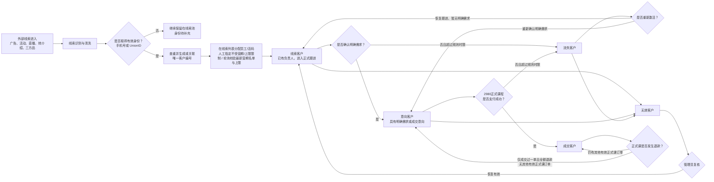
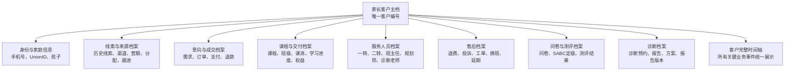
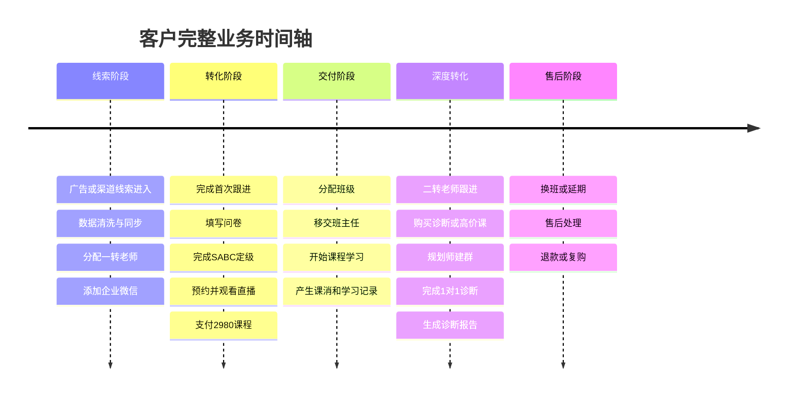

# 合数BOSS客户360°档案与生命周期需求

| 文档属性 | 内容 |
|---|---|
| 产品名称 | 合数BOSS |
| 文档主题 | 客户生命周期、客户360°档案及核心数据模型 |
| 文档版本 | V1.1 |
| 文档状态 | 产品需求评审稿 |
| 更新日期 | 2026-08-17 |
| 适用范围 | 合数BOSS V1.0 及后续版本 |

> 本文档独立维护“客户是谁、客户处于什么阶段、客户发生过什么业务、客户由谁服务过”四类核心客户信息。总体产品范围以 [合数BOSS需求文档1.0版本](./合数BOSS V1.0产品需求总文档.md) 为准。

## 1. 建模目标

合数BOSS以家长客户为唯一经营主体，通过唯一客户编号汇聚其历史线索、身份、跟进、订单、课程交付、服务人员、售后、问卷、测评和诊断报告，形成可查询、可追溯、可审计的客户360°完整档案。

客户主表只保存客户当前核心状态和常用汇总字段。各业务事实分别保存在对应业务对象中，不能把所有历史信息堆叠在客户主表，也不能通过覆盖当前字段丢失历史过程。

## 2. 核心业务口径

### 2.1 人员对象口径

- 家长或主要联系人是合数BOSS中的客户；
- 家长同时是登录用户、课程学员和服务权益归属人；
- 孩子不是客户、不是用户，也不单独定义为学员；
- 孩子仅作为客户名下的附属关联对象，用于记录年龄、年级、学科等背景信息；
- 订单、支付、退款、课程权益、课程交付、客户归属及生命周期均归属于家长客户；
- 问卷、测评、诊断、课程匹配等记录可以选择关联 `child_id`，表示本次业务参考或涉及的孩子，但不得改变家长客户的业务主体地位；
- 一转老师、二转老师、班主任、规划师、诊断老师和售后客服统一建模为内部员工及客户服务关系。

### 2.2 对象边界

| 对象 | 业务定义 | 是否拥有独立生命周期 |
|---|---|---|
| 线索 | 某一次渠道进入或营销触达产生的业务记录 | 有线索处理状态，不使用客户生命周期 |
| 客户 | 已通过手机号或 UnionID 唯一识别的家长经营主体 | 有客户生命周期 |
| 客户账号 | 同一家长用于登录或使用服务的账号 | 无独立客户生命周期 |
| 孩子 | 家长名下的附属背景对象 | 无客户生命周期 |
| 订单 | 客户发生的一次交易凭证 | 有订单状态 |
| 服务关系 | 员工在特定阶段和角色下服务客户的关系 | 有生效、结束和移交状态 |

## 3. 客户生命周期

### 3.1 生命周期状态图



### 3.2 生命周期阶段定义

| 生命周期阶段 | 进入条件 | 主要退出条件 | 负责人要求 |
|---|---|---|---|
| 线索客户 | 已取得手机号或 UnionID，已生成或关联客户编号，已分配负责人 | 确认明确需求、流失或无效 | 必须存在当前负责人 |
| 意向客户 | 已完成挖需，并形成明确需求或成交意向 | 2980成交、流失或无效 | 必须存在当前负责人 |
| 成交客户 | 2980正式课程支付成功且订单有效 | 满足特殊退款回退条件 | 必须存在当前负责人或交付负责人 |
| 流失客户 | 线索客户或意向客户超过规则时限未成交 | 重新激活或判定无效 | 保留原负责人或由管理员人工改派 |
| 无效客户 | 满足无效规则或经授权人员审核判定 | 管理员复核恢复 | 可为空 |

页面展示的正式客户生命周期从“线索客户”开始。取得身份但尚未分配负责人时，使用“待分配”线索处理状态，不新增客户生命周期阶段。

### 3.3 线索客户规则

进入线索客户必须同时满足：

1. 线索已经进入合数BOSS；
2. 至少取得有效手机号或有效 UnionID；
3. 已按身份规则完成客户查重；
4. 已生成或关联唯一客户编号；
5. 已实际分配给员工；
6. 存在当前有效负责人。

### 3.4 意向客户规则

意向客户必须有可追溯的业务依据，至少满足以下一项：

- 已确认具体学习需求；
- 已确认适用年龄段、年级或课程方向；
- 已完成问卷且结果达到配置条件；
- 已预约直播、试听或诊断；
- 已确认明确需求及成交意向；
- 命中其他已发布的意向识别规则。

转换时保存原阶段、目标阶段、转换时间、转换人、触发方式、意向依据和规则版本。

### 3.5 成交客户规则

成交定义为：2980正式课程订单支付成功，并且订单未关闭、未全额退款。仅创建订单、提交订单或支付中不得进入成交客户。

后续高价课成交属于同一客户的复购或价值升级，不得重复创建客户，也不得生成另一套客户身份。

### 3.6 流失客户规则

流失条件由规则配置，不在代码中固定统一天数。规则至少支持以下维度：

- 当前客户生命周期阶段；
- 营期、渠道和业务团队；
- 客户等级；
- 最后一次有效跟进时间；
- 最后一次客户互动时间；
- 是否存在有效订单；
- 提醒期、缓冲期和正式流失时间。

可增加“流失候选”作为系统内部过程状态，用于提醒和缓冲，但前台仍展示五个主要生命周期阶段。

### 3.7 无效客户规则

可配置的无效原因包括：

- 虚假或测试数据；
- 手机号、UnionID 均无效且无法补充；
- 明确非目标客户；
- 恶意、骚扰或黑名单客户；
- 经审核确认不具备继续运营价值；
- 其他经过配置的无效原因。

撞单、暂时不回复、更换负责人、员工离职和普通未成交不能直接作为无效原因，应分别进入撞单、流失或业务页面改派流程。无效操作必须记录原因、证据、操作人、时间和复核结果。

### 3.8 退款回退规则

同时满足以下条件时，成交客户回退为意向客户：

```text
客户历史正式课程成交订单数 = 1
且该订单已全额退款
且当前有效正式课程订单数 = 0
且不存在其他已生效的高价课订单
```

回退时不得删除客户编号、历史成交记录、订单、支付、退款、交付和服务记录，只追加生命周期变更记录。重新进入意向阶段后允许再次成交。

## 4. 多维状态分离

| 状态维度 | 示例 | 业务用途 |
|---|---|---|
| 客户生命周期 | 线索、意向、成交、流失、无效 | 表示客户总体经营阶段 |
| 线索状态 | 待清洗、待同步、待分配、跟进中、已转客户 | 管理某条线索的处理过程 |
| 客户等级 | 未定级、S、A、B、C | 表示客户价值和跟进优先级 |
| 订单状态 | 待支付、已支付、已生效、已退款、已关闭 | 表示交易结果 |
| 交付状态 | 待开课、学习中、已结课、暂停、终止 | 表示服务交付进度 |
| 售后状态 | 待受理、处理中、待确认、已完成、已关闭 | 表示售后处理进度 |

各状态维度分别保存，不允许使用一个字段同时表达客户阶段、等级、订单和交付状态。

## 5. 客户360°档案全景



## 6. 客户档案页面

### 6.1 档案总览

页面头部展示：

- 客户编号、客户名称和当前生命周期；
- S/A/B/C 等级；
- 手机号、UnionID 和企业微信状态；
- 当前营期、首次来源和最近来源；
- 当前主负责人、一转、二转、班主任和规划师；
- 关联孩子摘要；
- 累计成交金额、有效订单数和在学课程数；
- 最近跟进时间和最近服务时间；
- 风险、流失、退款、售后和异常标签。

### 6.2 页面页签

| 页签 | 主要内容 |
|---|---|
| 基本档案 | 身份、联系方式、关联孩子、标签、等级、生命周期 |
| 线索记录 | 所有来源线索、渠道、营期、清洗、同步和分配记录 |
| 跟进记录 | 人工跟进、企业微信互动、SOP 动作、预约和回访 |
| 订单交易 | 订单明细、支付、退款、成交和复购 |
| 学习交付 | 客户学习的课程、班级、班主任、课消、学习进度和服务权益 |
| 服务人员 | 历史服务人员、角色、服务区间和移交过程 |
| 售后记录 | 退款、投诉、换班、转课、延期、补课和售后工单 |
| 问卷测评 | 问卷填写、SABC结果、测评记录和结果 |
| 诊断报告 | 诊断预约、诊断报告、学习方案和报告版本 |
| 客户时间轴 | 将各业务域关键事件按时间统一排列并支持跳转原始业务详情 |

## 7. 分档案域需求

### 7.1 身份与基础档案

建议分组保存：

| 信息分组 | 字段示例 |
|---|---|
| 基本信息 | 客户编号、客户名称、生命周期、SABC等级 |
| 有效身份 | 单一主手机号、UnionID、企微 ExternalUserID、身份校验状态 |
| 来源信息 | 首次来源、最近来源、渠道、营期、添加方式、首次进入时间；添加方式使用 `customer_add_method`：通过链接添加、名片、扫描二维码 |
| 归属信息 | 当前负责人、所属组织、分配时间、分配方式 |
| 意向信息 | 挖需状态、意向课程、预计成交时间 |
| 行为信息 | 最近跟进、最近互动、问卷状态、直播状态 |
| 交易信息 | 首次成交、累计成交金额、有效订单数、退款状态 |
| 关联对象 | 孩子数量、当前业务关联孩子、年龄段和年级 |
| 生命周期 | 当前阶段进入时间、流失原因、无效原因、最近阶段变更时间 |

“个人/企业”属于客户主体类型；“微信/手机号”属于身份或联系方式，二者不得共用同一个“客户类型”字段。

客户手机号采用单值模型：每个有效客户主档最多保存一个主手机号，且该号码在所有有效客户中全局唯一。客户主档不保存备用手机号或多手机号数组；旧手机号在换号后只进入身份变更历史与审计，不再参与当前身份匹配。手机号缺失时允许凭有效UnionID建档；手机号已命中客户时复用原客户，手机号与UnionID分别命中两个客户时进入撞单裁决。客户合并后的目标主档仍只能保留一个经核验的主手机号。

### 7.2 线索与来源档案

一个客户可以关联多条历史线索。线索转客户或客户合并后不得删除原始线索，至少保留：

- 引流订单编号、来源系统、来源记录编号及不对业务用户展示的内部关联主键；
- 渠道、广告计划、活动、直播、转介绍或三方品；
- 营期和原始数据快照；
- 清洗、标准化和同步结果；
- 首次进入时间、分配方式、分配员工和活码；
- 有效、无效、待补充或已转客户状态；
- 转客户时间和关联客户编号；
- 该线索产生的历史跟进。

多条线索命中同一手机号或 UnionID 时归并至同一个客户，但每条线索的来源和转化贡献继续独立保留。

### 7.3 订单与交易档案

订单与课程交付分开建模。订单档案至少包含：

- 订单编号、订单类型和订单来源；
- 商品、课程和订单明细；
- 成交营期、销售人员和关联线索；
- 原价、优惠、实付金额；
- 支付方式、支付流水和支付状态；
- 退款金额、退款原因和退款审核；
- 当前有效状态及关联孩子背景。

一张订单可以包含多个课程或权益。退款后不得删除历史交付、课消和服务记录。

### 7.4 课程与交付档案

课程交付主体为家长客户，孩子仅提供本次课程匹配背景。建议采用以下业务链路：

```text
客户 → 订单 → 订单明细 → 服务权益 → 课程报名 → 班级分配 → 学习与课消记录
```

至少记录：

- 客户购买并实际学习的课程；
- 课程版本和关联订单；
- 服务权益、营期、开课和结课时间；
- 所属班级和班主任；
- 学习状态、进度、出勤、已学课次和剩余课次；
- 作业和学习任务；
- 延期、转班、停课和补课记录；
- 可选关联孩子及用于匹配的年龄、年级、学科快照。

### 7.5 服务人员流转档案

客户可能同时存在多种服务角色，不能只通过客户表中的单一负责人字段表达。服务角色至少包括：

- 线索负责人；
- 一转老师；
- 二转老师；
- 班主任；
- 规划师；
- 诊断老师；
- 售后客服；
- 当前客户主负责人。

每段服务关系保存：客户、服务角色、员工、所属组织、服务阶段、开始时间、结束时间、当前是否有效、关联订单/班级/诊断服务、接替人员、变更原因和移交记录。

员工变更时必须结束旧服务关系并创建新服务关系，禁止直接覆盖原员工。员工停用后的业务页面改派、主动改派和一转移交二转均需要形成正式移交记录。

### 7.6 售后档案

售后档案统一记录：退款申请、投诉、换班、转课、延期、休学、补课、权益调整、服务异常和售后工单。每条记录关联客户，并按场景关联订单、课程、班级、孩子背景和责任服务人员，同时保存处理过程、处理结果和客户确认。

### 7.7 问卷档案

保留客户做过的全部问卷，而不是只保存最后一次答案：

- 问卷名称和模板版本；
- 发送人、发送时间和发送渠道；
- 填写人、提交时间和关联孩子；
- 原始答案快照；
- 计算结果、SABC等级和定级规则版本；
- 是否为当前有效定级依据；
- 关联线索、订单和营期。

问卷模板修改后不得覆盖历史答卷和历史定级依据。

### 7.8 测评档案

记录测评名称、类型、时间、题目版本、原始答案、各维度得分、总分、能力等级、结果、报告、测评老师、来源系统及可选关联孩子。

V1.0 客户档案可先展示已同步测评记录；测评模板、规则和完整测评管理能力按全局版本规划在 V2.0 建设。

### 7.9 诊断报告档案

记录诊断服务编号、关联诊断订单、预约时间、实际诊断时间、诊断老师、规划师、问题描述、诊断结论、学习方案、推荐课程、后续行动、报告文件、报告版本、交付状态、客户确认情况和可选关联孩子。

诊断报告必须版本化。修改时生成新版本，不得覆盖已经交付的历史报告。

## 8. 客户完整时间轴



客户事件索引至少保存事件类型、发生时间、事件摘要、操作人或服务人、来源系统、关联业务类型、关联业务编号、客户可见性和异常标识。时间轴只负责聚合和跳转，原始业务事实仍保存在各业务模块中。

## 9. 核心数据模型

```mermaid
erDiagram
    CUSTOMER ||--o{ CUSTOMER_IDENTITY : "拥有身份"
    CUSTOMER ||--o| CUSTOMER_ACCOUNT : "拥有登录账号"
    CUSTOMER ||--o{ CHILD_PROFILE : "关联孩子"
    CUSTOMER ||--o{ LEAD_CUSTOMER_RELATION : "关联来源线索"
    LEAD ||--o{ LEAD_CUSTOMER_RELATION : "归并至客户"
    CUSTOMER ||--o{ FOLLOW_UP_RECORD : "产生跟进"
    CUSTOMER ||--o{ CUSTOMER_LIFECYCLE_HISTORY : "产生阶段记录"
    CUSTOMER ||--o{ CUSTOMER_GRADE_HISTORY : "产生定级记录"

    CUSTOMER ||--o{ ORDER : "产生订单"
    ORDER ||--|{ ORDER_ITEM : "包含明细"
    ORDER ||--o{ PAYMENT : "产生支付"
    ORDER ||--o{ REFUND : "产生退款"

    CUSTOMER ||--o{ SERVICE_ENTITLEMENT : "获得权益"
    CUSTOMER ||--o{ COURSE_ENROLLMENT : "参加课程"
    COURSE_ENROLLMENT ||--o{ CLASS_ENROLLMENT : "分配班级"
    COURSE_ENROLLMENT ||--o{ LEARNING_RECORD : "产生学习记录"

    CUSTOMER ||--o{ CUSTOMER_SERVICE_RELATION : "关联服务人员"
    CUSTOMER ||--o{ HANDOVER_RECORD : "产生移交"
    EMPLOYEE ||--o{ CUSTOMER_SERVICE_RELATION : "承担服务角色"

    CUSTOMER ||--o{ AFTER_SALES_CASE : "产生售后"
    CUSTOMER ||--o{ QUESTIONNAIRE_SUBMISSION : "填写问卷"
    CUSTOMER ||--o{ ASSESSMENT_RECORD : "参加测评"
    CUSTOMER ||--o{ DIAGNOSIS_REPORT : "形成诊断报告"

    CHILD_PROFILE ||--o{ QUESTIONNAIRE_SUBMISSION : "作为背景对象"
    CHILD_PROFILE ||--o{ ASSESSMENT_RECORD : "作为背景对象"
    CHILD_PROFILE ||--o{ DIAGNOSIS_REPORT : "作为背景对象"
    CUSTOMER ||--o{ CUSTOMER_EVENT : "形成统一时间轴"
```



### 9.1 建议实体清单

| 数据域 | 核心实体 |
|---|---|
| 客户主数据 | `CUSTOMER`、`CUSTOMER_IDENTITY`、`CUSTOMER_ACCOUNT`、`CHILD_PROFILE` |
| 线索与跟进 | `LEAD`、`LEAD_CUSTOMER_RELATION`、`FOLLOW_UP_RECORD` |
| 生命周期与等级 | `CUSTOMER_LIFECYCLE_HISTORY`、`CUSTOMER_GRADE_HISTORY` |
| 销售交易 | `ORDER`、`ORDER_ITEM`、`PAYMENT`、`REFUND` |
| 课程交付 | `SERVICE_ENTITLEMENT`、`COURSE_ENROLLMENT`、`CLASS_ENROLLMENT`、`LEARNING_RECORD` |
| 服务流转 | `CUSTOMER_SERVICE_RELATION`、`HANDOVER_RECORD` |
| 售后服务 | `AFTER_SALES_CASE` |
| 问卷测评 | `QUESTIONNAIRE_SUBMISSION`、`ASSESSMENT_RECORD` |
| 诊断服务 | `DIAGNOSIS_REPORT` |
| 聚合索引 | `CUSTOMER_EVENT` |

### 9.2 历史与审计约束

- 生命周期、等级、负责人、服务人员和移交均采用生效区间或追加式历史记录；
- 已完成业务不得通过修改客户当前字段破坏历史；
- 每条外部数据保存来源系统和来源记录编号；
- 订单、退款、问卷、测评、报告和移交必须保留业务版本及操作审计；
- 客户合并后保留原客户编码、身份、线索和业务关系作为历史别名；
- 敏感身份原值加密保存，标准化哈希用于查重；
- 客户时间轴中的每个事件必须能够跳转或定位到原始业务记录。

## 10. V1.0 建设范围

V1.0 客户档案至少包含：

1. 客户基本档案、手机号、UnionID 和企业微信身份；
2. 关联孩子信息；
3. 历史线索、渠道、营期、分配和跟进；
4. 客户生命周期和 SABC 等级历史；
5. 2980正式课订单、支付和退款；
6. 课程报名、营期、班级、班主任及基础交付状态；
7. 一转、二转、班主任、规划师等服务人员及移交历史；
8. 问卷填写及定级结果；
9. 已有测评结果的只读展示；
10. 诊断报告及版本；
11. 售后和退款记录；
12. 客户统一时间轴。

## 11. 完成与验收标准

客户360°档案完成后，应能够针对任一客户准确回答：

> 客户从哪里来、由哪条线索转化、当前处于什么生命周期、为什么被定为当前等级、产生过哪些订单、学习过哪些课程、由哪些员工以什么角色服务过、发生过哪些移交、填写过哪些问卷、做过哪些测评、获得过哪些诊断报告、发生过哪些售后问题，以及每次变化发生在什么时间。

验收要求：

- 同一客户各档案域使用同一个客户编号关联；
- 每个有效客户仅存在一个主手机号，且同一主手机号不会出现在两个有效客户主档；
- 客户总览数据与各业务明细可核对；
- 线索、订单、交付、服务、售后、问卷、测评和诊断均能查看历史；
- 服务人员变更前后关系可追溯，不出现直接覆盖；
- 一张订单包含多个课程或发生退款时，订单与交付记录仍然准确；
- 问卷、测评和诊断报告保留当时版本；
- 时间轴关键事件可定位原始记录；
- 客户、用户和学员均指向家长主体，孩子不被错误创建为独立客户或学员。

## 12. 待业务确认

- 线索客户和意向客户进入流失候选的具体时限；
- 流失缓冲期及提醒次数；
- 意向客户的必选识别条件和人工转换权限；
- 无效原因字典和复核角色；
- 2980退款回退时负责人、改派和待办处理规则；
- 课程交付、课消和历史测评数据在 V1.0 的可获取范围；
- 诊断报告的审批、客户确认和对外可见规则；
- 客户档案各页签的角色权限和手机号、问卷、报告脱敏规则。

## 13. 版本记录

| 版本 | 日期 | 内容 |
|---|---|---|
| V1.0 | 2026-08-17 | 独立形成客户360°档案与生命周期需求，统一家长客户主体口径，补充线索、订单、课程交付、服务人员流转、售后、问卷、测评、诊断报告、时间轴及核心数据模型 |
| V1.1 | 2026-08-17 | 移除“线索分配”模块化表达，明确员工及活码分配在线索列表内完成 |
| V1.2 | 2026-08-25 | 补充客户主手机号单值模型、全局唯一、重复关联、换号历史和客户合并保留规则 |
