# 合数BOSS总体业务流程图

| 属性 | 内容 |
|---|---|
| 产品 | 合数BOSS |
| 文档版本 | V1.0 |
| 更新日期 | 2026-08-16 |
| 流程范围 | 线索导入至 1v1 诊断交付 |
| 核心参与角色 | 一转老师、班主任、规划师、运营/管理员 |
| 适用版本 | V1.0 核心链路及后续交付扩展 |

## 1. 端到端业务流程

```mermaid
flowchart LR
    subgraph LEAD["① 线索接入与治理"]
        A["渠道/运营｜线索导入<br/>API / 文件 / IDMS / 第三方"]
        B["系统｜线索清洗<br/>解密 / 校验 / 标准化 / 查重"]
        BQ{"清洗是否通过？"}
        BX["异常线索池<br/>修正 / 补充 / 重新清洗"]
        C["系统｜线索同步<br/>进入合数BOSS线索中心"]
        CQ{"同步是否成功？"}
        CX["异常中心<br/>重试 / 人工补偿 / 对账"]

        A --> B --> BQ
        BQ -- "否" --> BX --> B
        BQ -- "是" --> C --> CQ
        CQ -- "否" --> CX --> C
    end

    subgraph FIRST["② 营期分配、一转承接与客户建档"]
        D["系统｜匹配营期及分配规则"]
        E["系统/管理员｜分配一转老师<br/>人工指定（不受营期/上限限制） / 最新营期活码名单轮询（校验上限）"]
        F["一转老师｜承接线索并跟进"]
        G{"是否具备有效手机号<br/>或 UnionID？"}
        G1["继续按线索跟进<br/>补充身份 / 回收 / 重新分配"]
        H["系统｜客户身份查重"]
        I{"是否发生身份冲突？"}
        I1["撞单管理<br/>自动建案 · 证据核验<br/>人工裁决 · 审计留痕"]
        J["系统｜创建或关联唯一客户<br/>生成客户编码与负责人关系"]

        D --> E --> F --> G
        G -- "否" --> G1 --> F
        G -- "是" --> H --> I
        I -- "是" --> I1 --> J
        I -- "否" --> J
    end

    subgraph CONVERT["③ 问卷、直播与 2980 课程转化"]
        K["客户｜填写问卷"]
        L["系统｜关联问卷并计算<br/>S/A/B/C 客户等级"]
        M["客户｜预约直播"]
        N{"客户是否观看直播？"}
        N1["一转老师｜提醒或改约"]
        O["一转老师｜直播后跟进转化"]
        P{"2980 课程订单<br/>是否支付成功？"}
        P1["继续跟进 / 待支付 / 关闭转化"]
        Q["系统｜生成 2980 课程订单<br/>建立客户与学员关系"]

        K --> L --> M --> N
        N -- "否" --> N1 --> M
        N -- "是" --> O --> P
        P -- "否" --> P1 --> O
        P -- "是" --> Q
    end

    subgraph DELIVERY["④ 分班、移交与课程交付"]
        R["系统｜按营期 + 年龄段<br/>匹配班级和班主任"]
        S{"是否存在合适班级<br/>及可接收班主任？"}
        S1["待分班池<br/>人工协调 / 调整班级"]
        T["系统/教务｜完成分班<br/>明确班主任"]
        U["一转老师｜发起客户及学员移交"]
        V{"班主任是否确认接收？"}
        V1["退回补充资料<br/>或重新指定班主任"]
        W["班主任｜执行课程交付<br/>建联 / 排课 / 上课 / 跟进"]

        R --> S
        S -- "否" --> S1 --> R
        S -- "是" --> T --> U --> V
        V -- "否" --> V1 --> U
        V -- "是" --> W
    end

    subgraph DIAGNOSIS["⑤ 诊断高价课转化与 1v1 交付"]
        X["班主任｜课程过程跟进<br/>识别诊断需求"]
        Y{"是否转化诊断<br/>高价课订单？"}
        Y1["继续课程交付与培育"]
        Z["系统｜生成诊断订单<br/>确认支付及权益"]
        AA["系统/管理员｜分配规划师"]
        AB["规划师｜建立服务群并拉群"]
        AC["规划师｜预约 1v1 诊断"]
        AD["规划师｜交付 1v1 诊断"]
        AE["系统｜沉淀诊断结果<br/>方案 / 标签 / 后续任务"]

        X --> Y
        Y -- "否" --> Y1 --> W
        Y -- "是" --> Z --> AA --> AB --> AC --> AD --> AE
    end

    CQ -- "是" --> D
    J --> K
    Q --> R
    W --> X
```

## 2. 关键规则与完成标志

| 环节 | 核心规则 | 完成标志 |
|---|---|---|
| 线索治理 | 保留原始来源、导入批次和清洗结果；重复数据不得直接覆盖 | 引流记录进入合数BOSS并具有订单编号、来源和同步状态；内部关系主键不对业务用户展示 |
| 一转分配 | 人工指定按组织架构选择在职启用员工，不受营期名单和人数上限限制；自动分配按最新营期活码人员名单轮询，并校验账号、活码和最大分配人数 | 线索具有一转负责人、分配方式和完整历史；轮询额外保存营期名单版本与上限快照 |
| 转为客户 | 有效手机号或 UnionID 任一具备即可查重；手机号与 UnionID 分别命中不同客户时阻断自动建档并进入撞单管理 | 创建或关联唯一客户编码；冲突自动建案、人工裁决并保留完整证据与审计记录 |
| 2980 转化与分班 | 支付成功后，按营期和年龄段匹配班级及班主任；匹配失败进入待分班池 | 订单、客户、学员、班级、班主任关系完整 |
| 一转移交 | 一转发起、班主任接收；未接收前一转仍承担跟进责任 | 生成移交单，双方、资料、时间和状态可追踪 |
| 诊断交付 | 诊断订单支付成功后分配规划师，建群后预约并完成 1v1 诊断 | 诊断结果、服务方案、标签和后续任务进入客户档案 |

## 3. 建议主状态链

`待清洗 → 待同步 → 待分配 → 一转跟进中 → 已转客户 → 已填问卷 → 已预约直播 → 已观看直播 → 2980 已成交 → 待分班 → 待移交 → 课程交付中 → 诊断订单已成交 → 规划师服务中 → 1v1 诊断已完成`

异常、取消、未支付、未观看、待补充、撞单待裁决和移交退回等状态作为主状态旁路记录，不得覆盖已完成的历史节点。
