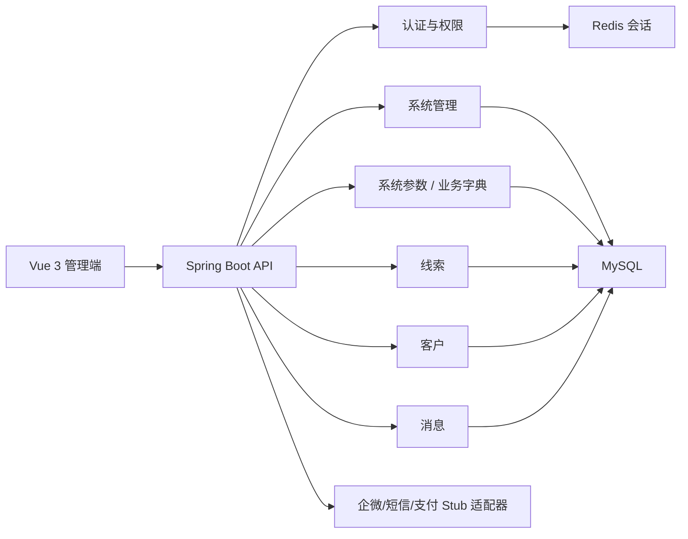

# 样板架构

采用模块化单体：认证、工作台、系统管理、全局配置、线索、客户、消息、订单/交付基础关联按包隔离，共享一个部署单元和 MySQL。

未来拆分边界：auth、system、lead、customer、message 可分别演进为服务；跨模块只能通过应用服务与领域事件协作。

系统参数使用不可变参数键和版本号；密钥类参数不得由通用接口回显。业务字典使用“字典类型—字典项”主从模型，业务表只保存稳定项值。参数、字典变更必须刷新缓存并写入审计，停用字典项不得破坏历史数据显示。

IP大类读取 `ip_category` 字典，字典项值即大类编码并保存至业务表；IP渠道引用渠道主数据并保存不可变渠道编号，首批为店播 `CH000001`、阿留专属 `CH000002`。IP配置复用IP主档并保证同一IP编号只有一组当前生效的大类和渠道关系；活码关联IP后自动带出只读渠道，同时保存绑定时渠道编号快照。商品列表保存第三方字符串商品ID、店铺、状态、活码关联和IP关系；IP、商品或渠道停用时只结束有效关系，不删除历史归因。

组织员工初始化只接收整改后的企业微信基线，飞书不进入初始化、身份匹配、员工编号或同步对账链路。合数BOSS登录账号与企微 `CorpID + UserID` 采用双向一对一生效绑定；当前绑定表对 `account_id` 和 `(corp_id, wecom_user_id)` 分别建立唯一约束，解绑与换绑写入历史表后再建立新关系。自有系统主控开启时，员工管理可创建企微通讯录成员并发送激活邀请；先按手机号查重，创建、绑定、邀请分步持久化，企微已创建但BOSS落库失败时通过任务补偿，不重复创建成员。

客户身份采用单值主手机号模型：`crm_customer.mobile` 仅保存当前主手机号，禁止以JSON或子表方式并列维护多个当前有效手机号，并通过 `uk_customer_mobile` 保证有效主档唯一。换号、合并和解绑只在身份历史/审计表保留旧值；手机号或UnionID任一有效可建档，但两者分别命中不同客户时必须先创建撞单案件，禁止控制器或导入任务直接覆盖身份。
